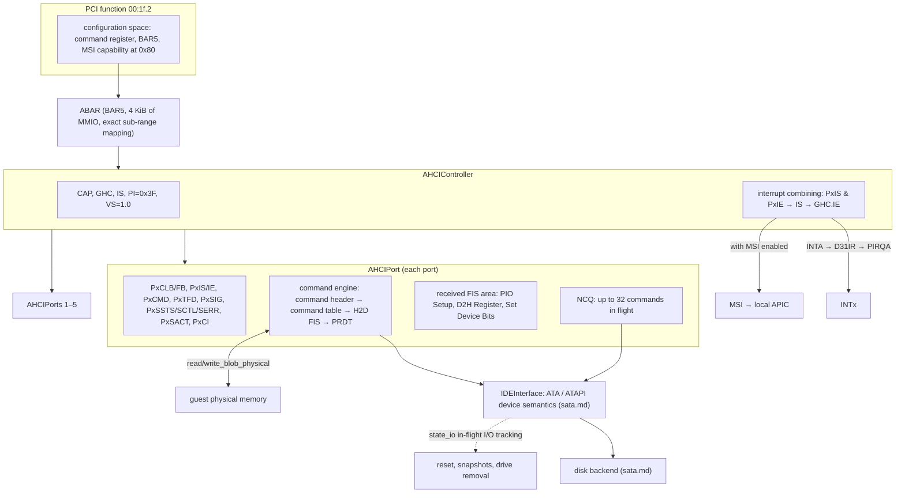
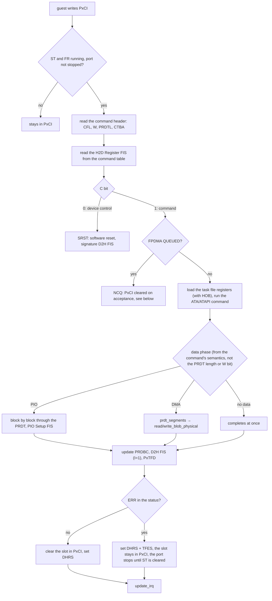
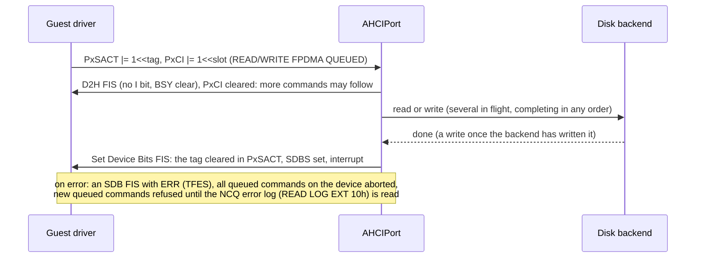

# AHCI controller

The ICH9 AHCI function of the Q35 machine (`00:1f.2`, `8086:2922`, class
`01:06:01`), implemented in [`src/ahci.js`](../src/ahci.js). It takes the
requests the operating system makes through the AHCI registers and the command
structures in memory, has the ATA/ATAPI devices on the SATA ports carry them
out, and reports the results through DMA, the received FIS area and interrupts.

Related documents: the platform (address map, interrupt routing, firmware, SMM)
is in [q35.md](q35.md); ports and links, FISes, the device model, SATA hot plug,
link power management and disk backends are in [sata.md](sata.md). Data
structures, alignment, resets and state machines follow the
[Intel AHCI 1.3.1 specification](https://www.intel.com/content/dam/www/public/us/en/documents/technical-specifications/serial-ata-ahci-spec-rev1-3-1.pdf).

| | |
| --- | --- |
| Identity | `00:1f.2`, `8086:2922`, class `01:06:01`; registers in BAR5 (ABAR, 4 KiB) |
| Ports and slots | 6 ports, 32 command slots each |
| Verified with | SeaBIOS (real mode, and virtual-8086 mode through SMM), Linux 4.16–6.18 ahci/libata, Windows 8.1 storahci |
| Not implemented | Port multipliers, FIS-based switching, CAP2/BOHC, a few ATA commands such as CHECK POWER MODE (ABRT) |

## Status

Implemented: 6 ports with 32 command slots each, PIO/DMA/ATAPI commands, PRDTs
with many entries, LBA48, error completion and non-queued error recovery,
COMRESET, software reset, HBA reset, 64-bit addressing (S64A), MSI, NCQ (depth
32, with queued error recovery and the NCQ error log), SATA hot plug, and link
power management (Partial/Slumber). Verified with SeaBIOS (real mode, and
virtual-8086 mode through SMM), Linux (ahci/libata of 4.16 to 6.18) and Windows
8.1 (storahci).

Not implemented: port multipliers, FIS-based switching, CAP2/BOHC (only defined
from AHCI 1.2 on), and a few ATA commands such as CHECK POWER MODE (they end with
ABRT).

## Design

**Reuse IDE's device semantics; the port is only the transport.** QEMU's AHCI
does not split the IDE device model. Each port gets a single-device IDE bus, and
AHCI moves the data and raises the interrupts
([`ahci.c`](https://github.com/qemu/qemu/blob/v9.2.0/hw/ide/ahci.c)). v86 takes
the same route. [`IDEInterface`](../src/ide.js) depended on its channel in only a
few places, and those became a transport interface (`push_irq()`, `dma_status`,
`dma_segments(byte_count)`, `master/slave`, `channel_nr`, `cmos_geometry`,
`sata`, `ncq_depth`, `cpu`, `bus`, `name`) that IDE channels and AHCI ports both
implement. An H2D Register FIS is loaded into the existing task file registers
(including the HOB bytes) and the existing ATA/ATAPI command code runs. That was
the smallest change, and IDE's behaviour and tests stayed as they were; the
shared device layer is described in [sata.md](sata.md#device-model).

**Layers by responsibility.** The PCI wrapper (identity, BAR5, decoding, bus
mastering, INTx/MSI), the HBA registers, the port state machine (registers,
command list, received FIS area, link), the command engine (command headers,
command tables, FISes, PRDTs), DMA and the device semantics are kept apart.
`AHCIController` owns the global registers and combines the interrupts;
`AHCIPort` owns a port.

**Status is separate from interrupt output.** `PxIS` and the received FIS area
are updated whether interrupts are enabled or not. Whether an interrupt is
delivered then depends on `PxIE`, the global `IS`, `GHC.IE` and PCI's INTx
disable or MSI, and it is withdrawn when the condition goes away. SeaBIOS sets
`PxIE` to 0 and polls `PxIS`, and depends on exactly this.

**The specification first, then what real firmware and drivers need.** A
capability bit is reported only after the feature is implemented and verified
(NCQ, S64A, SALP, ...). `VS` reports 1.0, as QEMU's does (`CAP2/BOHC` only exist
from 1.2 on, and Linux reads CAP2 only when VS ≥ 1.2). The behaviour SeaBIOS and
Linux depend on is listed under "Firmware interplay". Where QEMU differs from the
specification, v86 follows the specification (see "Differences from QEMU").

**DMA goes only through the physical access interface.** Command structures and
data are accessed through the CPU's `validate_physical_range`,
`read_blob_physical` and `write_blob_physical`; guest addresses never index
`mem8` directly and are never truncated to 32 bits. Addresses outside RAM
(including beyond 36-bit physical addresses) fail with the controller's error
semantics instead of a host exception that would break the emulator.

**Asynchronous completions survive resets, snapshots and hot plug.** A disk
backend may complete asynchronously. Every command is registered with the
in-flight I/O tracking of [`state_io.js`](../src/state_io.js). Resets, clearing
ST, COMRESET, removing a drive and restoring a snapshot all advance a command
epoch, so a stale callback can neither write into the new machine's memory,
complete a new command nor raise an interrupt twice. A write command reports
completion only after the backend has written the data, and FLUSH waits for all
earlier writes.

**The controller does not depend on Q35.** SeaBIOS finds the AHCI controller by
its class, so the controller could be brought up on the i440FX first. The
test-only `ahci_test_drives` still puts a second AHCI at the i440FX's `00:0d.0`
or behind a root port (it is not a public option).

## Architecture

### Components

### Command flow

### Queued command flow

## PCI function

Identity `8086:2922`, class `01:06:01`, with the main registers in BAR5 (ABAR,
4 KiB). INTA is routed through D31IR to PIRQA (GSI 16 in APIC mode). The MSI
capability is at `0x80` (where the ICH9 has it), with a 64-bit address and one
message; enabling MSI releases INTA, and disabling it restores INTA from the
current level. The command register's memory enable decides whether ABAR
decodes, and bus master enable whether the controller can do DMA. Behind a root
port the bridge's windows and bus master bit apply as well
([q35.md](q35.md#pci-express-root-ports-and-hot-plug)).

## HBA registers

| Register | Value and behaviour |
| --- | --- |
| CAP | NP=5 (6 ports), NCS=31 (32 slots), SAM, ISS=Gen1, PSC, SSC, SALP, SNCQ, S64A |
| GHC | HR (HBA reset), IE (global interrupt enable), AE (read-only 1, because of CAP.SAM) |
| IS | the ports' interrupt summary, write-1-to-clear |
| PI | `0x3F` |
| VS | `0x00010000` (1.0) |

## Port registers

`PxCLB/CLBU` (command list), `PxFB/FBU` (received FIS area), `PxIS/IE`, `PxCMD`,
`PxTFD`, `PxSIG`, `PxSSTS/SCTL/SERR`, `PxSACT`, `PxCI`. Read-only,
write-1-to-clear and reserved bits and the reset defaults follow the
specification:

- `ST/FRE` and `CR/FR` start and stop together; when `ST` goes from 1 to 0,
  `PxCI` and `PxSACT` are cleared and queued commands in flight are dropped.
- After a successful probe, SeaBIOS rewrites CLB/FB after resetting the port and
  then sets FRE and ST in a single write. The HBA does not cache the old
  addresses and accepts both bits at once.
- The link semantics of `PxCMD.ICC/ALPE/ASP` and `PxSSTS/SCTL/SERR`, `PxCMD.HPCP`
  and hot plug are described in [sata.md](sata.md#link-and-port-state).

## Command execution

The command list holds up to 32 command headers. A header gives the FIS length,
the write direction, the number of PRDT entries and the command table address. A
command table holds the 64-byte command FIS, a 16-byte ATAPI command packet and
the PRDT. Each port runs non-queued commands one at a time, and every slot it
reports can be used.

- **Data direction and length come from the command and its CDB**, never from
  the PRDT length or the header's W bit. SeaBIOS's commands without data carry a
  PRDT as well: SET FEATURES with a length of 0 and W=1, TEST UNIT READY with a
  NULL buffer, and both PRDTs describe 4 MiB from address 0.
- **PIO commands move their data through guest memory too**, not through IDE's
  data port: each data block goes through the PRDT, with a PIO Setup FIS.
- **PRDT**: each entry's data address is word aligned and its byte count at most
  4 MiB; with 64-bit addressing DBAU is used. A PRDT shorter than the transfer or
  pointing outside RAM makes the command fail with ABRT (the PIO and NCQ paths
  also set OFS). If a command structure cannot be read or written (its address is
  not in RAM), the port sets HBFS and stops. On completion the number of bytes
  transferred is written back to the header's PRDBC.
- **Completion**: a D2H Register FIS (I=1) sets DHRS; when the device reports an
  error, TFES is set as well, the failed slot stays in `PxCI` and the port stops
  processing until software clears ST (the non-queued error recovery of AHCI
  6.2.2.1: clear ST, wait for CR to clear, clear SERR/IS, and COMRESET if PxTFD
  still shows BSY or DRQ).
- **Device control** (C bit 0 in the H2D FIS): setting and then clearing SRST is
  a software reset, after which the device sends its signature in a D2H FIS.

## 64-bit addressing

CAP.S64A: CLBU, FBU, CTBAU and DBAU all take part in addressing. An address
beyond guest RAM fails like any other access outside RAM. The tests put the
command list, the received FIS area, the command tables and the data above 4 GiB
with `high_memory_size`; Linux reports `flags: 64bit`.

## NCQ

- CAP.SNCQ; words 75/76 of IDENTIFY report a depth of 32, and words 84/87 report
  GPL (the device side is in [sata.md](sata.md#ncq-on-the-device-side)).
- READ/WRITE FPDMA QUEUED clears `PxCI` as soon as the command is accepted and
  sends a D2H FIS without the I bit. Several commands are in flight at once; each
  completion sends an SDB FIS that clears its bit in `PxSACT` and sets SDBS.
- Non-queued commands (including FLUSH CACHE) wait until all queued commands have
  completed.
- On an error the port sends an SDB FIS with ERR (setting TFES), aborts all
  queued commands on the device and refuses new queued commands until the NCQ
  error log has been read. READ LOG EXT supports the log directory (00h) and the
  NCQ error log (10h, with checksum, cleared by reading it). Linux can thus find
  the failed tag without resetting the link.
- Clearing ST and COMRESET drop the queued commands in flight; saving a snapshot
  waits for them to complete.

## Interrupts

A port's interrupt condition is `PxIS & PxIE` (`PxIS.PCS` and `PRCS` follow
`PxSERR.DIAG.X` and `DIAG.N` and clear only when `PxSERR` is cleared). The global
`IS` combines the ports, and with `GHC.IE` set the result goes out: as an INTA
level without MSI (PCI's INTx disable applies), or as one message when the
condition appears with MSI enabled. All interrupt state is withdrawn when its
condition goes away.

## Lifecycle and snapshots

- The disk I/O of every command is registered in `state_io.js`. Saving a snapshot
  first waits for the I/O in flight; restoring one makes the IDE devices cancel
  the old machine's I/O (for IDE and AHCI alike). Promises and network requests
  are never serialized.
- Resets, clearing ST, COMRESET and removing a drive advance the epochs
  (`reset_epoch`, `ncq_epoch`), and late callbacks are dropped.
- Write commands complete only after the backend has written the data; FLUSH
  waits for earlier writes. S5 waits for submitted writes to land, and a reset
  invalidates the completion callbacks of old commands.
- A snapshot holds the AHCI global and port registers and the device and media
  state (`state[101]`); after a restore the ABAR mapping and the interrupt levels
  are rebuilt.

## Firmware interplay

SeaBIOS ([`src/hw/ahci.c`](https://github.com/coreboot/seabios/blob/rel-1.16.2/src/hw/ahci.c))
and Linux ([`libahci.c`](https://github.com/torvalds/linux/blob/v6.12/drivers/ata/libahci.c))
depend on the following, and every point has a test:

1. SeaBIOS first sends IDENTIFY PACKET DEVICE to a hard disk and sends IDENTIFY
   DEVICE only after that completes with a proper error. A failed command must
   update the FIS and the status and allow its non-queued error recovery; the
   firmware must never be left waiting for a timeout.
2. It sets `PxIE` to 0 and polls `PxIS` and the received FIS area, so masking
   interrupts must not mask status updates.
3. It looks only at DHRS and PSS in `PxIS`. An error completion must send a D2H
   Register FIS with ERR and set DHRS; with TFES alone it waits the full 32-second
   timeout.
4. When PSS is set, it reads the status from byte 2 of the PIO Setup FIS, so only
   a PIO Setup FIS with I=1 may set PSS (QEMU uses I=0 in the ATAPI command packet
   phase). Otherwise an ATAPI command would read the status of the packet phase,
   and a failed TEST UNIT READY would look successful. For PIO reads, Linux takes
   the final status from byte 15 of the same FIS (E_Status); both must be valid.
5. Success requires DRDY=1, for ATAPI commands too.
6. `PxTFD` resets to `0x7F`, which has DRQ set. When a device is connected, the
   initial D2H Register FIS that updates the signature and status must be
   emulated; otherwise SeaBIOS waits the full 32 seconds on every port and then
   gives up on the device (see [sata.md](sata.md#signature-and-the-first-d2h-fis)).
7. Rewriting CLB/FB after a port reset and setting FRE and ST in one write (see
   "Port registers").
8. Commands without data carry a PRDT (see "Command execution").

**Performance during SeaBIOS.** SeaBIOS polls for completion after issuing a
command and calls `yield()` on every iteration. On Q35, once `HaveSmmCall32` is
set, every iteration goes through SMM to 16-bit mode and back (two SMIs), and the
SMM handler lives in the mapped memory at `0xA0000`, which the JIT does not
compile, so it runs interpreted (5–20 MIPS). The main loop yields only after
finishing a batch of instructions, so the result of an asynchronous disk read
arrives only after that batch: every read waits tens of milliseconds. Windows'
boot loader reads about 2300 times through int13h: with synchronous completion
the BIOS phase takes 19.5 seconds, with asynchronous completion 91–95 seconds
(Node), and about 180 seconds in the browser. Local files are now read
synchronously in the CPU worker, which fixes this
([sata.md](sata.md#disk-backends)). AHCI by itself is not guaranteed to be faster
than IDE either; performance has to be compared with the same guest, image and
backend.

## Guest drivers

- Linux: `ahci`/`libata`. `images/linux4.iso` (4.16) and `TinyCore-11.0.iso`
  (5.4) have ahci built in; `buildroot-bzimage68.bin` has no libata. The 6.18
  kernel of Alpine 3.24 drives an AHCI behind a root port with MSI.
- Windows: Windows 7 uses `msahci`, Windows 8 and later `storahci`, both included
  with Windows. A system disk installed on IDE may stop with
  INACCESSIBLE_BOOT_DEVICE after moving to AHCI because its boot driver is not
  ready. Set the driver's Start value to 0 on the i440FX first (from Windows 8 on,
  also delete `storahci`'s StartOverride), then switch to Q35. See
  [Microsoft's article](https://learn.microsoft.com/en-us/troubleshoot/windows-server/performance/inaccessible-boot-device-stop-error).
  Changing the machine type does not migrate the system disk, and snapshots
  cannot be restored across machine types.
- DOS and other guests that rely on int13h work through SeaBIOS's AHCI driver,
  from virtual-8086 mode through SMM ([q35.md](q35.md#firmware-seabios)).

## Testing

- [`tests/devices/ahci.js`](../tests/devices/ahci.js) programs registers and
  command tables directly, without guest code: presence and signatures, the
  initial D2H FIS, PIO/DMA/ATAPI commands, PRDTs with several entries, LBA48,
  error completion and recovery, interrupts and MSI, COMRESET, HBA reset, software
  reset, MSE/BME, byte accesses, 64-bit addresses, NCQ (SDB FIS, tags, the error
  log, recovery, PRDT overflow, ATAPI refusal), the registers of hot plug and link
  power management, snapshots and streamed snapshots.
- [`tests/devices/ahci_lifecycle.mjs`](../tests/devices/ahci_lifecycle.mjs): with
  an asynchronous backend that answers after 100 ms, resets, clearing ST,
  snapshots and S5 with reads and writes in flight; writes report completion only
  after the backend finished them; four queued reads in flight together, queued
  writes completing only after landing, FLUSH ordering; removing a drive with
  queued reads and writes in flight.
- [`tests/devices/q35_guest.js`](../tests/devices/q35_guest.js): SeaBIOS boots
  from the SATA CD drive and from the SATA disk; Linux with MSI and with
  `pci=nomsi`, 64-bit DMA, `NCQ (depth 31/32)` with parallel reads checked against
  an asynchronous backend that completes out of order, finding a failed tag
  through log page 10h (`res 41/10:...`, `Emask 0x481`) without resetting the
  link; a second AHCI behind a root port.

## Differences from QEMU

- On a command error QEMU 9.2 sets only TFES, not DHRS. v86 sets both, as the
  specification says (the D2H FIS has the I bit); otherwise SeaBIOS 1.16.2 waits
  for its 32-second timeout.
- On an NCQ error QEMU sets only TFES. v86's SDB FIS has the I bit and sets both
  SDBS and TFES (Linux looks only at TFES).
- QEMU does not implement reading the NCQ error log (READ LOG EXT 10h); v86 does.
- QEMU's AHCI has no hot plug events (no HPCP, no PCS/PRCS); v86 implements them
  after AHCI 1.3.1 and libahci ([sata.md](sata.md#sata-hot-plug)).
