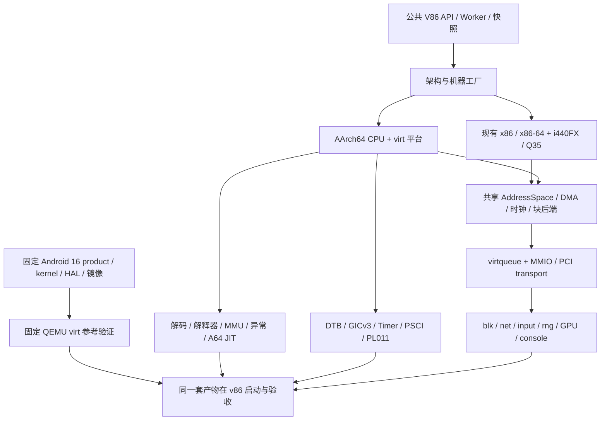

# ARM64 virt 与 Android 16 实施计划

状态：设计与实施计划，尚未实现或通过本文验收。

本计划基于 2026 年 10 月 3 日审查的当前 v86 分支，目标是新增独立的 AArch64 全系统
执行能力、`machine_type: "virt"`，并运行具有图形界面、输入、网络和持久化数据的
Android 16 ARM64 系统。现有 x86、x86-64 和后续 Q35 平台继续保留。

实现 A64 指令执行是必要条件，完整系统还需要异常与特权级、MMU、原子和内存顺序、
中断控制器、定时器、固件或启动协议、设备模型，以及适配该虚拟硬件的 Android 产品镜像。
Android 桌面成功启动与所选 ARM64 架构配置完整通过验证，是两项独立的完成条件。

## 目标版本与完整支持的定义

本次查阅的 [AOSP 官方版本表](https://source.android.com/docs/setup/reference/build-numbers)
已列出 Android 17；本文仍按需求以 Android 16 系列为目标。表中 Android 16 平台标签包含
`android-16.0.0_r4`，安全维护标签另列，不能单凭不同标签的 `r` 数字判断产品新旧。
实施开始时重新核对 Android 16 系列可获得的发布与维护版本，选择经验证的完整源码组合，
导出固定 manifest、kernel commit、工具链版本与镜像 hash。不要把会变化的
`android-latest-release`、AOSP main 或某个 CI 最新构建当作固定 Android 16 基线。

ARM64 通常指 AArch64 执行状态，其指令集称为 A64。Arm 架构包含持续演进的版本、可选扩展
及不同异常级别，不能用一个无边界的“全部 ARM64 指令”作为可交付规格。
建议建立版本化 CPU profile，保留完整支持的长期目标，并明确每个里程碑覆盖什么：

| 层级 | 交付范围 | 可以声明的结果 |
| --- | --- | --- |
| 引导阶段 | A64 基础执行、单核 EL1、4KiB MMU、串口 | 可以启动指定 Linux 测试环境 |
| Android 16 基础运行 | 所选 A64 基础指令及 FP/NEON、EL0/EL1、原子和屏障、4KiB MMU、必要设备与 JIT | 指定 Android 16 product 可运行，尚未代替架构完整性验收 |
| 完整基础 profile | 固定规范版本内全部已声明 A64/FP/NEON 语义、EL0/EL1 系统行为、4KiB/16KiB/64KiB stage-1、SMP、异常与一致性测试 | 完整实现所定义的 AArch64-only 基础 profile |
| 后续系统 profile | EL2、stage-2、虚拟中断；EL3、安全状态和安全内存；调试与 PMU 扩展 | 对应特权级及系统能力完成 |
| 后续 ISA profile | 按需求加入 LSE、CRC/crypto、FP16、dot-product、PAC/BTI、MTE、SVE/SVE2/SME 等 | 对应扩展完成，能力位与执行行为一致 |

首个 profile 建议使用自己的名称，例如 `v86-aarch64-v1`，固定 AArch64-only、little-endian、
非安全 EL0/EL1、A64 基础整数、FP32/FP64 和 Advanced SIMD/NEON。具体规范修订、
ID 寄存器、地址宽度及可选特性在 P0 冻结，不冒充一颗只实现了部分能力的 Cortex CPU。

Android 的 `arm64-v8a` ABI 不要求一次实现所有后续 Armv9 可选扩展；但 ABI 基线也不能证明
某份 kernel、vendor 库或产品构建未使用更高版本指令。P0 必须审计实际构建参数及依赖，
必要扩展提前实现或选用匹配 profile 的构建配置。AArch32 和 `armeabi-v7a` APK 兼容
另立里程碑，不能由 ARM64 支持自动推导出来。[Android ABI 文档](https://developer.android.com/ndk/guides/abis)

## 对外配置契约

沿用现有 `cpu_type` 字段，建议增加 `"arm64"`；内部代码和规范使用 AArch64 命名。
`machine_type` 表示机器平台，不同时引入另一个含义重复的 `arch` 开关。

```js
// 拟新增 API 的形状，不是当前可运行的启动配置。
new V86({
    cpu_type: "arm64",
    machine_type: "virt",
    cpu_cores: 4,
    graphics_adapter: "virtio_gpu",
    // RAM、kernel、initramfs 和磁盘由固定 Android 构建产物清单配置。
});
```

| CPU 与机器组合 | 规则 |
| --- | --- |
| 默认或 `cpu_type: "x86"`，i440FX | 保持现有默认行为 |
| `cpu_type: "x86_64"`，i440FX 或后续 Q35 | 保留现有及计划中的 x86 平台 |
| `cpu_type: "arm64"`，`machine_type: "virt"` | 新增 ARM 虚拟平台；ARM64 未指定机器时可默认选择 virt |
| ARM64 配 i440FX/Q35，或 x86 配 virt | 初始化阶段明确拒绝 |

新增通用 `kernel` 入口承载 Arm64 Linux `Image`，保留 `initrd`、`cmdline`；`dtb` 默认由
机器描述生成，外部 DTB 仅作为显式调试覆盖并检查资源一致性。现有 x86 `bzimage`、SeaBIOS
和 multiboot 路径不能被静默当作 ARM 启动方式。

`hda` 在 virt 上可继续表示第一个块后端，但连接到 virtio-blk；镜像内容必须是实际 raw
磁盘扇区。若产品需要多盘，新增有稳定 id、顺序和只读属性的块设备数组，明确它与旧字段
的冲突规则。Android 的 partition label、fstab 和 init 参数由同一份镜像清单决定。

`virt` 初期使用 DTB 与 PSCI，不自动创建 ACPI、SeaBIOS、PIC、APIC、PIT、CMOS、IDE 或
传统 VGA。无显示阶段使用 `graphics_adapter: "none"`；图形阶段使用无 VGA 依赖的
virtio-gpu。CPU profile 和机器布局都应有内部版本，进入快照及测试基线。

## 当前代码与复用边界

| 当前入口 | 可复用基础 | 必须改造的部分 |
| --- | --- | --- |
| [`src/main.js`](../src/main.js)、[`src/cpu.js`](../src/cpu.js) | 调度、设备生命周期、对外控制 | 固定创建 x86 CPU，设备和复位流程包含 PC 假设 |
| [`src/browser/starter.js`](../src/browser/starter.js)、[`src/browser/cpu_worker.js`](../src/browser/cpu_worker.js)、[`v86.d.ts`](../v86.d.ts) | 加载、Worker、公共 API | CPU 枚举、Wasm 产物/导入选择、架构参数传递 |
| [`src/rust/x64/`](../src/rust/x64/) | u64 客体地址、独立解码器、解释器与编译执行的设计经验 | x86 寄存器、特权状态、页表和指令语义不可用于 A64 |
| [`src/rust/ir/`](../src/rust/ir/) | I64/F32/F64/V128 类型、部分 SSA/CFG/MIR 和验证思路 | StateMap 固定 x86 GPR/FLAGS/x87/XMM，HIR 有分段及 x86 专用操作 |
| [`src/rust/wasmgen/`](../src/rust/wasmgen/) | Wasm 发射与模块基础设施 | ARM 专用状态恢复、异常与内存语义适配 |
| [`src/rust/softfloat.rs`](../src/rust/softfloat.rs) | 软件浮点集成经验 | 当前包装服务 x87/F80，不能直接替代 ARM FPCR/FPSR 语义 |
| [`src/rust/x64/physical.rs`](../src/rust/x64/physical.rs)、[`src/extended_memory.js`](../src/extended_memory.js) | 地址不截断、分块 RAM、脏页和流式快照 | 36-bit、4KiB、x86 低地址洞和仅高地址 window 的耦合 |
| [`src/virtio.js`](../src/virtio.js)、[`src/virtio_devices.js`](../src/virtio_devices.js) | split virtqueue、设备接口、异步 generation | PCI/端口/IRQ 强耦合，DMA 仍包含 x86 地址判断 |
| [`src/graphics_adapters/virtio_gpu/`](../src/graphics_adapters/virtio_gpu/) | 2D、Virgl、Venus 与 WebGPU 路径 | 当前包含 VGA core、VGA class、BIOS ROM 与 PC BAR 布局 |
| [`src/machine_clock.js`](../src/machine_clock.js)、[`src/parallel/`](../src/parallel/) | 虚拟时钟、调度、安全停止、宿主 Worker 通信 | TSC/APIC/INIT/SIPI、x86 state 与并发内存模型耦合 |
| [`src/kernel.js`](../src/kernel.js)、[`src/state.js`](../src/state.js) | 加载和序列化基础设施 | x86 Linux 启动协议、CPU 状态槽和架构校验 |

现有 IR 有 64-bit 值类型，不等于已经拥有跨架构 JIT；现有 x64 高地址总线也不能直接作为
ARM virt 的地址空间。这两项需要明确抽象边界，避免把工作量误估为新增一个解码器。

与 [Q35 AHCI SATA 计划](q35-ahci-sata-plan.md) 共享精确 MMIO、通用 PCI 配置访问、DMA、
块后端与机器版本管理等基础设施；ARM virt 不依赖先实现 Q35 芯片组或 AHCI。
两份文档描述的机器类型均不能被当作当前已经实现。

## 架构与并行工作线



CPU、virt 平台、Android product 三条工作线可并行。Android 参考镜像应在项目初期启动
构建与验证，避免模拟器完成后才发现镜像依赖未实现的板型或宿主服务。

## P0 冻结架构与参考产物

P0 交付一个机器可读的兼容清单，至少包含：

- Arm 规范修订、AArch64 CPU profile、特性矩阵、ID 寄存器、VA/PA 位宽、页粒度和异常级别。
- 固定 QEMU release、版本化 `virt-X.Y`、固定 CPU 模型及特性、GIC/PSCI/transport 配置。
  不以变化的 `-cpu max` 作为唯一对照。
- Android 16 完整 manifest、kernel/GKI tag 与配置、模块 KMI、Clang/构建工具及产品配置。
- RAM 布局、DTB、磁盘 GPT/分区名、bootconfig、图形协议及 guest/host 驱动版本。
- 每个镜像的格式、大小、hash、读写属性和所需宿主服务；4KiB 与 16KiB 产物分别记录。
- 本地 Native QEMU 与浏览器 v86 的区别、测试宿主、性能测量方法和首版功能边界。

规范依据应冻结到具体修订；[Arm 架构手册入口](https://developer.arm.com/documentation/ddi0487/latest/)
用于定位所选版本，不能让移动的 latest 文档代替已经冻结的 profile。

P0 不要求参考 Android 立刻启动成功，但其构建工作立即开始；Android 镜像验收必须在
v86 Android 集成关卡前完成。参考 Linux 则尽早建立，作为 CPU 与设备开发的稳定输入。

## P1 架构工厂与通用地址空间

新增架构感知的 CPU 工厂和机器工厂。公共调度接口包括执行预算、异常/IRQ 通知、暂停、
复位、时钟推进、快照和架构调试状态；具体寄存器与启动协议归所属架构。先保留 x86
实现及状态布局，不通过一次全仓库重写来接入 ARM。

建议新增 `src/rust/aarch64/`，包含独立的 profile、state、decode、execute、exceptions、
sysregs、mmu、tlb、fp、simd、exclusive 和 jit 模块。这些是拟新增目录，不是现存实现。
生成独立 ARM 状态布局，禁止把 X 寄存器叠加到现有 x86 offsets。

定义架构无关 AddressSpace：客体虚拟地址、客体物理地址、Wasm backing offset 三者分离。
Rust 使用明确的 u64 地址类型；JS 边界采用 BigInt 或高低 word，受限物理地址使用 Number
时必须证明在安全整数范围。禁止将任意 64-bit 值经过 `|0`、`>>>0` 或普通 Number 截断。

QEMU virt 的 RAM 从 `0x40000000` 开始。当前 x64 `physical.rs` 的 window 校验要求
guest base 至少 4GiB，并包含 VGA hole，无法直接表达这个映射。新地址空间应把
`guest 0x40000000 → backing offset 0`，支持连续或分段 RAM、ROM、MMIO 与空洞，
不为低地址空洞浪费 1GiB 宿主内存。

当前 MMIO 注册按 128KiB 粒度，而 virtio-mmio 槽、PL011 和 RTC 等区域更小。增加精确
子区间 decode、访问宽度和对齐策略、重叠检查、映射 owner、迁移与释放；可保留粗块快路径。
设备 DMA、virtqueue 和图形插件全部经过同一地址空间，不能继续调用仅适用于 x86 的
`x64_phys_*` 或硬编码 VGA 地址洞。

Wasm32 已有 i64，因此 AArch64 不要求先迁移 Memory64。但 Android 的实际 RAM 容量、
浏览器内存限制与分块 backing 必须独立验证。复用 extended RAM 时，要处理高 RAM 中的
可执行代码、JIT 失效、DMA 和快照，不能让 Android 代码一旦落入高内存就长期退回慢解释器。

验收：非零 RAM base、超过 4GiB 的有效 PA、空洞和窄 MMIO 正确；现有 x86/x64 回归通过；
只创建 ARM 平台要求的设备，不依赖 PC 固件启动。

## P2 A64 解释器与架构语义

先实现完整、易校验的解释器，作为 JIT 的语义参考。解码与执行分离，取指不得在编译阶段
产生 MMIO 副作用或客体异常；维护按编码族、特性、异常行为和测试用例关联的覆盖清单。

| 类别 | 必须覆盖的内容 |
| --- | --- |
| 状态 | X0–X30、W 写零扩展、SP_EL0/SP_EL1、PC、PSTATE/NZCV/DAIF、V0–V31、FPCR/FPSR |
| 解码 | 固定 32-bit 指令、字段合法性、SP/ZR 的按指令解释、未分配和扩展编码、权限检查 |
| 整数 | 算术、carry/overflow、逻辑、移位/扩展、位域、bitmask immediate、乘除与乘法高位、条件选择 |
| 控制流 | branch、link、return、条件跳转、PC 相对寻址和异常返回 |
| 内存 | 各宽度 load/store、sign extension、pair、前后索引、literal、对齐和跨页故障 |
| 原子 | exclusive load/store、acquire/release、CLREX、屏障与所选扩展 |
| FP/NEON | FP32/FP64、向量运算/重排/转换、饱和与 QC、NaN、舍入、异常标志 |
| 系统操作 | MRS/MSR、SVC、BRK、ERET、WFI/WFE/SEV/SEVL、TLBI、DC/IC、DMB/DSB/ISB |

未知或未开启特性不能统一作为 NOP。按所选规范实现 Undefined/Trap、RAZ/WI 或指令规定
的兼容行为；对实现定义和约束不可预测行为固定选择并记录，而不是用宿主随机结果掩盖缺口。

FPCR 的舍入、FZ/DN 和 FPSR 状态必须影响执行；特别测试 signed zero、subnormal、
NaN、fused operation 和转换边界。Wasm FP/SIMD 仅在语义等价时直接映射，其他路径使用
精确软件 helper，不能将“结果大致相同”作为浮点完成标准。

ID_AA64PFR/ISAR/MMFR、MIDR/MPIDR、Linux HWCAP 和实际能力保持一致。Linux 根据
架构特征决定是否执行优化指令，误报特性会导致真实用户空间失败。
[Linux HWCAP 文档](https://docs.kernel.org/arch/arm64/elf_hwcaps.html)

验收：裸机指令测试、非法编码与边界输入、差分测试通过；解释器没有被静默忽略的
已声明指令族。只补齐一次 Android 启动遇到的指令不能替代该关卡。

## P3 异常 MMU 与多核内存语义

实现 EL0/EL1 异常入口和返回，覆盖 VBAR/ELR/SPSR/ESR/FAR、同步异常、IRQ、FIQ、
SError 及 mask/priority 行为。取指与数据 abort 必须给出正确 fault PC、地址、syndrome
和提交状态；异步设备通知在架构安全点注入。

系统寄存器采用表驱动方式定义访问权限、reset、RES0/RES1、RAZ/WI 和副作用，覆盖
SCTLR、TCR、TTBR0/1、MAIR、TPIDR、架构 ID、timer 和 GICv3 CPU interface。

Stage-1 MMU 分阶段支持 4KiB、16KiB、64KiB granule，处理 TTBR0/1、T0SZ/T1SZ、ASID、
各级 table/block/page、AP/AF、UXN/PXN、内存属性和选定的 TBI/PAN 等特性。
不支持的 granule/地址宽度必须在 ID 寄存器正确声明，并按规范处理非法配置。

TLB 使用有界缓存，tag 包含完整 VA、地址空间/ASID、权限上下文和 generation；实现
translation/access flag/permission/alignment/address size fault 的区别，以及 TLBI 的
按地址、ASID、全局和跨核效果。Guest granule、内部脏页单位、Wasm 64KiB page 和磁盘
sector 是独立概念，不能共用一个固定 `PAGE_SIZE`。

可以不模拟缓存时延，但 DC/IC、DSB/ISB 与代码可见性必须正确。ART 会生成并修改 A64
代码，因此代码写入、cache maintenance、TLBI、DMA 和恢复必须可靠失效编译缓存。
早期可保守扩大失效范围，通过正确性测试后再优化。

Exclusive monitor 必须记录 reservation 和失效事件，覆盖跨核/DMA 写入、异常、复位和
恢复。单纯检查“内存值没变”不足以替代 LDXR/STXR 的保留语义，会遗漏 ABA 等情况。
LSE 可单独分期，但产品实际使用时必须提前进入所选 profile。

第一版可采用比 ARM 更强的顺序一致访问，但必须满足架构要求的原子性、acquire/release、
屏障与 Device memory 顺序。不能把 x86 TSO 直接当作 ARM 语义。性能优化若放松顺序，
需要 ARM litmus 和多核压力测试证明合法性。

先实现一个宿主 Worker 内确定性轮转的多核，再接入真正 parallel Worker。PSCI、WFI/WFE、
SEV、IPI、timer、TLBI、reservation、代码失效与保存时的全核停止统一设计。

验收：页表和异常差分、用户态程序、signals、futex/pthread、多核 TLB shootdown 和
原子压力通过。4KiB 是初次启动关卡，16KiB 是 Android 16 扩展验收，64KiB 是完整基础
profile 的独立完成条件。

## P4 virt 机器与 Linux 启动

`virt` 是虚拟板型，不是某颗真实手机 SoC。以固定 QEMU 版本的机器布局为对照，从统一
Platform 描述生成地址、IRQ、CPU affinity 和 DTB；不能把不同 QEMU 版本的地址拼在一起。
QEMU 明确约定 RAM 起点为 `0x40000000`，其他设备信息应从 DTB 获取。
[QEMU Arm virt 文档](https://www.qemu.org/docs/master/system/arm/virt.html)

| 组件 | 首版行为与后续边界 |
| --- | --- |
| RAM 与 ROM | 与 DTB 一致的 guest PA 映射，内核/initrd/DTB/保留区不重叠 |
| PL011 | 寄存器、FIFO、状态及中断，用于 earlycon、串口和测试日志 |
| GICv3 | Distributor、每核 Redistributor、ICC 系统寄存器；SGI/PPI/SPI、优先级、mask、EOI/active 状态和路由 |
| Generic Timer | CNTFRQ、counter、物理/虚拟 timer 的已声明接口、compare/control、每核 PPI；使用机器虚拟时钟 |
| PSCI | VERSION/FEATURES、CPU_ON/OFF、AFFINITY_INFO、SYSTEM_RESET/OFF；按所选版本实现返回值与 CPU 状态 |
| DTB | CPUs/MPIDR、memory、chosen、initrd、bootargs、PSCI、GIC、timer、UART、virtio 与 PCI 节点 |
| virtio-mmio | modern transport，作为 Linux 初始 blk/net/rng/console/input 路径 |
| Generic PCIe host | ECAM、MMIO windows、INTx 到 GIC；Android 图形阶段提供 modern virtio-pci |
| RTC 和 fw_cfg | 按所选 virt profile 实现 PL031 及 fw_cfg MMIO，明确初始时钟和固件接口 |
| 可选后续设备 | ITS/MSI、SMMUv3、UEFI/pflash、ACPI、GPIO、热插拔；未实现时不在 DTB/能力中声明 |

PSCI 的版本、HVC/SMC conduit 与 DTB 匹配。若初期通过 VMM 服务路径截获 PSCI 调用，
应精确定义截获与错误行为，不能声称由此完成 EL2/EL3 指令和状态机。
GICv3 的非安全基本路径可先交付；安全分组、虚拟中断和 ITS 在对应系统 profile 中完成。

新增 Arm64 Linux loader，读取 `Image` header、加载约束及入口，放置 initramfs 与 DTB，
按启动协议设置 x0 为 DTB 地址、x1–x3 为零，以及入口异常级、mask、MMU/cache 状态。
首次可直接进入 non-secure EL1；EL2 是后续能力，不能伪造其存在。Linux 协议允许从 EL1
或 EL2 进入内核。[Linux AArch64 启动协议](https://docs.kernel.org/arch/arm64/booting.html)

DTB 校验涵盖 phandle、地址和 size cells、IRQ 编码、CPU affinity、设备存在性及 reserved
memory。用 dtc/内核实际枚举进行验证，不能只检查二进制能生成。

验收顺序：裸机串口 → timer/GIC → Linux earlycon → initramfs shell → 块设备、网络 →
多核 Linux。guest 必须实际接收 timer/设备 IRQ，不能靠长期轮询掩盖中断缺陷。

## P5 Virtio 存储输入网络与图形设备

将现有 VirtIO 拆成设备核心、virtqueue 和 transport。共享 split queue、descriptor
校验、feature/status 协商、reset/generation 与 DMA，分别提供 modern virtio-mmio 和
modern virtio-pci。MMIO transport 的 DeviceID 是 Virtio 功能编号，不能直接使用 PCI ID。
未实现的 packed ring、indirect/event-index 等功能不得错误协商。
[Virtio 1.2 规范](https://docs.oasis-open.org/virtio/virtio/v1.2/virtio-v1.2.html)

Linux 引导先用 MMIO 简化平台依赖；Android 产品基线建议在 PCIe host 完成后固定为 modern
virtio-pci，便于复用并测试现有 GPU/BAR 路径。两种 transport 共用同一设备核心，镜像清单
固定最终拓扑，不在快照恢复时自动切换。

| 设备 | 仓库现状与实施事项 |
| --- | --- |
| virtio-blk | 未发现内建实现；新增读取、写入、flush、容量与只读状态，复用现有块后端和 I/O 跟踪 |
| virtio-net | 已有设备核心；适配通用 DMA/transport/IRQ，验证 MAC、DHCP、DNS 与网络恢复 |
| virtio-console | 已有基础；用于控制通道和诊断，但不能未经实现就当作现成 ADB 通道 |
| virtio-rng | 当前有自定义设备示例和测试；产品化为正式设备，正常运行使用宿主安全随机源 |
| virtio-input | 新增键盘、指针/触摸和事件同步，配套 Android input 配置 |
| virtio-gpu | 复用 2D/3D 核心，提取无 VGA 的设备包装与 modern PCI transport |
| virtio-vsock | 当前未发现实现；借用的 Android 服务若需要则实现设备及宿主后端，否则在 product 中替换依赖 |
| virtio-snd | 后续完整交互阶段新增声音设备和 Android audio HAL 对接 |

DMA 验证完整 descriptor 链、方向、环和长度上限、guest 地址溢出；异步回调通过 generation
防止 reset/restore 后污染新状态。设备数据可复用，但 x86 的 `raise_irq`、PIO、VGA hole
和 CPUID 相关逻辑不能进入 ARM 核心。

验收：Linux 原生驱动完成磁盘随机读写/flush/重启校验、网络、输入与 RNG；MMIO/PCI
transport 分别测试，IRQ 与多核并发通过。块后端必须明确缓存与持久化语义。

## P6 A64 JIT 与浏览器执行性能

解释器负责正确性，Android 可交互目标需要可用 JIT。浏览器中的 Wasm 不能直接使用 KVM/HVF，
即使宿主 CPU 也是 ARM64，客体仍需要模拟执行，不能以原生 QEMU 硬件加速的性能作承诺。

第一版建立 A64 block frontend 和独立 StateMap，记录 31 个 GPR、SP、PC、NZCV、V0–V31、
FP 状态以及精确异常恢复点。复用 Wasm emitter 和可证明通用的优化组件，不先强迫所有
x86 HIR/StateMap 变成通用架构。

热路径先覆盖整数、分支、load/store、常见 NEON；其余已实现指令调用精确 helper。
helper fallback 是性能策略，不能用于掩盖尚未实现的语义。

编译代码身份至少考虑架构/profile、完整代码地址与物理 backing、执行上下文、可用特性及
代码 generation；地址转换、权限、ASID、TLBI、cache maintenance、自修改代码、DMA 和
restore 都需要正确 guard 或失效。fault/MMIO/退出必须恢复到精确状态，不能重复执行
已经发生的写入。高 RAM 中的代码同样应可编译。

先让解释器/JIT 在相同确定性输入下逐段差分，再优化跨块链接、代码缓存和向量化。
ART 自身 JIT/AOT 与模拟器 JIT 是两层机制；覆盖动态生成代码、权限切换及 cache flush，
不能只测静态 kernel 和 ELF。

验收记录冷启动与第二次启动、应用启动、输入延迟、持续帧率、JIT 时间、内存峰值和缓存
命中率。P0 建立测量口径，Linux/JIT 基准后冻结 Android 可交互的量化预算；不在未测量时
承诺固定秒数或帧率。

## P7 Android 16 产品与启动材料

### 板型与产品选择

| 环境 | 与本计划的关系 |
| --- | --- |
| 上游 QEMU Arm virt | 通用虚拟板，是 v86 的硬件对照，不自动包含 Android HAL |
| Android Emulator ranchu/goldfish | Android 专用板级设备和宿主协议，镜像不能直接当作普通 virt 镜像 |
| Cuttlefish | 包括 product、launcher、VMM 配置和宿主服务的完整环境，可作为构建与 HAL 参考 |

新增自有 AOSP `device/<project>/virt_arm64` product，参考同版本 Cuttlefish/Goldfish 配置，
逐项选择 HAL 并替换所依赖的宿主服务。不要将任意手机固件、GSI 或 `aosp_arm64` 输出视作
可直接启动的完整 virt 系统；AOSP 文档明确 `aosp_arm64` 不是完整设备 target。
[Cuttlefish 文档](https://source.android.com/docs/devices/cuttlefish)、
[Generic boot 与产品配置](https://source.android.com/docs/core/architecture/partitions/generic-boot)

建议以固定 `android16-6.12` ACK/GKI 分支的适当 tag 为内核候选，并按官方兼容矩阵验证；
这不表示 Android 16 只能使用 6.12。GKI、GKI modules 和 vendor modules 必须匹配
所选 KMI/构建。导出准确配置，覆盖 PL011、GICv3、timer、PSCI、Virtio、Binder、文件系统、
device-mapper、DRM/dma-buf 以及实际 product 所需功能。[ACK 文档](https://source.android.com/docs/core/architecture/kernel/android-common)

在固定 Native QEMU + versioned virt + 固定 CPU/GIC/transport 上先启动同一套产物，保留
经过实际运行的启动脚本、串口日志、logcat、DTB、分区表和驱动配置。未通过该关卡，
不能把 Android 启动失败直接归因于 v86 CPU。原生构建和参考验证属于开发工具链，
浏览器运行本身不能暗中依赖宿主 Linux 服务，除非作为独立可选运行模式公开说明。

### 分区与启动流程

| 材料 | 处理方式 |
| --- | --- |
| Arm64 `Image` | 初期 direct kernel boot 的内核，不等同于 Android boot 容器 |
| `boot.img`、`init_boot.img` | 按产品 header/version 提取内核与 generic ramdisk |
| `vendor_boot.img` | 选择 vendor ramdisk/早期模块、DTB 与 bootconfig，按格式构造启动输入 |
| system/system_ext/product/vendor/odm | 框架、产品和 HAL 分区，按产品实际选择 |
| system_dlkm/vendor_dlkm | 按 GKI/module 方案提供模块及依赖 |
| `super.img` | 动态分区容器，必须理解其元数据，不作为普通 ext4 根分区挂载 |
| userdata/metadata | 可写数据、按配置需要的加密相关状态，支持重启后持久化 |
| vbmeta/AVB 元数据 | 与所选开发或 verified-boot 策略、分区内容一致 |

首个移植入口建议使用由构建工具生成的 direct boot bundle：提取 kernel，按规则合并所选
vendor/generic ramdisk，附加合法 bootconfig，使用匹配 virt 的 DTB，并生成稳定 GPT/raw
磁盘布局。Android sparse image 要先转换为 raw 或由明确的格式层解析，不能直接作为扇区。

ramdisk 的合并、padding 和 bootconfig 的长度/校验/trailer 遵循格式规范；
`androidboot.*`、fstab、partition label 与块设备拓扑必须一致。不能把 bootconfig 文本
随意塞进 cmdline 就认为完成适配。[Vendor boot 文档](https://source.android.com/docs/core/architecture/partitions/vendor-boot-partitions)、
[Bootconfig 文档](https://source.android.com/docs/core/architecture/bootloader/implementing-bootconfig)

后续若要承诺完整 Android 原生 boot flow，再实现或接入相应 bootloader/UEFI、boot
容器加载和 AVB 校验。UEFI 本身不等于 Android bootloader。开发用 direct boot/userdebug
不代表已经实现 verified boot、rollback protection 或硬件信任根。

### Android 服务与系统策略

产品需要维护 BoardConfig、product 配置、init/ueventd、fstab、权限 XML、VINTF
manifest/matrix 与 SELinux policy。Binder 是客体内核/用户空间功能，不应由模拟器
伪造；GIC、原子、内存和计时正确后，让正常 Android 内核实现这些接口。

图形、input、网络、health/power、audio、KeyMint/Gatekeeper 等按产品需求逐项匹配。
借用 Cuttlefish 服务时检查 vsock、serial、Trusty 或宿主 helper 的依赖。开发软件实现
应明确其安全等级；不能把“启动服务”当作硬件安全隔离已完成。数据加密及 metadata
策略与重启持久化一起验收，避免每次启动都重新初始化 userdata。

VINTF 必须使用目标 Android 16 版本的匹配规则，不能照搬旧教程将缺少的服务统一设为
optional。阶段性 permissive 只用于排错，产品完成标准包括 enforcing 下运行和必要服务
无反复重启。[VINTF 匹配规则](https://source.android.com/docs/core/architecture/vintf/match-rules)、
[HAL 文档](https://source.android.com/docs/core/architecture/hal)

ADB 首先选择明确的网络接入路径，配套 adbd 与浏览器网络后端/代理；需要时再做 vsock
或专用通道。PL011 串口不自动等于 ADB，浏览器也不自动拥有任意 TCP 端口监听能力。

### 页面大小

首次引导使用 4KiB kernel，16KiB 单列完整兼容测试，尽早按目标工具链生成兼容的 ELF
对齐布局。Android 16 并非所有系统只能以 16KiB 运行；16KiB 需要 CPU MMU、kernel、
库和 native APK 的共同支持。不能只改 DTB 或内核 PAGE_SIZE。[AOSP 页面大小文档](https://source.android.com/docs/core/architecture/16kb-page-size/16kb)、
[Android 应用页面兼容说明](https://developer.android.com/guide/practices/page-sizes)

## P8 Android 图形与完整交互

当前分支已具有 Virgl/Venus 到 WebGPU 的实现，可作为加速后端基础。其在 x86 Linux 上
可用，不等于 ARM Android 的 Mesa、WSI、allocator/mapper 和 composer 已可用。
保留现有后端，新增无 VGA 依赖的 virtio-gpu 包装：ARM 不需要 VGA 寄存器、VBE、
VGA BIOS 或 VGA PCI class。

图形分为三个可独立定位问题的关卡：

1. Linux DRM/KMS 和 virtio-gpu 2D：scanout、格式、stride、分辨率、光标、资源生命周期。
2. Android 软件渲染桌面：在目标 product 中选定并验证 Mesa 软件路径或
   SwiftShader/ANGLE 的适当组合，配套 allocator/mapper、composer/HWC 与显示驱动。
   2D 设备不会自动提供完整 Android 图形栈，软件渲染也会增加 A64 模拟负载。
3. Android GPU 加速：固定 guest Mesa Virgl/Venus、capset、WebGPU 后端与 Android
   集成版本，逐项补足实际要求。若采用 gfxstream，另行实现它的传输和宿主协议，
   不能认为现有 Virgl/Venus 是同一协议或浏览器可直接加载原生宿主库。

重点验证 AHardwareBuffer/native buffer、dma-buf、fence/sync、DRM format/modifier、
gralloc/mapper、composer、EGL/GLES/Vulkan、Android WSI 与 SurfaceFlinger 的组合。
能力声明必须与实现一致；基础桌面、GLES 应用和 Vulkan 应用分开验收。
[Mesa Android 集成](https://docs.mesa3d.org/android.html)、
[Android Vulkan 实现](https://source.android.com/docs/core/graphics/implement-vulkan)、
[SurfaceFlinger 文档](https://source.android.com/docs/core/graphics/surfaceflinger-windowmanager)

输入覆盖键盘、触摸坐标、按下/抬起、滚动和旋转后的坐标映射；网络覆盖 DNS、连接与恢复；
完整交互增加 virtio-snd/audio HAL、浏览器音频权限和缓冲。相机、传感器、基带等按产品
功能声明逐项推进，未实现的硬件功能不虚假暴露。

## P9 生命周期与发布验收

快照记录 arch、CPU profile、机器布局版本、RAM map、每核状态、GIC/Timer/PSCI、
Virtio 队列、块设备和介质状态；旧快照按原 x86 契约处理，拒绝跨架构恢复。

保存前全核进入安全点，阻止新 DMA，等待在途 I/O 并同步 GPU 必要状态；恢复后失效
宿主编译代码，重建地址映射、timer 与 IRQ。定义 exclusive monitor 的合法恢复策略。
复位重新加载 direct boot 材料，PSCI CPU_OFF/CPU_ON 与系统 reset/off 各自保持正确范围。

快照覆盖磁盘写缓存和 userdata 的一致性；若基础镜像可被外部更改，必须匹配其版本/hash
或使用一致的 overlay。网络连接、ADB 会话及 WebGPU device 等宿主资源明确重连/重建，
不承诺保存网络对端或原生宿主对象。

| 关卡 | 完成条件 |
| --- | --- |
| R0 契约与参考产物 | 固定 profile、版本、配置和镜像清单；QEMU Linux 参考可启动 |
| R1 CPU 基础语义 | 有效编码族、保留编码、边界值、SP/ZR、NZCV、load/store 和异常差分 |
| R2 CPU 系统语义 | FP/NEON、FPCR/FPSR、MMU、ASID/TLBI、故障提交状态、原子与屏障 |
| R3 virt Linux | 正常串口、中断、timer、PSCI、shell、磁盘、网络及 1/2/4 核 |
| R4 JIT | 解释器/JIT 差分、异常精确恢复、自修改代码、跨核/高 RAM 代码失效和性能基线 |
| R5 Android 参考 | 自定义 Android 16 product 在固定 QEMU 上完成启动，必要宿主依赖已记录 |
| R6 Android 用户空间 | v86 挂载真实分区，模块成功加载，zygote/system_server/Binder/adbd 正常 |
| R7 Android 桌面 | `sys.boot_completed=1`，SurfaceFlinger/Launcher、输入、应用安装启动和网络可用 |
| R8 产品稳定性 | SELinux enforcing、VINTF/必要 HAL、userdata 持久化、反复冷启动和内存压力通过 |
| R9 扩展兼容 | 16KiB Android、加速图形、音频、SMP/parallel、快照及长期运行分别通过 |
| R10 完整基础 ARM64 | 已声明 profile 的全部语义与 4KiB/16KiB/64KiB 架构测试完成，而非仅 Android 工作负载覆盖 |
| R11 回归与性能 | 原 x86/x64/i440FX，以及 Q35 实现后的相关回归；满足冻结的资源和交互预算 |

差分工具固定 QEMU 版本，并尽可能增加真实 ARM 硬件对照。对实现定义和约束不可预测行为
比较允许结果集合，不把 QEMU 的单一结果当作规范。每个 fault point 验证 PC、ESR、FAR
及已提交状态；FP/NEON 比较结果与 flags；多核覆盖 ARM litmus、futex 和共享队列。

复用现有 [`tests/x64/oracle/`](../tests/x64/oracle/)、
[`tests/smp/physical_bus.mjs`](../tests/smp/physical_bus.mjs)、
[`tests/devices/device_io_reset.mjs`](../tests/devices/device_io_reset.mjs) 和
[`tests/parallel/litmus.mjs`](../tests/parallel/litmus.mjs) 的测试组织经验，但新增 ARM
测试程序及参考执行器，不把现有 x86 测试直接算作 ARM 覆盖。

运行 Android 验收脚本覆盖 framework、ART JIT/AOT、JNI/native APK、signals、futex、
网络、图形和重启后文件校验。按 4KiB/16KiB 对齐构建的 native APK 兼容性单独记录。
选定 CTS/VTS 子集形成回归，完整 CTS/VTS、Android 兼容性认证、Google Play/GMS
及硬件安全等级是不同目标，不能用桌面出现代替这些结论。

## 分阶段交付与后续完整平台

| 里程碑 | 主要阶段 | 可对外展示的成果 |
| --- | --- | --- |
| M0 | P0 与 Android 构建线启动 | 固定参考、可复现产物及缺口清单 |
| M1 | P1/P2，P3/P4 基础 | 裸机与单核 Linux shell |
| M2 | P3/P4/P5 | MMU/中断/多核 Linux，Virtio 磁盘和网络 |
| M3 | P6 与 P7 参考完成 | A64 JIT 和同一套经 QEMU 验证的 Android 16 产物 |
| M4 | P7/P8 基础 | Android 用户空间、软件渲染桌面与基本交互 |
| M5 | P8/P9 | 16KiB、GPU 加速、音频、快照和持续运行 |
| M6 | 完整基础 profile 关卡 | 完整已声明 ARM64 基础语义与覆盖报告 |
| M7 | 后续系统/ISA profile | EL2/EL3、更多 ISA、UEFI/ACPI、ITS/SMMU 和完整平台扩展 |

EL2/stage-2、EL3/TrustZone、AArch32、SVE/SVE2/SME、MTE 等按独立 profile 推进；
如果选定 Android 产品需要 AVF/pKVM、TEE 或某项安全扩展，应把相应工作提前，不能通过
只改 feature bit 或 guest 属性伪装支持。后续完整 virt 还需要审计选定 QEMU 版本的其余
设备、固件启动路径、PCIe/MSI、IOMMU 和平台配置组合。

这是一项 CPU、虚拟硬件、编译执行和 Android 产品适配共同推进的工程。进度按上述
可复现验收关卡管理，性能与工期在参考镜像、Linux 和 A64 JIT 实测后进一步量化。
