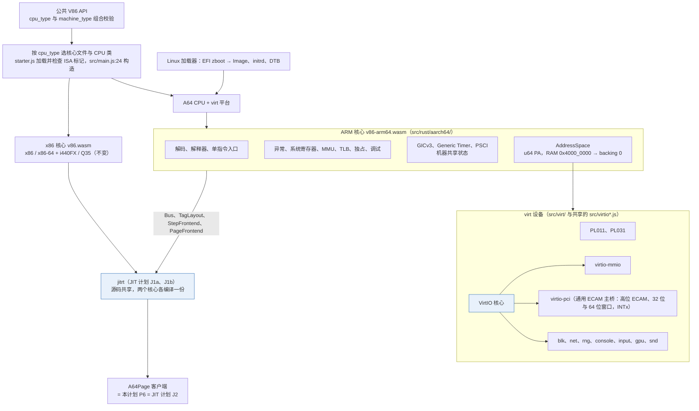
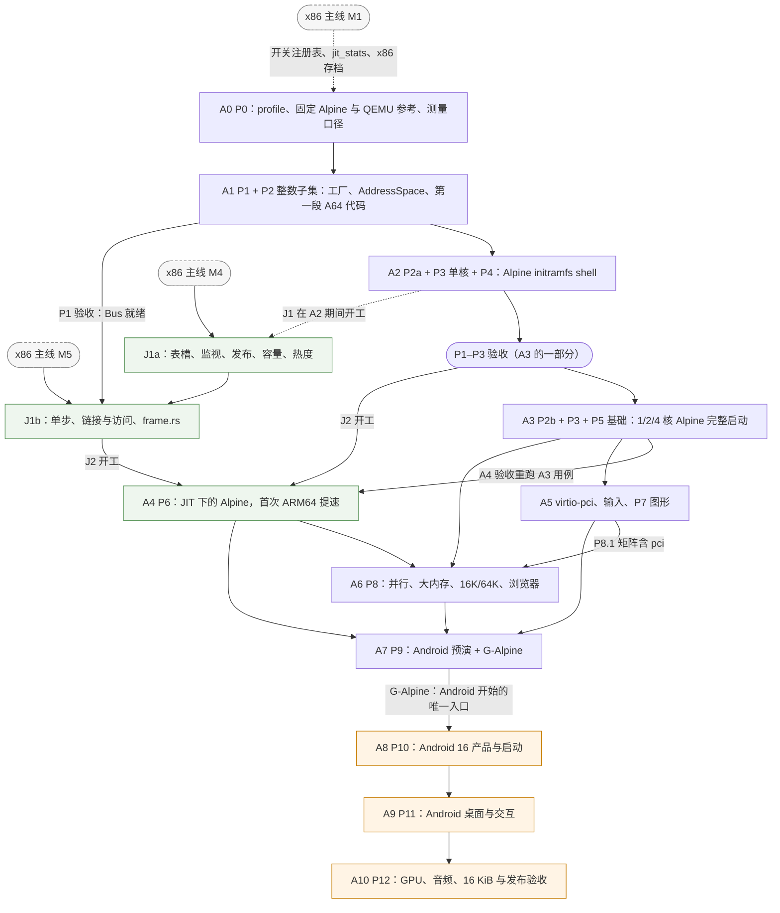

# ARM64 virt 与 Android 16 实施计划

状态：设计与实施计划，尚未实现或通过本文验收。验证顺序已定：P0–P9 以 Alpine Linux 3.24 aarch64 为验证载体
（P0 在 QEMU 参考上跑 Alpine；P1 是基础设施，以单元测试与 x86 不退化验收；从 A2 起 Alpine 在 v86 中运行）；
全部阶段完成并通过 Alpine 发布关卡（A7，下称 G-Alpine）之后，才用 Android 16 验证（P10–P12）。

本计划基于 2026 年 10 月 7 日审查的 `0aebe4f`，2026-10-09 与 [JIT 统一计划](jit-unification-plan.md)（下称 JIT 计划）
一起按 `985f518d`（SIMD/XSAVE 计划全部完成后的 master）重新核对：代码位置由 `0aebe4f` 的位置按 git 差异逐条换算，
所引代码本身有改动的逐条人工复核。两份计划都已提交（`3dab585f`）；文中引用的 JIT 计划行号以同日重新核对之后的版本为准。远程事实（Alpine aports 3.24-stable、mkinitfs 3.14.1、Linux v6.18、
QEMU 9.2.0 与 11.1.2、GKI android16-6.12）注明来源，核对日期都是 2026-10-07，见附录 B。审查环境无法访问
`dl-cdn.alpinelinux.org` 与 `source.android.com`，依赖它们的内容标为"待核对"。规模估计（S/M/L/XL）与
JIT 计划相同：单人粗估，S 为几天，M 约 1–2 周，L 约 3–4 周，XL 超过一个月。

目标是新增 AArch64 全系统执行（`cpu_type: "arm64"`）与 QEMU 风格的 `machine_type: "virt"`：先让未修改的
Alpine Linux aarch64（官方 ISO 中的 virt 内核与用户空间）在 v86 中以解释器、A64 JIT、多核、并行 Worker、
virtio 设备和图形完整运行，最后运行具有图形界面、输入与网络的 Android 16（磁盘数据只在同一会话内保留）。现有 x86、x86-64、
i440FX 与 Q35 保持不变。

## 结论

- **Alpine 先行，Android 最后。** P0–P9 以 Alpine 3.24 aarch64 为验证载体（P1 是基础设施，A2 起 Alpine 在 v86 中
  运行），方法照搬仓库已有的
  x86_64 Alpine 体系：固定官方 ISO 与 SHA-256、QEMU TCG 参考先跑、独立 probe、快照与生命周期
  （`tests/x64/linux_boot.mjs`）。Android 16 的构建、参考验证与集成全部排在 A7 之后；P0 只做一次不构建的
  Android 纸面审计，提前暴露会改变 profile 或 virt 布局的需求。
- **先补上会直接挡住 Alpine 的缺口。** Alpine aarch64 的 `vmlinuz-virt` 是 EFI zboot 镜像而不是 `Image`；
  Linux 在 IRQ 屏蔽状态下执行 WFI 进入空闲；musl 的第一个 busybox shell 就要用 FP/AdvSIMD、独占监视器和
  DC ZVA；内核几乎每个函数都有 PACIASP，还会读取 v8.0 之后才定义的 ID 寄存器。原计划没有覆盖这些。
- **A64 JIT 就是 JIT 计划的 P6，即支线 J2。** 本计划不建自己的表槽、发布、热度、链接表或访问缓存，只交付
  J2 需要的东西：P1 的 AddressSpace（JIT 计划 `Bus` 的实现对象）、P2 的单指令入口、P3 的 TLB 失效钩子，以及
  Alpine 上的验收。J2 依赖 JIT 计划的 J1b，J1b 又依赖 x86 主线 M5；J2 就绪之前，P5、P7 与 P8 的非 JIT 部分以
  解释器推进。
- **v1 profile 冻结到字段级**：按 Alpine 的实际需要取 ARMv8.0-A、FP/AdvSIMD、CRC32、只有 AArch64 的 EL0/EL1、
  4 KiB granule（16/64 KiB 在 v1.1）、CSV2/CSV3=1（Linux 因此不开 KPTI）、无 PMU、调试架构最小集；另按所有者的
  决定（2026-10-07）提前放进 crypto 扩展 AES、PMULL、SHA1、SHA2。LSE 等由 Android 审计决定是否进入 v2，PAN 另可由
  P9.3 在 androidish 内核上的测量提前决定；v2 的特性也要先在 Alpine 上验收。
- **QEMU 参考固定为 9.2.x 的 virt-9.2 加 cortex-a35**（v8.0、40 位 PA、支持 4/16/64 KiB granule）。
- **virt 布局跟随 QEMU virt-9.2 的默认内存图，只关闭 ITS**：GICv3；RAM 从 `0x4000_0000` 起映射到 backing 0；
  按所有者的决定（2026-10-07）支持 QEMU 默认的高位区域：高位 ECAM 在 `0x40_1000_0000`（256 MiB），64 位 PCIe MMIO
  窗口在 `0x80_0000_0000`（512 GiB），所以要有 4 GiB 以上的 MMIO 分派；高位区域止于 1 TiB，40 位 PARange 正好够用。
  设备先走 virtio-mmio，再走 virtio-pci。Android 的 GKI 没有 virtio-mmio，所以 virtio-pci 也在 Alpine 上先验收；
  Cuttlefish 的 `androidboot.boot_devices=4010000000.pcie` 不用改。
- **按指令集家族出 Wasm 核心，x86 不受影响。** x86 核心仍是 `v86.wasm`（x86-32 与 x86-64 必须在同一个模块里）；
  AArch64 放进新的 ARM 核心 `build/v86-arm64.wasm`，将来的 AArch32 也放这里。两者是同一个 crate，用 cargo 特性
  `aarch64` 区分，x86 由 `cfg(not(feature = "aarch64"))` 屏蔽，jitrt、wasmgen 等只在源码层共享。拆分在 P1 落地
  （P1.0），不等到 J2，也不经过"ARM 核心先带上全部 x86 代码"的过渡。只改 `src/rust/aarch64/` 的提交不改变
  `v86.wasm` 的任何字节；改共享 Rust 的提交按函数比较，有变化才过 JIT 计划的 R 级。理由与实测见
  "Wasm 核心：按指令集家族拆分"一节。
- 到 A7 的工作量粗估约 171 人周（附录 A），Android 阶段在 P10.4 审计之后另估。

## 评审结论与主要修改

原计划方向正确：自定义 profile、不冒充 Cortex、只进入 EL1、GICv3、先解释器后 JIT、Android 自有 product。
这次评审按"Alpine 先行"的新方向和 JIT 计划的要求重写，主要改动如下。

| 问题 | 原计划 | 修订 |
| --- | --- | --- |
| 验证顺序 | Android 构建从 P0 开始；Android 参考是 M3、R5 的一部分；完整 profile 关卡 R10 排在 Android 桌面之后 | Alpine 关卡贯穿 P0–P9；Android 在 A7 之后；16/64 KiB 与架构完整性在 Android 之前完成 |
| 内核格式 | 只读取 Arm64 `Image` 头 | 先解 EFI zboot（gzip），再校验 `Image` 头；QEMU 9.2 的 `-kernel` 也是这样做的 |
| 与 JIT 计划 | 自己的"A64 block frontend"、跨块链接与代码缓存，没有提到 jitrt | P6 = JIT 计划 P6/J2，只经声明的扩展点修改共享层；函数按物理页作键 |
| 编号 | P0–P9、R0–R11、M0–M7、profile 层级四套；R 与 JIT 计划的 R 级、`tools/release_gate.mjs` 的 R-* 级别同名 | 阶段 P0–P12、里程碑 A0–A10、发布级别 R-a64-*；门禁类沿用 JIT 计划的 R/F，另设 A64 专用的 C（正确性）与 E（性能预算） |
| 代码现状 | "MMIO 按 128 KiB 粒度注册"；softfloat"只服务 x87"；machine_clock 与 TSC/APIC 耦合；Q35 是"后续" | 精确子区间已存在，缺的是 16/64 位宽、4 GiB 以上地址和"RAM 从 0 开始"的假设；SoftFloat 3e 有 f16/f32/f64，但链接的是 8086-SSE 特化；machine_clock 与架构无关；Q35 已实现 |
| 参考机 | "固定 CPU 模型及特性"，未指定 | QEMU 9.2.x、virt-9.2、cortex-a35，所有默认值显式关闭，差别列入允许差异清单 |
| profile | 只有原则 | 字段级取值、固定的 IMPLEMENTATION DEFINED 选择、与 QEMU 参考的允许差异清单 |
| 语义缺口 | 未写 | WFI、HINT 与 ID 空间、KPTI 与 ASID、TLBI 广播、调试架构、可测的独占监视器（P3） |
| 验收 | 叙述性 | 每项写出脚本或 make 目标与数值；同一组产物 QEMU 先过 |
| Wasm 产物（2026-10-07 核心拆分评审） | 暂定独立的 `v86-a64.wasm`，由叠加在 x86 之上的 `a64` 特性构建，A64 状态靠提高 `--global-base` 另占一块，A1 实测后定案 | 按指令集家族拆核心：ARM 核心 `v86-arm64.wasm` 不含 x86，状态块、Wasm 表与并行构建各用各的；P1.0 落地，不等 J2 |
| 待决问题（所有者 2026-10-07 的回答） | 人力、crypto、高位区域、Alpine 版本、virtio-mmio 的 DTB、持久化、真机对照、Android 图形都待定 | 除第 8 项外全部定下：不另加人；AES/PMULL/SHA1/SHA2 进 v1（P2.11）；支持 QEMU 默认的高位 ECAM 与 MMIO（P5.10）；固定 3.24.0；DTB 列 32 个槽位；不做跨会话持久化；在所有者的 Mac 上做真机对照（P2.12）；Cuttlefish，先 SwiftShader 后 Venus；A64 的乘加在宿主融合时用 relaxed SIMD（待决问题 12，2026-10-09） |

## 目标与非目标

目标：

- 未修改的 Alpine 3.24 aarch64 virt 内核与用户空间，在 v86 中以 1/2/4 核、解释器与 JIT、协作式与并行 Worker、
  virtio-mmio 与 virtio-pci、2D/3D 图形运行，全部通过 probe，快照与生命周期正常（A7）。
- v86-aarch64-v1.1 profile（v1 加 16/64 KiB granule）的已声明语义完整（编码覆盖、ID 寄存器与 HWCAP 一致、
  4/16/64 KiB granule），而不只是 Alpine 碰到的那部分。
- A64 JIT 作为 jitrt 的第二个客户端接入，首次 ARM64 提速在 A4。
- Android 16 ARM64（自有 virt product）在 v86 中启动到桌面、可交互、数据在同一会话内的重启后保持，并在 SELinux enforcing 下稳定
  运行（A9）；再完成 GPU 加速、16 KiB、音频、快照与长时间运行（A10）。

非目标：

- AArch32（EL0 compat 与 `armeabi-v7a`）、EL2/stage-2、EL3/安全状态、KVM/pKVM/AVF；SVE/SME/MTE/PAC/BTI 的执行
  （v1 不声明，对应的 HINT 编码按 NOP 执行）。AArch32 EL0 以后如果需要，另立 profile 与里程碑，不能由 ARM64
  支持自动推出；本计划中只含 32 位原生库的 APK 安装失败属于预期。
- ACPI/UEFI 启动、ITS/MSI、SMMU、热插拔。
- Memory64、跨 ISA 的中间表示、扩宽 x86 HIR/MIR（与 JIT 计划一致）。
- 把 x86 与 A64 放进同一个 Wasm 模块或实例，或者做"公共核心加动态链接的 ISA 模块"（见"Wasm 核心"一节）。
- x86 快照格式和 x86 默认行为的任何变化。
- 完整 CTS/VTS、GMS、Android 兼容性认证与硬件安全等级。
- 块设备的跨会话持久化（所有者 2026-10-07 决定先不考虑）：磁盘写入只保存在当次会话的内存覆盖层里，关闭页面即丢失；
  以后需要时依赖 [disk-image-formats-plan.md](disk-image-formats-plan.md) 的持久覆盖层，另立里程碑。

## 验证路线：Alpine 先行，Android 最后

### 固定产物

| 产物 | 内容与用途 |
| --- | --- |
| `alpine-virt-3.24.0-aarch64.iso` | 主载体：`boot/vmlinuz-virt`（EFI zboot，gzip 载荷）、`initramfs-virt`、`modloop-virt`、`config-virt` 与 `apks/`。aarch64 ISO 只能经 UEFI GRUB 自启动（aports `scripts/mkimg.base.sh:228-276`），所以与 x86 测试一样，用 bsdtar 解出内核与 initramfs 直接引导 |
| `alpine-standard-3.24.0-aarch64.iso` | lts 内核，带 `CONFIG_ANDROID_BINDER_IPC=y`、`ANDROID_BINDERFS=y`（aports 3.24-stable `lts.aarch64.config:2845-2846`），供 P9 的 binder 预演 |
| probe | `tests/a64/linux_probe.c`：clang `--target=aarch64-unknown-linux-gnu` 加 rust-lld `-m aarch64linux` 链接的静态 ELF（审查时已在本机验证这条工具链），以 ustar 磁盘与 newc cpio 两种形式交付 |
| 离线包仓库 | 扩展 `tools/alpine_gpu_repo.mjs`（现在只生成 x86_64 的 Mesa/GPU 仓库，没有 arch 参数）：新增 `--arch aarch64` 与 JIT 代理包集，生成 GPU 仓库（3.24 的 Venus，3.23 的 virgl）与 JIT 代理仓库（nodejs、openjdk21、luajit、pcre2） |
| 自建内核 | P8.6、P9.2 用固定的 linux-6.18.y 源码与 Alpine `virt.aarch64.config` 加片段（16k、64k，以及模仿 GKI 配置形态的 androidish）构建，manifest 记录源码与配置的 hash |
| kvm-unit-tests arm64 | 固定上游 commit 的 `arm/`、`lib/arm`、`lib/arm64`，以 `--page-size=4k/16k/64k` 各构建一套 |

版本取 3.24.0，与 x86 测试固定的 `alpine-virt-3.24.0-x86_64.iso`（`tests/x64/linux_boot.mjs:17-21`）属于同一个
发布。当前最新的点版本 3.24.2（2026-09-17）以 OpenSSL 安全更新为主，同时带有 3.24.0 以来的其他安全与缺陷修复
（ISO 内的内核也随之更新），不跟随。整个计划固定 3.24.0：A3 之后不升点版本，3.25 发布后也不跟进（所有者 2026-10-07
决定）；Alpine 在本计划里只是验证载体。SHA-256 在首次下载时写进脚本，做法同 `tests/x64/linux_boot.mjs:17-34`
（待核对：审查环境不能访问 dl-cdn）。3.24.0 的 linux-lts 为 6.18.35（aports v3.24.0 `main/linux-lts/APKBUILD:5`），
以 ISO 里的 `config-virt` 与 `uname -r` 为准，不等于 aports 3.24-stable 当前的 6.18.55。本文引用的 Alpine 配置行号
都来自 aports 3.24-stable：`virt.aarch64.config` 第 746 行之后的行号在 v3.24.0 标签上小 1（第 746 行的
`DRM_VKMS=m` 在 v3.24.0 上还没有），`lts.aarch64.config` 的 binder 两行在 v3.24.0 上是 2840-2841；ISO 里的 mkinitfs 是 3.14.0，
它的 `features.d/virtio.modules` 与 3.14.1 相同。P0.1 以 ISO 中的 `config-virt` 复核这些配置项。

### 参考执行

QEMU 固定为 9.2.x，与 x86 侧 [q35.md](q35.md) 第 18-19 行核对用的 9.2.0 相同。9.2 的 `-kernel` 已能解开 EFI
zboot（`hw/arm/boot.c:875-876`），也有 `highmem-*`、`dtb-randomness` 与 CPU 的 `cntfrq` 属性。参考命令：

```sh
qemu-system-aarch64 \
  -machine virt-9.2,gic-version=3,its=off,highmem-ecam=on,highmem-mmio=on,highmem-redists=on,virtualization=off,secure=off,acpi=off,dtb-randomness=off \
  -cpu cortex-a35,pmu=off,cntfrq=1000000000 -m 512M -smp N,sockets=1,cores=N,threads=1 \
  -global virtio-mmio.force-legacy=false \
  -kernel vmlinuz-virt -initrd initramfs-virt \
  -append "console=ttyAMA0 earlycon nokaslr panic=-1 modules=loop,squashfs,sd-mod,usb-storage" \
  -drive if=none,id=iso,file=alpine-virt-3.24.0-aarch64.iso,format=raw,readonly=on -device virtio-blk-device,drive=iso \
  -drive if=none,id=probe,file=probe.tar,format=raw,snapshot=on -device virtio-blk-device,drive=probe,serial=a64probe \
  -display none -serial stdio -no-reboot
```

每个参数都显式给出，因为 QEMU 的默认值会让参考机偏离本计划的机器：TCG 下不超过 8 核时默认用 GICv2，默认 CPU
是 32 位的 cortex-a15，GICv3 默认带 ITS，virtio-mmio 默认是 legacy v1，`dtb-randomness` 默认往 `/chosen`
写随机的 kaslr-seed 与 rng-seed。三个 `highmem-*` 与默认值相同，也显式写成 `on`（AArch64 CPU 下 `highmem-ecam`
默认开启，只有 32 位 CPU 加固件时才关闭，`hw/arm/virt.c:2398`）。高位区域从 1 GiB + 255 GiB = 256 GiB 起依次
排列：REDIST2（64 MiB，`0x40_0000_0000`；低位的 GICR 区能放 123 个核，不超过这个数时它只占地址、不进 DTB）、
ECAM（256 MiB，按大小对齐到 `0x40_1000_0000`，256 条总线）、64 位 PCIe MMIO 窗口（512 GiB，对齐到
`0x80_0000_0000`），止于 1 TiB。PA 位数取自 CPU 的 PARange，cortex-a35 为 40 位，三个区域都放得下（QEMU v9.2.0
`hw/arm/virt.c:211-217, 1489-1597, 1798-1893, 2131`；`include/hw/arm/virt.h:207-215`）。

CPU 选 cortex-a35：ARMv8.0 核，PARange 40 位，支持 4/16/64 KiB granule（`target/arm/tcg/cpu64.c:32-71`，
ID_AA64MMFR0_EL1 为 0x00101122），在 Linux 的 KPTI 安全列表中，也是 virt 允许的 CPU 型号。它属于 QEMU 的
BACKCOMPAT_CNTFRQ 型号（为兼容旧版保留 62.5 MHz 的 CNTFRQ），用 `cntfrq=` 对齐到 profile 的 1 GHz。不用
cortex-a57：它的 ID_AA64MMFR0_EL1 为 0x1124，TGran16=0，16k 的 kvm-unit-tests 在 `lib/arm/mmu.c:216` 断言失败，
16K 内核停在 `__no_granule_support`，A0 与 A6 的 16K 关卡在它上面无法判定。

参考机与 v1 不可能完全一致：cortex-a35 支持 AArch32、6 个断点与 4 个观察点、
CSV2/CSV3=0，CTR_EL0 为 0x84448004（L1Ip=VIPT），并支持 v1 不声明的 16/64 KiB granule。这些差别
写进 P0.3 的允许差异清单。比较的是启动阶梯、probe 结果和 dmesg 中的错误项，不比较 HWCAP 字符串。

两条规则：同一组产物 QEMU 先过，QEMU 不过的关卡不对 v86 判定；QEMU 偏离架构之处以架构为准。例如 QEMU 的
STXR 用"地址匹配加对 LDXR 值做 cmpxchg"实现（`target/arm/tcg/translate-a64.c` 的 `gen_store_exclusive`，其 FIXME
注释承认只记录地址、不记录范围；ABA 问题见 QEMU `docs/devel/multi-thread-tcg.rst:350-359`），
ABA 场景的结果与架构不同，所以 QEMU 的结果只进允许结果集合，不作判据。

### Alpine 启动阶梯

| 阶 | 方式 | 需要的组件 |
| --- | --- | --- |
| initramfs | initrd 为 `initramfs-virt` 后接 `probe.cpio`（Linux 接受拼接的 cpio 归档），`rdinit=/a64-init`：附加 cpio 中的脚本用 Alpine 的 busybox 挂载 proc、sys、devtmpfs，运行 probe，再 `poweroff -f`。另跑一个用 Alpine 自己的 init 加 `single` 参数的变体 | CPU、MMU、GICv3、timer、PL011、PSCI；不需要 virtio |
| live | ISO 作为只读 virtio-blk。initramfs 的 virtio 特性带 virtio_mmio 与 virtio_blk 模块（mkinitfs `features.d/virtio.modules`；virtio_pci 在 virt 内核中内建），nlplug-findfs 找到 modloop 与 apks，启动到 `localhost login:`；probe 从 serial 为 `a64probe` 的 virtio-blk（ustar）运行 | P5 的 virtio-mmio 与 virtio-blk |
| full | live 加 virtio-net 回显、rng、hvc0、PL031、离线 `setup-disk` 安装到空盘后重启、快照与生命周期 | P5.1–P5.5、P5.9（A3）；pci 变体另需 P5.6、P5.7、P5.10（A5） |

initramfs 能否按 DT modalias 自动加载 virtio_mmio 与 virtio_blk，还是要在 `modules=` 里显式列出，由 P0.2 在
QEMU 参考上确定。

### aarch64 probe

`tests/a64/linux_probe.c` 保留 `tests/x64/linux_probe.c` 的多核 OS 契约，改写实现：

- ABI：`svc #0` 加 asm-generic 系统调用号（openat、clone(SIGCHLD)、pipe2、mmap），只构建 64 位版本。页大小取
  `AT_PAGESZ`，不写死 4096（x86 版写死在第 47、105、230-237、445-463、514-524、567-588 行）。
- 原有检查：mmap/mprotect 与 SIGSEGV 往返（另从 `esr_context` 取 ESR 与 FAR）；fork/wait4；绑定到每个 CPU 的
  线程各做 20000 次 LDXR/STXR 计数；MAP_FIXED 之后的跨核 TLB shootdown（arm64 Linux 用 TLBI IS 广播，不发 IPI）；
  每线程 24 次迁移、16 个跨核信号；tmpfs；O_DIRECT 读 probe 盘（盘符不稳定，按 virtio-blk serial 查找：QEMU 用
  `serial=a64probe`，v86 由 GET_ID 返回同一个串，客体读 `/sys/block/vd*/serial`）；AF_PACKET 回显（附 cBPF 过滤器，由内核 BPF
  JIT 生成 A64 代码）；pagemap 高页统计，阈值改为 extended 区起始 PFN。
- ARM 新增检查：
  - 跨核改写代码：按 DC CVAU、DSB、IC IVAU、DSB、ISB 序列执行 64 轮，按 CTR_EL0 判断哪些步骤可以省略；
  - memfd RW/RX 双映射执行 64 轮，作为 ART JIT 代码页的替身；
  - `excl_aba`：另一核把同一地址写回原值后，本核的 STXR 必须失败（QEMU 上只记录）；
  - futex ping-pong；跨核比较 CNTVCT 与 vDSO 时钟，不得倒退；
  - 信号与迁移前后 FPCR、FPSR、V 寄存器一致；
  - `AT_HWCAP` 与 `/proc/cpuinfo` 的 Features 等于 profile；EL0 执行 `MRS ID_AA64ISAR0_EL1` 得到内核净化后的值。在 QEMU
    参考上以 `ref=qemu` 参数运行，期望值为 profile 加允许差异清单中的项（32 位特性）；
  - 执行一个 AArch32 ELF 得到 ENOEXEC（cortex-a35 支持 AArch32，Alpine 的 virt 内核开了 `COMPAT=y`，所以 QEMU 上
    只记录）；DC ZVA 清零 64 字节。
- 输出三行：`A64_PROBE_OK ...`、`A64_PROBE_XC ...`、`A64_PROBE_NET frames=16 ...`，字段与判定方式同
  `tests/x64/linux_boot.mjs:116-140`。initramfs 阶没有块设备与网卡，以 `nodisk` 参数运行：XC 行记
  `direct_io=0`，不输出 NET 行；live 阶及以后要求 `direct_io=1`。

### Alpine 证明不了的 Android 需求

| 需求 | Alpine 上的预演（P7–P9） | 只能在 Android 上验证 |
| --- | --- | --- |
| Binder | lts 内核的 binderfs selftest 与跨核 ping-pong | servicemanager、AIDL/HIDL 栈 |
| GKI 内核形态 | androidish 内核：VA_BITS_39、SW_TTBR0_PAN、PSEUDO_NMI、RANDOMIZE_BASE、BOOT_CONFIG | GKI/KMI 与 vendor 模块 |
| SELinux、userfaultfd | androidish 内核加最小策略，enforcing 下 probe 通过；uffd 单测 | 完整 sepolicy enforcing；ART 的 CMC GC（并发标记整理，依赖 userfaultfd） |
| ART JIT | memfd 双映射；node、java、luajit | ART JIT/AOT 与 dex2oat 产物 |
| 存储 | erofs 加 dm-verity；f2fs 加 fscrypt 重启后持久 | AVB/vbmeta、super/dm-linear、metadata 加密 |
| 内存 | 3/4 GiB、zram、PSI 触发器 | lmkd 策略 |
| 16 KiB | 自建 16K 内核加 Alpine 用户空间 | bionic、APK 对齐、16K 后向兼容模式 |
| 图形 | atomic KMS、dma-buf、sync_file、virgl/venus | gralloc、HWC、SurfaceFlinger、hwui |
| 输入、音频 | virtio-input 多点触控；virtio-snd 与 aplay | InputFlinger、audio HAL |
| 宿主服务 | virtio-console 的附加端口回显（P9.1） | Cuttlefish 的 keymint、gatekeeper、oemlock 等服务 |

## 编号约定与 JIT 计划的对接

| 编号 | 含义 |
| --- | --- |
| P0–P12 | 阶段。P1 = AddressSpace、P2 = 解释器、P3 = 异常/MMU/多核语义、P6 = A64 JIT，含义与原计划相同，因为 JIT 计划按编号引用它们 |
| Pn.m | 任务 |
| A0–A10 | 里程碑，标签 `vA0`…`vA10`。不用 M，免得与 x86 主线的 M1–M11 和标签 `vM*` 混淆 |
| R 级、F 级 | 门禁类，定义与 JIT 计划跨阶段规则 2 相同；A64 的 F 级细则见跨阶段规则 3 |
| C 级 | A64 专用的正确性门禁（JIT 计划没有对应级别）：与固定参考（QEMU、llvm-mc oracle、`.ref` 文件或 A64 解释器）0 差异，或任务行写明的用例全部通过。任务表的门禁列简写为"C" |
| E 级 | A64 专用的性能预算（JIT 计划没有对应级别）：A64 的 Alpine 指标相对同一宿主、同一构建类型上重测的 x86_64 page tier 的倍数上限；初值在 A0 写定（数值见 P6 验收），A4 实测后冻结 |
| R-a64-*、R-android | 发布级别，加进 `tools/release_gate.mjs:22-91` 的 `LEVELS` |
| v86-aarch64-v1 / v1.1 / v2 | CPU profile 版本 |

跨计划引用一律带前缀，例如"JIT 计划 P5.8""ARM64 计划 P1"。本文中不带前缀的 P、A 编号与待决问题都指本计划；
P6 任务表里的"JIT P6.x"是"JIT 计划 P6.x"的简写。

| 本计划 | JIT 计划 | 关系 |
| --- | --- | --- |
| A0、A1 | M1（开关注册表 `jit_switches.rs`、P0.5 StepKey、P0.7 `jit_stats`、P0.8 `gate.mjs`、`state-layout-check` 进本地门禁、M1 录制的 x86 存档）；M2（P2.0 记录与重放） | M1 合入之前：x86 存档用在 `985f518d` 上录制的存档代替；测量用现有脚本；A64 开关先放在 `src/rust/aarch64/` 内的本地表，M1 合入后经 A64 一侧注册进注册表（注册表本身不写 `cfg(feature = "aarch64")`）。P2.0 就绪之前，R 级的"生成代码 0 差异"用 `make x64-differential-tests nasmtests-force-jit` 代替。StepKey 的 ISA 字段（附录 D 第 12 项）必须在 JIT 计划 M1 关闭前合入 |
| P1 验收（A1 中 P1 的部分，含 Bus 就绪清单；不等 A1 的 P2 整数子集） | J1b（JIT 计划 P5.6、P5.8、P5.9） | J1b 的前提；JIT 计划 P5.8 的 `Bus` 是 ARM64 计划 P1.5 AddressSpace 的适配器 |
| A2（Alpine 单核 shell） | "J1 在 ARM64 计划的 M2 进行期间开始" | 不是改名：原 M1（单核 shell）对应现在的 A1 加 A2，原 M2（多核 Linux、virtio 磁盘与网络）对应 A3。J1 若到 A3 期间才开工，J1b 赶不上 J2 开工，所以 J1 提前到 A2 期间开工，比原计划早一个里程碑 |
| P1–P3 验收（A3 的一部分：解释器上 1/2/4 核 initramfs 阶的 probe 与 kvm-unit-tests 4k/16k/64k；不含 P5） | J2 开工条件 | 另需 J1b 已合入；ARM 核心已在 A1 拆出（P1.0）；A3 的 virtio 部分（P5.1–P5.5、P5.9）不是 J2 的前提 |
| P6 | P6.1–P6.5、P6.3b、P6.6a，另加本计划新增的 P6.0、P6.7 | 同一组任务。主体任务表在 JIT 计划，本计划写开工条件、A64 侧的前置与调整、Alpine 验收；JIT 计划的 P6 表增加 P6.0、P6.7 两行（附录 D） |
| P6.6b（A4） | P6.6b | 从 Android 指标改为 Alpine 指标 |
| P12.3 | 新增 P6.6c | Android 指标，不阻塞 `vJ2` |
| "Wasm 核心"一节、P0.7、P1.0 | 待决问题 8（已定）、跨阶段规则 12 | 结论写进两份计划：本计划写依据、判定工具与落地，JIT 计划的规则 12 写对共享代码的约束 |
| P0.7 的按函数比较 | P0.14（codegen-units） | P0.14 的结论决定按函数比较会不会把无关变化报成改动 |
| P0.8 | 待决问题 12（所有者已定：默认目标浏览器都支持尾调用） | P0.8 的宿主矩阵只作核对 |
| A1 起每个里程碑 | 第 512-513 行（J1 的 P5.7–P5.9 与主线的 P4.14–P4.18、P7.2–P7.3b、P7.7–P7.8 依次进行，先后由 ARM64 进度决定） | 公布 P1–P3 验收与 A3 的预计时间 |

JIT 计划需要的同步修改见附录 D。

## 现状与复用边界

| 位置 | 可复用 | 必须新做或改造 |
| --- | --- | --- |
| `src/main.js:24, 31-133, 268-363` | 调度、yield 与快照事务。CPU 对象要提供的接口有限：main.js 用到 init、run_cores、clock、in_cpu、snapshot_io_pending、reboot_internal、parallel（request_stop、failure、destroy、park）、parallel_capture/parallel_install、devices.acpi.soft_off；`src/state.js` 用到 get/set/validate_state、mem8、memory_size、wasm_memory、zstd_*、zero_memory、is_memory_zeroed、extended_*；完整清单见 P1.2 | 第 24 行固定 `new CPU(...)`，需要按 cpu_type 选择的工厂 |
| `src/cpu.js` | 设备生命周期的写法 | 几乎全是 x86：构造函数绑定 x86 的 STATE_OFFSETS（79-303）；`wasm_patch` 取约 70 个导出（638-752），其中约 50 个是 x86 专用（APIC、PIC/IOAPIC、SMM、段、FPU 等），zstd、内存分配、mmio_ram 与 jit 的导出与架构无关；`load_devices` 下无条件创建 PCI、RTC、ISA DMA、PS/2、VMware 鼠标、0x3F8 串口、0x378 并口、软驱、IDE/AHCI、PIT、SB16，以及默认的 NE2K（net_device 缺省为 ne2k，`src/browser/starter.js:501`）（2978-3171）；IO 端口表、0x92、fw_cfg 端口与 BIOS（2812-2968）。A64 另写 CPU 类，不在 cpu.js 里分支 |
| `src/browser/starter.js:120-145, 176`、`src/platform.js:26-31, 189-197, 233-243` | cpu_type 在构造函数里早校验；machine_type 字段 | `CPU_TYPES` 只有 x86 与 x86_64，`tests/x64/profile_options.mjs:59-63` 断言 arm64 被拒；machine_type 到 CPU.init 才校验，没有组合检查；`cpu_cores > 1` 要求 `acpi: true`（platform.js:240-243）；多核时显式给出的 `cpuid_level` 必须 ≥ 0x1F（`src/cpu.js:2770-2773`） |
| `src/browser/starter.js:220-271, 279-344, 684-796, 1066-1085`、`src/parallel/vcpu.js:85-129`、`src/browser/cpu_worker.js:21-82` | 产物选择、选项加载、worker 选项允许列表 | Wasm 的 env 导入在三处手写，zstd worker 的那份（`starter.js:1066-1085`）没有 `memory`，配 `v86-parallel.wasm` 时实例化报 LinkError；产物选择没有架构维度；没有 `kernel`、`dtb` 选项；worker 允许列表会丢弃新选项 |
| `src/kernel.js:42-238`、`src/elf.js:97-139` | 复位时重载内核的做法（`src/cpu.js:2280-2283`） | 只认 bzImage 与 i386 ELF，ARM 需要新加载器 |
| `src/state.js:6, 350`、`src/cpu.js:907, 1182-1221` | 通用序列化、V7 流、CRC、I/O 静止（`src/state_io.js`） | 快照头没有 arch 字段；state[103] 只比较机器名，`MACHINE_LAYOUT_VERSION` 写了不查；x86 的 cpu_type 也没有记录 |
| `src/io.js:31-59, 305-338, 355-470`、`src/const.js:105-109` | 精确子区间 MMIO（`mmap_register_range`：带 owner、可按 owner 撤销，HPET、RCBA、AHCI 在用） | 只有 8/32 位处理函数，16 位拆成字节、64 位拆成两个 32 位（`src/cpu.js:305-363`）；地址只有 32 位；重叠检查只是 dbg_assert；构造函数假设 RAM 在 [0, memory_size) |
| `src/rust/x64/physical.rs:15-19, 82-98, 168-216` | u64 地址类型的纪律、generation、窗口校验的写法 | 36 位；窗口要求 guest_base ≥ 4 GiB；4 GiB 以下恒等映射，并带 VGA 洞与 TSEG，表达不了 RAM 起点 `0x4000_0000`。A64 用新的 AddressSpace，x86 不动 |
| `src/cpu.js:393-492`、`src/virtio_devices.js:31-39, 641-716` | 所有设备的 DMA 都经 `cpu.*_physical` 门面 | 门面写死 36 位并直接调 `x64_phys_*`；virtio_devices 写死 0xA0000–0x100000 与 2^36 |
| `src/extended_memory.js`、`src/rust/x64/extended.rs` | 4 KiB 帧池、钉住、flush/discard、代码键 `CODE_KEY_BASE + page`（:301、:310） | 基址必须 ≥ 4 GiB（:537）；带 x86 钩子（aperture、jac 即 x64 页函数的访问缓存、32 位 TLB、`apic::current_core`）；并行 Worker 下没有代码键，其中的代码一律解释执行（:303-311；访问缓存也不用其帧，:273-276） |
| `src/virtio.js`、`src/virtio_devices.js` | split ring、indirect 描述符、64 位环地址、描述符链校验与 needs_reset、共享内存 capability、按 generation 丢弃过期请求 | 只有 PCI transport（172-385）；默认用 I/O 端口 BAR；中断经 PCI INTx（1254-1266）；队列核心读 `pci.absent`（1416-1418）；`on_driver_ok` 永不触发（510-515）；没有 virtio-blk、input、rng、vsock、snd |
| `src/pci.js:526-563, 1201-1253, 1486-1501` | ECAM（128 KiB 对齐的任意 32 位基址）、桥与 INTx swizzle | ECAM 基址只能是 32 位（`set_ecam` 用 `>>> 0` 算偏移，:1207-1226），BAR 只按 32 位处理（`write_bar`，:752-795），没有 64 位 BAR；构造时无条件注册 CF8/CFC/CF9，machine 为 i440fx 时再建 i440FX（199-264）；INTx 送 PIC/IOAPIC（1503-1608）；MSI 直接调 `apic_msi`（1172-1199）；I/O BAR 进 x86 端口表 |
| `src/graphics_adapters/virtio_gpu/` | 2D、virgl、venus 核心；插件句柄（`src/graphics_adapter.js:340-430`） | 只有 virtio-vga：VGAScreen、class 0x0300、BAR0 是 LFB、VGA BIOS ROM（`virtio_gpu_device.js:29-35, 344-395`） |
| `src/uart.js`、`src/rtc.js` | 串口总线名 `serial0-input`、`serial0-output-byte`（uart.js:116, 408）；`clock.wall_time()` | 8250 只有端口 I/O，RTC 是 CMOS；PL011 与 PL031 要新写 |
| `src/machine_clock.js` | 与架构无关，原样复用 | vCPU worker 的时钟从 worker 创建时起算并各自截断宿主间隔（`src/parallel/vcpu.js:44-45, 92, 136`；截断见 `src/machine_clock.js` 的 `now()`），ARM 的系统计数器必须全系统唯一 |
| `src/parallel/`、`src/rust/parallel.rs` | 停机纪元、kick、代码发布与失效环、SeqCst 访存（比 ARM 强，可直接作为第一版）、CAS | INIT/SIPI、TSC 偏移、端口 I/O、32 位 IO_ADDR、只有 MMIO_READ8/32（`control.js:23-83`；`vcpu.js:23-24, 173-204`）；`COMMAND_FLUSH` 没有发出方；没有独占监视器；`parallel.rs` 的 set_active、attach、sync、poll 直接调用 x86 模块：attach 写 x86 状态偏移 552、812、1352（`acpi_enabled`、`memory_size`、`x87_native_policy`，:160-177），poll 在客户机运行时经 `full_clear_tlb` 写偏移 620（`last_virt_eip`，:1003-1047），P1.0 把这 4 处改为 ISA 挂钩点 |
| `src/rust/jit.rs:36-37, 74-105, 107-200, 238-268` | 12000 槽的表、按 backing 页的写监视位图、`page_watched` | 脏页分发硬接 IR 与 x64（118-126）；初始化、脏页退役、清空、占用与释放槽位 5 处直接调用 x86 模块（:53、118、182、279、297），P1.0 改为 ISA 挂钩点；A64 先经 `page_watched`、`jit_dirty_page`、`jit_clear_cache_js` 通知（过渡，见层表），JIT 计划 J1a（JIT 计划 P5.3）合入后改为 `jitrt::watch` 的监听器。每个核心实例各有一张表：x86 的 JIT 占 12000 个槽里的 9768 个（x64 page tier 9000，`src/rust/x64/pages.rs:41`；IR 缓存 768，`src/rust/ir/runtime/cache.rs:588`） |
| `src/rust/wasmgen/` | 模块 ABI（单个导出 `f`，FN1/FN1_RET）、v128 发射 | 中立的 v128/f64 叶子由 JIT 计划 P2.2 提供；并行构建的 `guest_*` 是 SeqCst 原子，v128 拆成两个 i64 |
| `src/rust/ir/` | 不复用 | JIT 计划 P7.6 冻结 region 管线，P7.9 在 M11 把它连同 ir/runtime 删除；StateMap 固定为 x86（`ir/state.rs:37-51`） |
| `lib/softfloat/softfloat.c`、`src/rust/softfloat.rs`、`src/rust/cpu/simd_fp.rs:24-56, 126-150, 362-377` | SoftFloat 3e 有 f16/f32/f64、mulAdd、roundToInt（含 ties-away）；`cpu/simd_fp.rs` 有 MXCSR 式的包装（`Fp`），SIMD/XSAVE 计划 P4a 起由 x86 的解释器、Tier-0、region 与 x64 引擎共用 | 链接的是 8086-SSE 特化（softfloat.c 第 1 行；tininess 在舍入后，:853；默认 NaN 0xFFC00000，:928），ARM 需要另一个特化；round-to-odd（FCVTXN 需要）受 `SOFTFLOAT_ROUND_ODD` 控制，当前构建（`Makefile:331-337`）没有定义它，ARM 特化构建时加上 `-DSOFTFLOAT_ROUND_ODD` |
| `gen/state_layout.js`、`Makefile:96-115`、`docs/multicore.md:146-148` | 字段 owner 分类、STATICS 登记、`state-layout-check` | 固定状态区为 64–4096，x86 字段在 `0aebe4f` 用到第 2424 字节，SIMD/XSAVE 计划 P2（`8c6ccc8c`）加入 XCR0、XSS 与 YMM 高半部之后到第 2704 字节（`985f518d` 不变）；ARM 核心有自己的一整块（P1.4）；并行构建每核 4096 字节的槽；生成代码访问的状态必须在低地址（arm64 宿主上放在高地址会慢 1.4 倍）；`state!` 宏与 `STATE_BLOCK` 在 x86 模块里（`src/rust/cpu/global_pointers.rs:7-39`），P1.0 移出 |
| `src/rust/cpu/execution.rs:19-44, 164, 187-191, 203, 223-236` | 退役指令统计 | 按 `apic::current_core()` 索引 |
| 测试：`tests/x64/linux_boot.mjs`、`linux_probe.c`、`guest_runner.mjs`、`tests/parallel/litmus.mjs`、`tests/smp/clock.mjs`、`tests/devices/device_io_reset.mjs`、`tools/release_gate.mjs` | 固定镜像、QEMU 先行、probe、快照标记、QMP 比对、litmus 框架、注入时钟、I/O 复位、发布级别 | x86 专用的 inspect()、系统调用 ABI、以 CPUID 序列化、NASM 客体；`tests/kvm-unit-tests` 只有 x86；CI 只装了 qemu-system-x86（`.github/workflows/ci.yml:44`） |

已发现但不属于本计划的问题（已修好）：`tests/smp/virtio_high_dma.mjs` 在 `0aebe4f` 上失败。PCIe 热插拔（`0e40292c`）
之后 `src/virtio.js:1418` 读 `pci.absent`，测试模拟的 cpu 对象没有它，抛 TypeError，所以当时 `make highmem-tests`
与发布级别 R-x64-UP 不是绿的。`60817b0e`（2026-10-09）给模拟对象补上空的 `absent` 表，只改了测试；当天
`make highmem-tests` 的 5 个脚本全部通过。本计划与 JIT 计划都不再为它单列任务。

## 目标架构



| 层 | 内容 | 依赖规则 |
| --- | --- | --- |
| `src/rust/lib.rs` | 按特性选择编进核心的模块：x86 模块（`cpu`、`x64`、`ir`、`x86tpl` 等）挂 `cfg(not(feature = "aarch64"))`，`aarch64` 挂 `cfg(feature = "aarch64")`；选定 `jit.rs` 与 `parallel.rs` 中 ISA 挂钩点的实现；导出 ISA 标记（P1.0） | 共享代码里只有它和 `src/rust/aarch64/` 可以写 `feature = "aarch64"`，lint 进本地门禁（JIT 计划跨阶段规则 12 与 P0.9） |
| `src/rust/aarch64/` | profile、state、decode、execute、fp（ARM 特化 SoftFloat）、simd、sysregs、exceptions、mmu、tlb、exclusive、debug、gic、timer、psci、bus | 不引用 `crate::cpu`、`crate::x64`、`crate::ir` 等 x86 模块（它们在 ARM 核心里根本不编译，导入检查只是更早报错）；可以引用 `crate::page`、`crate::wasmgen`、`crate::leb`、P1.0 移出 x86 模块的中立部分（状态块、宿主导入、核编号、内存基址）、`crate::core_stats`（P1.10）、`crate::jit_switches`（JIT 计划 M1 的开关注册表，A64 的开关表放在 `src/rust/aarch64/` 内，经 A64 一侧注册）、jitrt、`pagegen::frame` 与 `crate::parallel` 中与 ISA 无关的原子原语。JIT 计划 J1a（JIT 计划 P5.3 `jitrt::watch`）合入之前，过渡性地允许引用 `crate::jit` 的 `page_watched`、`jit_dirty_page`、`jit_clear_cache_js`（P1.5、P3.5），J1a 合入后的下一个 A 标签删除 |
| `src/rust/aarch64/jit/` | 只放 ISA 侧：解码到模板、NZCV 物化、单步上下文、A64 组合根 | 只经 JIT 计划声明的扩展点修改共享层；jitrt 永不引用 aarch64；CI 做导入检查 |
| `src/arm/`、`src/virt/` | A64 CPU 的 JS 侧、平台描述、DTB、Linux 加载器、PL011、PL031 | 不改 `src/cpu.js` 的 x86 路径 |
| 共享 JS | VirtIO 核心与 transport、块后端、DMA 门面、PCI | 改动过 R 级门禁，x86 的行为不变 |

### Wasm 核心：按指令集家族拆分

不与 x86 共用一个 wasm。按指令集家族出两个核心，用同一套 Rust 源码构建：

- x86 核心就是现在的 `v86.wasm`，x86-32 与 x86-64 继续放在一起。一个 Windows 客户机运行时会在实模式、保护模式、
  兼容模式和长模式之间切换，所以两者必须在同一个模块里。
- ARM 核心是 `v86-arm64.wasm`，放 AArch64；将来的 AArch32（EL0 compat，见非目标）也放这里，与 Linux 的 arm64
  架构包含 compat 的做法一致，文件名也与 `cpu_type: "arm64"` 对应。ARM 客户机从不执行 x86 代码；架构在初始化时
  选定，arm64 配 i440FX/Q35 与跨架构恢复快照都被拒绝（P1.1、P1.9），没有任何场景需要两种 ISA 出现在同一个实例里。

两者是同一个 crate，用 cargo 特性 `aarch64` 区分，和 `v86-parallel.wasm` 现在的做法一样。jitrt、wasmgen、leb、
page、zstd、并行运行时和 JS 设备在源码层共享，每个核心各编译一份，不在二进制层共享。拆分的主要理由不是"合在一起
会变慢"，而是保护 x86 的性能（ARM 的提交可以对 `v86.wasm` 做确定性门禁），并给 ARM 一块自己的低地址状态区。
JIT 计划把它写成跨阶段规则 12。

三种做法的对比。数据由核心拆分评审于 2026-10-07 在本仓库、所有者的 Mac 上测得；状态区与表槽的数字另按代码核对：

| | 合成一个 wasm | 每个 ISA 家族一个 wasm（采用） | 公共核心 + 动态链接 ISA 模块 |
| --- | --- | --- | --- |
| 客户机峰值速度 | 与拆分基本相同：每个执行片检查一次 ISA，耗时 0.98–1.01×；V8 逐个函数编译和分层 | 最好 | 最差：跨实例调用不能内联，小函数慢 3.4× |
| ARM 提交对 x86 的影响 | 在同一 crate 里加一个类似 A64 的小模块，改变了 11–40 个 x86/IR 函数（emit_page、解码器、REP 助手）；bench 没测出变慢，但本机噪声 ±5%，测不出 R 级要求的 1% | 关闭特性时 `v86.wasm` 逐字节不变（sha256 相同），可以做确定性门禁 | — |
| 固定状态区（偏移 64–4096） | x86 在 `0aebe4f` 用到第 2424 字节，`8c6ccc8c` 之后到第 2704 字节（`985f518d` 不变）；ARM v1 约 1.3 KB，在 `0aebe4f` 上挤进剩下的 1672 字节后只剩 336 字节，在 `8c6ccc8c` 之后只剩约 90 字节，加上 PMU 与调试寄存器就放不下 | 每个核心各用一整块 | PIC 把状态地址放到 `__memory_base` 之后，常量地址的优势没了 |
| Wasm 表 | x86 的 JIT 占 12000 个槽里的 9768 个，ARM 只剩约 2231 个；`WASM_TABLE_OFFSET`（1024）下方是 Rust 自身的间接调用表项，按构建只剩 485–689 个空位（附录 A），而且没有检查 | 各用各的 | — |
| 多核构建 | 每个 vCPU 都要复制、重定位、编译整个合并模块（x86 静态数据 7.2 MB，每个实例还要复制 1.16 MB 的 .data；这是审查时的数字，`985f518d` 本机构建的已初始化数据为 1.35 MB）；`tools/parallel_wasm.mjs` 要求模块里只有一个 `STATE_BLOCK`（:136） | 只带本 ISA 的部分 | `tools/parallel_wasm.mjs` 只支持一个模块 |
| 下载与启动 | x86 用户多带 ARM 的代价很小（V8 惰性编译多 2–4 ms，brotli 后多 110–220 KB）；ARM 用户多带 x86 的 290 万字节，占模块 66–80%，brotli 后约 566 KB，常驻内存多约 6 MB | 各自最小 | — |

先例也一致：JSLinux、qemu-wasm、container2wasm、MAME 都是每个 ISA 一个 wasm。QEMU 一直按目标分别出二进制；它的
单一二进制工作是为了异构 SoC，不是为了速度。

拆分的代价与对策：

- **产物矩阵翻倍。** 正式发布的核心从 4 个（`v86`、`-debug`、`-fallback`、`-parallel`）变成 8 个。起步时本地门禁只构建
  release 版 `v86-arm64.wasm`，只多一次约 65–90 s 的构建；ARM 核心用独立的 `CARGO_TARGET_DIR=build/arm64`（同
  `Makefile:305` 的 `build/parallel`），两个核心不互相触发重编译。其他变体加入本地门禁的时间见跨阶段规则 9。
- **cfg 腐烂与源码悄悄分叉。** `parallel` 特性已经把 cfg 漏进了共享的 `src/rust/wasmgen/wasm_builder.rs:964`
  （`ATOMIC_GUEST_MEMORY`）与 :264-275（内存导入）。对策有三条：lint 把 `feature = "aarch64"` 限制在 `lib.rs` 与
  `src/rust/aarch64/` 里；每个 ISA 的策略经 `jitrt::host::Env` 或泛型参数传入，不用 cfg；本地门禁（JIT 计划 P0.9）增加
  `cargo check --features aarch64` 与 `--features aarch64,parallel`，各约 12 s。
- **从 ARM 核心里剔除 x86，实测成本很小。** 评审的原型编译报 46 个错误，改 5 个文件、127 行就修好，x86 的代码段
  不变；只含 ARM 骨架的核心为 193 KB，只有 3 个导入。这个原型基于 `0aebe4f`，没有进仓库；SIMD/XSAVE 计划之后 x86
  的代码段大了 14%（附录 A），P1.0 在新基线上重做，要屏蔽的地方会多一些，做法不变。
- **不走"ARM 核心先带上全部 x86 代码"的过渡。** 它在多核构建里不安全：`parallel_attach` 会写 x86 状态的偏移 552、
  812、1352（`acpi_enabled`、`memory_size`、`x87_native_policy`，`src/rust/parallel.rs:160-177`），`poll` 会在客户机
  运行时经 `full_clear_tlb` 写偏移 620（`last_virt_eip`，:1003-1047），而这些偏移在 ARM 的状态块里是 ARM 的字段。
- **用 `cfg(not(feature = "aarch64"))` 屏蔽 x86，不新增默认开启的 `x86` 特性。** 后者会改变 crate 的哈希，把整个
  `v86.wasm` 的符号重命名一遍；前者实测只差 10 字节的 panic 位置数据。
- **codegen-units。** 默认 16 个代码生成单元下，一处无关的小改动也会改变 12 个 x86/IR 函数；改成 1 后这类变化消失，
  代码段小 4.6%，性能未知。JIT 计划 P0.14 对它单独跑一次 R 级，结论决定 P0.7 的按函数比较会不会误报。

落地：判定工具与比较脚本在 P0.7（A0）；拆分本身在 P1.0（A1），不等到 J2，因为 P1 正是新建 `src/rust/aarch64/` 与
让加载器选择核心的阶段；加载器在 P1.3，ARM 的状态块在 P1.4，ARM 的并行核心在 P8.2。

## CPU profile：v86-aarch64-v1

v1 取 ARMv8.0-A，内容由 Alpine 的实际需要决定，另加所有者决定提前的 crypto 扩展：

- Alpine 3.24 的 GCC 15.2 以 `--with-arch=armv8-a` 配置（aports `main/gcc/APKBUILD:292`），用户空间以 v8.0 为基线。
- musl 1.2.6 的原子操作是 LDAXR/STLXR 加 DMB，memset 用 Q 寄存器，并在 DCZID 块大小为 64 字节时用 DC ZVA。
- GCC 的 outline atomics 在 musl 上永远走 LL/SC：libgcc 的 `lse-init.c` 只在 glibc 下读取 HWCAP。所以 LSE 不是
  Alpine 的需求。
- Linux v6.18 的 LSE、PAN、PAC、BTI、MTE、SVE 都按 ID 寄存器在运行时打补丁，v8.0 的 CPU 能运行同一个内核，
  前提是 ID 寄存器不虚报。
- AES、PMULL、SHA1、SHA2 不是 Alpine 的硬需求（没有它们，软件实现照样能跑），所有者决定（2026-10-07）提前放进 v1：
  模拟器里一条 AESE 比 NEON 写的软件 AES 快得多；Linux 的 AES-CE、SHA-CE、GHASH-CE 实现、OpenSSL（apk 校验包时
  也用）以及 Android 的 dm-verity 与 fscrypt 都按 HWCAP 选用它们。它们是 v8.0 允许声明的可选特性，取值也与
  cortex-a35 参考相同，少了一类允许差异。

| 寄存器 | 取值 | 理由 |
| --- | --- | --- |
| ID_AA64PFR0_EL1 | EL0=EL1=0b0001（只有 AArch64），EL2=EL3=0，FP=AdvSIMD=0（已实现，无 FP16），GIC=0b0001，CSV2=CSV3=0b0001，其余为 0 | 模拟的核不推测执行，声明 CSV3 是真实的；x86-64 profile 同样经 IA32_ARCH_CAPABILITIES 报告 RDCL_NO 等，客户机因此跳过 PTI（`src/rust/cpu/instructions_0f.rs:3356-3377`）。CSV3 让 Linux 不开 KPTI，否则每次进出 EL0 都切换 ASID |
| ID_AA64PFR1_EL1 | 0 | 无 BTI、SSBS、MTE |
| ID_AA64ISAR0_EL1 | AES=0b0010（含 64 位 PMULL）、SHA1=0b0001、SHA2=0b0001（只有 SHA-256；SHA-512 是 v8.2 的 FEAT_SHA512，不声明）、CRC32=0b0001，其余为 0（无 LSE、RDM、SHA3、SM3、SM4、DotProd、RNDR）；值为 0x11120，与 cortex-a35 参考（QEMU v9.2.0 `target/arm/tcg/cpu64.c:69`）相同 | CRC32 实现量小，ext4 的 crc32c、zlib 与 ART 会用；crypto 见上；LSE 归 v2 |
| ID_AA64ISAR1/2_EL1 | 0 | 无 PAuth、JSCVT、LRCPC 等；PACIASP、AUTIASP 这类 HINT 编码按 NOP 执行 |
| ID_AA64MMFR0_EL1 | PARange=0b0010（40 位），ASIDBits=0b0010（16 位），TGran4=0（支持），TGran16=0（不支持），TGran64=0xF（不支持），BigEnd=0 | 40 位 PA 正好容纳 QEMU 默认的高位区域（止于 1 TiB，见"参考执行"）。TGran16 与 TGran64 的编码方向相反，填错时 Linux 会在 `head.S` 的 `__no_granule_support` 里静默自旋。v1.1 改为 TGran16=0b0001、TGran64=0 |
| ID_AA64MMFR1/2/3_EL1 | 0 | 无 HAFDBS（AF 由软件管理）、PAN、VHE、E0PD；MMFR3 与其他保留的 ID 寄存器读零 |
| ID_AA64DFR0_EL1 | DebugVer=0b0110，BRPs=1（2 个），WRPs=1（2 个），CTX_CMPs=0（1 个上下文断点，即断点 1），PMUVer=0（无 PMU），DoubleLock=0（OS Double Lock 已实现） | v8.0 要求调试架构；Linux 启动时写全部断点与观察点寄存器，ptrace 单步依赖硬件单步。三个计数字段都编码"个数减 1"。无 PMU（Alpine 的 virt 配置 `# CONFIG_ARM_PMU is not set`，aports 3.24-stable `virt.aarch64.config:835`） |
| MIDR / REVIDR / MPIDR | Implementer 0x00（保留给软件），Architecture 0xF，PartNum 在 P0.3 确定；MPIDR 第 31 位为 1，Aff0 为核号 | 不冒充任何 Cortex 型号 |
| CTR_EL0 | 0x8444C004：IminLine 与 DminLine 64 字节，L1Ip=PIPT，ERG 与 CWG 64 字节，IDC=DIC=0 | IDC=DIC=0 让客户机走真实硬件最常见的缓存维护路径（DC CVAU、IC IVAU）；PIPT 符合 v86 的实际情况，客户机不必为 VIPT 别名整体失效 I-cache。与 cortex-a35 参考（0x84448004）只差 L1Ip，列入允许差异。v86 的代码失效从不依赖客户机执行 IC 指令，另设 IDC=DIC=1 的测试变体证明这一点 |
| CLIDR_EL1 | 0x0A200023：L1 I/D 分离、L2 统一；LoUIS=1、LoC=2、LoUU=1 | LoC 与 LoUU/LoUIS 不得为 0，否则 Linux 把 CTR.IDC 当作 1，与原始 CTR 不一致时清 SCTLR_EL1.UCT，EL0 每次读 CTR_EL0 都陷入（`arch/arm64/include/asm/cache.h:123-136`、`arch/arm64/kernel/cpufeature.c:1747-1756`），libgcc 的 `__clear_cache` 与 V8、LuaJIT 都会受影响 |
| CCSIDR_EL1、CSSELR_EL1 | 按 CLIDR 给出 L1D、L1I、L2 的几何（行 64 字节，容量与路数取 cortex-a35 参考的值，P0.3 从 QEMU 读出写进 JSON）；CSSELR 可读写并进快照 | Linux 的 cacheinfo 读取；v86 没有缓存，几何只用于报告 |
| AIDR_EL1 | 0 | Linux 6.18 每核启动时无条件读取（`arch/arm64/kernel/cpuinfo.c:476`），不得 UNDEF |
| DCZID_EL0 | BS=4（64 字节）；DZP 动态：在 EL0 且 SCTLR_EL1.DZE=0 时读 1，否则读 0（同 QEMU 的 `aa64_dczid_read`） | musl 的 memset 把 DZP 与 BS 一起检查（`and #31; cmp #4`），块大小为 64 字节且允许时才用 DC ZVA |
| CNTFRQ_EL0 | 复位值 1 GHz；EL1 是最高实现的异常级别，按架构可写（写入只改寄存器值，不改计数器的实际频率，随快照保存）；EL0 只读，受 CNTKCTL_EL1 控制 | 与 x86 的 TSC_RATE（`src/rust/cpu/cpu.rs:304`）一致；可写性同 QEMU（`target/arm/helper.c:2489-2528`） |
| FPCR、FPSR | RMode、FZ、DN、AHP 生效；陷阱使能位 RAZ/WI | v1 不支持 FP 陷阱，架构允许 |
| ICC_* | SRE 恒为 1（RAO/WI），5 位优先级，16 位 INTID，单一安全状态（GICD_CTLR.DS=1） | Linux 的 GICv3 驱动置位 ICC_SRE_EL1.SRE 并要求读回为 1，否则报 "unable to set SRE" 后 panic（`include/linux/irqchip/arm-gic-v3.h:644-657`、`drivers/irqchip/irq-gic-v3.c:1197-1198`）；booting.rst:276-279 对 ICC_SRE_EL2 的要求只在有 EL2 时适用，没有 EL2/EL3 时 RAO/WI 是架构允许的实现 |

固定的 IMPLEMENTATION DEFINED 选择：

- 跨页 store 先检查两页，任何一页故障都不做部分写入；FAR 取第一个故障字节的地址。QEMU 对 SIMD STP 与 ST1–ST4
  逐个元素写入，跨页故障时会留下部分写入（架构同样允许）；`tests/a64/system_oracle.mjs`（P3.2）对这类故障只比较 PC、ESR、FAR 与寄存器，
  不比较目标内存，并写进允许差异清单。
- 访问未映射的物理地址：P0.2 用定向裸机测试记录 QEMU 的行为，v86 照做（预期为同步外部中止）。
- 保留粒度 64 字节；STXR 的地址与 LDXR 不同时一律失败；异常进入不清除本地监视器（与 QEMU 相同）。
- TCR_EL1.TG0/TG1 选择 profile 未声明的 granule 或保留编码时按 4 KiB 处理（同 QEMU 的 `sanitize_gran_size`）；
  v1.1 声明 16/64 KiB 之后才按所选 granule 遍历。
- HVC 由模拟器按 PSCI/SMCCC 截获：没有 EL2 时 HVC 在架构上是 UNDEFINED，QEMU 也是这样截获的。SMC 一律 UNDEF。
- 系统计数器全系统唯一、跨核单调，快照恢复后连续（没有 EL2，CNTVOFF 视为 0）。

架构要求（不是可选项，列出来是因为容易做错）：

- ERET 清除本地监视器并置位事件寄存器；CLREX 清除本地监视器。
- WFI 在有挂起中断时唤醒，与 PSTATE.I 无关。WFE 在事件寄存器未置位时等待；事件来自任一核的 SEV、本核的 SEVL、
  ERET、本核在全局监视器中的保留被其他核或 DMA 的写入清除，以及 event stream；未被 PSTATE.I 屏蔽的 IRQ 也唤醒
  WFE（被屏蔽的 IRQ 只唤醒 WFI）。
- 未分配和 profile 外的非 HINT 编码 UNDEF（EC 0）；HINT #0–#127 中未实现的执行为 NOP；DMB/DSB 的所有 CRm
  取值都当全屏障。
- ID 空间中 op0=3、op1=0、CRn=0、CRm=1–7 的未分配编码在 EL1 读零、在 EL0 UNDEF（由 Linux 按 HWCAP_CPUID
  模拟）；CRm=0 只有 MIDR_EL1、MPIDR_EL1、REVIDR_EL1（op2=0、5、6），其余 op2 UNDEF（同 QEMU）。

| 版本 | 内容 | 何时成为默认 |
| --- | --- | --- |
| v1 | 上表 | A2 |
| v1.1 | 加 16 KiB 与 64 KiB granule | P8.6 用自建内核验收之后（A6）；在此之前只作为裸机测试用的 profile 变体 |
| v2 | 由 P10.4 审计决定；FEAT_PAN 另可由 P9.3 的测量结果提前放入。候选：FEAT_PAN（硬件 PAN 存在时 Linux 不用 SW_TTBR0_PAN，否则每次访问用户内存都切换 ASID）、LSE、LRCPC、FP16、DotProd（AES、PMULL、SHA1、SHA2 已在 v1）。每个特性都按 P0.3 固定的 Arm ARM 修订核对 permitted-from 规则：LSE、PAN、RDM 与 crypto 可以在 v8.0 上作为可选特性声明；不能在 v8.0 上声明的特性（例如 DotProd 从 v8.2 起），选了就把基线升级并补齐对应版本的强制特性 | 先在 Alpine 上通过 R-a64-isa、R-a64-sys 与 kselftest hwcap，再进入 P10.6 |
| v3 及以后（不在本计划） | EL2/stage-2、EL3、AArch32 EL0、SVE/SME、MTE、PAC/BTI、PMU，各自另立 profile 与里程碑 | 不改 v1/v2 的 ID 寄存器；P10.4 若发现产品需要 pKVM、AVF 或 TEE，由所有者决定是否提前，不靠只改特性位伪装 |

profile 是机器状态而不是开关：它复制到 vCPU worker、写进快照，任何改动都升版本号。与 QEMU cortex-a35 参考的
允许差异清单在 P0.3 写定，至少包括：MIDR/REVIDR；AArch32 及 `/proc/cpuinfo` 中的 32 位特性；断点、观察点与上下文
断点的个数；CSV2/CSV3（参考为 0，Linux 靠 MIDR 安全列表得出相同的缓解结论，
`vulnerabilities/*` 的文字可能不同）；CTR_EL0 的 L1Ip（VIPT 对 PIPT）；TGran16/TGran64（v1 只声明 4K）；SIMD 存储
跨页故障时的部分写入（见上）；以及由它们引起的 "CPU features: detected" 条目。DTB 方面：v86 在 `/chosen` 写
rng-seed（参考用 `dtb-randomness=off`，不写）；没有 flash、fw-cfg、pl061 与 gpio-keys 节点；有 extended RAM 时 memory 节点分为从 `0x4000_0000` 起与从 4 GiB 起的两段（QEMU 是
从 `0x4000_0000` 起的一段连续内存，3 GiB 时没有 4 GiB 以上的页，所以 pagemap 高页检查只在 v86 上判定）。

## 对外配置契约

| 选项 | x86（i440fx、q35） | arm64（virt） |
| --- | --- | --- |
| `cpu_type` | `"x86"`（默认）、`"x86_64"` | `"arm64"`，标为 experimental（同 `v86.d.ts:730-737` 对 x86_64 的写法） |
| `machine_type` | `"i440fx"`（默认）、`"q35"` | `"virt"`；arm64 缺省即 virt。其他组合在 V86 构造函数（`src/browser/starter.js:176`）报错，CPU.init 再查一次 |
| `kernel` | 报错 | Arm64 `Image` 或 EFI zboot（gzip，zstd 可选） |
| `initrd` | bzImage 的 initrd | 可以是数组，按顺序拼接 |
| `cmdline` | 同 | 写入 `/chosen/bootargs` |
| `dtb` | 报错 | 只用于调试，默认由平台描述生成；会检查与平台资源一致 |
| `bzimage`、`multiboot`、`bios`、`vga_bios`、`fda`/`fdb`、`cdrom`、`acpi: true`、`hpet`、`smbus`、`pcie_root_ports`、`qemu_compatible`、`uart1`–`uart3`、并口、`cpuid_level`、`x87_*`、`high_memory_size` | 原样 | 报错，不静默忽略 |
| `hda`、`hdb` | IDE/AHCI | 第一、二块 virtio-blk（`/dev/vda`、`/dev/vdb`） |
| `virtio_disks` | 报错 | 新增的块设备数组：`{url 或 buffer, readonly, id}`，顺序固定；与 `hda`/`hdb` 同时给出时报错 |
| `extended_memory_size` | x86_64 可用 | P8.5 之后可用，此前报错 |
| `cpu_cores` | 1–8 | 1–8，不要求 ACPI |
| `graphics_adapter` | 原样 | `"none"` 或 `"virtio_gpu"`（无 VGA 的 virtio-gpu） |
| `net_device` | 原样 | `{type: "virtio"}`（默认）；ne2k 报错 |
| `memory_size` | ≤ 2 GiB − 128 KiB | 同；Alpine 阶段用 512 MiB 与 1 GiB 两档 |

同时更新 `v86.d.ts`、demo 页的选择框与默认值（`src/browser/main.js:2614-2631`、`index.html:272-286`）以及
cpu_worker 的选项允许列表。本计划不弃用任何 x86 选项；`kernel` 在 v1 只用于 arm64。

```js
// 拟新增 API（P1、P4、P5 完成后）；Alpine 示例
new V86({
    cpu_type: "arm64",                       // machine_type 缺省为 "virt"
    cpu_cores: 2,
    memory_size: 512 * 1024 * 1024,
    kernel: { url: "alpine/vmlinuz-virt" },  // EFI zboot，原样使用
    initrd: { url: "alpine/initramfs-virt" },
    cmdline: "console=ttyAMA0 modules=loop,squashfs,sd-mod,usb-storage",
    virtio_disks: [{ url: "alpine/alpine-virt-3.24.0-aarch64.iso", readonly: true }],
    graphics_adapter: "none",
    net_device: { type: "virtio" },
});
```

## 跨阶段规则

1. **x86 不退化。** 触及共享代码（`src/main.js`、`src/cpu.js`、`src/browser/starter.js`、`src/browser/main.js`、`src/browser/cpu_worker*.js`、`src/browser/speaker.js`、
   `src/platform.js`、`src/io.js`、`src/ide.js`、`src/buffer.js`、`src/virtio*.js`、`src/pci.js`、`src/state.js`、
   `src/extended_memory.js`、`src/parallel/`、`src/graphics_adapter.js`、`src/graphics_adapters/virtio_gpu/`、
   `src/rust/lib.rs`、P1.0 移出的中立模块、`src/rust/jit.rs`、`src/rust/parallel.rs`、`src/rust/cpu/execution.rs`、`src/rust/x64/extended.rs`、
   `src/rust/wasmgen/`、`gen/state_layout.js`、`Makefile`、`Cargo.toml`、jitrt、`pagegen/frame.rs`）的 PR 要过 JIT 计划的 R 级门禁
   （生成代码 0 差异、bench warm 几何均值 ≥ 0.99、单项 ≥ 0.97、XP 与 Win8.1 桌面 ≥ 0.99）；只改共享 Rust 的 PR，若 P0.7 的
   按函数比较显示 `v86.wasm` 没有实际变化，免跑其中的性能部分（JIT 计划跨阶段规则 12）。这些 PR 都要跑
   `make platform-release-gate GATE_ARGS="--levels R-x64-UP,R-x64-SMP,R-q35 --quick"` 与 `make nasmtests-force-jit`。
   R-base 的两项在 `tools/release_gate.mjs:25-27` 中都标为 long，`--quick` 会整级跳过，所以单独跑一项，完整的
   R-base 放进 `make a64-gate-full`，由所有者定期运行。另按触及的范围加跑：`src/parallel/` 或 `parallel.rs` 跑 R-parallel，extended RAM 跑
   R-extended-memory，`src/ide.js` 跑完整的 R-q35 与 IDE/AHCI 测试。只改 A64 新文件的 PR 跑同一个 `--quick` 命令，并由 P0.7 的比较脚本证明 `v86.wasm` 与父 commit 逐字节一致，不跑 R 级。
   架构在加载时选定（独立的核心文件、CPU 类与导出），`cycle_internal`
   （`src/rust/cpu/cpu.rs:3397`）、`run_cpu_slice`（:3777）和 x86 的 TLB 填充里不加架构分支。
2. **核心隔离。** 按"Wasm 核心：按指令集家族拆分"一节构建：cargo 特性 `aarch64` 选出 ARM 核心，x86 模块挂
   `cfg(not(feature = "aarch64"))`；`feature = "aarch64"` 只出现在 `src/rust/lib.rs` 与 `src/rust/aarch64/`（lint，P1.0）；
   共享 Rust 代码里的 ISA 差异经 `jitrt::host::Env` 或泛型参数传入，不写 cfg。产物为 `build/v86-arm64.wasm` 及其
   `-debug`、`-fallback`、`-parallel` 变体，用独立的 `CARGO_TARGET_DIR=build/arm64`；各变体进入 CI 的时间见规则 9。
   只改 `src/rust/aarch64/` 的 PR：`v86.wasm` 与父 commit 的构建逐字节一致。改动共享 Rust 的 PR（如 P1.0、P1.4、P1.10、
   P8.2、P8.3、P8.5）由 P0.7 按函数比较 `v86.wasm`：没有实际变化的免跑 R 级的性能部分，有变化的走 JIT 计划的 R 级
   （生成代码重放 0 差异与性能门禁）。引入屏蔽的 P1.0 只允许 panic 位置数据不同（评审原型为 10 字节），code 段必须
   不变。每个里程碑记录两个核心的体积与 compile、instantiate 时间。
3. **门禁与测量。** R 级、F 级沿用 JIT 计划规则 2：3 次交替会话的中位数，先跑 A/A。翻转 A64 的默认值（JIT、
   链接、NEON 模板等）走 F 级：目标指标（Alpine 的 `boot_to_login_ms`、`probe_done_ms` 或 MIPS 之一）至少改善 2%；
   JIT 计划 F 级中的"套件几何均值 ≥ 1.00"在 A64 上改为 P6.7 的 JIT 代理负载与 P6.6b 的其余指标都不低于 0.99，
   启动不变慢。退役指令沿用
   JIT 计划规则 3 的唯一定义（`core_statistics_get(0,0)` 的增量），A64 的细则：SVC、HVC 计一次；同步故障、
   UNDEFINED、BRK 不计；WFI 计一次；失败的 STXR 计。
4. **参考先行与产物固定。** Alpine ISO、自建内核、离线包、QEMU 与 kvm-unit-tests 都按版本与 SHA-256 固定，不跟随
   latest。每个 Alpine 关卡先在固定 QEMU 上用同一组产物通过；允许差异清单之外的不同都算缺陷。
5. **状态与静态变量。** ARM 核心有自己的 4096 字节 `STATE_BLOCK`，与 x86 一样从偏移 64 开始（P1.4），
   `gen/state_layout.js` 按核心生成布局，用同样的 owner 分类；`src/rust/aarch64` 的所有 static 登记进 STATICS
   （`gen/state_layout.js:165`）。生成代码访问的 A64 状态都在这块低地址的固定区里，并行构建中每核一个 4096 字节的槽，
   与 x86 相同。`make state-layout-check` 进本地门禁（与 JIT 计划 M1 相同）。
6. **快照不变量。** x86 的 `STATE_VERSION 6` 与 `STREAM_VERSION 7`（`src/state.js:6, 350`）永不因本计划改变。virt
   在 state[103] 记录机器名、virt 布局版本与 profile，A64 核状态有自己的版本，跨架构恢复两个方向都明确拒绝。
   每个 A 里程碑都验证 JIT 计划 M1 录制的 x86 存档仍能恢复（M1 之前用 `985f518d` 上录制的存档）；从 A3 起再验证 A3 录制的 Alpine 存档。A7 之前
   A64 的状态版本可以升级，升级时重录 A3 存档并记录原因；A7 之后冻结。
7. **开关。** A64 JIT 的开关（`a64_page`、`a64_chain`、`a64_neon`、`a64_inline_access`、`a64_asid_tag` 等）只进
   JIT 计划 M1 新增的注册表 `src/rust/jit_switches.rs`；A64 的开关表放在 `src/rust/aarch64/` 内，经 A64 一侧注册，
   注册表本身不写 `cfg(feature = "aarch64")`。x86 经
   `copy_machine_configuration`（`src/rust/cpu/cpu.rs:365-370`）把机器配置复制到 vCPU worker，aarch64 不能引用
   `crate::cpu`，A64 在 P8.2 的 worker 配置复制里做同样的事；JS 侧的设置列表在 `src/browser/starter.js:988-990`。CPU profile 与 virt 布局是机器状态，不是开关。
8. **A64 语义红线。**
   - 未实现的语义不得用 helper、NOP 或"结果大致相同"来掩盖；profile 外的非 HINT 编码一律 UNDEF；ID 寄存器、
     HWCAP 与实际行为一致。
   - FP 按 FPCR 精确，v1 没有快速策略。Wasm 浮点指令只在可证明逐位相同的条件下使用。relaxed-simd 只用于乘加（所有者
     2026-10-09 决定，待决问题 12）：与 x86（SIMD/XSAVE 计划 P12 第三部分）一样，CPU 创建时探测宿主的 relaxed 乘加是否
     融合，融合时 FMADD 族与 FMLA/FMLS 的原生路径用它，结果逐位精确；其他 relaxed-simd 指令不用。
   - 单步、重试与冷代码只走 A64 解释器。
   - 解释器与协作式多核实现精确的独占监视器，不以值比较代替；并行模式下的值比较是已声明的偏差（P8.3）。
   - 并行模式下生成代码不得跨回边或安全点缓存、提升客体 load，否则 LDXR 加 WFE 与 READ_ONCE 的自旋等待会看不到
     其他核的写入（x86 的同一规则见 `docs/multicore.md:124`）。
   - 代码失效从不依赖客户机执行 IC 指令，以物理页写入检测为准。
9. **浏览器与可移植构建。** 起步时提交前的本地门禁（`make a64-gate`）只构建 release 版 `v86-arm64.wasm`，另跑
   `cargo check --features aarch64` 与 `--features aarch64,parallel`。`v86-arm64-fallback.wasm`（无 simd128 与 bulk memory，
   NEON 走标量路径）在每个里程碑出口与 `make a64-gate-full` 中构建，跑 `a64-portable-tests`；A4 起 NEON 模板按 simd128
   分流，它进 `a64-gate`。`v86-arm64-parallel.wasm` 在 P8.2 加入，A6 起进 `a64-gate`。`v86-arm64-debug.wasm` 只供本地开发与 `debug.html`。P8.7 之后再跑浏览器测试。A64 的链接默认用尾调用（所有者已定目标浏览器都支持，JIT 计划待决问题 12）；运行时探测保留作保险
   （`src/cpu.js:574-587` 的探测现在受 `ir_t0_set_tail_calls` 导出守卫，:577；P1.3 把它移到不依赖 IR 导出的位置），
   不支持时 A64 退回分派器，正确性不变。所有者从 A2 起每个里程碑在桌面 Chrome 上实测一次 Alpine。
10. **quick 与 long。** 每个 Alpine 关卡分 quick（单核 initramfs 阶加 probe，不挂 modloop）与 long（完整 ISO、
    2/4 核、快照）。提交前跑 quick 与受影响的单元目标（`make a64-gate`）；long 进 `make a64-gate-full` 和所有者执行的发布门禁，在
    `tools/release_gate.mjs` 中标为 long。
11. **A2 起每个里程碑都有 Alpine 上可见的收益**（A0 的收益在 QEMU 参考上，A1 是基础设施），数值写进 docs/aarch64.md 的实测表。里程碑打标签 `vA0`…；被替换的旧路径
    在下一个标签时删除。
12. **Android 隔离。** A7 之前，除了 P0.12 的纸面审计，不做任何 Android 工作。Android 阶段期间 R-a64-* 作为回归
    套件，不允许退化；Android 上出现的问题先在固定的 QEMU 参考上复现，再归因到 v86。

## 阶段与任务

### P0 冻结 profile、Alpine 参考与测量口径

目标：让之后的每个关卡都可以判定。除测试工具外不改 v86 的行为。

| ID | 任务 | 关键位置 | 门禁/开关 | 规模 |
| --- | --- | --- | --- | --- |
| P0.1 | 固定 Alpine aarch64 产物：ISO 名与 SHA-256；bsdtar 解出 `boot/vmlinuz-{virt,lts}`、`initramfs-*`、`modloop-*`、`config-*`；在宿主上解开 zboot 并记录 `Image` 的 hash；写 manifest JSON；用 ISO 中的 `config-virt` 复核附录 B 引用的配置项。顺带把 x86 测试里两份重复的下载、校验与解包代码收拢成共享模块 | 新 `tests/a64/linux_boot.mjs`，仿 `tests/x64/linux_boot.mjs:14-40, 110-114`；新 `tests/lib/alpine_image.mjs`，替换 `tests/x64/linux_boot.mjs:14-40` 与 `tests/devices/pcie_hotplug.mjs:37-60` 中的副本；`tests/x64/poweroff_loop.mjs:18-21`、`tests/x64/linux_gpu.mjs:35-40` 中写死的 ISO 路径改为从该模块导入 | `A64_LINUX_PREPARE_ONLY=1` | S |
| P0.2 | QEMU 参考：按上文命令在 1/2/4 核下跑 initramfs 阶与 live 阶；存档 dumpdtb、`/proc/cpuinfo`、dmesg；用定向裸机测试记录 QEMU 对未知 PSCI 函数号、非 0 立即数的 HVC、访问未映射物理地址的行为；确定 `modules=` 是否需要显式列出 virtio 模块 | `tests/a64/linux_boot.mjs` 的 `A64_LINUX_QEMU=1` 分支，仿 `tests/x64/linux_boot.mjs:141-184` | A0 | M |
| P0.3 | profile 规格：机器可读的 JSON，注明依据的 Arm ARM 修订（DDI 0487 的具体版本），列出全部 ID 寄存器字段、固定的 IMPLEMENTATION DEFINED 选择、允许差异清单（CPU 与 DTB 两部分）；`tools/cpu_contract.mjs` 增加 a64-1、a64-4 两个 profile（用一个裸机程序读出 ID 寄存器） | 新 `tests/platform/a64-profile.json`；`tools/cpu_contract.mjs`；`tests/platform/cpu-contract.json` | QEMU 上用 P0.5 的裸机程序读出 cortex-a35 的 ID 寄存器，与 profile JSON 的差别只在允许差异清单上；a64-1、a64-4 的期望值取自 profile JSON，不取自 QEMU；JSON 评审通过；v86 端的 `tools/cpu_contract.mjs --check`（a64-1、a64-4）从 P3.1 起并入 `make platform-contract-tests` | M |
| P0.4 | aarch64 probe 与 `/a64-init` 脚本，按上文规格；产出 ustar 与 newc cpio | 新 `tests/a64/linux_probe.c`；构建方式同 `tests/x64/linux_boot.mjs:62-76` | — | M |
| P0.5 | 裸机运行器与解码 oracle：clang `--target=aarch64-none-elf` 加 rust-lld `-m aarch64elf` 构建，QEMU 端用 QMP 轮询并 pmemsave；解码 oracle 用 llvm-mc，按 profile 设置 `-mattr`；接入 QEMU `tests/tcg/aarch64` 的 `float_convs.ref` 与 `float_madds.ref`。A0 交付 QEMU 端，v86 端随 A1 交付 | 新 `tests/a64/guest_runner.mjs`，仿 `tests/x64/guest_runner.mjs:25-133`；新 `tests/a64/oracle/`，仿 `tests/x64/oracle/` | — | M |
| P0.6 | 导入 kvm-unit-tests arm64：上游 `arm/`、`lib/arm`、`lib/arm64`；`build.sh` 加 arm64 的 clang 加 rust-lld 路径；`run.mjs` 解析 PL011 上的 `EXIT: STATUS=` 并把 PSCI SYSTEM_OFF 当作结束；按 4k/16k/64k 各构建一套。`pl031.flat`、`spinlock-test.flat` 不在上游 `arm/unittests.cfg` 中，`fpu-context`（fpu.flat，smp=2）在其中限 `accel = kvm` 且属 `nodefault` 组，`run.mjs` 与 QEMU 参考都按 .flat 直接运行这三项 | `tests/kvm-unit-tests/`（现在只有 x86）、`build.sh`、`run.mjs` | QEMU 上先过 | M |
| P0.7 | 核心拆分的判定工具（产物问题已由"Wasm 核心"一节决定，即 JIT 计划待决问题 8）：`tools/wasm_diff.mjs` 按段比较两个 wasm，code 段再按函数比较（函数按 name 段对齐；name、producers 等自定义段与 panic 位置数据单列，不算 code 的变化）；比较脚本 `make core-split-check`（进 JIT 计划 P0.9 的本地门禁；GitHub CI 暂不处理）：在本机的同一次运行里用两个工作树分别构建父 commit 与新 commit 的 `v86.wasm`，保证两者用同一个工具链；只改 `src/rust/aarch64/` 的提交要求逐字节一致（P1.0 之后生效），改了共享 Rust 的提交输出按函数的差异清单，有实际变化才要求 R 级；记录 `v86.wasm` 的体积与 compile、instantiate 时间作为两个核心的基线 | 新 `tools/wasm_diff.mjs`；`Makefile`（`core-split-check`）；`Cargo.toml:31-35` | 同一 commit 在两个目录各构建一次，code 段与数据段报告 0 差异；用一处无关的小改动验证：`codegen-units` 为 16 时报出约 12 个函数，为 1 时报 0（与 JIT 计划 P0.14 共用这组数据） | S |
| P0.8 | 宿主能力矩阵（JIT 计划待决问题 12 已定为默认都支持尾调用，这里只作核对）：桌面 Chrome、Firefox、Safari，arm64 宿主，Android Chrome 上的 WebAssembly.Memory 上限、SharedArrayBuffer（COOP/COEP）、simd128、尾调用，以及 relaxed SIMD 的乘加是否融合（x86 的 `relaxed_fma_fused` 探测；待决问题 12 已定，A64 的乘加模板依赖它） | 新 `tests/a64/browser_caps.html` | 结果进附录 A | S |
| P0.9 | 测量口径：`boot_to_login_ms`（串口出现 `localhost login:` 为准）、`probe_done_ms`、退役指令、MIPS、JIT 统计（JIT 计划 P0.7 的 `jit_stats`）；用 QEMU 的 libinsn 与 howvec 插件统计 Alpine 启动的指令数与类别，供校准与之后的 Android 预算使用；请 JIT 计划在 StepKey v1（JIT 计划 P0.5 的单步直方图键）中预留 ISA 字段 | `tests/x64/linux_boot.mjs:513` 的结果 JSON；`docs/x86-64.md:14` 的 x86_64 基线 | E 级初值在 A0 写定（数值见 P6 验收），A4 实测后冻结 | S |
| P0.10 | Alpine ISA 语料扫描：从 ISO 的 apks 与离线仓库中取出所有 ELF 的 `.text`，按编码族与特性归类，超出 v1 的编码逐项给出结论（必须实现、确认未用、运行时探测）；同时记录每个 ELF 的 LOAD 段 `p_align`，供 P8.6 确认 16/64 KiB 页可用。P10.4 用同一工具扫 Android | 新 `tools/a64_isa_scan.mjs`；APKINDEX 的提取与解析可复用 `tools/alpine_gpu_repo.mjs:39-52`（从 tar.gz 取出 APKINDEX）与 `:78-93`（解析记录），需要导出这两部分，并把 `:74, 77` 写死的 x86_64 改成参数 | — | M |
| P0.11 | 本地门禁、发布级别与文档骨架（GitHub 上的 CI 以后再做，所有者 2026-10-09 决定）：`make a64-gate` 是提交前的快速档（quick 关卡、单元目标、`tools/check_a64_imports.mjs`），`make a64-gate-full` 是里程碑出口与所有者定期运行的完整档（long 关卡与发布级别），与 JIT 计划 P0.9 的 `jit-gate` 并列；QEMU 9.2.x 按 tarball 的 SHA-256 在本机从源码构建到固定前缀（`--target-list=aarch64-softmmu,aarch64-linux-user --enable-plugins`，含 contrib 插件；Homebrew 的 QEMU 跟随最新版，不能固定），ISO 与离线包按 SHA-256 缓存在本机；`tools/release_gate.mjs` 增加 R-a64-* 级别，Makefile 先为下文发布级别表中的全部 a64-* 目标建空壳，环境记录（`tools/release_gate.mjs:110-124`）里加 `qemu-system-aarch64 --version`；docs/aarch64.md 仿 docs/x86-64.md，docs/virt.md 仿 docs/q35.md。以后接 GitHub CI 时，workflow 直接调用这两个目标 | `Makefile`；`tools/release_gate.mjs:22-91` | 无 | M |
| P0.12 | Android 16 纸面审计（不构建、不设门禁）。已知事实（附录 B）：GKI android16-6.12 的 `gki_defconfig` 只有 virtio-pci（VIRTIO_PCI 与 VIRTIO_BLK 是模块，没有 VIRTIO_MMIO 与 DRM_VIRTIO_GPU），VA_BITS_39，开启 ARM64_SW_TTBR0_PAN、PSEUDO_NMI、RANDOMIZE_BASE，命令行带 `kvm-arm.mode=protected bootconfig`；Cuttlefish 的宿主服务走 virtio-console 端口与 vsock。没有 EL2 时 `kvm-arm.mode=protected` 不生效，AVF 不可用，记入风险表。待核对：Cuttlefish arm64 product 的 ISA variant | 无代码；结论进风险表与 v2 候选 | — | S |

验收（A0）：

- `A64_LINUX_QEMU=1` 下 1/2/4 核的 initramfs 阶与 live 阶，probe 全部输出 `A64_PROBE_OK` 与 `A64_PROBE_XC`，每次
  在 180 s 内（同 `Makefile:963` 中 x86 QEMU 参考的超时）。
- initramfs 阶的 XC 行为 `direct_io=0`，live 阶为 `direct_io=1`。
- kvm-unit-tests arm64 子集（selftest-setup、selftest-vectors-kernel、selftest-vectors-user、selftest-smp、psci、
  timer、gicv3-ipi、gicv3-active、cache、debug-bp、debug-wp、debug-sstep，以及直接运行的 fpu.flat（smp=2）、
  pl031.flat、spinlock-test.flat）在 QEMU（cortex-a35）上通过，4k、16k、64k 各一次。
- P0.5 的裸机运行器在 QEMU 上跑通 `float_convs` 与 `float_madds`，结果与 `.ref` 一致。
- manifest 记录 ISO、vmlinuz、解包后的 Image、initramfs、probe、QEMU 版本与 DTB 的 hash；profile JSON 与允许
  差异清单评审通过。
- P0.7 的比较脚本已运行：同一 commit 的两次构建 0 差异，`v86.wasm` 的体积与 compile、instantiate 时间已记录。
- `v86.wasm` 不变。

### P1 架构工厂与通用地址空间

目标：按指令集家族拆出 ARM 核心；能创建 arm64/virt 机器；A64 有一个与 x86 无关的地址空间与 DMA 路径；x86 的行为不变。P1 的验收（A1 中 P1 的部分）
是 JIT 计划 J1b 的前提。

| ID | 任务 | 关键位置 | 门禁/开关 | 规模 |
| --- | --- | --- | --- | --- |
| P1.0 | 核心拆分（"Wasm 核心"一节）：cargo 特性 `aarch64`；`lib.rs` 中的 x86 模块挂 `cfg(not(feature = "aarch64"))`，不新增默认开启的 `x86` 特性。先把中立部分移出 x86 模块：`state!` 宏、`StateBlock`/`STATE_BLOCK` 与 `state_base`（`tools/parallel_wasm.mjs:136` 按名字找唯一的 `STATE_BLOCK`，移动后照样可用）、microtick 等宿主导入、核编号（`current_core`、`MAX_CORES`）与内存基址（`mem8`）。`jit.rs` 留 5 个 ISA 挂钩点（初始化、脏页退役、清空、占用槽位、释放槽位），JIT 计划 P5.3 的 `jitrt::watch` 合入后换成监听器；`parallel.rs` 留 4 个（set_active、attach、sync、poll），x86 专用的 TSC 偏移导出移到 x86 一侧。挂钩点的实现由 `lib.rs` 按特性选定，共享文件里不写 `feature = "aarch64"`。导出 ISA 标记供加载器检查（P1.3）；Makefile 增加 `build/v86-arm64.wasm`（`CARGO_TARGET_DIR=build/arm64`）与供本地使用的 `-debug`、`-fallback` 目标；`feature = "aarch64"` 的 lint 与两项 `cargo check` 进本地门禁（JIT 计划 P0.9） | `Cargo.toml:7-14`；`src/rust/lib.rs`；`src/rust/cpu/global_pointers.rs:7-39`；`src/rust/jit.rs:53, 118, 182, 279, 297`；`src/rust/parallel.rs:22, 140-215, 1003-1047`；`Makefile:96-115, 288-326` | R：引入屏蔽的提交 code 段不变，只差 panic 位置数据（评审原型为 10 字节）；此后只改 `src/rust/aarch64/` 的提交 `v86.wasm` 逐字节一致（P0.7）；只含 ARM 骨架的核心能构建并实例化（评审原型 193 KB、3 个导入）；`cargo check --features aarch64` 与 `--features aarch64,parallel` 通过 | M |
| P1.1 | 对外契约与校验：`CPU_TYPES` 加 `"arm64"`，`MACHINE_TYPES` 加 `"virt"`；一个组合校验函数，在 V86 构造函数与 CPU.init 各调一次；arm64 缺省选 virt；x86 专用选项在 virt 上报错；更新 d.ts 与 demo 页；改写断言 arm64 被拒的测试；新测试加进 `Makefile:591-604` 的 `api-tests` 目标（它逐个列出文件） | `src/browser/starter.js:120-145, 176`；`src/platform.js:26-31, 189-197`；`v86.d.ts:427-433, 677, 730-737`；`src/browser/main.js:2614-2631`；`index.html:272-286`；`tests/x64/profile_options.mjs:59-63`；新 `tests/api/arm64-options.js` | R；`make api-tests` | M |
| P1.2 | CPU 与机器工厂：按 cpu_type 构造 CPU；新 A64 CPU 类实现 main.js、starter.js、state.js 用到的接口（init、run_cores、clock、devices、in_cpu、snapshot_io_pending、reboot_internal、get/validate/set_state、mem8、memory_size、zero_memory、is_memory_zeroed、read/write_blob_physical、wasm_memory、zstd_*（`src/state.js:257-318`）、extended_pages、get_diagnostics、instruction_counter、stop_idling、run_hardware_timers；parallel 相关成员在 P8.2 之前置空）；virt 不创建 IO 端口表与 PC 设备 | `src/main.js:24`；`src/browser/starter.js:371`（把 cpu_type 传给构造函数）；新 `src/arm/cpu.js` | R | L |
| P1.3 | 加载器与 Wasm 导入：按 cpu_type 选核心文件（cpu_type 在构造函数里已校验，P1.1）；`wasm_path`、`V86_WASM`、`wasm_fallback_path`、`parallel_wasm_path` 等显式路径照旧可用，回退只在同一个家族里进行（arm64 不回退到 x86 核心）；实例化后检查核心导出的 ISA 标记（P1.0），不符就报错；env 导入集中到一处，同一个导入对象服务两个核心（实例化只取模块声明的导入）；加载时检查 Rust 自身的表项没有越过 `WASM_TABLE_OFFSET`（`src/const.js:135`，现在没有检查）；zstd worker 的桩从模块导入表生成，并覆盖 memory 导入（现在的手写列表没有 `memory`，配 `v86-parallel.wasm` 时 LinkError，评审已另建任务修复；ARM 的并行核心同样需要）；尾调用探测移出 `ir_t0_set_tail_calls` 守卫（`src/cpu.js:577`；同一守卫还控制 :586 的 `x64_page_set_chaining`，它留在 x86 路径）；x86 的 relaxed 乘加探测（`relaxed_fma_fused`，SIMD/XSAVE 计划 P12 第三部分）同样移到与 ISA 无关的位置，两个核心共用 | `src/browser/starter.js:218-344, 1054-1110`；`src/browser/cpu_worker_runtime.js:105-127`；`src/parallel/vcpu.js:85-129`；`src/cpu.js:574-587` | R；C：x86 核心配 `cpu_type: "arm64"`（或反过来）时加载器报错，不会静默运行 | M |
| P1.4 | ARM 核心的状态布局：ARM 核心有自己的 4096 字节 `STATE_BLOCK`，与 x86 一样从偏移 64 开始，`--global-base=4096` 不变；最热的字段放前面（PC、X0–X30、SP、NZCV，其后是 FPCR/FPSR 与 V0–V31），系统寄存器、GIC CPU 接口、独占监视器、定时器与调试寄存器在后；SVE 超过 128 位的状态（不在 v1）放到固定块外面；`gen/state_layout.js` 按核心生成 Rust 与 JS 常量；`state-layout-check` 进本地门禁 | `gen/state_layout.js:1-20, 165, 294-308`；`src/rust/cpu/global_pointers.rs:7-39`（P1.0 移出的状态块） | `make state-layout-check`；x86 的生成结果（`global_pointers.rs` 的 GENERATED 段与 `src/state_layout.js`）不变 | M |
| P1.5 | AddressSpace（JIT 计划 `Bus` 的实现对象）：u64 物理地址；RAM `0x4000_0000` → backing 0；RAM、ROM、MMIO（带 owner）与空洞区域，MMIO 区间可以在 4 GiB 以上（高位 ECAM、64 位窗口中的 BAR）；generation，映射变化时调用 `jit_clear_cache_js`；`code_key(pa)` 返回 backing 页，extended RAM 返回 `CODE_KEY_BASE + page`；CPU 存储、DC ZVA、STXR、DMA、加载器与恢复的写入都经 `page_watched`/`jit_dirty_*` 通知；支持 1/2/4/8/16 字节事务与 ≤ 64 字节的探测；不沿用 `physical.rs` 的 ≥ 4 GiB 与 VGA 洞约束；x86 不迁移 | 新 `src/rust/aarch64/bus.rs`；`src/rust/x64/extended.rs:301`；`src/rust/jit.rs:146-180, 238-268`；`src/rust/x64/physical.rs:82-98`（不沿用的约束） | `cargo test aarch64::bus`；新 `tests/a64/address_space.mjs`；新 `tools/check_a64_imports.mjs` 进本地门禁（规则同"目标架构"层表的 aarch64 行，含 J1a 之前对 `crate::jit` 的过渡引用，J1a 合入后的下一个 A 标签起拒绝这些引用；做法同 JIT 计划 P2.10） | L |
| P1.6 | DMA 门面：`cpu.*_physical` 按机器选择实现；virtio_devices 中的 LEGACY_HOLE、2^36 与直接调用 `x64_phys_*` 换成总线查询；`read_memory` 系列 API 用机器的物理地址上限；MSI 改走机器提供的接收端（virt v1 不用 MSI） | `src/cpu.js:393-492`；`src/virtio_devices.js:31-39, 641-716`；`src/browser/starter.js:2247-2278`；`src/pci.js:1172-1199` | R；`make highmem-tests`（其中的 `virtio_high_dma.mjs` 已在 `60817b0e` 修好） | M |
| P1.7 | MMIO 宽度与布局：`mmap_register_range` 增加可选的 16/64 位处理函数，x86 现有调用不变；release 构建下重叠也报错；IO 构造函数按机器的内存图初始化；图形插件句柄开放精确区间注册。virt 的 IO 对象提供与 `src/io.js` 相同的区间注册与撤销接口，但地址是 64 位（JS 边界上的约定同 Bus 就绪清单），区间登记进 P1.5 的 AddressSpace，处理函数收到区间与区内偏移；4 GiB 以上的区间与低位区间走同一条路，x86 的 32 位分派表不变 | `src/io.js:31-59, 355-470`；`src/cpu.js:305-363`；`src/graphics_adapter.js:361` | R；C：`tests/a64/address_space.mjs` 中用一个测试 FIFO 设备验证 16 位读只弹出一次（PL011 的同一用例在 P4.5） | M |
| P1.8 | 中断线与电源钩子：VirtIO 的 raise/lower 经 transport；机器级的电源钩子替代对 `devices.acpi.soft_off` 的直接检查；ACPI 与 cpuid_level 的多核检查按机器区分 | `src/virtio.js:1254-1266`；`src/main.js:38-42, 79-85`；`src/browser/starter.js:1266-1293`；`src/platform.js:240-243`；`src/cpu.js:2770-2773` | R | S |
| P1.9 | 快照身份：state[103] 记录 `["virt", VIRT_LAYOUT_VERSION, profile]`，virt 校验布局版本与 profile；A64 核状态用新槽位；跨架构两个方向都拒绝 | `src/cpu.js:907, 1182-1190` | x86 存档仍可恢复 | S |
| P1.10 | 与 ISA 无关的退役统计：把 `CORE_STATISTICS`、`flush_core_statistics`、`core_statistics_*` 导出从 `crate::cpu` 移到新的中立模块 `src/rust/core_stats.rs`（核编号已由 P1.0 移出），x86 的 `execution.rs` 与 `src/rust/aarch64` 都经它计数，`core_statistics_get(0,0)` 的口径不变（JIT 计划规则 3）；移动的 static 按 JIT 计划规则 5 更新 STATICS；上限仍为 8 核 | `src/rust/cpu/execution.rs:19-44, 164, 187-191, 203, 223-236`；`gen/state_layout.js:184-186` | R | S |

Bus 就绪清单（P1 验收必须满足，交给 JIT 计划 J1b）：`lookup(pa)` 返回 `Ram{backing, code_key}`、`Rom`、
`Mmio{owner}` 或 `Hole`；有 generation 与映射变化钩子；所有写入来源都有通知路径；JS 边界上地址用 BigInt 或高低
两个 word，不经 Number 截断；一个单元测试用它完成一次 jac（x64 页函数的访问缓存）式的填充（对照
`src/rust/x64/pages.rs:973-1070` 的 `x64_page_access`）。

验收（A1 的一部分）：

- `tests/a64/address_space.mjs`：RAM 基址 `0x4000_0000`、4 GiB 以上的物理地址区域与 MMIO 区间（`0x40_1000_0000`、
  `0x80_0000_0000` 处）、空洞、同一 128 KiB 块内的
  0x200 字节窄区间、16/64 位访问、generation 变化、跨区间访问不做部分写入、code_key 与写入通知。
- `make api-tests state-layout-check rust-test`；`tests/api/arm64-options.js` 覆盖组合矩阵与 x86 专用选项报错。
- 核心拆分：P1.0 的门禁全部满足；ARM 核心实例化后 ISA 标记正确，x86 核心配 `cpu_type: "arm64"`（或反过来）时
  加载器报错；`feature = "aarch64"` 的 lint 与两项 `cargo check` 在本地门禁中运行，`tools/check_a64_imports.mjs` 进本地门禁（P1.5）。
- x86：JIT 计划 R 级；`make platform-release-gate GATE_ARGS="--levels R-x64-UP,R-x64-SMP,R-q35 --quick"` 与
  `make nasmtests-force-jit`；`make highmem-tests extended-memory-tests`；只改 `src/rust/aarch64/` 的 PR 下
  `v86.wasm` 逐字节一致（P0.7 的比较脚本）；JIT 计划 M1 的 x86 存档（M1 之前用 `985f518d` 上录制的存档）可恢复。

### P2 A64 解释器

目标：一个完整、易校验的解释器，是 JIT 的语义参照与单步回退。分两段：P2a（P2.1、P2.2、P2.3、P2.4、P2.5、P2.9、
P2.11：解码、整数、系统、访存、FP/SIMD 的加载存储与寄存器搬移、独占、CRC32、单指令入口、crypto 扩展）是 A2 的前提；
P2b（P2.6、P2.7、P2.8、P2.10、P2.12：完整的 FP 与 AdvSIMD、语料与轨迹差分、arm64 真机对照）是 A3 的前提。crypto
放在 P2a，是因为 v1 在 A2 成为默认 profile，ID 寄存器声明的特性那时就必须已经实现。两段都完成才算 P2 验收，这也是
JIT 计划 J2 的条件之一。

| ID | 任务 | 关键位置 | 门禁/开关 | 规模 |
| --- | --- | --- | --- | --- |
| P2.1 | 表驱动解码器与编码覆盖清单：每个编码类标为已实现、profile 外（UNDEF）、HINT（NOP）或 ID 空间（读零），并关联编码族、特性、异常行为与测试用例 | 新 `src/rust/aarch64/decode.rs`、`tests/a64/encodings.json` | C：已分配的编码类全覆盖，再加 2^32 空间的分层抽样，与 P0.5 的 oracle 0 差异 | L |
| P2.2 | 整数、分支与访存（P2a）：SP 与 ZR 按指令区分、W 写零扩展、bitmask immediate、乘除与乘法高位、条件选择、LDP/STP、前后索引、literal、跨页访问全有或全无、PC 不对齐（EC 0x22）、SP 不对齐（EC 0x26，由 SCTLR.SA/SA0 控制）、TBI 下的分支目标；取指不产生 MMIO 副作用；译码缓存按 32 位指令字重验 | 新 `src/rust/aarch64/execute.rs`；译码缓存的做法同 `src/rust/x64/execute.rs:528-573` | C：`tests/a64/integer_oracle.mjs` ≥ 2,000 例，与 QEMU 0 差异（x86 是 1,552 例，`docs/x86-64.md:397`） | L |
| P2.3 | HINT、屏障与可选指令：HINT #0–#127 中未实现的执行为 NOP（PACIASP #25、AUTIASP #29、BTI #32、#34、#36、#38、CSDB #20、ESB #16、XPACLRI #7）；DMB/DSB 的全部 CRm 当全屏障；ISB、CLREX；SB、XPACI、LDAPR、CAS/LDADD 等 UNDEF；UNDEF 遥测（按 EL、PC、编码类） | 同上 | C：Alpine 原版内核不触发任何内核态 UNDEF | S |
| P2.4 | 独占、acquire/release 与 CRC32：LDXR/STXR/LDAXR/STLXR/LDXP/STXP、LDAR/STLR、CRC32B/H/W/X 与 CRC32C*、独占访问的对齐故障 | 新 `src/rust/aarch64/exclusive.rs` | C：定向测试 0 差异 | M |
| P2.5 | FP/SIMD 的加载存储与搬移（P2a）：LDR/STR/LDP/STP 的 Q/D/S 形式、DUP、INS、UMOV/SMOV、FMOV、MOVI，覆盖内核 fpsimd 上下文保存和 musl memset 用到的全部编码 | 新 `src/rust/aarch64/simd.rs` | C | M |
| P2.6 | 标量 FP（P2b）：用 SoftFloat 3e 的 ARM-VFPv2 特化单独构建一份，符号加前缀；DN=1 时在包装层把 NaN 结果换成默认 NaN，FZ 在包装层处理输入与输出、tininess 在舍入前判断；FPCR 的 RMode/FZ/DN/AHP 生效，FPSR 的粘滞位含 IDC（输入非规格化，与 CTR_EL0 的 IDC 同名但无关）；FMADD 族用 mulAdd 精确融合，但 NaN 结果在包装层预先按 ARM 规则选取：先 SNaN 后 QNaN，顺序为加数、op1、op2，inf×0 加 QNaN 得默认 NaN 并置 IOC，FNMADD/FNMSUB 先对相应操作数取反（NaN 的符号位也翻转）再选取（SoftFloat 的 mulAdd 先合并 a、b 再合并 c，`lib/softfloat/softfloat.c:7606-7621`（内联的上游 `s_mulAddF32.c` 第 192-207 行），与 ARM 的顺序不同；参见 QEMU `fpu/softfloat-specialize.c.inc:479-501`）；FRINT*、FCVT（含半精度）、FCVTXN（round-to-odd，ARM 特化构建时定义 `SOFTFLOAT_ROUND_ODD`）、FCVTZ* 饱和且 NaN 得 0；FMIN/FMAX/FMINNM/FMAXNM；FRECPE/FRSQRTE 查表，FRECPX 按指数取反、尾数置零；SoftFloat 的全局量按 scratch 规则保存、设置与恢复 | 新 `src/rust/aarch64/fp.rs`；现有特化见 `lib/softfloat/softfloat.c:1, 853, 928`，构建在 `Makefile:331-337`；scratch 的定义见 `gen/state_layout.js:16-17`，x64 把 softfloat_roundingMode、softfloat_exceptionFlags 登记为 scratch（:289），保存、设置与恢复的做法同 `src/rust/cpu/simd_fp.rs:137-150, 362-377`（`Fp::new` 与 `finish`） | C：`tests/a64/fp_oracle.mjs` 结果与 FPSR 逐位一致，覆盖 RMode×FZ×DN 共 16 种组合；与 `float_convs.ref`、`float_madds.ref` 一致 | L |
| P2.7 | AdvSIMD 整数（P2b）：v8.0 的全部整数类，含 1–4 个表寄存器的 TBL/TBX、LD1–LD4/ST1–ST4（含 replicate 与后索引）、饱和与 QC、窄化与加宽、8 位 PMULL、CNT、URECPE/URSQRTE；先写标量实现，可移植构建也能运行 | `src/rust/aarch64/simd.rs` | C：`tests/a64/simd_oracle.mjs` ≥ 1,500 例 0 差异（x86 有 958 个向量例） | XL |
| P2.8 | AdvSIMD 浮点（P2b）：向量 FP 遵守 P2.6 的规则；by-element 的 FMLA；FRECPS/FRSQRTS 的融合语义；向量 FCVT 与 FRINT | 同上 | C：含 FPSR 的随机向量轨迹 0 差异 | L |
| P2.9 | 单指令入口 `interpret_one(ctx)`：故障前不写任何状态，可以在延迟 IRQ 的上下文里调用；退役计数按跨阶段规则 3。它就是 JIT 计划 P6.2 的 StepFrontend | `src/rust/aarch64/execute.rs` | C | M |
| P2.10 | Alpine 语料与轨迹差分：按 P0.10 统计的频率加权抽取编码做单指令差分；在 qemu-aarch64（user 模式）下用自写的 QEMU 插件（基于 execlog；寄存器用 `qemu_plugin_read_register`，访存值用 `qemu_plugin_mem_get_value`）运行 busybox、musl 测试程序与 `luajit -joff`，抽样得到（PC、指令、执行前的全部寄存器、读入的内存值、执行后状态），在 v86 的 EL0 harness 中重放。原版 execlog 只记录访存地址与变化了的寄存器，不足以重放访存指令 | 新 `tests/a64/corpus_oracle.mjs`、`tests/a64/trace_replay.mjs` | C：语料中已声明特性的编码 100% 可解码；重放 ≥ 1,000 万条抽样指令 0 差异 | M |
| P2.11 | Crypto 扩展（P2a；所有者 2026-10-07 决定提前进 v1）：AESE、AESD、AESMC、AESIMC；PMULL/PMULL2 的 64 位形式（1Q ← 1D，FEAT_PMULL；8 位形式属于 P2.7）；SHA1C、SHA1P、SHA1M、SHA1H、SHA1SU0、SHA1SU1；SHA256H、SHA256H2、SHA256SU0、SHA256SU1。写成操作 V 寄存器的标量 helper（可移植构建也能运行），JIT 调用同一组 helper（P6）；SHA512、SHA3、SM3、SM4 不声明，按 profile 外编码 UNDEF | 新 `src/rust/aarch64/crypto.rs` | C：`tests/a64/crypto_oracle.mjs` 与 QEMU 0 差异，另对 FIPS-197、FIPS 180-4 与 GHASH 的已知答案向量；A3 的 live 阶中 `openssl dgst`、`openssl enc` 对固定输入输出已知答案 | M |
| P2.12 | arm64 真机对照（P2b；所有者 2026-10-07 同意）：在所有者的 Mac（Apple M1 Pro，支持 AES、PMULL、SHA1、SHA256）上原生执行 P2.6–P2.8 与 P2.11 的随机向量（同一组种子；macOS 上用 clang 构建的 arm64 测试程序，按 RMode×FZ×DN 逐组设置 FPCR），结果与 FPSR 和 v86 解释器逐位比较；GitHub 托管 arm64 runner 上的同一 job 等以后接 CI 时再加。它是 QEMU 与 `.ref` 之外的第三个 oracle；三者不一致时按 Arm ARM 判定。真机的 CPU 特性比 v1 多，测试只用 v1 声明的编码；架构允许实现自选之处（例如 FP 陷阱使能位是否可写）列入允许差异 | `tests/a64/fp_oracle.mjs`、`simd_oracle.mjs`、`crypto_oracle.mjs`；`make a64-gate-full` | C：真机与 v86 逐位一致，或差异都在允许清单里 | S |

验收：

- `make a64-decode-tests a64-isa-tests a64-trace-tests`；profile 外的编码全部 UNDEF，0 例外；HINT 全编码测试通过。
- `tests/a64/crypto_oracle.mjs` 与 QEMU、已知答案向量 0 差异（P2a）；P2.12 在所有者 Mac 上的对照在 FP、AdvSIMD 与
  crypto 上与 v86 逐位一致（P2b）。
- `make a64-portable-tests`（`v86-arm64-fallback.wasm`）通过。
- P2a 完成时 A2 的 initramfs 阶可以开始；P2b 完成时，initramfs 阶（不需要 virtio）里 busybox awk 的浮点脚本与 musl
  的浮点、向量路径结果与 QEMU 一致；lua 的浮点脚本在 A3 的 live 阶运行（需要 P5 的 virtio，不属于 J2 的开工条件）。

### P3 异常、系统寄存器、MMU 与多核语义

目标：EL0/EL1 的系统行为、精确故障、4/16/64 KiB 的 stage-1 转换、TLB 失效、空闲与事件、独占监视器、调试，以及一个
Worker 内的协作式多核。解释器级的 4/16/64 KiB 与 TLBI 是 JIT 计划 P6.4、P6.5 的前提，所以放在这里而不是 Android
阶段。

| ID | 任务 | 关键位置 | 门禁/开关 | 规模 |
| --- | --- | --- | --- | --- |
| P3.1 | 系统寄存器表：访问权限、复位值、RES0/RES1、副作用；SCTLR.UCT/UCI/DZE/UMA/nTWI/nTWE 控制的陷阱（EC 0x18、0x01）；ID 空间按 profile 一节的架构要求处理：op0=3、op1=0、CRn=0、CRm=1–7 的未分配编码在 EL1 读零、在 EL0 UNDEF，CRm=0 只有 MIDR、MPIDR、REVIDR（Linux 无条件读取 v8.9 才定义的 ID_AA64MMFR3_EL1，`arch/arm64/mm/proc.S:524, 537`；`arch/arm64/kernel/cpuinfo.c:479-495` 还读 MMFR4、ISAR3、PFR2 等）；op1=1/2 的 CCSIDR_EL1、CLIDR_EL1、AIDR_EL1 与 CSSELR_EL1 按 profile 表取值；CNTFRQ_EL0 在 EL1 可写；取值来自 P0.3 的 JSON | 新 `src/rust/aarch64/sysregs.rs` | `make platform-contract-tests`（a64 profile，从本任务起并入） | M |
| P3.2 | 异常：EC 0x00、0x01、0x07、0x0E、0x15、0x18、0x20、0x21、0x22、0x24、0x25、0x26、0x30–0x35、0x3C（没有 EL2，EC 0x16 不会出现；0x23 未分配）；FAR、ELR、SPSR、IL 位与非法异常返回；IRQ/FIQ 只在指令边界投递；ERET 清除本地监视器并置位事件寄存器（异常进入不清除，同 QEMU）；HVC 按 P4.4 截获，SMC UNDEF | 新 `src/rust/aarch64/exceptions.rs` | C：`tests/a64/system_oracle.mjs`，每个故障点的 PC、ESR、FAR 与已提交状态与 QEMU 0 差异（SIMD 存储跨页故障只比较寄存器，见 profile 一节） | L |
| P3.3 | 4 KiB stage-1 MMU：48 位与 39 位 VA（GKI 用 3 级表）；TG0/TG1 各自的编码；TBI0/TBI1；TCR.A1（Linux 无条件设置 ASID16、TBI0、A1，`proc.S:484-485`；CONFIG_ARM64_MTE=y（Kconfig 默认，以 ISO 的 `config-virt` 为准）时还设置 TBI1 与 TBID1（:48-55），RANDOMIZE_BASE 时设置 NFD1（:33-34）。TBID1、NFD1 在 v8.0 中是 RES0，写入接受并忽略；TBI1 生效时内核地址的顶字节同样被忽略，TLB 标签与 JIT 键都用去掉顶字节的 VA）；层级 APTable/XNTable；L1/L2 block；contiguous 位当作提示；HA=0 时的 AF fault；address size fault；MMU 关闭时数据访问按 Device 处理；AT S1E1R/W、S1E0R/W 与 PAR_EL1（Linux 的故障路径会用，`arch/arm64/mm/fault.c:279`）；Runtime 与 Snapshot 两种遍历，快照遍历不置位、不故障 | 新 `src/rust/aarch64/mmu.rs`；做法参考 `src/rust/x64/paging.rs` | C：`tests/a64/mmu.mjs` 页表与故障差分 0 差异 | L |
| P3.4 | 16 KiB 与 64 KiB granule：各级 table、block、page；非法配置按规范处理。v1 的 ID 字段仍声明不支持，v1 下选择它们按 4 KiB 处理（profile 一节），裸机测试用只供测试的 profile 变体 v1.1。客体 granule、写监视与代码键的 4 KiB 单位、Wasm 的 64 KiB 页与磁盘扇区是不同的量，代码中不共用一个 PAGE_SIZE 常量 | 同上 | C：`tests/a64/mmu_granule.mjs`；kvm-unit-tests 的 `--page-size=16k/64k` 构建 | M |
| P3.5 | TLB 与 TLBI：标签含 VA 页、ASID 或 global、EL0/EL1 视图、来源 block 大小；VAE1、VALE1、VAAE1、VAALE1、ASIDE1、VMALLE1 及其 IS 变体；按 VA 失效时覆盖由 2 MiB/1 GiB（4K）、32 MiB（16K）、512 MiB（64K）block 和 contiguous 区间派生的全部子项；不缓存中间表项；条目带 has-code 位（同 x86 的 `TLB_HAS_CODE`），写代码页时经 `page_watched` 通知；解释器的译码缓存订阅同一个写监视（JIT 计划 J1a 之前经 `crate::jit` 的过渡引用），J1a（JIT 计划 P5.3）合入后改为 `jitrt::watch` 的监听器 | 新 `src/rust/aarch64/tlb.rs`；`src/rust/cpu/cpu.rs:271`；`src/rust/jit.rs:238-268` | C | M |
| P3.6 | WFI、WFE、SEV：WFI 在有挂起且未被 GIC 屏蔽的中断时唤醒，与 DAIF 无关（Linux 在 IRQ 屏蔽下执行 `dsb(sy); wfi()` 进入空闲，`arch/arm64/kernel/idle.c`）；所有核都在 WFI 时等待下一个设备 deadline，同 HLT（`docs/multicore.md:69-70`）；WFE 在协作式下让出切片，事件来自 SEV、SEVL、ERET、本核的全局监视器保留被其他观察者清除与 event stream，未屏蔽的 IRQ 也唤醒（profile 一节的架构要求） | `src/rust/aarch64/execute.rs` | C：kvm-unit-tests timer；Alpine 空闲时不挂死 | S |
| P3.7 | 精确的独占监视器（解释器与协作式）：保留粒度 64 字节；其他核或 DMA 写同一粒度时清除保留并产生 WFE 事件（保留所在页走 TLB 慢路径）；复位与恢复时清除 | `src/rust/aarch64/exclusive.rs` | C：litmus 的"其他核写入清除保留"；probe `excl_aba=1` | M |
| P3.8 | 调试架构最小集：MDSCR_EL1、OSLAR/OSLSR/OSDLR、DBGB{V,C}R0–1（断点 1 支持 CONTEXTIDR_EL1 匹配与 LBN 链接）、DBGW{V,C}R0–1（可链接到断点 1）、软件单步（SPSR.SS 与 MDSCR.SS，EC 0x32/0x33）、断点与观察点异常（EC 0x30/0x31/0x34/0x35）；观察点只在启用时走慢路径；BRK 支撑 Linux 的 BUG/WARN | 新 `src/rust/aarch64/debug.rs` | C：kvm-unit-tests debug-bp、debug-wp、debug-sstep | M |
| P3.9 | 协作式多核：A64 的切片入口与 `run_cores`/`switch_core` 的契约相同（`run_cpu_slice(budget)`、in_hlt、core_runnable、take_core_events 与每核状态区间）；核间事件改为 PSCI CPU_ON/OFF；TLBI 与 IC 的 IS 变体以及 SEV 立即作用于所有核；确定性模式由解释器提供已提交指令账本 | `src/cpu.js:1521-1533, 1637-1708, 2757-2773`；`src/rust/cpu/context.rs:60-66`；新 `tests/a64/litmus.S`（MP、SB、LB、IRIW、2+2W、独占清除、不发 IPI 的 TLBI IS shootdown、WFI 加 SGI、WFE/SEV），`tests/parallel/litmus.mjs` 加 A64 的 cooperative 模式 | C 加 Alpine | L |
| P3.10 | A64 核状态的快照：每核寄存器、系统寄存器、profile；监视器在恢复后清除；Snapshot 遍历供 `read_memory` 使用 | `src/arm/cpu.js`；`src/state.js` | C | M |

验收（单核部分在 A2，全部在 A3）：

- kvm-unit-tests arm64 在解释器上：selftest-setup、selftest-vectors-kernel、selftest-vectors-user、selftest-smp、psci、
  timer、gicv3-ipi、gicv3-active、cache、debug-bp/wp/sstep，以及直接运行的 fpu.flat（smp=2）、pl031.flat、
  spinlock-test.flat；`--page-size=16k/64k` 的构建（用测试 profile v1.1）通过。
- `make a64-system-tests a64-mmu-tests`。
- 协作式 litmus：MP、SB、LB、IRIW、2+2W 在 DMB、LDAR/STLR 下的禁止结果出现次数为 0，观察到的结果都在 herd7 的
  允许集合内（访存全是 SeqCst，弱结果本来就不会出现，所以只判定禁止结果）；不发 IPI 的 TLBI VAE1IS shootdown；
  WFI 加 SGI 的唤醒环；WFE/SEV 环。
- Alpine：initramfs 阶的 `kpti=1` 变体在 1/2/4 核下输出 `A64_PROBE_OK`（不需要 virtio；到 login 的检查在 A3）；
  dmesg 的 "CPU features: detected" 与 QEMU 只在允许差异清单上不同；
  `/sys/devices/system/cpu/vulnerabilities/meltdown` 为 `Not affected`。

### P4 virt 机器与 Alpine 启动

目标：一台按 QEMU virt-9.2 默认内存图布局（只关闭 ITS）的机器，能直接引导未修改的 Alpine `vmlinuz-virt`。

virt 布局与参考命令一致：4 GiB 以下取 QEMU `hw/arm/virt.c` 的 base_memmap 与 irqmap，高位区域按"参考执行"一节的
算法放在 256 GiB 以上（所有者 2026-10-07 决定支持）：

| 区域 | 地址 | 中断（SPI 号；INTID = SPI + 32） |
| --- | --- | --- |
| GICD | 0x0800_0000，64 KiB | — |
| GICR | 0x080A_0000，每核 2 × 64 KiB（这个区最多放 123 个核） | — |
| PL011 | 0x0900_0000，4 KiB | 1 |
| PL031 | 0x0901_0000，4 KiB | 2 |
| virtio-mmio | 0x0A00_0000 + n × 0x200，32 个槽位，DTB 全部列出（P4.1） | 16 + n，DTB 中为边沿触发（同 QEMU） |
| PCIe 32 位 MMIO 窗口 | 0x1000_0000–0x3EFE_FFFF | INTA–INTD：3–6 |
| PCIe PIO 窗口 | 0x3EFF_0000（v1 不用） | — |
| RAM | 从 0x4000_0000 起 | — |
| REDIST2（高位） | 0x40_0000_0000，64 MiB；不超过 123 个核时只占地址，不进 DTB | — |
| PCIe ECAM（高位） | 0x40_1000_0000，256 MiB，256 条总线；低位的 0x3F00_0000 不用 | — |
| PCIe 64 位 MMIO 窗口（高位） | 0x80_0000_0000–0xFF_FFFF_FFFF，512 GiB | 同 32 位窗口 |
| 定时器 PPI | DTB 按 Linux 的索引顺序列 4 个：安全物理 INTID 29、非安全物理 30、虚拟 27、EL2 物理 26（同 QEMU，`include/hw/arm/bsa.h:27-31`；Linux 按下标取用，`drivers/clocksource/arm_arch_timer.c:1142-1148`）；v86 只驱动 27 与 30，Linux 在 EL1 用虚拟定时器 | — |

v1 不实现、DTB 也不声明：flash、fw_cfg（直接内核引导用不到，Alpine 只有 `FW_CFG_SYSFS=m`）、PL061、ITS 与
GICv2m、SMMU、PMU。

| ID | 任务 | 关键位置 | 门禁/开关 | 规模 |
| --- | --- | --- | --- | --- |
| P4.1 | 平台描述与 DTB：带标签的 Platform（`{arch: "aarch64", machine: "virt", ...}`），是 DTB、设备创建与定时器列表的唯一来源；DTB 含 cpus（MPIDR、`enable-method = "psci"`）、memory、chosen（bootargs、stdout-path、initrd、rng-seed，默认不写 kaslr-seed）、psci（hvc）、timer（`arm,armv8-timer`，always-on，4 个 PPI 按上表顺序）、gic-v3、PL011 与 PL031（`arm,primecell`，apb-pclk 固定时钟）、32 个 virtio_mmio 节点（同 QEMU：按地址从低到高排列，中断为边沿触发，`hw/arm/virt.c:1167-1180`；所有者 2026-10-07 决定，便于与 dumpdtb 逐项比较）、dma-coherent；用 dtc 做回环 | 新 `src/virt/platform.js`、`src/virt/dtb.js`；现有 `src/platform.js:153-176, 224-342` 只描述 PC | C：与 QEMU dumpdtb 归一化后只在允许清单上不同 | M |
| P4.2 | GICv3（Rust，与 apic.rs、ioapic.rs 同层，状态由机器共享）：GICD（DS=1、ARE_NS、LPIS=0、MBIS=0、IROUTER、PIDR2.ArchRev=3）；GICR（TYPER.Last 与 Affinity、WAKER 握手、SGI 帧）；ICC 系统寄存器（PMR、IAR1、EOIR1、DIR、BPR1、CTLR、IGRPEN1、SGI1R、AP1R、RPR、HPPIR1，group 0 保持一致）；电平与边沿触发；按亲和路由；GICD/GICR 在 Rust 内解码，原生处理 Linux 的 64 位访问（GICR_TYPER、GICD_IROUTER） | 新 `src/rust/aarch64/gic.rs`；APIC 在 Rust 内解码的先例见 `src/rust/cpu/memory.rs:166-171` | C：kvm-unit-tests gicv3-active（A2）、gicv3-ipi（A3，需要 P3.9 的多核） | L |
| P4.3 | Generic Timer：CNTVCT/CNTPCT 在 Wasm 内由机器时钟算出（x86 的 `read_tsc` 每次都调用 JS，`src/rust/cpu/cpu.rs:4756`，这里不照搬）；确定性模式按已提交指令推进；CNTV/CNTP 的 CTL、CVAL、TVAL 与 ISTATUS/IMASK；CNTKCTL_EL1 的 EL0 访问与 event stream；快照中保存；virt 有自己的设备定时器列表（x86 的 `run_hardware_timers` 是 PC 设备表，`src/cpu.js:3808-3824`） | 新 `src/rust/aarch64/timer.rs`；`src/machine_clock.js:96-109` | C：kvm-unit-tests timer；`sleep 1` 误差 < 5% | M |
| P4.4 | PSCI 与 SMCCC：截获 HVC #0，行为与固定的 QEMU 一致——PSCI 1.1 的 VERSION、FEATURES、CPU_ON、CPU_OFF、CPU_SUSPEND（按 WFI 处理）、AFFINITY_INFO、MIGRATE_INFO_TYPE、SYSTEM_OFF、SYSTEM_RESET，其他函数号返回 NOT_SUPPORTED；PSCI_FEATURES 对上述已实现的函数返回 0，对其他函数（含 SMCCC_VERSION、SYSTEM_SUSPEND、SYSTEM_RESET2、SYSTEM_OFF2）返回 NOT_SUPPORTED（Linux 调用 MIGRATE_INFO_TYPE，并用 PSCI_FEATURES 探测 SMCCC_VERSION、CPU_SUSPEND、SYSTEM_SUSPEND、SYSTEM_RESET2 与 PSCI 1.3 的 SYSTEM_OFF2，`drivers/firmware/psci/psci.c:680-707`；SMCCC 因此停在 1.0，不发 ARCH_WORKAROUND 探测，:633-647；SYSTEM_OFF2 不支持时 hibernate 用 SYSTEM_OFF 断电）；次核初始为断电状态；CPU_ON 之后进入 EL1h，MMU 关闭，DAIF 屏蔽，x0 = context_id；SYSTEM_OFF/RESET 接 P1.8 的电源钩子 | 新 `src/rust/aarch64/psci.rs` | C：kvm-unit-tests psci（单核部分在 A2，CPU_ON 部分在 A3） | M |
| P4.5 | PL011 与 PL031：PL011 的寄存器、FIFO、中断与 PrimeCell ID（0xFE0–0xFFC，Linux 的 AMBA 总线据此绑定驱动），正确处理 8/16/32 位访问（驱动用 readw/writew，earlycon 用 writeb 写 DR、readl 读 FR，`drivers/tty/serial/amba-pl011.c:295-312, 2639-2649`），16 位读 DR 只弹出一次 FIFO；沿用 `serial0-input`、`serial0-output-byte` 总线名，现有串口适配器与测试 harness 不用改；PL031 取 `clock.wall_time()`，含 PrimeCell ID 与闹钟中断 | 新 `src/virt/pl011.js`、`src/virt/pl031.js`；`src/uart.js:116, 408`；`src/machine_clock.js:83` | C | M |
| P4.6 | Linux 加载器：识别 EFI zboot（偏移 0 的 `MZ`、偏移 4 的 `zimg`、偏移 8 与 12 的载荷偏移与大小、0x18 处的压缩类型字符串），gzip 在浏览器用 `DecompressionStream`、在 Node 用 zlib，zstd 可用现有的 `zstd_*` 导出；也接受原始 `Image`；校验 Image 头（0x38 处的 `ARM\x64`、text_offset、含 BSS 的 image_size、flags 的页大小位必须是已支持的 granule）；内核放在 2 MiB 对齐基址加 text_offset（QEMU 放在 0x4020_0000）；initrd 放在覆盖内核的 1 GiB 对齐窗口内，多个 initrd 依次拼接；DTB 8 字节对齐、不超过 2 MiB、独占所在的 2 MiB；入口 x0 = DTB 地址，x1–x3 = 0，EL1h，DAIF 屏蔽，MMU 与缓存关闭；复位时重新加载；`kernel`、`dtb` 选项接入加载列表、worker 允许列表与 d.ts | 新 `src/virt/linux_boot.js`；`src/cpu.js:2280-2283`；`src/browser/starter.js:684-796`；`src/browser/cpu_worker.js:21-82` | C：解出的 Image 的 SHA-256 等于宿主 gunzip 的结果 | M |
| P4.7 | Alpine harness 的 v86 分支：initramfs 阶（`rdinit=/a64-init`）与 `single` 变体；A64 版的 inspect()（PC、PSTATE、TTBR 遍历）；tag 为 `{qemu\|interp\|jit}-{N}c[-par]-{mmio\|pci}-{stage}`，修正 x86 tag 不区分并行模式的问题；dmesg 中不得出现 Oops、BUG、WARNING、SError、RCU stall 或 undefined instruction；`/proc/interrupts` 中 arch_timer 与 uart 的计数 > 0 | `tests/a64/linux_boot.mjs`；x86 版的 inspect() 在 `tests/x64/linux_boot.mjs:238-274`，tag 在 :44-53 | — | M |
| P4.8 | 首个快照与电源：在 shell 提示符处保存 CPU、GIC、timer、PL011 与 RAM，恢复后 probe 继续；reboot（SYSTEM_RESET，重新加载内核）后再次到 shell；poweroff（SYSTEM_OFF）后机器停止并发出 `emulator-stopped` | `tests/a64/linux_boot.mjs`；仿 `tests/x64/linux_boot.mjs:320-359, 476-512` | — | M |

验收（A2）：

- 1 核解释器：未修改的 `vmlinuz-virt` 加上 `initramfs-virt ‖ probe.cpio`，输出 `A64_PROBE_OK cpus=1`，然后经 PSCI
  关机；`single` 变体出现 "Entering single mode"。
- DTB 与 QEMU 的差别只在允许清单上；kvm-unit-tests 的单核 4k 子集通过；快照恢复、reboot 与 poweroff 通过。

### P5 VirtIO transport 与设备

目标：把 VirtIO 拆成核心、virtqueue 与 transport；在 virt 上先提供 virtio-mmio，再提供通用 PCIe 主桥上的
virtio-pci；Alpine 从 ISO 完整启动。Android 的 GKI 没有 virtio-mmio（附录 B），所以 virtio-pci 在 A5 也用 Alpine
验收。

| ID | 任务 | 关键位置 | 门禁/开关 | 规模 |
| --- | --- | --- | --- | --- |
| P5.1 | 核心与 transport 拆分：VirtioCore（特性、状态、config generation、队列、needs_reset、请求 generation）加 Transport 接口（raise/lower、取代 `pci.absent` 的 `present()`、拔出 generation、寄存器镜像的 get/set_state）；现有代码包成 PciTransport，x86 行为不变；顺带修正 `on_driver_ok` 永不触发的问题；`tests/smp/virtio_high_dma.mjs`（`60817b0e` 已修好）作为核心的单元测试 | `src/virtio.js:172-385, 492-515, 1049-1052, 1254-1266, 1416-1481`；`src/virtio_devices.js:422-500, 708-709` | R：`make api-tests devices-test highmem-tests` 与 R-q35 不变 | L |
| P5.2 | DMA 经可注入的总线：VirtQueue、VirtioDevice、virtio-gpu 的内存访问在 x86 上用 `cpu.*_physical`，在 virt 上用 P1.5 的 AddressSpace；virt 上 DMA 只能到 RAM，写入会让编译代码失效并清除独占保留 | `src/virtio.js:1546-1613, 1739-1823`；`src/virtio_devices.js:635-716` | R | M |
| P5.3 | virtio-mmio（version 2）：DeviceID 为 PCI device_id 减 0x1040；QueueNumMax/QueueNum；QueueReady=0 删除队列；InterruptStatus 加 InterruptACK，不是读清零；QueueNotify 携带队列号；ConfigGeneration；SHM 的选择、长度与基址（virtio-gpu 的 hostmem）；32 个槽位在同一个 128 KiB 块内，用 `mmap_register_range` 注册；空槽位读出 MagicValue、Version 2 与 DeviceID 0，Linux 见到 DeviceID 0 不报错地跳过（Linux v6.18 `drivers/virtio/virtio_mmio.c:610-617`）；设备从最高地址的槽位（槽 31）往下放，与 QEMU 按命令行顺序分配 `-device virtio-*-device` 的结果相同（`hw/arm/virt.c:1119-1158`），槽位、中断号与 `/sys` 路径都能和参考对照；内核不保证枚举顺序稳定，测试仍按文件系统的 LABEL/UUID 或 virtio-blk serial（probe 盘为 `a64probe`）找盘 | 新 `src/virtio_mmio.js`；`src/io.js:355-470` | C 加 Alpine | M |
| P5.4 | virtio-blk（内建设备；嵌入方的 `virtio_devices` 描述符不能与 cpu_worker 同用，`docs/custom-virtio-devices.md:14-17`）：读、写、FLUSH、只读、容量、SEG_MAX、BLK_SIZE、GET_ID（返回 `virtio_disks` 中的 `id`，probe 盘为 `a64probe`）；从 IDEInterface 抽出共享的块后端（`read_buffer` 的取消与 state_io、`write_to_backend` 的 reset_epoch、`when_writes_done` 的 FLUSH 等待）；写入在内存覆盖层中，FLUSH 在同一会话内有效；跨会话持久化不在本计划范围内（见非目标，待决问题 7 已定） | 新 `src/virtio_blk.js`；`src/ide.js:964-973, 1916-1972, 2937-2976`；`src/buffer.js` | C 加 Alpine | M |
| P5.5 | net、rng 与 console：virtio-net 现有核心接到新 transport（没有 MRG_RXBUF、CSUM、GSO，客户机没有挂 rx 缓冲时丢帧）；virtio-rng 产品化为内建设备，熵源是 `crypto.getRandomValues`；virtio-console 提供 hvc0（Alpine 的 `VIRTIO_CONSOLE=y`），附加端口（现有实现共 4 个端口，`src/virtio_console.js:38`）在 P9.1 用作宿主服务通道的预演 | `src/virtio_net.js`、`src/virtio_console.js`；示例 `tests/devices/virtio_rng.js` | C 加 Alpine | M |
| P5.6 | 通用 PCIe 主桥：virt 上不注册 CF8/CFC/CF9、不建 i440FX；ECAM 在高位 `0x40_1000_0000`，256 MiB、256 条总线，经 P1.7 的 virt IO 对象登记（不走 32 位的 `set_ecam` 偏移计算）；virt 自己的 irq_route：SPI 3 + (pin + slot) % 4，电平触发，送给 GIC；只有 INTx；DTB 的节点名为 `pcie@10000000`，含 interrupt-map、bus-range（0–255）与三段 ranges（PIO、32 位窗口、64 位窗口，同 QEMU v9.2.0 `hw/arm/virt.c:1583-1597`） | `src/pci.js:199-264, 1201-1253, 1503-1608` | C 加 Alpine | L |
| P5.7 | virt 上的 virtio-pci：所有 virtio 功能都用内存 BAR 放 capability（现有的 capability_bar 路径，目前只有 virtio-gpu 在用），这个 BAR 与 QEMU 一样是 64 位可预取 BAR（QEMU v9.2.0 `hw/virtio/virtio-pci.c:2070-2073` 的 BAR 4），Linux 把它分到 64 位窗口（P5.10）；v1 不做 PIO 窗口桥；QEMU 参考用 `virtio-*-pci` 非过渡型设备 | `src/virtio.js:353-375, 826-842` | C 加 Alpine | M |
| P5.8 | virtio-input：键盘（PS/2 set-1 扫描码转 evdev KEY_*）、tablet（`mouse-absolute` 转 EV_ABS 与 absinfo）、select/subsel 配置窗口 | 新 `src/virtio_input.js`；`src/browser/keyboard.js:538`；`src/vmware.js:142` | C 加 Alpine | M |
| P5.9 | 设备状态与在途 I/O：快照带 transport 标签与各自的寄存器镜像，恢复时拒绝 transport 不一致；在途请求经 `begin_state_io` 与 generation 静止；覆盖 SYSTEM_RESET/OFF 时有在途 virtio-blk 请求的情况；快照记录各块设备基础镜像的 SHA-256，恢复时校验；网络连接、ADB 会话与 WebGPU device 等宿主资源在恢复后重连或重建，不承诺保存对端状态 | `src/state_io.js:3-27`；新 `tests/a64/device_io_reset.mjs`，仿 `tests/devices/device_io_reset.mjs` | C | M |
| P5.10 | 4 GiB 以上的 PCI 区域（所有者 2026-10-07 决定支持 QEMU 默认的高位 ECAM 与 MMIO）：virt 上的 PCI 支持 64 位 BAR（相邻两个 BAR 寄存器成对，探测返回 64 位大小掩码，上半部可写）与 64 位窗口中的地址；Linux 移动 BAR 时更新 AddressSpace 的区间并递增 generation；x86 的 32 位 BAR 与 ECAM 路径不变 | `src/pci.js:752-795, 1207-1226`；P1.5、P1.7 | C：`lspci -vv` 中各 BAR 的位置、类型与大小和 QEMU 参考一致；`tests/a64/address_space.mjs` 增加 BAR 在 4 GiB 上下移动的用例；R：改动 `src/pci.js` 的 PR 过 R 级与完整的 R-q35 | M |

验收：

- A3（virtio-mmio）：1/2/4 核解释器从 virtio-blk 上的 ISO 经 modloop 启动到 `localhost login:`；probe 从
  serial 为 `a64probe` 的盘运行（含 O_DIRECT，`direct_io=1`）；virtio-net 回显 16 帧；`/dev/hwrng` 可读；可以在 hvc0 上登录；`setup-disk -m sys`
  离线装到空盘，同一会话内重启后从这块盘启动，md5 一致，fsck 干净；三个 probe 标记处交替做 V7 流式与 V6 单缓冲
  快照（仿 `tests/x64/linux_boot.mjs:320-359`）；reboot 与 poweroff 正常。
- A5（virtio-pci 与 input）：同一组用例在 `A64_TRANSPORT=pci` 下通过；`lspci -vv` 与 QEMU 参考一致，ECAM 在
  `0x40_1000_0000`，virtio 的 64 位 BAR 落在 64 位窗口（`0x80_0000_0000` 起）；evtest 读到注入的按键与坐标。
- x86：P5.1、P5.2、P5.4、P5.5、P5.6、P5.7、P5.10 的 PR（改动 `src/virtio*.js`、`src/pci.js`、`src/ide.js`）过 R 级与
  `R-q35 --quick`（P5.4 改 `src/ide.js`，另跑完整的 R-q35 与 IDE/AHCI 测试）；
  `make devices-test` 中的 `tests/devices/virtio_*.js` 全部通过（x86 只有 PciTransport）；两种 transport 由 A3、A5
  中 `A64_TRANSPORT` 取 mmio 与 pci 的 Alpine 用例覆盖。

### P6 A64 JIT（= JIT 计划 P6，即支线 J2）

开工条件：P1–P3 验收（Bus 就绪；A3 中 P5 的 virtio 部分不是前提）；JIT 计划的 J1b 已合入（J1b 依赖 x86 主线 M5
与本计划 P1）；ARM 核心已在 A1 按 P1.0 拆出。在此之前 P5、P7 与 P8 的非 JIT 部分以解释器推进。A4 的验收要重跑 A3 的用例，
所以 A4 在 A3 之后完成。本计划不自建 jitrt 已有的任何机制（表槽、发布、热度、
链接表、访问缓存、写监视、容量），不 fork pagegen，不复用 HIR/MIR/StateMap。

主体任务表只在 JIT 计划 P6，下表列 A64 侧的前置任务和本计划对 JIT 计划任务的调整：

| ID | 任务 | 关键位置 | 门禁/开关 | 规模 |
| --- | --- | --- | --- | --- |
| P6.0 | A64 组合根（相当于 `jit.rs` 在 x86 上的角色：注册 `ClientId::A64Page`、Bus 适配器、宿主环境）；把 P1.5 起已进本地门禁的 aarch64 导入检查扩展到 `src/rust/aarch64/jit/`（jitrt 永不引用 aarch64）；开关登记 | JIT 计划 P5.1、P2.10（`tools/check_x86tpl_imports.mjs` 的做法） | `a64_page` 等 | S |
| JIT P6.1 | 函数键 = Bus 返回的 code key（backing 页或 extended 键），代码与位置无关；失效来源：解释器与生成代码的存储、DC ZVA、STXR、DMA（P5.2）、加载器与恢复 | P1.5、P3.5 | — | M |
| JIT P6.2 | StepFrontend = P2.9 的 `interpret_one`；单步上下文为 EL、PSTATE（DAIF、SS、SPSel；PAN 在 v2 声明 FEAT_PAN 后加入）、SCTLR_EL1、TCR_EL1、TTBR0/1、MDSCR_EL1 与 GIC 的挂起状态 | P2.9 | — | M |
| JIT P6.3、P6.3b | PageFrontend 的整数 v1 与 NEON 模板（wasmgen 的中立叶子；只在 `cfg!(target_feature = "simd128")` 时发射 v128，同 `src/rust/x64/pagegen.rs:1372-1373`）；AES、PMULL 与 SHA 指令在生成代码里调用 P2.11 的 helper，不单步；标量与向量的乘加在宿主融合时用 relaxed 乘加（见下方 FP 模板规则） | — | `a64_neon` | L、L |
| JIT P6.4 | 失效接线，本计划的补充：TLBI 覆盖由 block 与 contiguous 区间派生的条目；IS 变体在 DSB 完成前作用于所有核：协作式（P3.9）属于 J2，并行（P8.3）在 A6 验收，不是 `vJ2` 的条件；ISB、异常进入与 ERET 时检查失效环；"ASID 切换即刷新"只在 KPTI 关闭（CSV3=1、没有 kaslr-seed）且没有 SW_TTBR0_PAN 时可用；ASID 进入 TagLayout 在本任务实现（开关 `a64_asid_tag`，默认关），由 P9.3 测量后按 F 级翻转，必须在 Android 阶段之前完成 | P3.5 | `a64_asid_tag` | M |
| JIT P6.5 | 测试，本计划的调整："ART 双映射"换成 probe 的 memfd 双映射加客体内的 JIT 负载；16/64 KiB 的 TLBI 在 A4 用 kvm-unit-tests 的 page-size 构建验证；P8.6 的 16K/64K 内核在 JIT 下运行属于 A6 验收，不是 `vJ2` 的条件；编译循环中途保存并恢复快照 | 新 `tests/a64/page_fuzz.mjs` | — | M |
| JIT P6.6a | 抽象审计：列出 A64 对 jitrt 超出声明扩展点的修改，在 A64 默认开启前解决 | — | — | S |
| JIT P6.6b | Alpine 验收指标（取代原来的 Android 指标）：解释器与 JIT 下 1/2/4 核的 `boot_to_login_ms`、`probe_done_ms`、MIPS、编译数与编译时间、驱逐数、表空闲槽最小值、单步占比、链接命中率 | P0.9 的口径 | E 级 | M |
| P6.7 | JIT 代理负载：`tools/alpine_gpu_repo.mjs` 泛化为 `tools/alpine_repo.mjs`（`--arch`，`--set gpu` 或 `--set jit`；P0.10 已导出 APKINDEX 的提取与解析并把 `:74, 77` 的 x86_64 改成参数，本任务与 P7.2 中先开工的一项完成其余泛化：改名、`--set` 与按 arch 区分的输出目录），用 `--arch aarch64 --set jit` 生成；nodejs 24.18.1（V8）、openjdk21（HotSpot，`java Hello.java`）、luajit（`-jon` 与 `-joff` 对照）、pcre2 的 JIT；输出确定的校验和 | `tools/alpine_gpu_repo.mjs:24-35, 74-77, 118-119` | — | M |

A64 JIT 的语义红线（叠加在 JIT 计划规则 8 之上）：

- FP 模板只在规定的快路径条件下直接用 Wasm 指令：FZ=0、RMode=RN；操作数不是 NaN、无穷或非规格化数，除法的除数
  不为零；结果是有限值且不在非规格化区间（指数不为 0、1 或全 1，精确零除外），以此排除 IOC、DZC、OFC、UFC 与 IDC；
  在此之上，FPSR.IXC 已经置位或结果可证明精确。操作数与结果的分类与 x86 page tier 相同
  （`src/rust/x64/pagegen.rs:6151-6208`）；x86 对 MXCSR 只要求异常全屏蔽且 RC 为最近偶数（:6034-6043），结果不精确时
  由 `fp_inexact`（:6238）判定后直接置 PE（:6111-6119），A64 在 IXC 未置位且结果不精确时改走慢路径。与 JIT 计划
  P4.18 一样，粘滞位只免去不精确判断，操作数与结果的分类照做。条件不满足时调用 ARM 特化的 SoftFloat
  或单步。
- 乘加（待决问题 12）：FMADD、FMSUB、FNMADD、FNMSUB 与 FMLA、FMLS（含 by-element）在宿主的 relaxed 乘加经探测融合时
  用 `f32x4`/`f64x2` 的 `relaxed_madd` 与 `relaxed_nmadd`；FNMADD 与 FNMSUB 先把加数取反（有限值取反是精确的）。准入条件
  同 x86 的 `native_fp::fused`（操作数不是非规格化数，结果有限且不微小），另要求 RMode=RN、FZ=0、FPSR.IXC 已置位；
  不满足时调用 ARM 特化的 SoftFloat。开关 `a64_relaxed_fma` 供 A/B，只在探测到融合时才能打开。
- 并行模式下不跨回边或安全点缓存客体 load。
- TagLayout 或函数键包含 EL 与 SCTLR.A/SA/SA0；模板若把 FP 模式固化进代码，还要包含 FPCR 的 RMode、FZ 与 DN。
- 对翻译相关的系统寄存器执行 MSR 之后、ISB 与异常返回之前结束编译块。

验收（A4）：

- 在 JIT 下重跑 A2、A3 的全部 Alpine 用例（1/2/4 核、快照、生命周期）与 kvm-unit-tests；`tests/a64/page_fuzz.mjs`
  与解释器 0 差异；node、java、luajit 的输出在 JIT、解释器与 QEMU 上一致；JIT 负载运行到一半时保存并恢复快照，
  结果不变。
- P6.6b 的指标取 3 次会话的中位数，写进 docs/aarch64.md。E 级初值：1 核 JIT 启动到 login 并跑完 probe，不超过
  同一宿主、同一构建类型上重测的 x86_64 page tier 64 位部分的 3 倍（`docs/x86-64.md:14` 记为 1:16，debug 构建、
  10 核 Mac，只作参考）；A4 实测后冻结。
- 乘加模板在 `a64_relaxed_fma` 开与关两种情况下都与 SoftFloat 逐位一致（`tests/a64/fp_oracle.mjs` 的乘加部分，含 FPSR）；
  宿主融合时，乘加热循环不调用 SoftFloat（同 x86 的 `tests/x64/fma.mjs`）。
- 每个触及 jitrt 的 PR 重跑 x86 的身份比对与 R 级门禁（JIT 计划 P6 的规则）；翻转 `a64_page` 的默认值走 F 级。

### P7 Alpine 图形、输入与音频

| ID | 任务 | 关键位置 | 门禁/开关 | 规模 |
| --- | --- | --- | --- | --- |
| P7.1 | 无 VGA 的 virtio-gpu：不建 VGAScreen，没有 BAR0 LFB 与 ROM；PCI class 0x0380（QEMU virtio-gpu-pci 的取值），在 virtio-mmio 上则不带 PCI 身份；自己的 vblank 与重绘；hostmem 经 PCI 共享内存 capability（64 位可预取 BAR，放在 64 位窗口里，不受 32 位窗口约 752 MiB 的限制，Venus 的 blob 资源需要）或 virtio-mmio 的 SHM 寄存器；virt 提供自己的插件句柄（没有 `in_vm86`，物理内存访问经 AddressSpace） | `src/graphics_adapters/virtio_gpu/virtio_gpu_device.js:29-35, 275-297, 344-395, 1214-1261, 1471-1501`；`src/graphics_adapter.js:340-430` | `graphics_adapter: "virtio_gpu"` | M |
| P7.2 | aarch64 GPU 仓库与 harness：用泛化后的 `tools/alpine_repo.mjs --arch aarch64 --set gpu`（见 P6.7；原工具写死 x86_64）；Alpine 3.24 的 Mesa 26.1 在 aarch64 上有 Venus（`mesa-vulkan-virtio`）但没有 virgl，virgl 沿用 3.23 的 Mesa 25.2.7，与 x86 侧的做法相同；新的 aarch64 GPU harness 复用 drm、gl、virgl、venus、vkcube、resize 场景，ICD 改为 `*.aarch64.json`，gltest 与 vktest 改用 aarch64 musl 构建，并补上 make 目标 | `tools/alpine_gpu_repo.mjs:24, 74, 77, 118-119, 131`；新 `tests/a64/linux_gpu.mjs`，仿 `tests/x64/linux_gpu.mjs` | — | M |
| P7.3 | Android 图形的前置检验：atomic KMS（`modetest -a`）、dma-buf PRIME、sync_file 显式同步（weston 的 linux-dmabuf）、多 plane 与光标 | 同上 | — | S |
| P7.4 | 输入补全：virtio-input 多点触控（MT slots）；weston 带输入启动，不再用 `--continue-without-input`；用 libinput debug-events 检查注入的事件序列 | `src/virtio_input.js` | — | S |
| P7.5 | virtio-snd（可选，Android 音频的前置）：新设备，宿主端复用 SB16 用的扬声器管线；Alpine 是 `SND_VIRTIO=m` | 新 `src/virtio_snd.js`；`src/browser/speaker.js` | — | M |

验收（A5）：drm 与 gl 场景的截图正确；virgl gltest 0 失败；venus 的 vktest 与 lavapipe 一致；vkcube 绘制中快照，
恢复后继续绘制；输入注入可见；（可选）aplay 播放的 PCM 在宿主端校验和一致。

### P8 生命周期、并行 Worker、大内存、页粒度与浏览器

| ID | 任务 | 关键位置 | 门禁/开关 | 规模 |
| --- | --- | --- | --- | --- |
| P8.1 | 生命周期矩阵：解释器与 JIT、1/2/4 核、mmio 与 pci 的组合下，三个 probe 标记处交替做 V7 与 V6 快照；hibernate（`HIBERNATION=y`）后重新上电恢复；s2idle 加 PL031 闹钟唤醒 | `tests/a64/linux_boot.mjs`，仿 `tests/x64/linux_boot.mjs:230, 320-359, 388-392`（快照）、`350-432`（S3/S4）、`433-469`（reboot 与 poweroff） | `A64_LINUX_SNAPSHOT`、`A64_LINUX_LIFECYCLE`、`A64_LINUX_SLEEP` | M |
| P8.2 | A64 的并行 vCPU worker：STATUS_WAIT_SIPI 改为断电状态，CPU_ON 经核间事件；去掉 PM_BASE 与端口 0x80 的快捷路径；TSC 偏移改为计数器偏移；IO_ADDR 扩到 64 位，增加 MMIO_READ16 与 MMIO_READ64；attach 与 sync 列表加上 GIC、PSCI 状态与 AddressSpace；`Registers` 按架构保存；以上都经 P1.0 在 `parallel.rs` 留下的 set_active、attach、sync、poll 四个挂钩点接入 ARM 的实现，`parallel.rs` 里不写 `feature = "aarch64"`。`v86-arm64-parallel.wasm` 用 `CARGO_TARGET_DIR=build/arm64-parallel`；ARM 的 `STATE_BLOCK` 同为 4096 字节且每个核心只有一个，`tools/parallel_wasm.mjs`（按名字找唯一的 `STATE_BLOCK` 并断言 4096 字节，:136、:160）与 `src/parallel/relocate.js:15-16` 的槽大小不用改 | `src/parallel/control.js:23-83`；`src/parallel/vcpu.js:23-24, 85-129, 173-204`；`src/parallel/machine.js:122-161`；`src/rust/parallel.rs:160-214, 318-337`；`src/parallel/relocate.js:15-16`；`tools/parallel_wasm.mjs:34, 160-161` | `parallel: true` | L |
| P8.3 | 并行下的一致性机制：TLBI IS 用每核失效队列，发起核的 DSB ISH 等到所有在线核确认（现在的 `COMMAND_FLUSH` 没有任何发出方，x86 只靠客体自己的 IPI）；IC IVAU 用同一协议；CNTVCT 用机器共享的单调时钟；跨 Worker 投递 SGI；WFE/SEV 用 Atomics.wait/notify；独占监视器采用与 QEMU 相同的值比较 CAS，在 ERET、CLREX 与切核时清除（异常进入不清除，与 profile 一节和 P3.2 一致，同 QEMU），作为已声明的偏差写进 docs/aarch64.md；LDXP/STXP 走 exclusive 模式（同 CMPXCHG16B） | `src/parallel/control.js:83`；`src/parallel/vcpu.js:44-45, 92, 246-250`；`src/rust/parallel.rs:484-524, 725-1101` | — | L |
| P8.4 | 并行模式下的 ARM litmus：宿主侧复用现有框架（现有默认为 2/4 核且不含 parallel-jit，`tests/parallel/litmus.mjs:10-11, 25-26`；A64 显式用 `LITMUS_MODES` 选 cooperative、cooperative-jit、parallel、parallel-jit 四种，`LITMUS_CORES=2,4,8`），跑 P3 的全部用例；独占清除在并行模式下只记录；60 分钟 soak 无 oops、RCU stall 与 soft lockup | `tests/a64/litmus.S`（协作式用例由 P3.9 建立，本任务加并行模式）；`tests/parallel/litmus.mjs` | — | M |
| P8.5 | A64 的大内存：把 extended RAM 引擎拆成中立核心（帧池、驱逐、钉住、flush/discard、代码监视）与 x86 钩子（aperture、jac、32 位 TLB、`apic::current_core`），A64 经 `jitrt::watch` 监听；A64 的 extended RAM 作为第二个 DTB memory 区间，从 4 GiB 起（保留 `x64_ext_configure` 的 ≥ 4 GiB 检查）；probe 在 3 GiB 与 4 GiB 下做 memtest；并行模式下 extended RAM 中的代码目前一律解释执行，记录"来自 extended RAM 的退役指令占比"，超过阈值（由待决问题 8 在 A6 实测后写定）就先做跨 Worker 的 extended 代码跟踪，再进入 Android 阶段 | `src/rust/x64/extended.rs:118-166, 273-352, 448-568`；`src/cpu.js:2453-2497` | `memory_size`、`extended_memory_size` | L |
| P8.6 | 16 KiB 与 64 KiB 页的 Linux：固定 linux-6.18.y 源码的 hash，以 Alpine 的 `virt.aarch64.config` 为底，叠加 16k、64k 片段，`LLVM=1` 交叉编译，所需驱动设为 `=y`，关闭模块签名，输出 manifest；用 Alpine 的 initramfs 与用户空间启动（P0.10 确认 Alpine 包的 LOAD 段都按 64 KiB 对齐）；完成后 profile 默认值升为 v1.1 | 新 `tools/a64_kernel.mjs`；aports `main/linux-lts/APKBUILD` | `A64_KERNEL=stock\|16k\|64k` | M |
| P8.7 | 浏览器：demo 页的 CPU 类型与机器默认值，并改掉 `src/browser/main.js:2618-2624` 在设置 extended_memory_size 时把 cpu_type 强制改成 x86_64 的逻辑；headless Chrome 测试（仿并行模式已有的浏览器测试）；cpu_worker 模式；所有者在桌面 Chrome 上手动运行 | `src/browser/main.js:2614-2631`；`index.html:272-286`；`src/browser/cpu_worker.js` | — | M |
| P8.8 | 文档：docs/aarch64.md（Option、Verified guests、Boot time、Not done、CPU profile、Testing，结构同 `docs/x86-64.md:10-15, 17-52, 391-422`）、docs/virt.md（结构同 docs/q35.md）；更新 multicore.md、profiling.md 与 `v86.d.ts` | — | — | S |

验收（A6）：2/4 核并行模式下 Alpine 的 probe 全部通过，litmus 与 stress-ng（futex、atomic、mmap 子集）无错误，并行
快照可恢复；3/4 GiB 的 memtest 0 错误，pagemap 证明有页落在 extended 区；16K 与 64K 内核在解释器与 JIT（含 TLBI）下各启动到 login 一次，probe
输出 `page=16384` 或 `page=65536` 并全部通过，node、java、luajit 的输出一致；headless Chrome 中 Alpine 到 shell 并执行
命令；hibernate 恢复后 tmpfs 内容的 md5 一致，所有 CPU 在线。

### P9 Android 前置预演（仍以 Alpine 为载体）与 G-Alpine

| ID | 任务 | 关键位置 | 门禁/开关 | 规模 |
| --- | --- | --- | --- | --- |
| P9.1 | Binder：lts 内核（`ANDROID_BINDER_IPC=y`、`ANDROID_BINDERFS=y`）；以 Alpine 的 musl 为 sysroot 构建 binderfs selftest；自写的跨核 ping-pong（`BINDER_WRITE_READ`）10,000 轮，在 2/4 核、JIT 与并行模式下都没有错误；virtio-console 的附加端口（`/dev/vport<N>p1`–`p3`，N 是 virtio-console 的 virtio 设备序号，随枚举顺序变化；测试从 `/sys/class/virtio-ports/` 查找，不写死）在 Alpine 上回显，作为宿主服务通道的预演 | aports `lts.aarch64.config:2845-2846` | `A64_LINUX_FLAVOR=lts` | M |
| P9.2 | androidish 内核：`tools/a64_kernel.mjs` 的 androidish 片段打开 SELinux、USERFAULTFD、BOOT_CONFIG、DM_VERITY、EROFS、F2FS 加 FS_ENCRYPTION、ZRAM、PSI，并模仿 GKI 的形态：ARM64_VA_BITS_39、ARM64_SW_TTBR0_PAN、ARM64_PSEUDO_NMI（`irqchip.gicv3_pseudo_nmi=1`）、RANDOMIZE_BASE（不提供种子）。用例：加载宿主编译的最小 SELinux 策略，enforcing 下 probe 通过；uffd 单测；bootconfig 拼接到 initrd 后检查 `/proc/bootconfig`；erofs 加 dm-verity 挂载；f2fs 加 fscrypt 的数据在重启后仍在；4 GiB 内存下的 zram 与 PSI 触发器 | `tools/a64_kernel.mjs` | `A64_KERNEL=androidish` | L |
| P9.3 | Android 形态下的 JIT：在 androidish 内核上测量 SW_TTBR0_PAN 带来的 ASID 切换频率与 JIT 性能；按 F 级翻转 `a64_asid_tag` 的默认值（实现在 JIT 计划 P6.4，A4）；androidish 内核上 JIT 的 `boot_to_login_ms` 比原版内核慢超过 X%（3 次会话的中位数；X 的初值与 E 级初值一起在 A0 写定，A4 实测后冻结）时，把 FEAT_PAN 提前放进 v2（硬件 PAN 存在时 Linux 不用 SW_TTBR0_PAN） | P6.6b 的指标 | F（翻转 `a64_asid_tag`）；E | M |
| P9.4 | G-Alpine 发布：在同一个打了标签的构建上，R-a64-* 在 Node、headless Chrome 与所有者的机器上各全部通过一次；profile 完整性报告（编码覆盖 100%，ID 寄存器与 HWCAP 等于 profile，4/16/64 KiB 都通过）；冻结 Alpine 的性能基线；已知缺陷清单中没有 major 及以上的项 | `tools/release_gate.mjs` | `make platform-release-gate GATE_ARGS="--levels R-a64-..."` | S |

验收（A7，G-Alpine）：以上全部通过；docs/aarch64.md 的 Verified guests 写入 Alpine 3.24 aarch64 的实测结果。

### P10 Android 16 产品与启动（A7 之后）

前提：A7 通过。原计划 P7 的分区、启动材料、服务与系统策略的内容迁到本阶段和 P11，要求不变：不把手机固件、GSI 或
`aosp_arm64` 当作完整的 virt 系统；bootconfig 不能随意塞进 cmdline；VINTF 按 Android 16 的匹配规则，不把缺失的
服务统一设为 optional；开发用的 direct boot 与 userdebug 不代表实现了 verified boot。

| ID | 任务 | 关键位置 | 门禁/开关 | 规模 |
| --- | --- | --- | --- | --- |
| P10.1 | 固定源码与内核：AOSP Android 16 系列取 `android-16.0.0_r4`（QPR2，build BP4A.251205.006），或其后已推送到 AOSP 的 16 系列安全标签。QPR1、QPR3 没有推送到 AOSP；`android-latest-release` 已指向 Android 17，禁止使用（待核对）。GKI 取 `android16-6.12-YYYY-MM` 月度分支。导出 manifest、kernel commit、工具链与镜像 hash | — | — | M |
| P10.2 | 产品：自有 `device/<project>/virt_arm64`，以 Cuttlefish 的 arm64-only 手机产品为底。Cuttlefish 已有 QEMU `virt` 后端（virtio-*-pci-non-transitional、U-Boot `-bios`、高位 ECAM，对应 `androidboot.boot_devices=4010000000.pcie`）；本计划的 virt 同样用高位 ECAM，`boot_devices` 不用改，只把 U-Boot 换成直接内核引导；Cuttlefish 经 virtio-console 端口与 vsock 提供的宿主服务（keymint、gatekeeper、oemlock 等）改为客体内的软件实现或 JS 后端；`TARGET_ARCH_VARIANT := armv8-a`、`TARGET_CPU_VARIANT := generic`，dalvik 的 ISA 属性与 profile 一致；图形先用 guest_swiftshader | — | — | XL |
| P10.3 | QEMU 参考：与 A0 相同的 QEMU 版本与 virt 布局（改用 virtio-pci），启动到 `sys.boot_completed=1`；实测能启动的最小 `-m`；用 libinsn 与 howvec 统计 Android 启动的指令数与类别，按 A4 实测的 MIPS 推算在 v86 上的启动时间，并据此冻结 Android 的 E 级预算（冷启动、应用启动、输入延迟、持续帧率） | P0.9 的工具 | — | L |
| P10.4 | ISA 与需求扫描：arm64-v8a 的 ABI 基线不能证明 vendor 库、APEX 或预装 APK 只用 v8.0 指令，所以扫描实际产物：`tools/a64_isa_scan.mjs` 扫描 system、vendor、apex 中的 ELF 与 OAT，超出 v1 的特性定为 v2（候选见 profile 一节）；v2 特性先实现，并在 Alpine 上通过 R-a64-isa、R-a64-sys、kselftest hwcap 与 litmus，才能进入 P10.6。若 P10.3 测得的最小内存超过 2 GiB − 128 KiB，确认 P8.5 的结论（并行模式下 extended RAM 中的代码是否可编译）满足 Android | — | — | M（v2 的实现另计） |
| P10.5 | 启动材料：direct boot 打包工具——按 header 版本从 boot、init_boot、vendor_boot 中提取内核、generic 与 vendor ramdisk（含早期模块）并合并；bootconfig（含长度、校验和与 trailer）；v86 生成的 DTB；GPT raw 磁盘（含 system_dlkm、vendor_dlkm、userdata、metadata）；sparse 转 raw；super.img 元数据；开发用的 AVB 策略。`androidboot.*`、fstab、分区标签与 virtio-blk 拓扑由同一份镜像清单生成，userdata 与 metadata 的加密状态也写在清单中。加载器补上 GKI 的 `Image.gz` 与 `Image.lz4`，或固定使用原始 `Image` | P4.6 | — | L |
| P10.6 | GKI 桥接：GKI 内核加 virtual-device 模块，配 Alpine 的 initramfs 与 probe 在 v86 上运行；期望输出先在 QEMU 上得到 | — | — | M |
| P10.7 | Android 用户空间启动：first/second stage init、super/dm-linear、dm-verity、模块加载、servicemanager、zygote、system_server、adbd；ADB 选定明确的网络接入路径（浏览器不能监听任意 TCP 端口） | — | — | XL |

验收（A8）：QEMU 参考到 `sys.boot_completed=1`；v86 上 GKI 桥接的 probe 通过；Android 启动到 system_server 并且
adbd 可用；R-a64-* 不退化。

### P11 Android 图形与完整交互

| ID | 任务 | 规模 |
| --- | --- | --- |
| P11.1 | 软件渲染桌面：guest_swiftshader 路径（minigbm、ANGLE、HWC/composer），SurfaceFlinger 与 Launcher；这是图形的第一步，在 v86 上显示出界面之后才开始 P12.4 的 Venus | XL |
| P11.2 | 输入与网络：virtio-input 触摸、旋转后的坐标映射；DNS、连接与恢复；ADB | M |
| P11.3 | 产品稳定性：SELinux enforcing；VINTF 匹配；必要的 HAL；userdata 与 metadata 在同一会话内的重启后保持，不在每次启动时重新初始化（跨会话持久化不做，见非目标）；lmkd | XL |

验收（A9）：`sys.boot_completed=1`；SurfaceFlinger 与 Launcher、输入、应用安装与启动、网络都可用；SELinux enforcing
下必要服务不反复重启；反复冷启动（同一会话内 SYSTEM_RESET 后重新加载）后 userdata 保持；R-a64-* 不退化。跨浏览器
会话的持久化不在本计划内（待决问题 7 已定）。

### P12 Android GPU、音频、16 KiB 与发布验收

| ID | 任务 | 规模 |
| --- | --- | --- |
| P12.1 | 16 KiB Android：16K 的 GKI 与 pgagnostic（页大小无关，同一镜像可在 4K 与 16K 内核上启动）产品（AOSP 文档要求用 arm64 Linux 宿主做参考，待核对）；native APK 的 4K/16K 对齐兼容性单独记录。16 KiB 需要 MMU、内核、bionic、库与 native APK 共同支持，不能只改 DTB 或内核配置 | L |
| P12.2 | 快照、并行 Worker、长时间运行与内存压力 | L |
| P12.3 | 选定的 CTS/VTS 子集；Android 指标（JIT 计划新增的 P6.6c）：冷启动与第二次启动、应用启动、输入延迟、持续帧率、JIT 时间、内存峰值，与 P10.3 冻结的预算对照 | M |
| P12.4 | GPU 加速走 virtio-gpu 的 Venus（所有者 2026-10-07 决定）：P11.1 的 SwiftShader 桌面在 v86 上显示出界面之后开始；用 Cuttlefish 的 venus 模式（ANGLE over Vulkan，客体 Mesa 的 venus 驱动），对应 v86 已有的 Venus 后端，Alpine 上的同一路径已在 A5 验过（P7.2）；需要 virtio-gpu 的 blob 资源与 64 位窗口里的 hostmem（P7.1、P5.10）。drm_virgl 与 gfxstream 不做 | XL |
| P12.5 | 音频：virtio-snd 与 audio HAL；浏览器的音频权限与缓冲 | M |

验收（A10）：发布级别 R-android 全部通过；16K 的 GKI 与 pgagnostic 产品在 v86 上到 `sys.boot_completed=1`，native APK
的 4K/16K 对齐兼容性记录在案；并行 Worker 下 Android 到桌面，桌面状态的快照恢复后继续交互，长时间运行与内存压力
用例（时长与阈值与 P10.3 的预算一起冻结）中必要服务不反复重启；选定的 CTS/VTS 子集通过，P12.3 的指标满足 P10.3
冻结的预算；Venus 模式下 SurfaceFlinger 合成正确；virtio-snd 播放的 PCM 在宿主端校验和一致；R-a64-* 不退化。完整 CTS/VTS、GMS 与兼容性认证不在范围内。

## 发布门禁级别

| 级别 | make 目标（L 表示 long） | 首次要求 |
| --- | --- | --- |
| R-a64-isa | `a64-decode-tests`、`a64-isa-tests`、`a64-trace-tests`、`a64-portable-tests` | A1（整数部分）、A3 |
| R-a64-sys | `a64-system-tests`、`a64-mmu-tests`、`a64-kvm-unit-tests`（4k/16k/64k）、`a64-litmus-tests`（协作式） | A2、A3 |
| R-a64-virt | `a64-virt-device-tests`（address_space、DTB、PL011/PL031 与 virt 定时器、device_io_reset）、`api-tests` 中的 arm64 部分 | A1（address_space、api-tests）、A2（DTB、PL011/PL031、定时器）、A3（device_io_reset） |
| R-a64-UP | `a64-guest-quick-tests`、`a64-guest-tests`（L：QEMU 参考、解释器、快照与生命周期；A5 起含 `A64_TRANSPORT=pci` 变体）、`a64-lifecycle-guest-tests`（L：P8.1 的矩阵、hibernate 与 s2idle） | A2、A3；pci 变体 A5；lifecycle A6 |
| R-a64-SMP | `a64-multicore-guest-tests`（L） | A3 |
| R-a64-jit | `a64-page-tier-tests`、`a64-jit-guest-tests`（L） | A4 |
| R-a64-gpu | `a64-gpu-guest-tests`（L） | A5 |
| R-a64-parallel | `a64-parallel-tests`、`a64-parallel-guest-tests`（L）、`a64-browser-tests`（P8.7 的 headless Chrome） | A6 |
| R-a64-memory | `a64-extended-guest-tests`（L） | A6 |
| R-a64-granule | `a64-pagesize-guest-tests`（L） | A6 |
| R-a64-android-prep | `a64-android-prep-tests`（L） | A7 |
| R-android | `android-reference-tests`、`android-guest-tests`（L） | A8–A10 |

G-Alpine 等于 R-a64-android-prep 及其之前的全部级别，在同一个打了标签的构建上全部通过。

## 里程碑

| 里程碑 | 内容 | Alpine 或 Android 上可见的收益 | x86 | 与 JIT 计划 |
| --- | --- | --- | --- | --- |
| **A0** | P0（P0.5 为 QEMU 端与解码 oracle） | QEMU 上固定的 Alpine 1/2/4 核通过 probe；profile 与允许差异清单；宿主矩阵；核心拆分的判定工具（P0.7） | 不变 | 核对 JIT 计划待决问题 12（所有者已定为默认都支持尾调用；问题 8 已由"Wasm 核心"一节回答）；StepKey 预留 ISA 字段；用到 JIT 计划 M1 的产出（替代办法见编号约定） |
| **A1** | P1；P2.1、P2.2 的整数子集；P0.5 运行器的 v86 端；P4.5 中 PL011 的最小子集（DR、FR，无中断） | ARM 核心 `v86-arm64.wasm` 拆出；v86 中第一段 A64 代码经 PL011 打印；整数差分通过 | R 级；引入屏蔽的提交 code 段不变；只改 `src/rust/aarch64/` 的 PR 下 `v86.wasm` 逐字节不变 | P1 验收 → J1b 的前提；核心拆分落地（P1.0，JIT 计划规则 12）；公布 P1–P3 验收与 A3 的预计时间 |
| **A2** | P2a；P3 的单核部分；P4 | **首次在 v86 中启动 Alpine arm64**：未修改的 vmlinuz-virt 到 initramfs shell，probe 通过（1 核解释器） | 不变 | J1 在此期间开工（比原计划的"M2 进行期间"早一个里程碑；原 M2 对应 A3） |
| **A3** | P2b；P3；P5.1–P5.5、P5.9 | 1/2/4 核解释器从 ISO 完整启动到 login，磁盘、网络、快照、重启都可用 | R 级（P5.1、P5.2、P5.4、P5.5） | 其中的 P1–P3 验收（不含 P5）→ J2 的开工条件 |
| **A4** | P6 | **首次 ARM64 提速**：JIT 下 Alpine 的全部用例通过，P6.6b 指标 | 每个触及 jitrt 的 PR 过身份比对与 R 级 | J2 完成，打 `vJ2`；按 JIT 计划规则 10 删除 J1 保留的旧导入（JIT 计划 P5.4，由 JIT 计划负责） |
| **A5** | P5.6–P5.8、P5.10；P7 | virtio-pci（高位 ECAM 与 64 位窗口）、weston 桌面、virgl 与 venus、输入 | R 级（P5.6、P5.7、P5.10、P7.1）；R-q35 不变 | 不依赖 J2，可与 A4 并行 |
| **A6** | P8 | 并行 Worker、3/4 GiB、16K/64K Linux、浏览器、hibernate | R-parallel、R-extended-memory 不变 | 并行与 16K/64K 下的 JIT 用例需要 A4 |
| **A7** | P9 | **G-Alpine**：R-a64-* 全部通过，profile 完整性报告 | 不变 | — |
| **A8** | P10 | Android 16 在 QEMU 参考上通过；v86 上启动到 system_server 与 adbd | 不变 | — |
| **A9** | P11 | Android 桌面、输入、网络、会话内的数据保持、SELinux enforcing | 不变 | — |
| **A10** | P12 | 16 KiB Android、GPU 加速、音频、快照与并行 Worker、长时间运行与内存压力、CTS/VTS 子集 | 不变 | JIT 计划 P6.6c 的 Android 指标 |

依赖关系：



工作线与人力（所有者 2026-10-07 确认，不另加工程师）：

| 线 | 阶段 | 规模合计（单人粗估，算法见附录 A） |
| --- | --- | --- |
| C 线：CPU | P2、P3 | 约 49 人周 |
| B 线：平台与设备 | P1、P4、P5、P7 | 约 57 人周 |
| T 线：参考、测试与发布 | P0、P8、P9 | 约 39 人周 |
| J 线：A64 JIT | P6（JIT 计划 J2）；J1 由 JIT 计划单独排人力 | 约 18 人周 |
| N 线：Android | P10–P12，A7 之后，由同一组人承担 | P10.4 之后另估；仅已列任务约 53 人周，不含 v2 特性 |

按两人（CPU 与 JIT、平台与设备）加一名兼顾测试的工程师计，A7 约在 16–20 个月之后：CPU 与 JIT 一人承担 C 线
加 J 线约 67 人周，是关键路径。Android 阶段不另加 AOSP 工程师，由同一组人在 A7 之后承担：已列任务约 53 人周，
按这三人计至少约 5 个月，P10.4 审计之后按这个人力重估。

## 停止与回退条件

- `cpu_type: "arm64"` 标为 experimental。A64 只在 ARM 核心 `v86-arm64.wasm` 中，回退的方式就是不发布这个核心；x86 用户从不下载它，没有感知。
- 共享路径的 PR 没有通过 R 级门禁就不合入；合入后发现退化就回滚。
- A2 的实际用时超过估算的 2 倍：重新划定 v1 的范围，例如推迟 P5.8、P7.5，但不放宽"未实现即 UNDEF"的规则。
- A4 之后 E 级超过初值的 2 倍：暂停 P7 以后的新功能，先按 JIT 计划的方法排名做性能。
- P1–P3 验收时 J1b 仍未就绪：P5、P7、P8 的非 JIT 部分以解释器继续，P6 顺延；不自建运行时。
- P10.3 的 QEMU 参考在约定时间内到不了 boot_completed，或者所需的内存与特性超出 P0.8 测得的浏览器能力：停止
  Android 阶段，以 Alpine 级别的 ARM64 支持（A7）收尾。

## 主要风险与缓解

| 风险 | 缓解 |
| --- | --- |
| 共享代码的重构拖慢 x86 或改变其行为（JIT 计划记录过把 32 位启动拖慢到 1.148× 的先例） | 按指令集家族拆核心；只改 `src/rust/aarch64/` 的 PR 下 `v86.wasm` 逐字节一致（P0.7 的比较脚本）；共享 Rust 的 PR 按函数比较，有变化就走 R 级；架构在加载时选定，热路径不加分支 |
| 两个核心的共享源码悄悄分叉，或 ISA 的 cfg 渗进共享层（`parallel` 特性已在 `wasm_builder.rs:964` 留下先例） | `feature = "aarch64"` 只在 `lib.rs` 与 `src/rust/aarch64/`（lint）；ISA 策略经 `jitrt::host::Env` 或泛型参数；CI 跑 `cargo check --features aarch64` 与 `aarch64,parallel` |
| 核心数翻倍，本地门禁与发布时间变长 | 起步时本地门禁只构建 release 版 ARM 核心（约 65–90 s）；独立的 `CARGO_TARGET_DIR`；其他变体按跨阶段规则 9 分批加入 |
| 官方 Alpine 内核依赖未实现的东西（zboot、HINT、ID 空间、WFI 语义、调试寄存器） | P0 用 QEMU 参考与 `config-virt` 列出依赖；P4.6（zboot）、P2.3、P3.1、P3.6、P3.8；A2 就用未修改的内核 |
| ID 寄存器虚报，用户空间因此失败 | profile JSON 与 `platform-contract-tests`；probe 比对 HWCAP；UNDEF 遥测 |
| KPTI 与"ASID 切换即刷新"叠加，导致性能崩溃 | CSV3=1，DTB 不写 kaslr-seed；`kpti=1` 变体作压力测试；ASID 进标签在 Android 之前完成；SW_TTBR0_PAN 在 P9.2/P9.3 预演，必要时 v2 加 FEAT_PAN |
| 并行模式下 TLBI 广播失效不完整，`tlb_stale` 偶发 | P8.3 的确认协议；probe 的 `tlb_stale`；litmus |
| 独占监视器：QEMU 与并行模式都做不到精确 | 解释器与协作式精确实现；并行模式的偏差写进文档；`excl_aba` 用例；QEMU 的结果只进允许集合 |
| FP 结果与 ARM 不一致（SoftFloat 是 x86 特化，Wasm 产生的 NaN 不确定） | ARM-VFPv2 特化单独构建；逐位差分（QEMU、`.ref` 文件与所有者 Mac 上的真机，P2.12）；relaxed-simd 只用于经探测确认融合的乘加（待决问题 12），relaxed 开与关两种情况都做逐位差分 |
| A64 JIT 被 JIT 计划的 J1b 或 x86 的 M5 卡住 | 解释器先行；A5 不依赖 A4；A6 中 JIT 相关用例（P8.1 的 JIT 组合、P8.4 的 *-jit 模式、16K/64K 内核的 JIT 运行）等待 A4，P8.1 的 pci 组合等待 A5，其余先以解释器推进；A1 起公布 P1–P3 验收与 A3 的预计时间，供 JIT 计划排序 |
| 解释器阶段的测试太慢（x86 解释执行 Alpine 1/2/4 核约 16/85/140 分钟） | quick 与 long 分档；initramfs 阶；long 进 `a64-gate-full` |
| Alpine 覆盖不到 Android 的需求 | "Alpine 证明不了"表与 P9 预演；P0.12 纸面审计；v2 特性先在 Alpine 上验收 |
| Android 需要的内存超过 wasm32 RAM 的上限 | P8.5 先在 Alpine 上做 3/4 GiB；P10.3 实测最小内存；并行下 extended 代码占比设阈值 |
| 16 KiB 的 Android 参考需要 arm64 宿主 | P12.1 准备 arm64 Linux 参考机；Alpine 与 kvm-unit-tests 的 16K/64K 参考在 x86 宿主的 TCG 上用 cortex-a35 |
| QEMU 版本漂移（virt-X.Y、CNTFRQ、默认的 GIC、ITS 与 legacy virtio-mmio） | 固定 9.2.x 与 virt-9.2，从源码构建并按 SHA-256 缓存，命令行全部显式 |
| 参考机 cortex-a35 与 v1 的差异掩盖缺陷 | 允许差异清单逐项列出，只含 ID 与报告类差异；架构 oracle（llvm-mc、`.ref` 文件、herd7）不依赖 QEMU |
| 没有 EL2：GKI 命令行的 `kvm-arm.mode=protected` 不生效，AVF/pKVM 不可用 | P0.12 审计记录；P10.4 若发现产品依赖 AVF，按 profile 版本表的 v3 行由所有者决定 |
| Alpine 产物下架或漂移 | 固定 3.24.0 与 SHA-256；本机缓存；离线仓库保留 Alpine 签名的 APKINDEX |
| Mesa 版本分裂（3.24 没有 virgl） | 3.23 的 Mesa 与 3.24 的 Venus 混用，同 x86 |
| 本地门禁的耗时 | 提交前只跑 quick 与单元目标；long 进 `a64-gate-full` 与所有者执行的发布门禁；记录各档耗时；GitHub CI 以后再接 |
| 浏览器限制（SAB 需要 COOP/COEP；Android Chrome 的内存） | P0.8 的宿主矩阵；cpu_worker 与并行模式都是可选的 |
| 抽象先于第二个客户端设计（JIT 计划已列） | A64 只经声明的扩展点修改共享层；JIT 计划 P6.6a 审计；导入规则检查 |
| 团队里没有专职的 AOSP 工程师（所有者决定不另加人） | 以 Cuttlefish 现成的 arm64 产品为底，只改与 virt 不同的部分（P10.2）；P0.12 纸面审计提前暴露阻塞项；Android 上的问题先在固定的 QEMU 参考上复现（跨阶段规则 12）；Android 阶段的时间在 P10.4 审计之后按现有人力重估 |
| 4 GiB 以上的 MMIO 与 64 位 BAR 让共享的 `src/pci.js` 改动变大，可能波及 x86 | 64 位 BAR 与高位 ECAM 只在 virt 上启用，x86 的 32 位路径不变；改动 `src/pci.js` 的 PR 过 R 级与完整的 R-q35（P5.10） |

## 待决问题

1. （已定）人力：A7 之前按两人（CPU 与 JIT、平台与设备）加一名兼顾测试的工程师，J1 由 JIT 计划另行排期；Android
   阶段不另加 AOSP 工程师，由同一组人承担（见"工作线与人力"与风险表）。
2. （已定）Wasm 产物：按指令集家族拆核心（"Wasm 核心"一节），J2 之后 jitrt 等也只在源码层共享，不再评估合并。
   仍需所有者确认的是 ARM 核心各变体加入本地门禁与正式发布的时间（每个变体多一次约 65–90 s 的构建）；本计划按跨阶段
   规则 9 分批：起步只有 release，fallback 在 A4，parallel 在 A6，debug 只供本地。
3. （已定）AES、PMULL、SHA1、SHA2 提前进 v1，ID_AA64ISAR0_EL1 = 0x11120，与 cortex-a35 参考相同；实现是 P2a 的
   P2.11（M），JIT 调用同一组 helper。
4. （已定）支持 QEMU 默认的高位 ECAM 与 MMIO：ECAM 在 `0x40_1000_0000`，64 位 PCIe 窗口在 `0x80_0000_0000`
   （512 GiB），止于 1 TiB，PARange 保持 40 位正好够用。落实在参考命令（`highmem-*=on`）、P1.5 与 P1.7（4 GiB 以上的
   MMIO 区间）、P5.6 与 P5.10（高位 ECAM、64 位 BAR 与窗口）以及 P7.1（hostmem 放进 64 位窗口）。
5. （已定）整个计划固定 Alpine 3.24.0，A3 之后不升点版本，3.25 发布后也不跟进。
6. （已定）DTB 像 QEMU 一样列出 32 个 virtio_mmio 节点，空槽位的 DeviceID 为 0，设备从最高地址的槽位往下放
   （P4.1、P5.3）；这一项不再是允许差异。
7. （已定）先不考虑块设备的跨会话持久化：写入只在当次会话的内存覆盖层里，A9 的"冷启动后 userdata 保持"指同一会话
   内 SYSTEM_RESET 之后（见非目标、P5.4、P11.3）。
8. 并行模式下 extended RAM 中的代码：P8.5 的占比阈值取多少？A6 实测占比之后写定；超过阈值时按 P8.5 在 Android
   阶段之前做到可编译。
9. （已定）A7 之前不构建 AOSP 产物，只做 P0.12 的纸面审计；审计中公开资料判断不了的阻塞项（例如 Cuttlefish 产品的
   ISA variant）记入风险表，由所有者另行决定。
10. （已定）FP、AdvSIMD 与 crypto 的真机对照在所有者的 Mac（Apple M1 Pro）上原生执行（P2.12）。所有者 2026-10-07 同意用
    GitHub 托管的 arm64 runner，2026-10-09 决定 GitHub CI 以后再做。
11. （已定）Android 产品基于 Cuttlefish；图形先用 SwiftShader（P11.1），在 v86 上显示出界面之后再换成 virtio-gpu 的
    Venus（P12.4），不做 drm_virgl 与 gfxstream。
12. （已定，2026-10-09）A64 的 FMADD 族与 FMLA/FMLS 像 x86 一样用 relaxed SIMD 的乘加。x86 在 SIMD/XSAVE 计划 P12 第三
    部分的做法：CPU 创建时探测宿主的 `relaxed_madd` 是否融合（`src/cpu.js` 的 `relaxed_fma_fused`），融合时对操作数不是非规格化
    数、结果有限且不微小的通道用它，结果逐位精确，其余通道走 SoftFloat；x86-64-v3 下 glibc libm 的 FMA 版本因此从 v2 的
    1.24–1.97 倍耗时变为 0.72–0.79 倍。A64 沿用同一探测与准入条件，另要求 FPCR 的 RMode 为 RN、FZ 为 0、FPSR.IXC 已置位；
    在 P6（J2，JIT 计划 P6.3b）的模板里实现，解释器仍用 SoftFloat。跨阶段规则 8 已相应修改。

## 附录 A：本次审查实测数据

环境：`0aebe4f` 的副本，rustc 1.97.0，clang 18.1.3，Node 22，4 vCPU 云容器，不用 wasm-opt。

- 产物体积：`v86.wasm` 5,090,053 字节，gzip -9 后 1,069,817 字节；去掉全部自定义段（.debug_*、name、producers、target_features）后 4,423,197 字节，
  gzip -9 后 919,491 字节，brotli 659,607 字节。`v86-fallback.wasm` 5,109,540 字节，`v86-parallel.wasm` 4,986,613
  字节。release 构建约 65 s。
- 2026-10-09 本机重测（rustc 1.93.1，两个 commit 用同一工具链，不用 wasm-opt）：release `v86.wasm` 在 `0aebe4f` 为
  5,054,764 字节（gzip -9 后 1,109,538），在 `985f518d` 为 5,597,062 字节（gzip -9 后 1,250,222），+10.7%；代码段
  3.17 → 3.63 MB，已初始化数据 1.29 → 1.35 MB，Rust 自身的表项 330 → 340，导入仍是 26 个。增长全来自 x86（SIMD/XSAVE
  计划），拆分核心对 ARM 用户的好处因此更大。
- 实例化：Node 22 中 WebAssembly.compile（惰性分层）的中位数为 8–14 ms（两次测量），实例化约 3 ms，约 1,150 个
  导出函数。体积主要影响下载，而不是实例化。
- 代码构成（按模块路径归类，近似）：ir 52.5%，x64 16.2%，cpu 模块 11.9%，x86 解释器处理函数 7.0%，wasmgen 1.6%，
  C 的 zstd 1.3%、softfloat 0.6%。按核心拆分后两类用户都只下载本 ISA 的部分；合并时的下载与内存代价见"Wasm 核心"
  一节的评审实测（ARM 用户要多带占模块 66–80% 的 x86 代码）。
- 固定状态区：x86 字段在 `0aebe4f` 用到第 2424 字节（共 4096），剩 1672 字节；SIMD/XSAVE 计划 P2（`8c6ccc8c`）加入
  XCR0、XSS 与 YMM 高半部之后用到第 2704 字节，只剩 1392 字节（按 `gen/state_layout.js` 核对；`985f518d` 不变）。A64 的 X0–X30、SP、PC、
  PSTATE、V0–V31、FPCR/FPSR、约 30 个 EL1 系统寄存器、GIC CPU 接口与独占监视器合计约 1.1–1.2 KiB（本次推断；核心拆分
  评审估计约 1.3 KB），合并后放不下 PMU 与调试寄存器，所以 ARM 核心用自己的一整块（P1.4）。
- Wasm 表（2026-10-07 本机构建核对，rustc 1.93.1，工作树含 SIMD/XSAVE 的改动）：`WASM_TABLE_OFFSET` 为 1024
  （`src/const.js:135`、`src/rust/cpu/cpu.rs:49`），Rust 自身的元素段从表项 1 起，release、parallel、debug 构建分别有
  334、472、538 项（`985f518d` 的 release 构建为 340 项），偏移下方只剩 689、551、485 个空位（评审在并行构建上测得 549），没有任何检查；x86 的 JIT 占
  12000 个槽里的 9768 个（`src/rust/x64/pages.rs:41` 的 9000 加 `src/rust/ir/runtime/cache.rs:588` 的 768）。
- 工具链：clang 18.1.3 加 rust-lld `-flavor gnu -m aarch64linux -static` 能产出静态 aarch64 ELF（LOAD 段
  `p_align` 为 0x10000，对 4/16/64 KiB 页都合法）；`--target=aarch64-none-elf` 加 `-m aarch64elf` 能产出裸机 ELF。
  审查环境与 CI（`.github/workflows/ci.yml:44` 仍只装 qemu-system-x86）都没有 qemu-system-aarch64、bsdtar 与 dtc。所有者
  的 Mac 上有 Homebrew 的 QEMU 10.2.0（含 qemu-system-aarch64）、dtc 与 macOS 自带的 bsdtar，rust-lld 随 rustup 的工具链
  提供；P0.11 仍从源码构建固定的 QEMU 9.2.x，因为 Homebrew 跟随最新版。
- x86_64 Alpine 基线（`docs/x86-64.md:14`）：page tier 下 1/2/4 核到 login 并跑完 probe 分别为 1:16、1:52、2:08，
  解释执行约 16、85、140 分钟（debug 构建，10 核 Mac）。
- `node tests/smp/virtio_high_dma.mjs` 在 `0aebe4f` 上失败：`TypeError: Cannot read properties of undefined
  (reading '56') at VirtQueue.has_request (src/virtio.js:1418)`。`60817b0e`（2026-10-09）修好，只改测试：模拟的
  `cpu.devices.pci` 补上空的 `absent` 表；当天 `make highmem-tests` 的 5 个脚本全部通过。
- 规模合计的算法：S 记 0.75 人周，M 记 1.5 人周，L 记 3.5 人周，XL 记 6 人周，按阶段相加：P0 14.25、P1 18.25（含核心
  拆分 P1.0）、P2 29.0（含 crypto 的 P2.11 与真机对照的 P2.12）、P3 20.25、P4 14.0、P5 19.0（含 4 GiB 以上 PCI 区域的
  P5.10）、P6 17.5（含 JIT 计划 J2 的任务）、P7 6.0、P8 17.25、P9 7.25 人周；到 A7 合计约 163 人周，加上协调与返工按约
  171 人周计。P10–P12 已列任务合计约 53 人周，不含 v2 特性的实现。

## 附录 B：外部事实（核对日期 2026-10-07）

| 事实 | 来源 |
| --- | --- |
| Alpine 3.24-stable 的 linux-lts 为 6.18.55（v3.24.0 标签为 6.18.35）；aarch64 以 `make zinstall dtbs_install` 安装为 `/boot/vmlinuz-<flavor>` | aports 3.24-stable `main/linux-lts/APKBUILD:5, 232`（v3.24.0 为 :5, 244） |
| virt 配置：`EFI_ZBOOT=y`（:508）、`ARM64_VA_BITS_48=y`（:51）、页大小取默认 4K、`NR_CPUS=4096`、`COMPAT=y`（:56）、`HIBERNATION=y`（:61）、`ACPI=y`、`KVM=y`（:81）、`PCI_HOST_GENERIC=y`（:489）、`VIRTIO_BLK=m`（:528）、`VIRTIO_NET=m`（:611）、`SERIAL_8250` 与 `SERIAL_OF_PLATFORM`（:707-716）、`SERIAL_AMBA_PL011(_CONSOLE)=y`（:717-718）、`VIRTIO_CONSOLE=y`（:719）、`DRM_VIRTIO_GPU=m`（:749）、`SND_VIRTIO=m`（:758）、`RTC_DRV_PL031=y`（:790）、`VIRTIO_PCI=y`（:797）、`VIRTIO_INPUT=m`（:802）、`VIRTIO_MMIO=m`（:803-804）、`# CONFIG_ARM_PMU is not set`（:835）；没有设置 `RANDOMIZE_BASE` | aports 3.24-stable `main/linux-lts/virt.aarch64.config`（v3.24.0 上第 746 行之后的行号小 1） |
| lts 配置：`ANDROID_BINDER_IPC=y`、`ANDROID_BINDERFS=y` | aports 3.24-stable `lts.aarch64.config:2845-2846`（v3.24.0 为 2840-2841） |
| Linux v6.18：`RANDOMIZE_BASE` 没有默认值（Alpine 因此不开 KASLR）；`UNMAP_KERNEL_AT_EL0` 默认 y；`ARM64_SW_TTBR0_PAN` 没有默认值；`ARM64_PAN` 默认 y；LSE、PAN、PTR_AUTH、BTI、MTE、SVE 等默认 y，并按 ID 寄存器在运行时启用 | `arch/arm64/Kconfig:1658-1660, 1679-1683, 1861-1863, 2284-2290` |
| Linux 的 KPTI 在 MIDR 属于安全列表（含 Cortex-A35/A53/A57/A72）或 ID_AA64PFR0.CSV3≥1 时不需要；KASLR 生效且没有 E0PD 时强制开启；命令行 `kpti=0` 总能强制关闭（early_param，先于 KASLR 的判断），`mitigations=off` 只在 KASLR 没有强制开启时关闭 KPTI | `arch/arm64/kernel/cpufeature.c:1792-1862`、`arch/arm64/include/asm/mmu.h:93-107` |
| aarch64 ISO 只装 GRUB EFI（`bootaa64.efi`）；initramfs 特性为 `ata base bootchart cdrom dhcp ext4 mmc nvme raid scsi squashfs usb virtio`（aarch64 加 `phy`）；cmdline 为 `modules=loop,squashfs,sd-mod,usb-storage quiet`；virt profile 加 `console=tty0 console=ttyAMA0` | aports `scripts/mkimg.base.sh:150-153, 228-276, 327-339`、`scripts/mkimg.standard.sh:75-91` |
| mkinitfs 3.14.1（与 ISO 中 3.14.0 的相同）的 virtio 特性包含 `drivers/block/virtio*`、整个 `drivers/virtio`（virt 内核中即 virtio_mmio；virtio_pci 为内建）、virtio_net、virtio-rng、virtio_console、virtiofs 与 drm/virtio | `alpinelinux/mkinitfs` 3.14.1 `features.d/virtio.modules` |
| Alpine 的 GCC 15.2 配置为 `--with-arch=armv8-a`；libgcc 的 LSE 运行时检测只在 glibc 下启用；musl 1.2.6 的原子是 LL/SC，memset 用 Q 寄存器与 DC ZVA | aports `main/gcc/APKBUILD:292`；gcc-15.2.0 `libgcc/config/aarch64/lse-init.c`；musl 1.2.6 `src/string/aarch64/memset.S` |
| Alpine 3.24 的 Mesa 26.1.6 不构建 virgl，aarch64 有 Venus；3.23 的 Mesa 25.2.7 有 virgl | aports 3.24-stable 与 3.23-stable 的 `main/mesa/APKBUILD` |
| Alpine 3.24 的 JIT 包：nodejs 24.18.1、openjdk21 21.0.12_p8、luajit 2.1_p20251030、pcre2 10.49（`--enable-jit`） | aports 3.24-stable 对应的 APKBUILD |
| Alpine 3.24 最新的点版本为 3.24.2（2026-09-17，以 OpenSSL 为主的安全更新） | docker-library 的 official-images；网络搜索 |
| EFI zboot 头：`MZ`，偏移 4 为 `zimg`，偏移 8、12 为载荷偏移与大小，0x18 为压缩类型，0x38 为 Linux PE magic；6.18 只支持 gzip 与 zstd | Linux v6.18 `drivers/firmware/efi/libstub/zboot-header.S:15-25`、`Makefile.zboot` |
| Image 头与启动要求：text_offset、image_size、flags 的页大小位、0x38 处的 magic；2 MiB 对齐；DTB 8 字节对齐且不超过 2 MiB；initrd 与内核同在一个 1 GiB 对齐的窗口内；x0 = DTB，DAIF 屏蔽，MMU 关闭；有 EL2 时要求 ICC_SRE_EL2 的 SRE 与 Enable 为 1（本机器没有 EL2，ICC_SRE_EL1.SRE 的要求来自 GICv3 驱动的回读） | Linux v6.18 `Documentation/arch/arm64/booting.rst:276-279`、`drivers/irqchip/irq-gic-v3.c:1197-1198` |
| QEMU 9.2.0：`-kernel` 解开 EFI zboot；有 `highmem-ecam`、`highmem-mmio`、`highmem-redists`、`dtb-randomness` 与 CPU 的 `cntfrq` 属性；最新机型 virt-9.2 | QEMU v9.2.0 `hw/arm/boot.c:875-876`、`hw/arm/virt.c`、`target/arm/cpu.c:1552` |
| QEMU virt：低地址内存图与中断表；TCG 下默认 GIC 版本在不超过 8 核时为 v2；默认 CPU 为 cortex-a15；virtio-mmio 默认 legacy；AArch64 CPU 下 ECAM 默认放到高位；没有 EL2 时 PSCI 走 HVC，并截获 HVC；TCG 的 PSCI 为 1.1；cortex-a35、cortex-a57 等 BACKCOMPAT_CNTFRQ 型号的 CNTFRQ 为 62.5 MHz；cortex-a57 不支持 16 KiB granule（ID_AA64MMFR0_EL1 = 0x1124），cortex-a35 为 v8.0、PARange 40 位、支持 4/16/64 KiB（0x00101122）；STXR 用值比较实现 | QEMU 11.1.2 与 master 的 `hw/arm/virt.c`、`hw/virtio/virtio-mmio.c`、`target/arm/tcg/psci.c`、`target/arm/cpu.c`、`target/arm/tcg/translate-a64.c`；CPU 型号的 ID 值按 v9.2.0 的 `target/arm/cpu64.c:640` 与 `target/arm/tcg/cpu64.c:32-71`；ECAM 见 v9.2.0 `hw/arm/virt.c:2398` |
| QEMU 9.2 virt 的高位区域：从 1 GiB + 255 GiB 起依次为 REDIST2（64 MiB，`0x40_0000_0000`，核数超过低位 GICR 区的 123 个才使用）、ECAM（256 MiB，`0x40_1000_0000`）、64 位 PCIe 窗口（512 GiB，`0x80_0000_0000`），止于 1 TiB；PA 位数取 CPU 的 PARange；PCIe 节点名 `pcie@10000000`，ranges 含 64 位窗口；virtio-pci 的 BAR 4 为 64 位可预取；32 个 virtio-mmio 节点按地址升序写进 DTB，`-device` 按命令行顺序从最高地址的槽位往下分配 | QEMU v9.2.0 `hw/arm/virt.c:172, 211-217, 1119-1180, 1489-1597, 1798-1893, 2131`；`include/hw/arm/virt.h:44, 207-215`；`hw/virtio/virtio-pci.c:2070-2073` |
| Linux 的 virtio-mmio 驱动先校验 MagicValue 与 Version，DeviceID 为 0 的槽位是占位，不报错地跳过 | Linux v6.18 `drivers/virtio/virtio_mmio.c:593-617` |
| QEMU 最新发布为 11.1.2（11.1.0 于 2026-08-11 发布），最新机型 virt-11.1 | QEMU v11.1.2 `VERSION`、`hw/arm/virt.c` |
| GKI android16-6.12 `gki_defconfig`：4K 页、`ARM64_VA_BITS_39`、`NR_CPUS=32`、`ARM64_SW_TTBR0_PAN`、`ARM64_PSEUDO_NMI`、`RANDOMIZE_BASE=y`、`CMDLINE` 含 `kvm-arm.mode=protected bootconfig`；内建 PL011、PL031、`PCI_HOST_GENERIC`、binder；`VIRTIO_PCI`、`VIRTIO_BLK` 为模块；没有 `VIRTIO_MMIO` 与 `DRM_VIRTIO_GPU` | aosp-mirror `kernel_common` 的 android16-6.12 快照（SUBLEVEL 52，较月度分支旧） |
| AOSP：`android-16.0.0_r4` 为 Android 16 QPR2（BP4A.251205.006）；QPR1、QPR3 没有推送到 AOSP；Android 17 已于 2026-06 发布，`android-latest-release` 指向它；GKI android16-6.12 有月度发布分支与按需的 16K 构建 | 网络搜索（source.android.com 在审查环境中不可访问，待核对） |
| AOSP 的 `generic_arm64` 板级配置为 `TARGET_ARCH_VARIANT := armv8-a`、`TARGET_CPU_VARIANT := generic`；没有找到 Android 16 要求 ARMv8.2 的证据 | aosp-mirror `platform_build` android-16.0.0_r3 `target/board/generic_arm64/BoardConfig.mk`（P10.1 固定 r4，待在 r4 上复核） |
| Cuttlefish 的 QEMU 后端：机型 virt；virtio-*-pci-non-transitional 设备；U-Boot `-bios`；arm64 的 `androidboot.boot_devices=4010000000.pcie`；hvc 端口承载 keymint、gatekeeper、oemlock 等服务；GPU 模式有 guest_swiftshader、drm_virgl、gfxstream、venus | google/android-cuttlefish `qemu_manager.cpp`、`crosvm_manager.cpp` |
| Wasm 尾调用：Chrome 112+、Firefox 121+、Safari 18.2+ | caniuse `mdn-webassembly_tail-calls` |

## 附录 C：关键代码位置

| 内容 | 位置 |
| --- | --- |
| cpu_type 校验 | `src/browser/starter.js:120-145, 176` |
| 机器类型与 Platform | `src/platform.js:26-31, 37, 153-176, 189-197, 224-342` |
| CPU 构造与设备创建 | `src/main.js:24`；`src/cpu.js:79-303, 638-752, 2812-2968, 2978-3171` |
| 产物选择与 env 导入 | `src/browser/starter.js:220-271, 279-344, 1066-1085`；`src/parallel/vcpu.js:85-129`；`src/browser/cpu_worker_runtime.js:105-127`；`Makefile:96-115, 288-326` |
| 核心拆分 | `Cargo.toml:7-14, 31-35`；`src/rust/lib.rs`；`src/rust/cpu/global_pointers.rs:7-39`（`state!`、`STATE_BLOCK`）；`src/rust/jit.rs:53, 118, 182, 279, 297`（5 个 ISA 挂钩点）；`src/rust/parallel.rs:22, 140-215, 1003-1047`（4 个）；`src/rust/wasmgen/wasm_builder.rs:264-275, 964`（`parallel` 的 cfg）；`tools/parallel_wasm.mjs:34, 136, 160`；`src/const.js:133-135`（表大小与偏移） |
| 尾调用探测 | `src/cpu.js:574-587`（守卫在 :577） |
| 快照 | `src/state.js:6, 350`；`src/cpu.js:760-914, 907, 1182-1221` |
| MMIO 分派 | `src/io.js:31-59, 305-338, 355-470`；`src/const.js:105-109`；`src/cpu.js:305-363`；`src/rust/cpu/memory.rs:166-171` |
| 物理总线与 DMA | `src/rust/x64/physical.rs:15-19, 82-98, 168-216`；`src/cpu.js:393-492`；`src/virtio_devices.js:31-39, 641-716` |
| extended RAM | `src/rust/x64/extended.rs:273-276, 301-311, 537`；`src/extended_memory.js` |
| VirtIO | `src/virtio.js:172-385, 353-375, 510-515, 1254-1266, 1416-1418`；`src/virtio_net.js`；`src/virtio_console.js` |
| PCI | `src/pci.js:199-264, 1172-1199, 1201-1253, 1503-1608` |
| virtio-gpu | `src/graphics_adapters/virtio_gpu/virtio_gpu_device.js:29-35, 344-395`；`src/graphics_adapter.js:340-430` |
| 写监视与 JIT 表 | `src/rust/jit.rs:36-37, 107-200, 238-268`；`src/rust/cpu/cpu.rs:271`（`TLB_HAS_CODE`） |
| x64 page tier 的对照 | `src/rust/x64/pages.rs:973-1070`（`x64_page_access`）；`src/rust/x64/execute.rs:528-573`（译码缓存）；`src/rust/x64/pagegen.rs:1372-1373`（SIMD 门控） |
| SoftFloat | `lib/softfloat/softfloat.c:1, 853, 928`；`src/rust/cpu/simd_fp.rs:24-56, 126-150, 362-377`；`Makefile:331-337` |
| 状态布局 | `gen/state_layout.js:1-20, 165, 289, 294-308`；`docs/multicore.md:146-148` |
| 多核与并行 | `src/cpu.js:1521-1533, 1637-1708, 2757-2773`；`src/rust/cpu/context.rs:60-66`；`src/parallel/control.js:23-83`；`src/parallel/vcpu.js:23-24, 44-45, 92, 173-204`；`src/rust/parallel.rs:160-214, 318-337, 484-524, 725-1101` |
| 退役指令统计 | `src/rust/cpu/execution.rs:19-44, 164, 187-191, 203, 223-236` |
| 开关复制到 worker | `src/rust/cpu/cpu.rs:365-370`；`src/browser/starter.js:988-990` |
| x86 的"不推测执行"声明 | `src/rust/cpu/instructions_0f.rs:3356-3377` |
| Alpine 测试 | `tests/x64/linux_boot.mjs`；`tests/x64/linux_probe.c`；`tests/x64/linux_gpu.mjs`；`tools/alpine_gpu_repo.mjs`；`Makefile:962-994` |
| 发布级别与 CI | `tools/release_gate.mjs:22-91`；`.github/workflows/ci.yml:44, 102-111` |

## 附录 D：JIT 计划需要的同步修改

行号按 2026-10-09 按 `985f518d` 重新核对之后的 JIT 计划，2026-10-10 M3 的排序在 P3 表里加了 P3.7 一行，此后的行号已加 1；同日 M4 的排序在 P4 表里加了 P4.5d 一行（此后的行号再加 1），P4.1 给待决问题 4、5 各加了一行实测结果（待决问题 6 以后再加 2）。第 1、6、13、14、17 项与核心拆分
改的是同一段文字，已在那次修改中一并写入；第 15 项随所有者对 JIT 计划待决问题 12 的回答写入（2026-10-09），第 19 项随所有者对本计划待决问题 12 的回答写入（同日）。这些标为"已写入"；第 16 项已不需要（`virtio_high_dma.mjs` 已修好）；其余各项仍待写入。编号保持不变，正文按编号引用。

1. （已写入）第 7-12 行与第 155 行（目标客户机）：写明 ARM64 先以 Alpine Linux 3.24 aarch64 逐阶段验收（ARM64
   计划 A0–A7），Android 16 在 G-Alpine 之后验证。
2. 第 507-508 行：把"在 ARM64 计划的 M2 进行期间开始"改为"在 ARM64 计划的 A2（Alpine 单核 shell）进行期间开始"。
   这是提前开工，不是改名：原 M2（多核 Linux、virtio 磁盘与网络）对应 ARM64 计划的 A3。
3. 第 511 行：J1b 的前提写成"ARM64 计划 P1 通过验收（A1 中 P1 的部分：`tests/a64/address_space.mjs` 与 Bus 就绪
   清单；不等 A1 的 P2 整数子集）"。
4. 第 513-514 行：补充"ARM64 计划从 A1 起在每个里程碑公布 P1–P3 验收与 A3 的预计时间"。
5. 第 526 行（P5.8）：`Bus` 是 ARM64 计划 P1.5 AddressSpace 的适配器；TagLayout 要能容纳 EL 视图、ASID、去掉 TBI
   之后的 VA，以及 A64 的代码模式位（SCTLR_EL1.A/SA/SA0；模板固化 FP 模式时再加 FPCR.RMode/FZ/DN）。
6. （已写入）第 541-545 行（P6 开工条件）：ARM64 计划 P1–P3 通过验收（解释器上 1/2/4 核 initramfs 阶的 probe，与
   kvm-unit-tests 4k/16k/64k；不含 ARM64 计划 P5 的 virtio）且 J1b 已合入；产物问题按核心拆分的结论：A64 只进 ARM
   核心，P6 不对 `v86.wasm` 的体积和实例化时间设门禁。
7. 第 553 行（P6.4）：补充 block 与 contiguous 派生条目的失效；IS 广播在 DSB 完成前作用于所有核，协作式（ARM64
   计划 P3.9）属于 J2，并行（ARM64 计划 P8.3）在其 A6 验收，不是 `vJ2` 的条件；不依赖客户机执行 IC 指令。把
   "ASID（v1 在切换时刷新，v2 才把 ASID 放进标签）"改为"ASID：切换时刷新只在 KPTI 关闭且没有 SW_TTBR0_PAN 时
   可用；ASID 进入 TagLayout（开关 `a64_asid_tag`）在 J2 内实现，默认关，由 ARM64 计划 P9.3 测量后按 F 级翻转"。
8. 第 554 行（P6.5）：把"ART 双映射"改为"memfd 双映射（ARM64 计划的 probe）加客体内的 JIT 负载（node、java、
   luajit）；ART 用例在 ARM64 计划的 Android 阶段"；16K/64K 的 TLBI 在 J2 内用 kvm-unit-tests 的 page-size 构建
   验证，ARM64 计划 P8.6 的 16K/64K 内核在 JIT 下运行属于其 A6，不是 `vJ2` 的条件。
9. 第 556 行（P6.6b）：改为"Alpine arm64 验收指标（ARM64 计划 A4，口径见其 P0.9）"；新增一行"P6.6c：Android 16
   验收指标（ARM64 计划 P12.3，不阻塞 `vJ2`）"。P6 表再增加由 ARM64 计划负责的两行：P6.0（A64 组合根与导入规则
   检查）与 P6.7（Alpine 上的 JIT 代理负载：node、java、luajit、pcre2）。
10. 第 657 行（J2 行）：内容列改为"P6.0、P6.1–P6.5、P6.3b、P6.6a、P6.7；P6.6b（Alpine 指标，ARM64 计划 A4）；P6.6c
    随 ARM64 计划的 Android 阶段（P12.3）完成，不是 `vJ2` 的条件"；ARM64 列改为"首次 ARM64 提速：Alpine 上的 A64
    page tier"。
11. 第 682-684 行与第 701-704 行（依赖图）：A1 节点改为"ARM64 计划 P1 验收"，A23 改为"ARM64 计划 P1–P3 验收"，
    AP 改为"ARM64 计划 Android 阶段（A7 之后）"；`AP -.-> J2` 的标签改为"P6.6c Android 指标"，并说明它不是 J2 的
    完成条件。
12. 第 351 行（P0.5）：StepKey v1 预留 ISA 或客户端字段（x86 为 0），A64 接入时不必升级键的版本；这一项须在 M1
    关闭前合入。
13. （已写入）第 523 行（P5.5）：容量预算按核心：x86 核心的表在 `IrRuntime` 与 `X86Page` 之间分配，ARM 核心的整张
    表归 `A64Page`。
14. （已写入）第 784 行（待决问题 8）：已定，按指令集家族拆核心（本计划"Wasm 核心"一节，JIT 计划跨阶段规则 12）；
    基线 `v86.wasm` 为 5,090,053 字节（`0aebe4f`，未用 wasm-opt）。
15. （已写入）第 797 行（待决问题 12）：注明尾调用在 Chrome 112+、Firefox 121+、Safari 18.2+ 可用；不支持时 A64 退回分派器，
    正确性不变。现在的探测受 `ir_t0_set_tail_calls` 导出守卫（`src/cpu.js:577`，同一守卫还控制第 586 行的
    `x64_page_set_chaining`）；ARM64 计划 P1.3 在 A1 把探测移出这个守卫，A64 的 `src/arm/cpu.js` 用同一个探测，
    J1a 之后由 jitrt 提供统一的尾调用设置导出。Android Chrome 由 ARM64 计划 P0.8 的宿主矩阵确认。
16. （不再需要）原提议在 JIT 计划的 P0 验收处注明 `tests/smp/virtio_high_dma.mjs` 在 `0aebe4f` 上失败、由 M1 先修好；
    它已在 `60817b0e` 修好（只改测试），JIT 计划无需改动。
17. （已写入）第 521 行（P5.3）：`jitrt::watch` 的监听器取代 ARM64 计划 P1.0 在 `jit.rs` 留下的 5 个 ISA 挂钩点；
    A64 解释器的译码缓存与 A64Page 的监听器只在 ARM 核心里注册，不影响 x86 的两种顺序。J1a 合入之前，ARM64
    计划 P1.5、P3.5 经这些挂钩点与 `crate::jit` 的 `page_watched`、`jit_dirty_page`、`jit_clear_cache_js` 过渡。
18. 第 644 行（M1）：注明 ARM64 计划 A0、A1 用到 M1 的开关注册表、P0.7 `jit_stats`、P0.8 `gate.mjs` 与 M1 录制的
    x86 存档，M2 的 P2.0 重放用于判定 ARM64 计划共享代码 PR 的 R 级；M1、M2 之前 ARM64 计划按其"编号约定"一节的
    替代办法执行。
19. （已写入）第 552 行（P6.3b）：标量与向量的乘加（FMADD 族、FMLA/FMLS）在宿主融合时用 relaxed 乘加，探测与准入
    条件同 x86 的 `native_fp::fused`，另要求 FPCR 的 RMode 为 RN、FZ 为 0 且 FPSR.IXC 已置位（本计划待决问题 12）；
    JIT 计划跨阶段规则 8 的 FMA 一条同时注明 A64 用同一个探测。

## 附录 E：实施记录

实施在 `jit` 分支上与 JIT 计划一起进行，详细记录在 JIT 计划附录 C。

- A0，P0.7（2026-10-09）：`tools/wasm_diff.mjs` 与 `make core-split-check` 已落地，并进入 JIT 计划的 `make jit-gate`。
  同一 commit 在两个目录各构建一次，`v86.wasm` 逐字节一致。按函数比较会把移位与真正的改变分开：调用目标比较
  函数名，静态数据移动时把数据区内的地址换成占位。一处无关的小改动（多一个导出函数）报 0 个改变、1 个新增。
  但在 16 个代码生成单元下，加入一个模块会让上百个无关函数改变，所以 P1.0 之前要先定 JIT 计划 P0.14 的
  `codegen-units`。
- 本机 `build/softfloat.o` 与 `build/zstddeclib.o` 只在源码变化时重建，可能出自旧 clang；比较脚本让两边链接同一份。
  P1.0 拆分核心时，ARM 核心的 C 目标文件同样要注意这一点。
- 附录 D 第 12 项（2026-10-09）：JIT 计划 P0.5 的 StepKey v1 第 30–31 位是 ISA 字段，x86 为 0，A64 接入时用 1，
  不必升级键的版本；第 28–29 位是单步的执行者（Tier-0、x64 page tier），A64 page tier 另取一个值。
