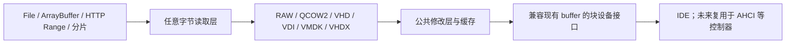

# 虚拟磁盘镜像格式支持计划

状态：设计与实施计划，尚未实现或通过本计划中的验收。

本计划基于 2026 年 10 月 3 日审查的当前 v86 分支。目标是在现有 RAW 镜像能力上，
增加 QCOW2、VHD、VDI、VMDK 和 VHDX 的原生读取，并通过公共修改层支持客户机写入、
状态保存、持久化和导出。建议顺序为 QCOW2 → VHD 与 VDI → VMDK → VHDX。
此顺序是结合当前代码与实现复杂度的工程建议，不是各格式的市场占有率排名。

第一轮完整交付为 P0 与 P1：统一镜像接口、QCOW2 基础解析、客户机可写修改层、
状态保存恢复及数据一致性测试。后续再扩展压缩、父盘链和原格式写入。

## 格式范围

| 格式 | 主要生态与用途 | 特点 | 计划范围 |
| --- | --- | --- | --- |
| RAW，常见扩展名 `.raw`、`.img` | 通用磁盘镜像、QEMU、模拟器 | 顺序存放扇区，宿主文件系统可提供稀疏存储 | 保持现有兼容性，作为测试及导出基准 |
| QCOW2，`.qcow2` | QEMU/KVM | 按需分配、压缩、父盘链、快照、加密 | 首要新增目标，按特性分阶段支持 |
| VHD，`.vhd` | Virtual PC、Hyper-V 及历史镜像 | 固定、动态、差分磁盘 | 先固定和动态，差分后续加入 |
| VDI，`.vdi` | VirtualBox | 固定、动态，以及用于快照的差分镜像 | 与 VHD 同阶段推进 |
| VMDK，`.vmdk` | VMware | 单文件、分片、固定、稀疏、压缩及父子链等变体 | 按子格式公布兼容范围 |
| VHDX，`.vhdx` | Hyper-V | 大容量、512/4K 逻辑扇区、元数据日志、差分磁盘 | 先独立镜像与有限扇区配置，再完善日志和差分 |

上述格式与特性分别参见 [QEMU 镜像文档][qemu-images]、[Oracle 存储文档][oracle-storage]、
[VMware 磁盘类型][vmware-disks]、[VHD 规范][vhd-spec] 和 [VHDX 规范][vhdx-spec]。
扩展名只能作为提示，例如 `.img` 不一定是 RAW，`.vmdk` 也不能确定具体子格式。

以下对象单独安排，不混入块设备格式解析器：

- OVF/OVA 是虚拟机分发格式。OVA 通常将配置和磁盘装入 TAR 归档，导入器先解析配置、
  定位磁盘，再调用对应格式后端。参见 [Oracle 虚拟机导入导出文档][oracle-ovf]。
- ISO 是光盘镜像，继续使用现有光驱路径；本计划首轮只扩展硬盘镜像入口。
- QEMU、VMware 等软件的运行状态包含 CPU、内存与设备内部状态，不属于磁盘格式兼容。
  读取 QCOW2 当前活动磁盘不等于恢复其中保存的整机状态，也不等于实现内部快照切换。
- Parallels HDD、旧 QCOW、QED 等放入后续兼容候选，不列为首轮发布条件。

格式可读也不保证系统可启动。迁移还需检查 CPU 架构、BIOS/UEFI、控制器和客户机驱动。
当前分支已有 [x86-64 支持](x86-64.md)，应依据当前平台能力验证，不能套用旧版 v86 的限制。

## 当前代码基础

| 代码入口 | 当前情况 | 计划中的处理 |
| --- | --- | --- |
| [`src/buffer.js`](../src/buffer.js) | 支持 ArrayBuffer、File、HTTP Range、静态分片与 Zstd 分片；没有上述容器格式解析器 | 分离字节来源、格式解析和修改层；分片压缩不等同于 QCOW2 压缩簇 |
| [`src/browser/starter.js`](../src/browser/starter.js) | 接受带 `get/set/load` 的自定义后端，启动时预读 MBR | 硬盘初始化统一经过格式工厂，预读的是解码后的虚拟扇区 |
| [`src/browser/cpu_worker.js`](../src/browser/cpu_worker.js) | 镜像配置按固定字段转发，拒绝带方法的后端对象 | 转发可序列化描述，在 Worker 内构建解析器 |
| [`src/ide.js`](../src/ide.js) | 通过 buffer 访问扇区和保存状态；已有 LBA48，FLUSH 当前立即成功 | 复用扇区接口，补齐错误、异步写完成和 flush/barrier 语义 |
| [`src/state_io.js`](../src/state_io.js) | 跟踪客户机发起的在途 I/O | 新后端在成功、失败和取消时均正确结束跟踪 |
| [`v86.d.ts`](../v86.d.ts) | 声明现有镜像描述 | 增加格式及修改层配置，明确文件长度和虚拟容量的区别 |
| [`tests/devices/ide_large_disk.js`](../tests/devices/ide_large_disk.js) | 包含 3 TiB 虚拟磁盘与超过 `2^32` 扇区的访问用例 | 扩充新格式大偏移及容量报告测试 |

异步 buffer 的 `set()` 当前将修改保存在内存，状态保存只收集写过的块；同步 buffer
则保存整盘内容。此机制可以提炼为公共修改层，但它尚不提供浏览器存储持久化。
现有 3 TiB 用例仅覆盖特定路径，不代表任意 64 位磁盘容量都已得到支持。

[`src/browser/filestorage.js`](../src/browser/filestorage.js) 是 9p 文件系统的文件来源层，
不应作为虚拟硬盘容器解析的接入点。

## 架构



源镜像保持只读，客户机写入进入独立修改层（overlay）。读取时先检查修改层，再读取
格式解析器提供的基础数据。修改层以客户机可见的磁盘偏移为索引，不使用容器文件偏移。
客户机可以正常修改文件和重启，首版无需修改 QCOW2 的分配表、引用计数及快照元数据。

底层字节读取器提供文件长度、任意区间读取、取消和明确的错误结果。现有异步 buffer
要求 256 字节对齐，而格式头、表项和压缩数据不一定对齐；可增加对齐读取后切片的适配，
或提取底层传输能力。读取尾部时不能向文件外扩展对齐区间。

格式解析器提供虚拟容量、逻辑扇区大小和虚拟区间读取。面向设备的适配层继续满足
`load/get/set/byteLength/get_and_cache/get_from_cache/get_state/set_state` 等实际调用。
大镜像导出使用流式接口，不能依赖现有异步后端无法提供的整盘 `get_buffer()`。

## 配置契约

以下为拟议 API，当前不能直接使用：

```js
new V86({
    hda: {
        url: "disk.qcow2",
        format: "qcow2",
        async: true,
        overlay: "memory",
    },
    // 其余配置保持现有用法
});
```

- 新增 `format: "raw" | "qcow2" | "vhd" | "vdi" | "vmdk" | "vhdx" | "auto"`，
  只对已实现的格式开放。首轮支持 `raw/qcow2/auto`。
- 省略 `format` 保留现有 RAW 行为；显式格式优先于文件名。`auto` 使用格式签名和结构
  探测，必要时读取文件尾部，例如固定 VHD 的 footer。不能只检测文件头。
- `auto` 无法确定格式时要求显式指定；RAW 没有统一签名。已识别格式损坏或具有
  不支持的特性时直接报错，绝不静默退回 RAW。
- `size` 如提供，表示源文件字节长度；设备的 `byteLength` 来自解码后的虚拟容量。
  RAW 的两者相同，QCOW2 等容器通常不同。
- `overlay: "memory"` 为首轮新格式默认写入策略。后续持久化描述需包含稳定存储标识，
  不能复用 URL 或文件名充当唯一镜像身份。
- `hda/hdb` 的 URL、File、ArrayBuffer 路径都经过相同工厂，包括非异步 URL 完整下载后的
  路径。BIOS、初始状态、内核、软盘和光盘继续保留各自的加载语义。
- Worker 只接收数据描述，不跨线程传递解析器实例或解析回调。后续父盘和 VMDK extent
  通过显式来源映射传入，并在执行磁盘 I/O 的线程内解析。

## 实施顺序

| 阶段 | 工作内容 | 交付与依赖 |
| --- | --- | --- |
| P0 | 统一字节来源、格式工厂、修改层及错误契约；贯通配置和 Worker | RAW 行为保持兼容，成为后续各格式共同基础 |
| P1 | QCOW2 v2/v3 基础读取、客户机写入、状态保存恢复 | 与 P0 合成第一轮完整交付 |
| P2 | QCOW2 压缩与父盘链；修改层持久化和流式 RAW 导出 | 分项交付，完整支持常见后续使用流程 |
| P3 | VHD 与 VDI 固定和动态镜像 | 共用 P0 的基础；两个解析器可并行开发 |
| P4 | VMDK 常用子格式，再加入复杂变体和 OVF/OVA 导入 | 导入器依赖实际支持的磁盘子格式 |
| P5 | VHDX 和高级导出写回 | 在基础正确性稳定后，逐项开放能力 |

### P0 统一接口与公共行为

建立独立的镜像模块目录，按字节来源、格式解析器、修改层和设备适配器组织。
具体文件名在实现时确定；`buffer.js` 保留兼容入口，避免一次替换所有旧后端。
新模块需接入现有构建流程，并覆盖浏览器、Node、Worker 和非 Worker 路径。

对 I/O 成功、失败、取消和复位后的过期完成建立统一规则。格式错误和网络错误都必须
结束请求与在途计数，不能让初始化、设备命令或状态保存永久等待。共享在途读取允许
合并，但取消某个调用方不能无条件中止其他调用方仍需要的读取。

此阶段与 [SATA 的磁盘后端](sata.md#disk-backends) 协调，复用错误、
异步完成和 flush/barrier 契约。新格式支持不依赖 Q35 或 AHCI 先行完成。

验收：现有 RAW 的加载、读写、启动和状态恢复行为不变；新描述经过 Worker 传递后
不丢字段；失败和取消均可收敛；设备容量取自虚拟磁盘而不是源文件。

### P1 QCOW2 基础支持

实现 v2/v3 文件头校验、标准 L1/L2 地址映射，以及普通数据簇、未分配簇和零簇读取。
首版仅支持无父盘、未加密、无外部数据文件、标准 L2 的镜像；压缩簇在 P2 实现。
当前活动磁盘可读即可，不要求提供内部快照选择、创建或整机状态恢复。

已分配、未分配和显式零簇必须分别处理。首版无父盘时未分配区返回零，但不能把这条
规则直接用于后续父盘链。带父盘时，未分配区可回落父盘，显式零簇仍必须返回零。

对未知不兼容特性、未实现的扩展 L2、加密、外部数据文件和父盘需求明确拒绝。
首版策略也拒绝 dirty/corrupt 镜像，将一致性修复留给已有工具。
未知 compatible 位及可忽略的普通头部扩展按规范处理，不因其未知就拒绝；文件包含
内部快照也不妨碍读取当前活动磁盘，只是不提供快照切换能力。
压缩簇可能仅在 L2 表项上标记，不能只依靠文件头排除；按需读取首次遇到未支持的
压缩簇时返回明确 I/O 错误。打开时通过文件头检查不代表已验证所有未读取的数据簇。
格式语义参见 [QCOW2 规范][qcow2-spec]。

修改层覆盖跨簇写入、部分修改块更新、写后读和读写并发，较早开始的基础读取不能
覆盖较晚的客户机写入。状态保存包含修改块、状态格式版本、虚拟容量与基础镜像身份；
恢复前检查身份和布局，拒绝把修改应用到另一份镜像。

验收：基础格式矩阵与 RAW 基准逐字节一致；可运行已知兼容系统，修改文件、重启并
恢复状态；不支持的特性和损坏输入给出可定位错误，无静默错误数据。

### P2 压缩父盘与持久化

优先加入 raw-deflate 压缩簇，再加入 zstd。QEMU 文档中的 zlib 压缩簇没有 zlib 头，
必须选择正确的解压模式。现有 zstd 解压能力仅在输入和输出契约核实后复用。
解压结果需校验长度并限制资源消耗，解压工作放在不会阻塞页面的执行路径。

父盘链由调用方显式提供，校验格式、容量适配、镜像身份、循环引用及深度上限。
不直接按镜像内的路径任意加载文件或网络资源；缺失父盘不得当作零数据处理。
后续 VHD、VDI 差分和 VMDK 父子链共用来源管理，但保留各格式的身份与继承规则。
状态和持久化修改层绑定完整链的格式、容量和稳定来源身份，恢复前逐项校验。

浏览器持久化优先评估 OPFS，并为不支持的环境保留内存模式。区分“内存写入已完成”
与“修改已持久化”，补齐写入顺序、FLUSH、空间不足、失败及崩溃恢复行为。
FLUSH 必须等待此前写入和对应存储提交成功后才向客户机报告完成；内存模式只兑现
内存写入屏障，不能将其描述为跨会话持久化。
页面重新打开时显式重新关联并校验原镜像，不能假定本地 File 对象仍然可用。

流式 RAW 导出读取格式解码后的数据与修改层合成结果，支持进度、取消和写入背压。
导出前暂停客户机并等待在途 I/O，或获取稳定的磁盘视图，避免拼出不同时刻的数据。
RAW 导出的逻辑长度为完整虚拟容量，应在开始前说明目标大小。

验收：压缩与父盘组合数据正确；持久化后关闭并重开仍保留修改；基础镜像或父盘不匹配
时拒绝恢复；导出数据与同一磁盘视图一致。

### P3 VHD 与 VDI

VHD 先实现固定与动态类型，覆盖 footer/header 校验、块分配表和扇区位图语义。
VDI 先实现固定与动态类型，覆盖头部、块映射、数据偏移及未分配和零块语义。
两个解析器都使用公共修改层，不在此阶段直接修改原格式分配结构。

差分类型在各自身份与父盘继承规则完成后单独开放，不能因公共父盘读取已存在就默认
宣称支持。验收包括独立工具生成的样本、随机区间比对、跨块写入和状态恢复。

### P4 VMDK 与整机包导入

先实现 descriptor + flat extent 和单文件 `monolithicSparse`，再加入分片 extent、
`streamOptimized` 压缩及父子链。每种 createType 和 extent 类型都维护明确支持状态；
不得笼统宣称支持全部 VMDK。VMFS 特殊快照类型等另行评估。

多文件输入通过显式来源映射绑定，检查 extent 长度、偏移和覆盖范围。父盘链需按格式
规则核对 CID 等信息。`streamOptimized` 的读取与索引方案单独验证，不能假设它等同于
普通 sparse，也不能因支持常规 VMDK 就直接支持所有 OVA 包。

OVF/OVA 导入器解析归档、配置与磁盘关系，将可支持的硬件设置映射到 v86；对于不匹配
的架构、固件、控制器或设备给出具体信息。优先完成磁盘提取与挂载，再扩展自动配置。

验收：各声明支持的子格式在本地与 HTTP 路径一致；多文件缺失、父子不匹配和未知
子格式被明确拒绝；导入包中的磁盘内容与独立读取结果一致。

### P5 VHDX 与原格式导出

VHDX 需要处理双 header、校验和、region/metadata、BAT 状态和逻辑扇区大小。
首版限定无父盘、512 字节逻辑扇区且无需日志重放的镜像。4K 逻辑扇区必须在整个设备
路径支持并正确报告后才能开放，不能仅让解析器以 512 字节重新切片。

非空日志必须先重放；未实现重放时拒绝打开，即使源镜像按只读使用也不能跳过。
这一要求来自 [VHDX 日志重放规范][vhdx-log]。后续可研究在独立视图中重放，以保留
源文件只读策略，再扩展差分磁盘。

原格式写入与读取分别发布。先实现导出新的、受限特性的 QCOW2 文件，再考虑就地
更新已有镜像；后者需要正确维护分配表、引用计数、写入顺序、崩溃一致性和快照关系。
其他格式按实际需求增加导出或写回，不作为读取支持的前置条件。

验收：VHDX 块状态、日志拒绝或恢复、扇区配置均符合规范；新导出的镜像可被独立工具
检查并在 QEMU 等工具中读取，所有客户机可见扇区与稳定导出视图一致。

## 地址缓存与来源一致性

- 所有 64 位字段先用 `BigInt` 解析和掩码，转换为 `Number` 前检查安全整数与实际支持
  范围。偏移、长度、乘法和加法均校验；不使用 JS 的 32 位位运算计算大磁盘地址。
- 分别限制元数据缓存、解压缓存和数据缓存，不能按虚拟容量分配完整内存。修改块不能
  被普通缓存淘汰策略丢弃；内存模式达到预算时明确失败，或使用已配置的持久化后端。
- 合并重复及相邻读取，缓存 L1/L2、BAT 或 grain table，并测量网络往返和读取放大。
  不能为了启动而强制下载整盘，也不能通过跳过格式检查换取性能。
- HTTP 路径校验 Range 响应状态、Content-Range、实际长度和文件边界。来源在会话中
  变化时使缓存失效并停止继续混读；使用可信版本标识、强 ETag 或内容哈希建立身份。
- URL、本地文件名、长度或修改时间单独不足以证明是同一基础镜像。大文件采用发布时
  生成的可信清单或受控版本标识等方案，避免每次启动都为校验下载整个镜像。

## 验收矩阵

测试以独立工具转换出的 RAW 为基准，系统成功启动不能替代数据正确性验证。
使用 [qemu-img][qemu-img] 创建和转换受控样本，记录生成命令、工具版本和样本校验和；
必要时加入厂商工具生成的样本。qemu-img 用于开发、校验和临时转换，不作为浏览器
运行时依赖，也不要求把完整 QEMU 镜像栈移植进首版。

| 范围 | 必测内容 |
| --- | --- |
| 格式读取 | 每种已开放版本和子格式；普通、稀疏、零块；首末扇区、跨块、跨簇、随机区间 |
| 容量与地址 | 容器小于虚拟容量；超过 4 GiB 的偏移；跨 `2^32` 扇区边界；超出安全整数范围的拒绝 |
| 写入修改层 | 写后读、部分块更新、跨簇写入、并发读取与写入、内存预算失败 |
| 状态与生命周期 | 保存恢复、底图身份不匹配、在途 I/O 等待、复位取消、迟到回调、导出一致视图 |
| 来源 | ArrayBuffer、File、完整下载、HTTP Range、静态分片；截断、错误区间和来源变化 |
| 运行入口 | Node、浏览器 CPU Worker、浏览器非 Worker；构建产物和类型声明一致 |
| 特性与错误 | 未知不兼容特性、损坏结构、非法偏移、缺父盘、链循环、未支持压缩和逻辑扇区 |
| 持久化 | flush 顺序、空间不足、写入失败、重开恢复、崩溃后不接受不完整提交 |
| 客体回归 | 已知兼容系统的安装或启动、文件写入、重启及状态恢复；旧 RAW 路径保持通过 |

复用 [`tests/devices/ide_large_disk.js`](../tests/devices/ide_large_disk.js)、
[`tests/devices/device_io_reset.mjs`](../tests/devices/device_io_reset.mjs) 和
[`tests/api/state.js`](../tests/api/state.js)，新增独立格式解析与传输测试。
性能记录冷启动读取字节数、请求数、元数据缓存命中和峰值内存，与同内容 RAW 对照；
验收阈值在取得基线后确定，不预先宣称性能提升。

## 参考资料

- [QEMU 镜像格式与选项][qemu-images]
- [QCOW2 文件格式规范][qcow2-spec]
- [qemu-img 使用文档][qemu-img]
- [Oracle VirtualBox 存储格式][oracle-storage]
- [Oracle VirtualBox 导入与导出][oracle-ovf]
- [VMware 虚拟磁盘类型][vmware-disks]
- [Microsoft VHD 规范][vhd-spec]
- [Microsoft VHDX 规范][vhdx-spec]
- [Microsoft VHDX 日志重放要求][vhdx-log]

[qemu-images]: https://www.qemu.org/docs/master/system/images
[qcow2-spec]: https://www.qemu.org/docs/master/interop/qcow2.html
[qemu-img]: https://www.qemu.org/docs/master/tools/qemu-img.html
[oracle-storage]: https://docs.oracle.com/en/virtualization/virtualbox/7.2/user/storage.html
[oracle-ovf]: https://docs.oracle.com/en/virtualization/virtualbox/7.0/user/Introduction.html
[vmware-disks]: https://developer.broadcom.com/xapis/virtual-disk-api/latest/vddkDataStruct.5.3.html
[vhd-spec]: https://www.microsoft.com/en-us/download/details.aspx?id=23850
[vhdx-spec]: https://learn.microsoft.com/en-us/openspecs/windows_protocols/ms-vhdx/83e061f8-f6e2-4de1-91bd-5d518a43d477
[vhdx-log]: https://learn.microsoft.com/en-us/openspecs/windows_protocols/ms-vhdx/0d588e33-23a6-4c71-b27f-87d97ac3e914
