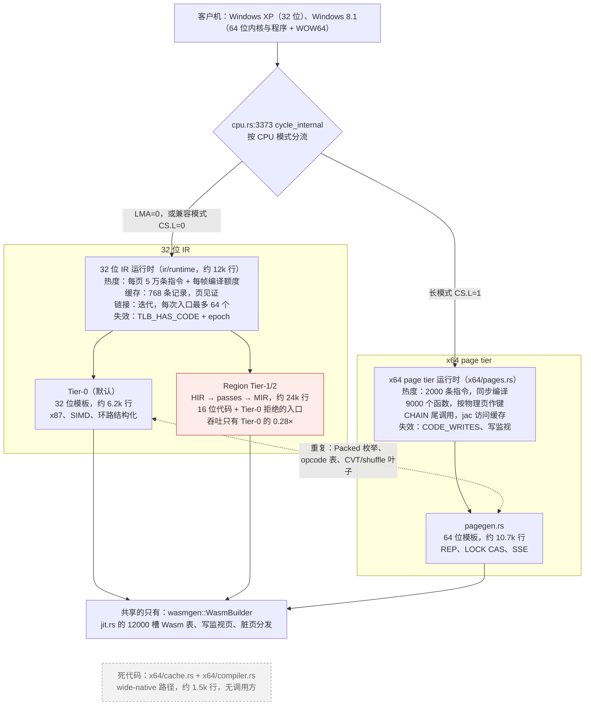
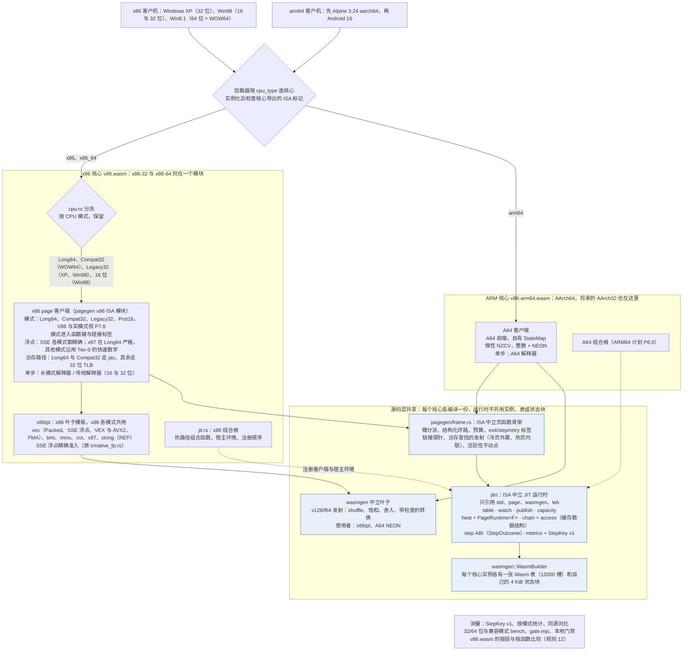
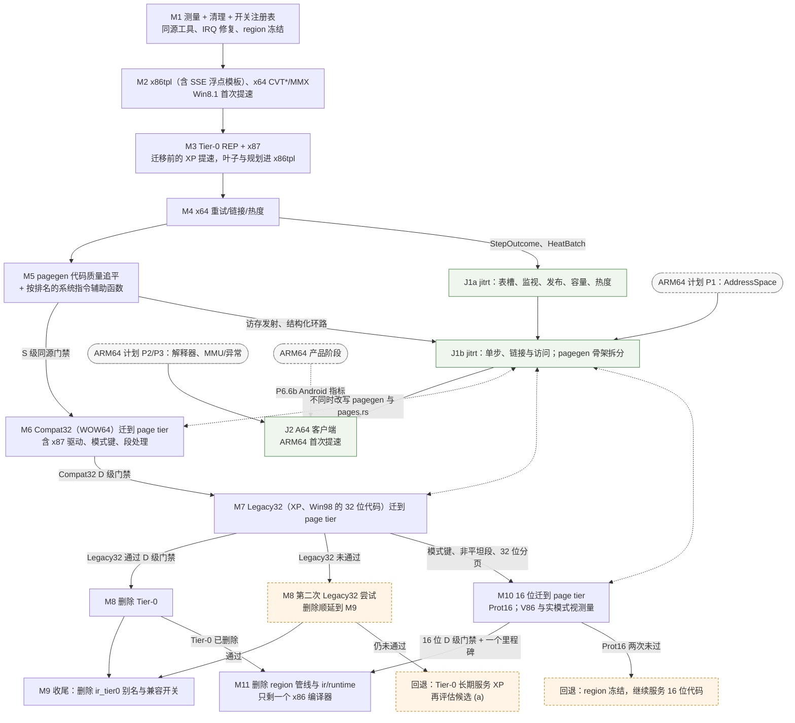

# v86 JIT 统一与 CPU 性能实施计划

状态：设计与实施计划，尚未实现或通过本文验收。P7 的方向已定：采用候选 (b)，32 位代码并入 page tier。
Wasm 产物已定（2026-10-07）：按指令集家族出两个核心，同一套源码构建（跨阶段规则 12）。
16 位代码的去向已定（2026-10-07）：也迁入 page tier，之后删除 region 管线与 ir/runtime（P7.7–P7.9，M10–M11）。

本计划基于 2026 年 10 月 6 日审查的 `0aebe4f`，2026-10-09 按 `985f518d`（SIMD/XSAVE 计划全部完成后的 master）重新核对。目标客户机是 32 位 Windows XP、64 位 Windows 8.1
（含 WOW64 32 位程序）、Windows 98（retro-gaming-site 上用得最多的客户机，约 42 个游戏条目，XP 约 20 个；
它运行大量 16 位代码，见附录 A），以及后续的 ARM64：先以 Alpine Linux 3.24 aarch64 逐阶段验收（ARM64 计划的
A0–A7），通过其 Alpine 发布关卡（G-Alpine）之后再验证 Android 16（见
[arm64-virt-android16-plan.md](arm64-virt-android16-plan.md)，下称 ARM64 计划）。目标是尽可能提升
CPU 模拟性能，同时把 32 位、64 位和将来的 ARM64 收敛到一套可维护的 JIT 体系。

本文的代码位置均按 `985f518d` 核对：由 `0aebe4f` 的位置按 git 差异逐条换算，所引代码本身有改动的逐条人工复核。
附录 A 的测量数据除另行注明外都是审查时在 `0aebe4f` 上测的；审查时用的同源对比原型没有进入仓库（见 P0 的说明）。规模估计（S/M/L/XL）是单人粗估：S 为几天，
M 约 1–2 周，L 约 3–4 周，XL 超过一个月。

## 结论

**统一运行时、x86 指令模板和测量体系；最终只保留一个 x86 页代码生成器，但不把所有模式塞进同一个编译器。**

- 不把 HIR/MIR region 管线扩宽到 64 位。它只支持 32 位，实测只有 Tier-0 吞吐的 0.28×，
  仓库自己估计扩宽的工作量相当于重写一遍 page tier（[x86-64.md](x86-64.md) 第 163–169 行）。
  ARM64 计划也已明确不先把 x86 HIR/StateMap 通用化。
- **32 位代码最终并入 x64 page tier（P7 采用候选 (b)）**：Compat32（WOW64）和 32 位保护模式代码
  （Legacy32，XP 与 Win98）成为 pagegen 的模式，通过 D 级门禁后删除 Tier-0。
- **但先追平代码质量，再迁移。** 同一份 C 源码的对比（附录 A）显示 page tier 目前比 Tier-0 慢：
  S 门禁的 5 个整数项几何均值 0.71×（访存内联后 0.91×），SSE 浮点 0.06×（在 SIMD/XSAVE 计划的 P4a 之前测得，
  见附录 A），x87 0.04×。
  所以先把 Tier-0 的代码质量优势移植进 pagegen（P4.14–P4.18），这些首先让 Win8.1 的 64 位代码
  变快；通过同源门禁后，按 Compat32 → Legacy32 的顺序迁移。
- 迁移需要的 32 位专属能力单独列为任务（P7.2–P7.3b）：模式进入函数键与链接标签、段处理、
  32 位解释器单步、x87 缓存驱动、热度与容量。它们是 (b) 的主要工作量。SSE 浮点不用另做 32 位模板：SIMD/XSAVE
  计划的 P4a（`06842d14`，在 `0aebe4f` 之后）已把 32 位引擎的 SSE 浮点改成与长模式相同的 MXCSR 精确语义，
  各模式共用一套精确模板（跨阶段规则 8）。
- 迁移完成之前，Tier-0 只做能带走的改进：REP、x87、SAHF/FNSTSW 的叶子和值检查放进共享模板库
  `x86tpl`。只对 Tier-0 有用的跨块 FLAGS/XMM 局部变量化取消。
- 与 ISA 无关的运行时 `jitrt` 主要为 ARM64 服务，和 32 位迁移解耦，作为单独排期的支线推进。
- **Wasm 产物按指令集家族拆分，共享只在源码层（跨阶段规则 12）。** x86 核心仍是 `v86.wasm`，x86-32 与
  x86-64 继续放在一起；ARM 核心是 `v86-arm64.wasm`。两者是同一个 crate，用 cargo 特性区分，jitrt、wasmgen
  等在源码层共享，每个核心各编译一份。理由不是"合在一起会变慢"（每个执行片检查一次 ISA，实测 0.98–1.01×），
  而是保护 x86：ARM 的提交不改变 `v86.wasm` 的任何字节，可以做确定性门禁；ARM 也有自己的低地址状态区与
  Wasm 表。拆分在 ARM64 计划的 P1 落地，不等到 J2。
- **16 位代码也迁入 page tier，最后删除 region 管线。** 原先的打算是冻结 region，让它只服务 16 位代码。
  但 Windows 98 是 retro-gaming-site 上用得最多的客户机，16 位代码在部分游戏里占大头：《暗黑破坏神》
  41.7% 的时间在 16 位保护模式，关掉 region 编译后 MIPS 少 37%（附录 A）。所以既不能直接删掉、交给解释器，
  也不该永久保留约 2.4 万行的 region 管线（P7.6 冻结清单里的文件，`985f518d`）和它的运行时（合计约 3.5 万行）。顺序：Legacy32（M7）之后给 page tier 加 16 位保护
  模式，V86 与实模式视测量结果再定（M10）；都过 D 级门禁并保留一个里程碑后，删除 region 管线与 ir/runtime
  （M11）。在此之前 region 冻结，只修 bug，不再加原生路径。

这个方向来自一轮设计评审：4 个独立方案、3 个评审（性能、正确性与迁移、ARM64 适配）打分，满分 30。

| 方案 | 得分 | 主要问题 |
| --- | --- | --- |
| 先做两个引擎各自的热点，只做最小共享 | 22 | 引擎数量长期偏多 |
| 共享运行时 + 各 ISA 各自前端 | 19 | 前几步不带来客户机提速 |
| 32 位并入 x64 page tier，删除 Tier-0（即 P7 的候选 (b)） | 16 | 替换 XP 的主力引擎；x87、LOCK、TLB 刷新语义不同 |
| 把 IR（HIR/MIR）扩宽到 64 位 | 8 | 最慢的管线、工作量最大、与 ARM64 计划冲突 |

本计划采用前两者的做法安排近期工作。第三个方案（候选 (b)）作为 32 位的终点采用，但改变了走法：
评审扣分的风险（替换 XP 主力引擎、语义差异）由三件事化解——先追平代码质量并设同源门禁、先迁风险
较小的 Compat32、XP 达到 D 级门禁前 Tier-0 一直保留。另一个候选 (a) 是"Tier-0 的运行时迁入 jitrt、
代码生成不变"，它对性能没有贡献，只作为 P7 失败时的退路。

## 目标与非目标

目标：

- XP：短期由 Tier-0 的 REP 串指令与 x87 热路径提速；长期在 page tier 上不慢于 Tier-0 后迁移过去。
- Win8.1：pagegen 代码质量（热页内联访存、结构化环路、XMM 局部变量、SSE 精确判断提速）、
  CVT*/MMX 与系统类指令模板；WOW64 迁到 page tier，消除跨引擎调度与编译饥饿。
- Win98：32 位代码随 Legacy32 迁到 page tier（D 级门禁含 Win98 存档）；16 位保护模式代码由 page tier
  编译，不慢于今天的 region；冷启动不变慢。
- 去重：最终只有一个 x86 页代码生成器，16、32、64 位代码都由它编译，Tier-0、region 管线与 ir/runtime
  都删除；SSE/MMX/CVT/x87/REP 叶子模板只有一份；表槽、发布、失效、单步 ABI、热度、链接只有一套实现。
- ARM64：A64 JIT 作为共享运行时的第二个使用者接入（在 ARM 核心里，与 x86 只在源码层共享），只通过
  声明的扩展点修改共享层。
- 每一步都可单独上线、可 A/B、可回滚，性能与正确性都有门禁。

非目标：

- 不新建跨 ISA 的中间表示，不扩宽 HIR/MIR。
- 不把 x86 与 A64 链接进同一个 Wasm 模块或实例，也不做"公共核心加动态链接的 ISA 模块"（跨阶段规则 12）。
- 不在本计划内增加 x86 指令集特性。SSSE3、SSE4、AVX、AVX2、FMA、F16C、BMI 与 XSAVE 系列已由 SIMD/XSAVE 计划完成；默认 CPU
  配置不变，由 `cpu_features` 显式开启（该计划的待决问题 Q1）。本计划只保证这些指令的模板在 x86tpl 抽取、32 位迁移与删除
  Tier-0 时不丢失、不变慢（P2.11、P7.2、P7.5）。
- 不改变快照格式。现有 `STATE_VERSION 6`、`STREAM_VERSION 7`（`src/state.js` 第 6、350 行）保持不变。

## 现状架构

分流点只有一处：`src/rust/cpu/cpu.rs:3397` 的 `cycle_internal`。

现状的问题：

| 问题 | 证据 |
| --- | --- |
| 两套运行时，各自有调度、缓存、发布、链接、访问缓存 | x64 对 IR 运行时只有 9 处直接引用；`jit.rs` 只共享表槽与写监视 |
| 两个 page 引擎能力互补，每项改进要做两遍 | x64 有 REP 模板、LOCK CAS、物理页共享；Tier-0 有 x87、环路结构化、SIMD 局部变量缓存 |
| page tier 的代码质量落后 Tier-0 | 同一份 C 源码：整数（S 门禁 5 项）0.71×、SSE 0.06×、x87 0.04×（附录 A） |
| 模板重复 | `Packed` 与 opcode 表同时在 `x64/pagegen.rs:611` 和 `ir/tier0/simd.rs:76` |
| region 管线慢且只支持 32 位 | 见附录 A |
| 16 位代码只有 region 能编译（Tier-0 只接 32 位入口，page tier 只有长模式），而 Win98 的部分游戏 16 位占比很高 | `ir/runtime/schedule.rs:709`；《暗黑破坏神》41.7% 的时间在 16 位保护模式（附录 A） |
| 64 位与 WOW64 的瓶颈是未模板化指令，而非跨块优化 | [x86-64.md](x86-64.md) 第 165–168、407–412 行 |
| IR 核心测试从不在 master 上运行 | `.github/workflows/ir-core.yml:3-7` 只触发于 `ir` 和 `chat/ir-*` 分支；GitHub CI 暂不处理（待决问题 1），这些测试改由本地门禁运行（P0.9） |
| 缓存容量上限过时 | `ir/runtime/cache.rs:586` 注释仍写"899 个表槽"，实际表已是 12000 槽（`jit.rs:37`） |

## 增强后的目标架构

下图是全部完成（M11 与支线 J2）之后的状态：Tier-0 与 region 管线都已删除，所有 16/32/64 位 x86 页代码由
pagegen 生成。
x86 与 A64 在两个 Wasm 核心里（跨阶段规则 12），加载时按 `cpu_type` 二选一，同一个实例里永远只有一种 ISA。

蓝色是两个核心在源码层共享的部分，每个核心各编译一份；`x86tpl` 只在 x86 核心里，供 x86 的各个模式共用。
region 管线与 ir/runtime 在 M11 删除；在此之前 region 冻结，它的运行时作为 `IrRuntime` 客户端接入 jitrt（P5.1）。

各模式在迁移过程中由谁执行（"非平坦"指 CS/SS/DS 任一基址非 0、SS 非 32 位等，Tier-0 今天为它们
生成带段基址的变体）：

| 时期 | Long64 | Compat32（WOW64） | 32 位保护模式（XP、Win98，含非平坦） | 16 位保护模式（Win16） | V86 与实模式 |
| --- | --- | --- | --- | --- | --- |
| M1–M5 | page tier | Tier-0 | Tier-0；Tier-0 拒绝的入口由 region 执行 | region / 解释器 | region / 解释器 |
| M6 起（WOW64 通过 D 级门禁） | page tier | page tier；Tier-0 保留为回退 | 同上 | region / 解释器 | region / 解释器 |
| M7 起（XP 与 Win98 通过 D 级门禁） | page tier | page tier | page tier，含 Tier-0 拒绝过的入口；Tier-0 保留为回退 | region / 解释器 | region / 解释器 |
| M8 起（Legacy32 达标后一个里程碑） | page tier | page tier | page tier；Tier-0 已删除 | region / 解释器 | region / 解释器 |
| M10 起（16 位通过 D 级门禁） | page tier | page tier | page tier | page tier；region 保留为回退 | page tier 或解释器（P7.8）；region 保留为回退 |
| M11 起 | page tier | page tier | page tier | page tier；region 已删除 | page tier 或解释器；region 已删除 |

各层归属：

| 层 | 内容 | 谁使用 | 依赖规则 |
| --- | --- | --- | --- |
| `jitrt` | 表槽、写监视与失效、发布、容量、热度、链接表与访问缓存的数据结构、单步/退出 ABI、指标 | 源码共享。x86 核心里是 `X86Page`，以及 M11 删除 region 之前的 `IrRuntime`；ARM 核心里只有 `A64Page` | 只能引用 `std`、`crate::page`、`crate::wasmgen`、`crate::leb`；不得出现 `feature = "aarch64"`，ISA 差异经 `jitrt::host::Env` 或泛型参数传入；本地门禁检查 |
| `pagegen/frame.rs` | 页函数骨架：分派、结构化环路、预算、退出、链接探针、访存查找的发射（冷页外置 / 热页内联）、块发现、活跃性不动点 | 源码共享：x86 page 客户端（三种模式）、A64 | 不含任何 ISA 语义；不得出现 `feature = "aarch64"` |
| `wasmgen` 叶子 | v128/f64 通用发射函数 | 源码共享：x86tpl、A64 NEON | 无 ISA 依赖 |
| `x86tpl` | x86 专用叶子：Packed 表、SSE 浮点（含 P2.4 移入的精确准入 `native_fp`）、SIMD/XSAVE 计划的 VEX、AVX2 与 FMA 模板（P2.11）、MMX、CVT、x87（words、值检查、缓存与 run 规划）、REP 串 | 只在 x86 核心：pagegen；删除前的 Tier-0 与 region（P2.2 的 x87、P2.4 的浮点准入） | 不得引用 `x64`、`ir::tier0`、`ir::runtime`、`jit`、region 后端 |
| 各 ISA 模块 | 解码、flags 物化、单步上下文、访存路径的选择（jac 或 32 位 TLB）、系统指令 | 本 ISA。x86 模块挂 `cfg(not(feature = "aarch64"))`，A64 模块挂 `cfg(feature = "aarch64")` | 留在 ISA 侧，不进入共享层 |
| `lib.rs` | 按特性选择编进核心的模块；选定 `jit.rs`、`parallel.rs` 中 ISA 挂钩点的实现；导出 ISA 标记（ARM64 计划 P1.0） | 两个核心 | 共享代码里只有它和 `src/rust/aarch64/` 可以写 `feature = "aarch64"`（规则 12） |
| `jit.rs` | x86 组合根：热路径组合函数、宿主环境、注册顺序 | x86 客户端。J1a 之前表槽与写监视也供 ARM 核心使用，ISA 相关的 5 处是挂钩点（ARM64 计划 P1.0）；J1a 之后中立部分在 jitrt，`jit.rs` 只编进 x86 核心 | J1a 之后可引用 `crate::cpu`；在此之前对 x86 模块的引用都放在挂钩点的 x86 实现里 |

## 跨阶段规则

这些规则对所有阶段生效，大多在 M1 落地。

1. **一个开关注册表。** M1 新增 `src/rust/jit_switches.rs`：`jit_set_switch(id, value) -> bool`
   与 `jit_switch(id)`。构建期默认值来自 `option_env!("JIT_DEFAULTS")`，Makefile 在其变化时重建。
   测试统一用 `tests/lib/jit_switches.mjs` 读取 `JIT_SWITCHES`。开关要复制到 vCPU worker：
   `copy_machine_configuration`（`cpu.rs:365-370`）和 `starter.js:988-990` 的设置列表都要加。SIMD/XSAVE 计划之后
   已有的 A/B 开关（如 `ir_set_relaxed_fma`）一并迁入。
2. **门禁分四级。** 所有阈值以 3 次交替会话的中位数为准，并先跑 A/A 对照。
   - **R（重构/埋点）**：生成代码字节一致（0 差异）；bench warm 几何均值 ≥ 0.99，单项不低于
     0.97（`--runs 7` 复测后）；XP 与 Win8.1 桌面时间 ≥ 0.99。
   - **F（翻转默认值）**：目标指标至少 +2%（Win8.1 桌面或 MIPS），或目标 benchmark ≥ 1.05×；
     套件几何均值 ≥ 1.00；启动不变慢。
   - **S（同源对比，M5 出口，P7 的前提）**：`make bench-same-source` 中，int、memory、control 三类里
     指令数比与数据量比都在 0.8–1.25 之内的项（`563.memops` 除外，它主要衡量 REP 模板）合在一起：
     几何均值 ≥ 1.00，单项不低于 0.85。审查时（`0aebe4f`，MinGW GCC 13）按这条规则选出的成员是 502、541、557、560、561；
     本机的 MinGW 是 GCC 16.1，指令数比与数据量比会变，P0.1 用 P0.2–P0.4 写成的同源工具按同一规则重新选定。
     x87 不按同源比较：长模式严格、32 位默认快速数学，两边语义不同。SSE 浮点自 SIMD/XSAVE 计划的 P4a 起两边都是
     MXCSR 精确语义，可以同源比较，但不进 S 门禁，单独作为 P4.18 的目标。两者最终都由 D 级门禁和 P7 的 x87/SSE
     小门禁检验；`621.simd.int` 单独作为 P4.17 的目标。
   - **D（模式迁移）**：对被迁移的模式，page tier 相对原来执行它的引擎（32 位模式是 Tier-0，16 位模式是 region）：
     - Compat32：兼容模式 bench（P0.2b，含 712–721）套件几何均值 ≥ 1.00、单项 ≥ 0.95；WOW64 CPULOAD32 ≥ 1.00；
       PROBE32 无失败；3DMark06 只记录不判定，直到有得分解析器。
     - Legacy32：32 位 bench 套件几何均值 ≥ 1.00、单项 ≥ 0.95（含 712–721：`suite.json` 为它们开启所需的 `cpu_features`，
       Tier-0 的 SIMD/XSAVE 模板只在这类负载里用到）；XP 桌面（所有者的配置：i440FX + IDE、PIC、非 PAE）≥ 1.00，XP 上的 3DMark06 记录分数；
       P0.15 的 Win98 存档 MIPS 几何均值 ≥ 1.00、单项 ≥ 0.95；XP 启动的编译量、编译时间与驱逐数记录在案。
     - Prot16（16 位保护模式）：P0.15 中 16 位保护模式时间占比 ≥ 5% 的 Win98 存档（目前是《暗黑破坏神》）
       MIPS ≥ 1.00，其余 Win98 存档 ≥ 0.99；Win98 冷启动到桌面不变慢。
     - V86 与实模式（做 P7.8 时）：Win98 冷启动到桌面 ≥ 1.00；XP 与 Win8.1 的启动不变慢。
     - 未达标时该模式继续由原来的引擎执行。
3. **"退役指令数"只有一个定义。** 以 `core_statistics_get(0,0)` 的增量为准，REP 记一次，故障不计。
   长模式测量前先调用 `x64_page_set_block_count(0)`，因为默认的块计数会高估。
   `instruction_counter` 只是预算计数器，不同 arm 之间不一致只报警告。
4. **字节一致性工具只有一个。** P2.0 的记录/重放（固定伪宿主地址、固定 `exit_kind`）加上 P5.0
   的归一化（嵌入地址、`mem8` 与状态块范围、去掉自定义段），并记录所有编译期开关。
   P2、P3、P5 的"字节一致"门禁都用它；P4.14–P4.18 与 P7 在开关关闭时也必须保持 Long64 输出 0 差异。
5. **Rust 静态变量登记。** 任何新增或移动的 `static` 必须同时更新 `gen/state_layout.js` 的
   `STATICS` 并保持归属类别（开关为 machine，每核热度缓存与 P7.1 epoch 为 cache，计数器为 debug），
   否则 `make state-layout-check` 失败。M1 起该检查进入本地门禁 `make jit-gate`（P0.9）。
6. **快照不变量。** P0–P7 的 x86 任务不新增 core 归属的状态，不升级快照版本。每个里程碑验证
   M1 时录制的存档仍能恢复运行。A64 使用自己的状态布局与版本。
7. **32 位热路径保护。** 有前车之鉴：x64 工作曾把 32 位启动拖慢到 1.148×（[x86-64.md](x86-64.md)
   第 78–83 行）。触及 `cycle_internal`、`run_cpu_slice` 或 TLB 填充的改动，新代码放进
   `is_long()` 分支内，并用 `#[cold]`/`#[inline(never)]`；每次都跑 XP 启动与 bench 门禁。
   **P7 是唯一例外**，因为迁移 32 位与 16 位代码必然改动非长模式路径：
   - Compat32、Legacy32、Prot16 与 V86/实模式的分派替换 `cache::execute()` 的调用点，由每个模式自己的开关控制，
     开关每个切片只读一次；
   - P7.1 的 epoch 更新是传统刷新函数里唯一的改动；
   - 每个 P7 的 PR 都要在开关关闭时通过 R 级门禁（XP 启动与 bench）。
8. **语义红线。**
   - SSE 浮点在所有模式下默认 MXCSR 精确。长模式一直如此；32 位引擎（解释器、Tier-0、region）自 SIMD/XSAVE 计划的
     P4a（`06842d14`，在 `0aebe4f` 之后）起也是：公共核心 `cpu/simd_fp.rs`（SoftFloat 加 x86 的规则），原生路径按
     `ir/native_fp.rs` 逐通道准入，Tier-0 中被拒绝的指令经 `ir_t0_sse_fp` 原地精确执行。所以 32 位与 16 位模式迁入
     pagegen 时 SSE 的可观察行为不变，与 Long64 共用一套精确模板。唯一的例外是所有者允许的可选快速策略（P4.19 的
     `x64_sse_fast`，默认关，只用于 Long64）。
   - FMA 的原生路径用 relaxed SIMD 的乘加（`relaxed_madd`、`relaxed_nmadd`），只在 CPU 创建时的探测（`src/cpu.js` 的
     `relaxed_fma_fused`，SIMD/XSAVE 计划 P12 第三部分）确认宿主融合时启用，此时结果逐位精确；否则走 `ir_t0_fma`。
     其他 relaxed SIMD 指令不用。x86tpl 抽取、32 位迁移与删除 Tier-0 都保留这个条件；A64 的乘加用同一个探测与准入条件（P6.3b）。
   - x87：长模式保持严格（`x64/vector.rs:1442`）；32 位模式进入 pagegen 后沿用 Tier-0 现在的策略，经
     `x87_native_policy`（`cpu/fpu.rs:77-80`）走快速数学路径。x87 策略是编译期的模式参数；调试构建断言 Long64
     不用快速 x87 策略，并且只在打开 `x64_sse_fast` 时用到快速 SSE 路径。
   - 32 位模式的单步、重试与冷代码解释都走 32 位解释器（与今天的 `ir_t0_step` 一样），
     不走长模式解释器 `run_long_instruction`。
   - 16 位模式（Prot16、V86、实模式）同样走这个传统解释器，浮点策略与 Legacy32 相同。V86 中受 IOPL 约束的
     指令（CLI、STI、PUSHF、POPF、INT n、IRET）、I/O 权限位图检查与段寄存器装入的故障路径一律单步，不做模板。
   - 多核下 LOCK 读改写的策略与现状一致：32 位代码在 `!parallel::active()` 时模板化，否则交给解释器。
   - 各模式的单步上下文不同（`ir/runtime/tier0.rs:14-42` 与 `x64/pages.rs:1072-1099`），
     32 位模式的上下文照搬 Tier-0 的字段，上下文类型留在 ISA 侧。
   - 同一物理页可能以不同模式执行（WOW64 的 `wow64cpu.dll` 同时含 32 位与 64 位代码），
     所以代码模式必须进入函数键、代码 TLB 与链接标签；16 位与 32 位（Win98 的 thunk）、保护模式与 V86 也一样。
   - `CONTINUATION_EPOCH` 与 `CODE_WRITES` 在单步计数一致之前不合并。
   - 跨客户端驱逐只在各自的冷点执行。
9. **浏览器与 Node 的差异。** 每个里程碑出口都跑 `make ir13-browser-tests ir-backend-browser-tests`；
   任何生成新 Wasm 特性的阶段（P2 SIMD、P3 `memory.copy`/`fill`、P4/P7 尾调用）都跑
   `make ir-portable-tests`，因为降级核心没有 simd128 和 bulk memory；另由所有者在 Chrome
   上实测一次 XP 与 Win8.1。
10. **"保留一个版本"以里程碑标签计。** x86 主线打 `vM1`…`vM11` 标签，支线打 `vJ1a`、`vJ1b`、`vJ2`。
    被替换的旧路径在同一条线的下一个标签时删除；支线 J1 保留的旧导入在 `vJ2` 删除。
11. **每个里程碑都要有收益。** M1 之后，x86 主线每个里程碑至少包含一项 F 级默认值翻转或一次
    模式迁移，对 XP、Win98 或 Win8.1 有实测提速；只做删除与收尾的 M8（Tier-0 删除时）、M9 与 M11 除外。
    M1 结束时按实测宿主时间占比给 P2.5–P2.7、P3.1/P3.2、P4.2/P4.3、P4.7–P4.12 重新排序，
    占比低于 0.5% 的项记录为"跳过"。P4.14–P4.18 与 P7 的任务不参与这个排序，因为它们是 S 级与
    D 级门禁的前提。
12. **按指令集家族出 Wasm 核心，共享只在源码层。** x86 核心就是 `v86.wasm`，x86-32 与 x86-64 必须在
    同一个模块里：一个 Windows 客户机运行时会在实模式、保护模式、兼容模式和长模式之间切换。ARM 核心是
    `v86-arm64.wasm`，放 AArch64，将来的 AArch32 也放这里；ARM 客户机从不执行 x86 代码，架构在初始化时
    选定，没有任何场景需要两种 ISA 出现在同一个实例里。两者是同一个 crate，cargo 特性 `aarch64` 选出
    ARM 核心，做法同 `v86-parallel.wasm`；jitrt、wasmgen、leb、page、zstd、并行运行时和 JS 设备只在源码层
    共享，每个核心各编译一份，运行时不共用实例、Wasm 表或状态块。三种做法的实测对比见 ARM64 计划的
    "Wasm 核心：按指令集家族拆分"一节，拆分在其 P1.0 落地。对本计划的约束：
    - x86 模块挂 `cfg(not(feature = "aarch64"))`，引入它的提交实测只让 `v86.wasm` 差 10 字节的 panic 位置
      数据。不新增默认开启的 `x86` 特性：它会改变 crate 的哈希，把整个 `v86.wasm` 的符号重命名一遍。
    - `feature = "aarch64"` 只允许出现在 `src/rust/lib.rs` 与 `src/rust/aarch64/`，lint 进本地门禁（P0.9）。jitrt、
      `pagegen/frame.rs`、wasmgen 等共享代码里的 ISA 差异经 `jitrt::host::Env` 或泛型参数传入，不写 cfg。
      `parallel` 特性已经把 cfg 带进了共享的 `wasm_builder.rs:964`（`ATOMIC_GUEST_MEMORY`）与 :264-275
      （内存导入），`aarch64` 不能走同一条路。
    - 只改 `src/rust/aarch64/` 的提交，`v86.wasm` 必须逐字节一致；改了共享 Rust 的提交按函数比较
      `v86.wasm`，有实际变化才跑 R 级。比较由 ARM64 计划 P0.7 的脚本完成：在本机的同一次运行里分别构建父
      commit 与新 commit，保证两者用同一个工具链。规则 4 的身份比对针对生成代码，这里比较的是模块本身；按函数比较
      是否会误报取决于 P0.14。
    - 本地门禁跑 `cargo check --features aarch64` 与 `--features aarch64,parallel`（各约 12 s），共享代码的改动
      不能悄悄弄坏 ARM 核心。

## 阶段与任务

### P0 测量基线与本地门禁

目标：让后续每个阶段都可测量、可设门禁，不改变生成代码和默认运行行为。

同源对比工具要在 M1 新写。附录 A 的同源数据来自审查时的原型：`make bench-same-source` 用 `tools/bench/build64.mjs`
以同一版 MinGW GCC 构建 x86-64 版 C 内核，`tests/bench/lib/long_mode.asm`（multiboot 进入长模式并安装故障桩）与
`crt0_64.asm`（Win64 入口）启动，`tests/bench/same_source.mjs` 在同一会话里交替运行 i686 版（Tier-0）与 x86-64 版
（page tier），并计算 S 门禁。这些文件没有随本计划进入仓库（`985f518d`、git 历史与本机都没有），P0.2–P0.4 按这个
设计从头实现；现有的 32 位 bench（`tests/bench/lib/boot.asm`、`crt0.asm`、`run.mjs` 的 PE 加载）与
`tests/x64/guest_builder.mjs` 可以复用。用法写进 [cpu-benchmarks.md](cpu-benchmarks.md)。本机的 MinGW 是 GCC 16.1。

| ID | 任务 | 关键位置 | 开关 | 规模 |
| --- | --- | --- | --- | --- |
| P0.1 | 用现有工具记录零改动基线：bench-quick 3 次与完整 bench 1 次；XP 启动 3 次（所有者的配置：i440FX + IDE、无 ACPI、PIC、非 PAE），含驱逐数，并在容量 768/512/256 下各测一次；Win8.1 启动 3 次，另用 `cpu_features: "x86-64-v3"` 启动 1 次（SIMD/XSAVE 的模板只在客户机开启这些特性时用到）；3DMark06 GT2，Win8.1 与 XP 各一组（XP 上先挂载 `~/Downloads/driver.iso`，把其中的 `d3d9.dll` 复制到 `retro-gaming-site/game/3dmark06.img` 的根目录）；`make bench-same-source` 3 次（P0.2–P0.4 完成之后）；另测一组 `idle_mode` 开启时的 XP 启动与 Win98《红色警戒 2》存档（待决问题 6） | `tests/bench/run.mjs`、`tests/ir/performance/xp_boot.mjs:128`、`tests/x64/windows_boot.mjs:706` | 无 | S |
| P0.2 | 长模式 bench 启动（新写）：`long_mode.asm` 由 multiboot 进入长模式，装 64 位 IDT 与故障桩；`crt0_64.asm` 是 Win64 入口；默认用 2 MiB 页（待决问题 7），补 4 KiB 页映射的选项 | 新 `tests/bench/lib/long_mode.asm`、`crt0_64.asm`；参考 `tests/bench/lib/boot.asm`、`tests/x64/guest_builder.mjs:2-58` | 构建期 `LARGE_PAGES` | M |
| P0.2b | **兼容模式 bench 启动**（Compat32 的 D 级门禁需要）：`long_mode.asm` 的变体远跳转到 CS.L=0、D=1 的代码段后进入 `crt0.asm`，在兼容模式下运行 i686 版 PE；`run.mjs --isa compat32` 让两个 arm（Tier-0 与 page tier）跑同一批镜像 | `tests/bench/lib/long_mode.asm`、`tests/bench/run.mjs` | `--isa compat32` | M |
| P0.3 | `-m64` 构建档加入 `tools/bench/build.mjs` 与 `suite.json`（审查时的原型 `tools/bench/build64.mjs` 未进仓库，这里新写）：int 档用 `-mgeneral-regs-only -fno-tree-vectorize`，调优 `nocona`（对应 i686 的 `pentium4`）；`625.mmx` 和 `616.fcompare` 不进 64 位集合；32 位产物的客户机可见字节不变 | `tools/bench/build.mjs`、`tests/bench/suite.json` | `BENCH_ISA` | M |
| P0.4 | `run.mjs`：`--isa`、PE32+ 加载（审查时的原型 `same_source.mjs` 未进仓库）、长模式机器配置、可用的纯解释器参考 arm、每个 arm 单独的开关（`--switches-a/--switches-b`）；`make bench-same-source` 在同一会话里交替运行两个 arm 并计算 S 门禁 | `tests/bench/run.mjs:60-124` | `--isa` | M |
| P0.5 | 统一单步直方图键 StepKey v1，Tier-0 与 x64 共用一个存储 `src/rust/step_profile.rs`；32 位分页下跨页字节用 `translate_address_read_no_side_effects` 读取 | `ir/runtime/tier0.rs:49-85, 208-212`、`x64/pages.rs:1106-1227` | `STEP_PROFILE`（默认关） | M |
| P0.6 | 按模式统计退役指令（实模式、V86、Prot16、Legacy32、Compat32、Long64 × native/step/retry/interpreted），并区分 Tier-0、region 与 page tier，平坦与非平坦 32 位代码；P0.15 的 Win98 工作负载也跑一遍 | `cpu/execution.rs`、`cpu.rs:3397-3464`、`cpu.rs:3777-3844` | `MODE_LEDGER`（默认关） | M |
| P0.7 | 三个测试脚本输出同一份 `jit_stats` 记录 | 新 `tools/bench/jit_stats.mjs` | 默认关 | M |
| P0.8 | 门禁工具：`tests/bench/gate.mjs` 汇总 N 个会话、按单项中位数和几何均值判定（S 级门禁的成员筛选与 `same_source.mjs` 相同）；`compare.mjs` 比较同一构建的两种配置；`--fallbacks` 只在额外的不计时轮次启用直方图 | `tests/bench/report.mjs` | 无 | S |
| P0.9 | **本地门禁**（GitHub CI 暂不处理，待决问题 1）：原定放进 CI 的检查收拢成两个 make 目标。`make jit-gate` 是每次提交前的快速档：`state-layout-check`、`RUSTFLAGS=-D warnings cargo check`（含 `--features parallel`，核心拆分后再加 `aarch64` 与 `aarch64,parallel`）、导入规则检查（P2.10、P5.1 与规则 12 的 lint）、region 冻结路径检查（P7.6）、P2.0 的字节一致重放与 ARM64 计划 P0.7 的 `v86.wasm` 比较（各自就绪后加入），以及与改动相关的 `ir-tier0-tests`、`x64-page-tier-tests`。`make jit-gate-full` 是里程碑出口与翻转默认值之前的完整档：再加上 `ir-core.yml` 里的全部 make 目标与发布门禁的 quick 级别。性能不设自动门禁（待决问题 2），R、F、S、D 级里的性能条件由做改动的人按需用 `gate.mjs` 测。做改动的人（或会话）提交前跑快速档，所有者在里程碑出口跑完整档；需要的 MinGW、nasm 与 qemu 在所有者的 Mac 上都已装好 | `Makefile`；`.github/workflows/ir-core.yml`（只作为目标清单的来源，本身不改） | 无 | M |
| P0.10 | 用新工具记录长模式基线和单步占比 s：bench x86_64（page tier 与纯解释器校验和一致）、XP、Win8.1、3DMark06；同时记录 Wasm 表空闲槽最小值和两侧驱逐数 | 同上 | 仅测量时启用 | S |
| P0.11 | 文档：[cpu-benchmarks.md](cpu-benchmarks.md)、[profiling.md](profiling.md)（StepKey、统计单位、s 的唯一定义）、[x86-64.md](x86-64.md) 实测表 | `docs/` | 无 | S |
| P0.12 | **CPULOAD32**：用 `i686-w64-mingw32-gcc` 构建 32 位版 CPU 负载程序，作为 WOW64 的计时负载；M1 记录 Tier-0 下的基线，M4 再记录一次 | `tests/x64/windows_boot.mjs:94` | 无 | S |
| P0.13 | **Tier-0 多页函数的贡献**：为邻页（range）与伙伴页（partner）重编译加一个总开关 `ir_t0_clusters`（开关注册表，默认开；`ir_t0_set_ranges` 不是这个开关，它让所有页都按邻页编译），测 `708.pages`、`502.codebloat` 与 XP 桌面的差异；结果决定 P7.3b 是否需要 | `ir/runtime/cache.rs:986-1131`、`ir/runtime/schedule.rs:386-404` | `ir_t0_clusters` | S |
| P0.14 | **codegen-units**：`[profile.release]` 没有设置，取默认的 16 个代码生成单元。核心拆分评审实测，这时一处无关的小改动也会改变约 12 个 x86/IR 函数；`codegen-units = 1` 时这类变化消失，代码段小 4.6%，性能未知。用 P0.8 的工具对 `codegen-units = 1` 跑一次 R 级（bench、XP 与 Win8.1 桌面），同时记录 release 构建时间。通过则在 M1 改为默认，规则 12 的按函数比较不再把无关变化报成改动；不通过则保持 16，记录数据，按函数比较照常报告这类变化，相应的 PR 照跑 R 级 | `Cargo.toml:31-35` | 构建期 | S |
| P0.15 | **Win98 工作负载**：把 `tests/ir/performance/game_state.mjs` 扩展到 Win98（Win98 存档里没有 9p 文件系统与 v86gl 设备，二者改为可选），增加不带存档的冷启动，并在每个约 1 ms 的执行片（`TIME_PER_FRAME`，`cpu.rs:76`）结束时采样 CPU 模式（实模式、V86、Prot16、Legacy32 与特权级），作为 P0.6 合入前的近似；固定一组存档（《暗黑破坏神》《红色警戒 2》《主题医院》，再按测量补上 16 位或 V86 占比高的）与冷启动到桌面，记录 3 次会话的 MIPS 与按模式的时间占比；`tools/owner_perf.mjs` 加入这些项 | `tests/ir/performance/game_state.mjs:148-158`；retro-gaming-site 的 `windows98/states/`、`app.js` | 无 | S |

验收：

- `make state-layout-check`、`RUSTFLAGS=-D warnings cargo check --release --target wasm32-unknown-unknown`（含 `--features parallel`）、`make rust-test` 通过。
- `make ir-tier0-tests ir-cache-tests ir-auto-tests x64-page-tier-tests multicore-coherence-tests multicore-atomic-tests multicore-memory-order-tests api-tests` 通过。
- `make platform-release-gate GATE_ARGS="--levels R-x64-UP,R-x64-SMP --quick"` 通过。
- 开关全关时 R 级性能门禁通过。
- s 是有统一单位的实测值，而非估计；XP 驱逐曲线、同源对比、CPULOAD32 与多页函数贡献的基线已记录。
- P0.14 的结论（`codegen-units` 的取值、R 级数据与构建时间）已记录。
- P0.15 的 Win98 基线（存档与冷启动的 MIPS、按模式的时间占比）已记录。

### P1 清理

| ID | 任务 | 关键位置 | 规模 |
| --- | --- | --- | --- |
| P1.1 | 删除无调用方的 wide-native 路径：`x64/cache.rs`（364 行）、`x64/compiler.rs`（1155 行）、`jit.rs:184` 的调用、`Makefile:925` 的 `native_oracle.mjs`；**同一提交删除 `gen/state_layout.js:273` 的登记** | `src/rust/x64/mod.rs:3-4` | M |
| P1.2 | 删除 JS 胶水：`cpu.js:85, 498-510`、`starter.js:228-230, 1074`、`vcpu.js:95-97, 141-154`。必须在 P1.1 之后；旧基线 wasm 仍导入 `x64_native_discard`，所以在不再用旧基线前保留一个空函数桩 | — | S |
| P1.3 | 修正过时注释和文档：`x64/pages.rs:5-6`（实际只按物理页作键）、`ir/tier0/emit.rs:4-8`（退出时还要写回 FLAGS/XMM/x87）、`ir/runtime/cache.rs:586`（899 槽）、`schedule.rs:333`（idle 默认值）、`x86-64.md:411`（CL 移位其实已有模板）、`Makefile:25`、`x64/pagegen.rs:6012-6021`（`vfp` 注释仍说"PE 必须已置位"，代码其实会自己置 PE） | — | S |

验收：`grep -rn 'x64_native\|wide_native\|native_oracle\|x64::cache\|x64::compiler' src tests Makefile tools gen` 为空（空函数桩除外）；`build/v86.wasm` 无 `x64_native_*` 导入导出；`make x64-differential-tests nasmtests-force-jit jitpagingtests multicore-parallel-tests` 通过。

P0.1 的基线要在 P1 之前录制；之后的 A/B 一律以 M1 标签构建的 wasm 为参照。

### P2 共享 x86 模板库与 x64 的 CVT*/MMX

目标：x86 向量叶子代码只保留一份，并让 x64 page tier 获得 CVT*（含 REX.W）与 MMX 模板。
Tier-0 生成的 Wasm 必须逐字节不变，因此 XP 和 WOW64 的性能不受影响。Tier-0 的 SSE 浮点
模板（P4a 之后是精确语义：逐通道准入，被拒绝时原地精确执行）也在这一步移进 `x86tpl`，因为 P7.5 会删除
Tier-0，而 P4.18 的 Long64 与 P7 的 32 位模式都要用它们。

| ID | 任务 | 关键位置 | 开关 | 规模 |
| --- | --- | --- | --- | --- |
| P2.0 | 字节一致性工具：`compile_page_with(CompileEnv { state_flags, flat, hosts, exit_kind, link, parallel })`；在 `ir-test-hooks` 特性下记录/重放编译输入；合成语料覆盖 `simd::classify` 与 pagegen `sse()` 接受的全部形式；从这一步起进入本地门禁 | `ir/tier0/mod.rs:107-245`、`x64/pagegen.rs:2247-2254` | 无 | M |
| P2.1 | 原地把叶子改成接收 `&mut WasmBuilder` 的自由函数，加穷举网格的黄金摘要测试；范围包括 SSE 浮点（`Simd::Float` 的 ADD/SUB/MUL/DIV/MIN/MAX/SQRT/RSQRT/RCP、`CompareFlags` 的 COMISS/UCOMISS，以及 P4a 加的逐通道准入、`ir_t0_sse_fp` 调用与 `xmm_clean` 寄存器事实：准入与精确 helper 在 `simd.rs` 第 1482-1550 行，`Simd::Float` 在第 1876 行，`CompareFlags` 在第 2363 行；P4a 取代了 `0aebe4f` 的 `retry_on_nan`） | `ir/tier0/simd.rs:1291-1336, 1480-2807`、`x64/pagegen.rs:5305-5361, 6456-6563` | 无 | M |
| P2.2 | 新建 `src/rust/x86tpl`（vec、mmx、x87）。通用 v128/f64 叶子放进 wasmgen 层模块；`X87Words` 和 `x87_native` 物理移入 `x86tpl/x87.rs`，region 后端反过来引用它。Tier-0 改用 x86tpl | `src/rust/lib.rs:30`、`ir/backend/wasm/x87.rs:84-124` | 无，以重放字节一致为门禁 | M |
| P2.3 | pagegen 改用 `x86tpl::vec`，删除自身的 `Packed`、`packed_op`、`shuffle_lanes` | `x64/pagegen.rs:609-705` | 无 | S |
| P2.4 | `VecOperands` trait（含 `store_vec`/`store_int`，所有重试点都在任何写入之前）；SSE 浮点的精确准入：把 P4a 加的 `ir/native_fp.rs` 移进 `x86tpl`（Tier-0、region 与 pagegen 的 `vcmp` 已经共用它，region 改为引用 `x86tpl`）；通用 CVT 模板与 SSE 浮点模板，以 `native_fp` 的准入为基础，两处差别作为参数：MXCSR.PE 未置位时的处理（Tier-0 拒绝，pagegen 逐通道用 TwoSum/Dekker 判断不精确）与被拒绝时的去处（Tier-0 原地调用 `ir_t0_sse_fp`，pagegen 退出重试）；x64 适配器显式做 i32/i64 转换 | 新 `x86tpl/ops.rs`、`x86tpl/native_fp.rs`、`x64/pagegen_vec.rs` | 无 | M |
| P2.5 | x64 CVT* 32 位整数形式，保持 MXCSR 精确：窄化转换在结果为 0、非规格化数或处于最小规格化区间（`\|result\| < 2^-125`）时，以及有限输入溢出为 ±inf 时重试 | `x64/pagegen.rs:145-590, 1234-1973` | `x64_cvt` | L |
| P2.6 | x64 REX.W CVT 形式；f→i64 先检查 `-2^63 ≤ x < 2^63` | `x64/vector.rs:203-212`、`cpu/simd_fp.rs:1112-1211` | `x64_cvt64` | M |
| P2.7 | x64 MMX 模板（MOVQ/MOVD、打包运算、PSHUFW、立即数移位、EMMS）；存储走各引擎自己的存储路径，保证自修改代码检测 | `ir/tier0/simd.rs:554-581`、`x64/vector.rs:998-1053` | `x64_mmx` | L |
| P2.8 | Win8.1 A/B，一次只翻转一个开关 | `tests/x64/windows_boot.mjs` | 翻转默认值 | S |
| P2.9 | （条件项）仅当 Long64 中 D8–DF 占单步 ≥ 1%：做严格的 F80 寄存器操作（交换、复制、符号位、tag/TOP/C1、#MF 检查），**不用** `X87Words` | `x64/vector.rs:1442-1476` | `x64_x87`（永不受快速数学策略开启） | L |
| P2.10 | 导入规则检查 `tools/check_x86tpl_imports.mjs`（扫描所有 `crate::`/`super::` 路径），更新文档 | `make jit-gate`（P0.9） | 无 | S |
| P2.11 | **SIMD/XSAVE 计划的模板并成一份**：该计划给 Tier-0 和 pagegen 各写了一套热点形式的模板（SSSE3；SSE4 的 ROUND、BLENDV、PCMPxSTRx；AVX 与 VEX.256 的搬运、打包、比较、广播与 VZEROUPPER；AVX2；FMA，含 relaxed 融合路径；BMI 与 MOVBE），两边只共用 `ir/native_fp.rs` 和 `ir/runtime/tier0.rs` 的操作数块与开关。移进 `x86tpl` 后 32 位模式（P7）与 Long64 用同一份；Tier-0 生成的字节不变（P2.0 重放），pagegen 一侧经 P2.4 的 `VecOperands` | `ir/tier0/simd.rs:743-1146, 1560-2625`（`classify_vex`、`classify_vex256`、`simd_form`）、`ir/tier0/emit.rs:215-226`（`Form::Bmi`、`Form::Movbe`）、`x64/pagegen.rs:145-590, 1235-1973`（`Op` 与 `sse()`） | 无，以重放字节一致为门禁 | L |

验收：

- 两个引擎里都不再有 `Packed`、`packed_op`、`shuffle_lanes` 的副本；Tier-0 的 SSE 浮点模板位于 `x86tpl`。
- Tier-0 与开关全关的 x64 重放均为 0 差异。
- 开关打开时，`X64_PAGE_SWITCHES=cvt,cvt64,mmx make x64-page-tier-tests`、新的 `sse_cvt_template.mjs` 与 `mmx_template.mjs`、`X64_JIT=1 make x64-opcode-matrix-tests`、`make x64-multicore-tests multicore-parallel-tests` 通过。
- Win8.1：CVT 和 MMX 的单步次数下降至少 90%，桌面时间不变慢，没有新的重试键超过原生指令数的 1%。
- XP 与 bench 落在 R 级门禁内；`make ir-portable-tests` 通过。

### P3 Tier-0 热点（XP 与 WOW64，迁移前的过渡）

目标：在 XP 迁到 page tier 之前，用能带走的改进提速 32 位代码。REP、x87、SAHF/FNSTSW 的叶子、
值检查以及 x87 run 规划与融合逻辑尽量写在 `x86tpl` 里，P7.2a 移植 x87 驱动时复用；
不改变 Tier-0 与 `t0_execute` 和页见证之间的运行时契约。

| ID | 任务 | 关键位置 | 开关 | 规模 |
| --- | --- | --- | --- | --- |
| P3.0a | Tier-0 特性开关、A/B 构建配方、按模板种类的统计 | `ir/runtime/tier0.rs:323-380` | 注册表中的 `t0_*` | S |
| P3.0b | **正确性修复，移到 M1**：Tier-0 慢路径访问设备时（APIC/IOAPIC MMIO、`device_raise_irq`）推迟 IRQ 投递，指令完成后再退出并投递。不改 `slice_budget`，因为单核 `main_loop` 不会重置它。延迟与退出的辅助函数与 P4.7–P4.11 共用，P7 的 32 位模式沿用 | `ir/runtime/tier0.rs:260-310`、`cpu.rs:4877-4933`、`cpu/memory.rs:517-525` | 只作紧急关闭开关，默认开 | S |
| P3.1a | 每条 REP 串指令单独成块，无论是否有模板，前后都设块首 | `ir/tier0/analysis.rs:140-269` | `t0_rep_blocks` | S |
| P3.1t | REP 差分测试：`tier0_fuzz` 新增 r0–r6（覆盖重叠、DF=1、ECX=0、页边界、自修改代码），加 REP 故障测试和单核统计测试 | `tests/ir/differential/tier0_fuzz.mjs` | 无 | M |
| P3.1b | REP MOVS/STOS 模板（v1：全有或全无、单核、传统模式），从 pagegen 移植，叶子放进 `x86tpl/string.rs`；只在 `cfg!(target_feature = "bulk-memory")` 时启用 | `x64/pagegen.rs:7474-7621`、`cpu/string.rs:62-152` | `t0_rep_movs_stos` | M |
| P3.1c | REPE/REPNE CMPS/SCAS 模板 | `x64/pagegen.rs:7680-7798` | `t0_rep_cmps_scas` | M |
| P3.1d | 协作式多核下允许 ECX ≤ 256 时走模板（`t0_rep_smp`）。兼容模式（WOW64）下放开（`t0_rep_compat`）是条件项：WOW64 在 M6 迁到 page tier，所以只在 P0.6 测得 WOW64 的 REP 占宿主时间 ≥ 0.5% 时才做，并先确认兼容模式的 TLB 填充会为 x64 代码页设置 `TLB_HAS_CODE` | `cpu/string.rs:62-77`、`jit.rs:118-126` | `t0_rep_smp`、`t0_rep_compat` | M |
| P3.1e | （可选）带无效 REP 前缀的控制转移（`repz ret`） | `ir/tier0/emit.rs:555-558` | `t0_rep_ignored` | S |
| P3.2t | x87/SAHF 模糊测试种类 i34、xm、xs | `tier0_fuzz.mjs` | 无 | S |
| P3.2a | 内联 FNSTSW AX，x87 缓存在 FCOM→FNSTSW→TEST→Jcc 期间保持打开；状态字计算放进 `x86tpl/x87.rs` | `ir/tier0/emit.rs:408-424, 3172-3179` | `t0_fnstsw_inline` | S |
| P3.2b | SAHF 模板；FLAGS 写入的叶子放进 `x86tpl` | `cpu/instructions.rs:1079-1084` | `t0_sahf` | S |
| P3.2c | 原生 FSQRT：只在与 softfloat 结果完全一致的前提下启用（PC=53 位、RC=就近、正规格化操作数） | `softfloat.rs:620-650` | `t0_x87_fsqrt` | S |
| P3.2d | 带内存操作数的 x87 run：所有检查、加载、转换、存储值校验都在第一次提交前完成；存储只出现在 run 末尾。`x87_source`/`x87_store` 的值检查与 run 规划抽进 `x86tpl/x87.rs` | `ir/tier0/x87run.rs:84-358`、`ir/backend/wasm/x87.rs:360-520` | `t0_x87_mem_runs` | L |
| P3.2e | （可选）run 内比较指令与 FCOM→FNSTSW 融合 | `ir/backend/wasm/x87.rs:205-235` | `t0_x87_compare_runs` | M |
| P3.5 | 仅当 XP 出现驱逐时，提高 IR 缓存上限；上限由 `WASM_TABLE_SIZE - MAX_FUNCTIONS - 预留` 算出并加断言 | `ir/runtime/cache.rs:585-588, 839-849` | 已有导出 `ir_cache_set_capacity` | S |
| P3.6 | 仅当 P0 计数显示 LICM 预算失败时：预算耗尽就跳过 LICM 而不是让 Tier-2 编译失败（LICM 是事务式的，`licm.rs:179, 231`），标为 region 修复 | `ir/runtime/compile.rs:491-500` | 新导出 | S |

**已取消：** 原 P3.3a–P3.3d（Tier-0 FLAGS 镜像与页级活跃性）和 P3.4（Tier-0 XMM 局部变量）。
P7 采用 (b) 后它们会随 Tier-0 一起删除；pagegen 已有页级 FLAGS 模型（`x64/pagegen.rs:2424-2484`），
XMM 局部变量化改在 pagegen 里做（P4.17）。原 P3.0c（Tier-0 导入审计）只服务于这两项，改为对
pagegen 做同样的审计（P4.17 的一部分）。只有当 Legacy32 两次过不了 D 级门禁、需要长期保留 Tier-0
时（见 P7 的回退），才重新评估这些项。

验收：

- 每项都有自己的开关；默认值的变化附 A/B 数据（bench JSON、XP/Win8.1 启动日志）；被否决的保持关闭并记录数据。
- 所有 `FUZZ_KIND` 跑 3 个种子、跨页、取指故障、`tier0_irq_slow`（需开 ACPI）、单核统计测试全部通过。
- `make x87-jit-cache-tests flags-provenance-tests mmx-fast-tests packed-simd-tests sse3-tests jit-tiers-tests ir-portable-tests` 和各多核套件通过；
  涉及 SSE 浮点（P2.1–P2.4）与 P2.11 的提交另需 SIMD/XSAVE 计划的套件：`make ssse3-tests sse4-tests sse-fp-tests sse-fault-tests avx-tests ir-avx-tests fma-tests bmi-tests ir-bmi-tests ir-crc32-tests xsave-tests`。
- 相对 P3 之前：套件几何均值 ≥ 1.00，单项不低于 0.95；`710.string`、`563.memops` 和 x87 类 benchmark ≥ 1.05×；XP（所有者的 PIC 配置）和 Win8.1 不变慢。
- REP、SAHF、FNSTSW、x87 值检查与 run 规划位于 `x86tpl`，`tools/check_x86tpl_imports.mjs` 通过。

### P4 x64 热点与 page tier 代码质量（Win8.1，P7 的前提）

目标：让 Win8.1 的 64 位代码更少离开编译代码、每次退出更便宜，并让 pagegen 的代码质量追平 Tier-0。
后者是 P7 迁移 32 位代码的前提，也是对 Win8.1 收益最确定的一组改进（同源对比已实测到差距）。
退出类任务（P4.2–P4.12）先看 P4.1 的排名，宿主时间占比低于 0.5% 的类别不做。

| ID | 任务 | 关键位置 | 开关 | 规模 |
| --- | --- | --- | --- | --- |
| P4.0 | 埋点：退出原因、未命中原因、WOW64 饥饿计数（全部写入 P0.5 的存储，不另开表）；`tests/x64/system_bench.mjs` 单事件开销微基准，基于 `guest_builder`；另记录回答待决问题 4、5 的计数：PROBE64 打印 QueryPerformanceFrequency，统计 HPET MMIO 读、ACPI PM 计时器端口读、#NM、CLTS 与改写 CR0.TS 的 MOV CR0，以及 FXSAVE/FXRSTOR（打开 XSAVE 时还有 XSAVE 系列）的次数 | `x64/pages.rs:1072-1250` | 无 | L |
| P4.1 | 基线测量与排名：单步计数和宿主时间占比分两次运行测（单步直方图会抬高单步成本） | `tests/x64/windows_boot.mjs` | 无 | M |
| P4.2 | 就地重试：模板守卫失败时在函数内单步，不再 `EXIT_RETRY`；单步前清除退出标记，避免同一条指令执行两次 | `x64/pagegen.rs:2745-2747, 3147-3149`、`x64/pages.rs:593-607` | `x64_retry_in_place` | M |
| P4.3 | STEP_CHAIN：单步只改变了 {cpl, cs, cr3, epoch, IF, IOPL, AC} 时继续经 CHAIN 链接，而不退出。前提：仍是 Long64；TF/RF/VM 清零；cr0/cr4/efer/dr7 不变；无代码写入；无中断影子、HLT、NMI、SMI；IF=1 时无可投递 IRQ。这里引入共享的 `StepOutcome` 分类器 | `x64/pages.rs:1072-1099, 1224-1250` | `x64_step_chain` | M |
| P4.4 | FXSAVE/FXRSTOR 批量路径：栈上 512 字节、按 qword 递增探测，替代 Vec 加逐字节访问 | `x64/vector.rs:1214-1373` | `x64_fxstate_bulk` | S |
| P4.5a | 长模式路径上无锁检查 JIT 是否启用（`AtomicBool` 镜像） | `cpu.rs:3399`、`x64/pages.rs:232` | 无 | S |
| P4.5b | 解释执行时的页热度批量累加（独立结构，P5 原样接管） | `x64/pages.rs:449-464` | `x64_heat_batch` | S |
| P4.5c | 冷代码按短批量解释执行：故障或 RIP 未变时停止，逐条更新 `last_rip` 和远转移入口 | `cpu.rs:3397-3407` | `x64_miss_run` | M |
| P4.6 | （条件项）WOW64 编译饥饿：长模式切片也处理排队的 Tier-0 页，但只在当前 CR3 与捕获时相同时编译；新增 `take_ready_if`，被跳过的页保留在队列中且不消耗尝试次数。只在 P4.0 测得 3DMark06 或 WOW64 程序启动时饥饿帧 ≥ 1% 才做；Compat32 迁移后 Tier-0 仍是 WOW64 的回退，所以它在 M7 才删除 | `cpu.rs:3397-3434`、`ir/runtime/schedule.rs:287-343` | `x64_long_visit` | M |
| P4.7 | SYSCALL/SYSRETQ 辅助函数模板，直接调用 `system::fast_call`；出错时退回单步 | `x64/system.rs:481-537` | `x64_system_templates` 第 0 位 | M |
| P4.8 | IRETQ 辅助函数模板；**出错时退回单步**，因为生成代码不写 `previous_rip`，直接 `raise` 会从错误的 RIP 恢复 | `x64/system.rs:1368-1449` | 第 1 位 | M |
| P4.9 | MOV CR3 辅助函数模板，完全复用 `system::write_cr` | `x64/system.rs:85-145` | 第 2 位 | M |
| P4.10 | FXSAVE64/FXRSTOR64 page tier 辅助函数（P4.4 后仍排得上才做） | `x64/vector.rs:1283-1373` | 第 3 位 | M |
| P4.11 | 只为实测的热端口做端口 I/O 辅助函数 | `x64/system.rs:890-940` | 第 4 位 | M |
| P4.12 | POPFQ 模板（排得上才做） | `x64/execute.rs:822-826` | 第 5 位 | S |
| P4.13 | 文档与计数器说明 | [x86-64.md](x86-64.md)、[profiling.md](profiling.md) | 无 | S |
| P4.14 | **热页内联访存**。冷编译继续调用外置的访问缓存查找函数（保住 Windows 启动时的编译速度，`OUTLINE_ACCESS` 当初就是为此引入）；热页用内联查找重编译。现有运行时没有可复用的执行计数：已发布函数的重编译只由未服务入口触发，经 CHAIN 尾调用进入的页也不经过 `run()`。所以需要：(a) 生成代码在函数入口（P4.16 之后改为环路头）递增每函数执行计数，运行时在冷点读取；(b) 单独的热标志，不计入 `compiles`，不触发退避；(c) `pagegen::compile` 增加 `outline: bool` 参数，取代全局开关。并行构建里，内联路径遇到未对齐访问时调用模块的外置查找函数（保留 0x200 类型位），不能交给会拒绝的 `x64_page_access`。实测全部内联时 S 门禁几何均值 0.71× → 0.91× | `x64/pagegen.rs:2601-2606`、`x64/pages.rs:29-40, 468-491` | `x64_hot_inline` | L |
| P4.15 | **访问缓存与数据量**：x86-64 版 `505.chase` 的链表节点在 LLP64 下从 8 字节变成 16 字节，链表 4 MiB，正好等于 jac 每类 1024 项的覆盖范围，树的 96 页与链表末尾 96 页冲突，宿主缓存足迹也翻倍；内联后反而从 0.45× 降到 0.35×，所以它不是查找开销问题，已移出 S 门禁。先埋点 jac 的未命中率与冲突，再按数据决定是否扩大或改成组相联；注意 `flush_nonglobal` 每次保留全局项的 MOV CR3 都会遍历全部表项，表越大 Win8.1 的切换越贵。Legacy32 直接用 32 位 TLB（P7.3） | `x64/jac.rs:14-21, 68-89` | `x64_jac_entries` | M |
| P4.16 | **结构化环路**：回边不再经过分派器（现在每次回跳都要设置 RIP、检查预算与页范围、走桶 `br_table`）。移植 Tier-0 的 SCC 环路布局，预算检查放在环路头；P5.9 拆分时进入 `pagegen/frame.rs` | `x64/pagegen.rs:2904-2909, 2649-2720`、`ir/tier0/analysis.rs:333-402` | `x64_loops` | L |
| P4.17 | **XMM 放进 v128 局部变量**：先审计 pagegen 每个导入调用对 XMM/FLAGS 的读写（原 P3.0c 的方法），然后块内缓存，在退出、单步、辅助函数调用前写回脏寄存器。目标：`621.simd.int` 同源 ≥ 0.80×（目前默认 0.31×，内联后 0.35×） | `x64/pagegen.rs:5918-6012` | `x64_xmm_locals` | M |
| P4.18 | **SSE 浮点精确判断提速**（长模式保持 MXCSR 精确），把 P4a 在 Tier-0 中的做法用到 Long64（P2.4 的模板）：MXCSR.PE 已置位时跳过逐通道的 TwoSum/Dekker 不精确判断（PE 是粘滞位，这个结果的唯一用途就是置 PE），只在 PE 未置位时保留，所以结果总是精确的代码也不会一直走慢路径；双精度 MUL/DIV 的 2^±450 指数拒绝只为 Dekker 服务，跳过时一并去掉，因此会接纳更多通道，SSE 模板测试的重试预期要相应调整；操作数与结果的分类改用 `native_fp` 的 v128 掩码一次判定，不再按通道走 i64 位模式；被拒绝的指令像 Tier-0 一样原地调用精确 helper（`ir_t0_sse_fp`；pagegen 调用 `ir_t0_fma` 时已经在用它的操作数块），不再退出重试；MXCSR 条件在两次可能改写 MXCSR 的指令或 helper 之间只算一次；已知不是 NaN 也不是非规格化数的寄存器（Tier-0 的 `xmm_clean`）跳过操作数检查，这一项依赖 P4.17。目标：SSE 4 项同源几何均值 ≥ 0.25×（附录 A 在 P4a 之前测得 0.06×；P4a 让 32 位一侧慢了 11–28%，换算约 0.08×，以 P0.1 的重测为准）；达不到时先做 P4.19（待决问题 10 已允许） | `x64/pagegen.rs:6013-6400`；P4a 加入的 `ir/native_fp.rs` 与 `ir/runtime/tier0.rs` 的 `ir_t0_sse_fp` | `x64_sse_fast_check` | M |
| P4.19 | **可选的长模式 SSE 快速策略**（所有者允许，待决问题 10）：在 `x86tpl` 的精确 SSE 浮点模板旁加一个快速变体，直接用 Wasm 的 IEEE 运算，不维护 MXCSR 的状态位，也不保证非规格化数等边界情况的结果精确，NaN 结果仍回退，以保住 x86 的 NaN 规则（相当于 P4a 之前 Tier-0 的做法）；开关 `x64_sse_fast` 是与现有 `x87_fast_math` 同类的模拟器选项，默认关，只影响 Long64 的 SSE（长模式 x87 仍严格，32 位模式不受影响）；P4.18 达不到 0.25× 时先做，并给出打开时的同源与 3DMark06 数据 | `x64/pagegen.rs:6013-6400`；P2.4 的 SSE 浮点模板 | `x64_sse_fast` | M |

所有辅助函数统一走一套"指令后处理"：在 `set_irq_deferral` 内调用，然后用 P4.3 引入的共享
`StepOutcome` 分类器判断是否要退出（与 `x64_page_step` 相同的判据，外加 NMI、SMI、核心事件、
`core_yield`、`exception_shutdown`）。只要 `handle_irqs` 会有动作就退出。

P4.14–P4.18 不依赖 P4.1 的排名：它们针对的是已实测的代码质量差距，在 M4 之后立即开始，
排在 P4.7–P4.12 之前。

验收：

- 开关全开的构建通过：扩充后的 `page_system.mjs` 热循环、`X64_JIT=1` 下的 `irq_boundary`/`smm_long_mode`/`task_faults`、新的 `accounting.mjs`、`make x64-multicore-tests x64-multicore-guest-tests extended-memory-tests highmem-tests multicore-parallel-tests`、发布门禁 `R-x64-UP,R-x64-SMP,R-extended-memory,R-parallel`。
- P4.14–P4.18 另需：`PAGE_FUZZ_STRADDLE=1` 的 `page_fuzz.mjs`、`X64_JIT=tier0` 的 `vector_oracle.mjs`、`sse_fp_template.mjs`/`sse_int_template.mjs`、自修改代码与别名用例在开关打开时通过；P4.14 另需并行构建（R-parallel）下含未对齐存储的热循环，重试次数不变；P4.17 另需 SSE 状态在单步、故障与快照恢复前后一致的定向测试；P4.18 另需 `tests/rust/sse_fp.mjs`（P4a 的独立 BigInt 模型，`make sse-fp-tests`）增加长模式 page tier 一栏；开关关闭时 Long64 重放 0 差异。
- Win8.1：每秒长模式退出加重试次数至少减半，s_total 至少降 30%；或者所有剩余类别都低于宿主时间的 0.5%。
- **S 级同源门禁通过**（这是 M5 的出口，也是 P7 的前提）。
- 3DMark06 饥饿帧约为 0，fps 不降；PROBE32/PROBE64 无失败。
- 32 位：bench ≥ 0.99，XP 桌面 ≥ 0.99。

### P5 ISA 中立运行时 jitrt 与 pagegen 拆分（支线 J1a、J1b）

目标：去掉重复的运行时机制，不合并代码生成器。每一步生成代码都逐字节一致，性能在 ±1% 内。
主要服务 ARM64；P7 的 32 位迁移不依赖它。J1 单独排人力，不与 x86 主线争抢，
在 ARM64 计划的 M2 进行期间开始，保证 A64 JIT 动工时它已就绪。

- **J1a**（M4 之后即可开始）：P5.0–P5.5、P5.7、P5.10。
- **J1b**（M5 之后，并要求 ARM64 计划 P1 通过验收）：P5.6、P5.8、P5.9，因为它们搬迁 M5 的成果
  （P4.3/P4.7–P4.12 的 `StepOutcome`、P4.14 的访存发射、P4.16 的结构化环路）。
- 改写 pagegen 或 `x64/pages.rs` 的任务不并行：J1 的 P5.7–P5.9 与主线的 P4.14–P4.18、P7.2–P7.3b、P7.7–P7.8
  依次进行，先后由 ARM64 的进度决定，后做的一方在前者合入后重新基于它实现。

| ID | 任务 | 关键位置 | 规模 |
| --- | --- | --- | --- |
| P5.0 | 把 P2.0 的身份工具扩展到并行构建：归一化状态块范围，去掉 name 段 | `x64/pagegen.rs:2658, 2926, 3257` | M |
| P5.1 | `src/rust/jitrt` 骨架，`ClientId { IrRuntime, X86Page, A64Page }`：`IrRuntime` 是 `ir/runtime`，删除前也拥有 Tier-0 的槽位与单步，M11 随 region 一起删除；`X86Page` 覆盖 Long64、Compat32、Legacy32。每个核心只注册本 ISA 的客户端（x86 核心：`IrRuntime`、`X86Page`；ARM 核心：`A64Page`），jitrt 里不写 `cfg(feature = "aarch64")`（规则 12）。`jit.rs` 成为 x86 组合根，只编进 x86 核心，热路径组合函数（`page_watched` 等）留在 `jit.rs`，ARM 核心的同类函数在 A64 一侧（ARM64 计划 P3.5、P6.0）；`jitrt::host::Env` 在初始化时一次性填入 `mem8`、表偏移、状态基址，它们与核编号、microtick 等宿主导入取自 ARM64 计划 P1.0 移出 `crate::cpu` 的中立模块；导入规则检查进本地门禁 | `src/rust/lib.rs:16`、`jit.rs` | S |
| P5.2 | `jitrt::table`：槽位所有者带客户端和签名（`Fn1`/`Fn1Ret`），替换 `T0_SLOTS`；每个核心实例一张表，大小与偏移经 `Env` 给出（Rust 自身的表项不得越过 `WASM_TABLE_OFFSET`，现在没有检查，由 ARM64 计划 P1.3 在加载时检查） | `jit.rs:16-105, 279-328`、`cache.rs:855-868` | M |
| P5.3 | `jitrt::watch`：监听器分两种触发（Always / WatchedOnly），保留两种顺序——脏页：IR live→cache→schedule→x64；重置：x64→live→cache→schedule；各客户端 epoch 分开。监听器取代 ARM64 计划 P1.0 在 `jit.rs` 留下的 5 个 ISA 挂钩点（`rust_init`、`retire_page_ctx`、`jit_clear_cache`、`ir_reserve_slot`、`ir_release_slot`）。A64 解释器的译码缓存与 A64Page 的监听器只在 ARM 核心里注册，不影响 x86 的两种顺序；J1a 合入之前，ARM64 计划 P1.5、P3.5 经这些挂钩点与 `crate::jit` 的 `page_watched`、`jit_dirty_page`、`jit_clear_cache_js` 过渡 | `jit.rs:53, 107-276, 279-328`、`parallel.rs:1022-1052` | M |
| P5.4 | `jitrt::publish`：一个 Pending→Ready→Dead 状态机，一个 JS 桥 `jit_publish`；旧导入保留到 `vJ2` | `x64/pages.rs:801-891`、`cache.rs:2005-2158` | M |
| P5.5 | `jitrt::capacity`：全局槽位预算加各客户端软配额，只投递驱逐请求，由受害方在自己的冷点执行；默认值取当时的实际上限（含 P7.2b 的模式配额）。预算按核心：x86 核心的表在 `IrRuntime` 与 `X86Page` 之间分配（现在 9000 + 768 = 9768 个槽），ARM 核心的整张表归 `A64Page` | `x64/pages.rs:41, 658`、`cache.rs:839` | M |
| P5.6 | `jitrt::step`：结果类型采用 P4.3 引入、P4.7–P4.12 扩展的 `StepOutcome`（含 CHAIN 和延迟 IRQ 退出），上下文按 ISA 与模式参数化；全局量只定义为偏移，由组合根解析成小立即数常量（ARM64 宿主上高地址会慢 1.4×，见 [multicore.md](multicore.md) 第 146–148 行） | `x64/pages.rs:1224`、`ir/runtime/tier0.rs:4-49` | M |
| P5.7 | `jitrt::heat` + `PageRuntime<F: PageFrontend>`，x86 page 客户端作为第一个使用者；直接搬入 P4.5b 的 `HeatBatch`，不再新增一个开关 | `x64/pages.rs:26-969` | L |
| P5.8 | `jitrt::chain` 与 `jitrt::access`：链接表与访问缓存的数据结构、填充与失效，带 `TagLayout`（含代码模式位）、`Bus` 扩展点；`Bus` 实现为 ARM64 计划 P1 `AddressSpace` 的适配器。访存查找的发射（P4.14 的冷页外置与热页内联）进入 `pagegen/frame.rs`，访存路径的选择（jac 或 32 位 TLB）留在 ISA 侧 | `x64/pages.rs:238-355`、`x64/jac.rs:14-220` | L |
| P5.9 | 把 pagegen 拆成中立骨架 `src/rust/pagegen/frame.rs` 和 x86 ISA 模块；结构化环路（P4.16）与访存查找发射进入骨架；flags 物化和单步上下文留在 ISA 侧；所有已有模式的输出逐字节一致 | `x64/pagegen.rs:2224-3044` | XL |
| P5.10 | 统一指标 `jit_stat(client, field)`，`get_jit_info` 加入 x64 | `x64/pages.rs:947`、`src/cpu.js:2681` | S |

验收：

- `jitrt` 导入规则通过；`make state-layout-check rust-test` 通过（含监听器顺序单元测试）。
- 默认构建与并行构建的 Long64、Tier-0（删除前）身份比对均为 0 差异。
- `X64_JIT=1 make x64-system-tests`、`make x64-page-tier-tests x64-multicore-tests extended-memory-tests highmem-tests x64-guest-tests ir-tier0-tests ir-cache-tests ir-auto-tests multicore-coherence-tests multicore-state-tests api-tests smp-tests multicore-parallel-tests multicore-linux-jit-tests jit-tiers-tests` 通过。
- R 级性能门禁通过（含长模式 bench 档）；在 ARM64 宿主上跑一次 bench-quick 无退化。
- 两个核心都能构建（`cargo check --features aarch64` 与 `--features aarch64,parallel`）；jitrt 与 `pagegen/frame.rs`
  中没有 `feature = "aarch64"`（规则 12 的 lint）。

### P6 A64 作为第二个 jitrt 客户端（支线 J2）

与 [arm64-virt-android16-plan.md](arm64-virt-android16-plan.md) 的 P6 对应。开工条件：ARM64 计划
P1–P3（AddressSpace、解释器、MMU/异常）通过验收（解释器上 1/2/4 核 initramfs 阶的 probe 与
kvm-unit-tests 4k/16k/64k，不含 ARM64 计划 P5 的 virtio），且 J1b 已合入。产物问题已经定了：A64 只进
ARM 核心 `v86-arm64.wasm`，ARM64 计划在 P1.0 就把它拆出来（跨阶段规则 12），所以 P6 不需要对 `v86.wasm`
的体积和实例化时间设门禁，x86 一侧由规则 12 的逐字节与按函数比较保护。

| ID | 任务 | 规模 |
| --- | --- | --- |
| P6.1 | virt 板的 `Bus` 与代码键（物理页，代码与位置无关）；为 A64 解释器 TLB 注册访问钩子，让解释器写入代码页、DC ZVA、独占存储和 DMA 都能触发失效 | M |
| P6.2 | A64 `StepFrontend`：单步上下文与 `interpret_one` | M |
| P6.3 | A64 `PageFrontend` 与骨架 ISA：整数 v1（算术、逻辑、MOVZ/K/N、ADR/ADRP、分支、LDR/STR/LDP/STP） | L |
| P6.3b | NEON 模板，复用 wasmgen 层的中立叶子；crypto 指令（ARM64 计划 v1 profile 的 AES、PMULL、SHA1、SHA2）在生成代码里调用解释器的 helper，不单步；标量与向量的乘加（FMADD 族、FMLA/FMLS）在宿主融合时用 relaxed 乘加，探测与准入条件同 x86 的 `native_fp::fused`，另要求 FPCR 的 RMode 为 RN、FZ 为 0 且 FPSR.IXC 已置位（ARM64 计划待决问题 12，所有者 2026-10-09 同意） | L |
| P6.4 | 失效接线：TLBI（按 VA 时覆盖 16 KiB/64 KiB 粒度对应的全部 4 KiB 子页）、ASID（v1 在切换时刷新，v2 才把 ASID 放进标签）、IC、DMA、恢复 | M |
| P6.5 | `tests/a64/page_fuzz.mjs` 与定向测试：ART 双映射、TLBI 各变体在 4K/16K/64K 粒度、编译循环中途快照恢复 | M |
| P6.6a | 抽象审计：列出 A64 对 jitrt 的所有超出声明扩展点的修改，作为设计债，在 A64 默认开启前解决 | S |
| P6.6b | Android 16 验收指标（依赖 ARM64 产品阶段） | M |

每个触及 jitrt 或其他共享代码的 P6 PR，先按规则 12 比较 `v86.wasm`：逐字节一致即可；有变化时重跑 x86
身份比对和 R 级性能门禁。

### P7 32 位与 16 位代码并入 page tier（采用候选 (b)），删除 Tier-0 与 region

决定：x86-32 代码最终由 page tier 执行。Compat32（WOW64）和 Legacy32（XP 的 32 位保护模式代码，
含非平坦段）成为 pagegen 的模式，XP 通过 D 级门禁后删除 Tier-0。不做候选 (a)。

16 位代码也一样（2026-10-07 决定）：16 位保护模式成为 pagegen 的模式 Prot16，V86 与实模式按 P7.8 的测量
决定进 pagegen 还是交给解释器；它们通过 D 级门禁并保留一个里程碑后，删除 region 管线与 ir/runtime。

走法：

1. **前提（M5 出口）**：S 级同源门禁通过；`x86tpl` 中已有 32 位模式需要的叶子
   （P2.1–P2.4 的 SSE 浮点模板与精确准入、P3.1b 的 REP、P3.2 的 x87 值检查、run 规划与 SAHF/FNSTSW）。
2. **先迁 Compat32（M6）**：它的分页与失效已经走 x64 的 `write_cr` 与 jac，是两个 32 位模式里离现有
   page tier 最近的。迁移后 WOW64 不再在两个引擎之间来回调度，编译饥饿问题随之消失。但 32/64 位
   之间的远转移（WOW64 thunk）仍是单步：CS 在单步上下文里，所以会结束激活；要在 page tier 内经
   CHAIN 链接，需要可选的 P7.2c。
3. **再迁 Legacy32（M7）**：在 Compat32 的基础上，增加 32 位分页的取指与访存翻译、P7.1 的 TLB 刷新
   epoch 和多页函数的替代（视 P0.13 而定）。
4. **XP 通过 D 级门禁后翻转默认值**，Tier-0 保留一个里程碑作为回退，M8 删除。
5. **再迁 16 位（M10）**：在 Legacy32 的模式键、非平坦段和 32 位分页之上加 Prot16（P7.7）；V86 与实模式先测，
   值得才做（P7.8）。region 保留为回退。
6. **删除 region（M11）**：Tier-0 已删除，16 位模式默认开启并保留一个里程碑，P0.6 的账本显示 region 不再
   执行任何指令之后，删除 region 管线与 ir/runtime（P7.9）。

| ID | 任务 | 关键位置 | 开关 | 规模 |
| --- | --- | --- | --- | --- |
| P7.0 | A/B 构建：cargo 特性 `x86-32-ptier` 只改两个模式开关的默认值；产出 `build/ab/A.wasm`（Tier-0）与 `build/ab/B-ptier.wasm`；D 级门禁使用 P0.2b 的兼容模式 bench 与 P0.12 的 CPULOAD32 | `Cargo.toml:7-14`、`Makefile:288` | — | S |
| P7.1 | 传统模式 TLB 刷新时更新每核代码 epoch（`full_clear_tlb`、`clear_tlb`、`invlpg`）；协作式多核切换核心上下文时不更新。Legacy32 的链接与代码 TLB 标签依赖它。这是跨阶段规则 7 的例外：它是刷新函数里唯一的改动，先单独合入并通过 XP 启动的 R 级 A/B | `cpu.rs:2526, 2545, 4763` | 无 | S |
| P7.2 | **Compat32 模式**（也是 Legacy32 的公共部分）：(1) 在 pagegen 中贯穿 `Mode`：解码模式、8 个 GPR、只写回低 32 位以保留 WOW64 的高半部、32 位地址与栈宽、无规范地址检查。(2) 代码模式（L、D 位）进入函数键（`by_page`/`FAST`/已服务入口位图）、代码 TLB 标签与 CHAIN 标签，同一物理页以 Long64 和 Compat32 执行时各有函数。(3) 段处理：入口检查 `FLAT_SEGS\|SS32\|IS_32`，平坦时省略 CS/SS/DS 基址；非平坦时移植 Tier-0 的变体（每次访存加段基址、检查空选择子、SS 非 32 位时重试）；ES/FS/GS 读基址并检查空选择子；EA + 基址按 32 位回绕。非平坦路径要做快：Win98 的 32 位时间里有 46.5% 不平坦（附录 A，主要是 VMM ring 0 代码的 DS 基址非 0，以及 ring 3 的 32 位代码跑在基址非 0 的 16 位栈上），所以 DS 基址放进局部变量，SS 为 16 位时也原生执行（SP 按 16 位回绕），不像 Tier-0 那样一律重试。(4) 单步、重试与冷代码解释走 32 位解释器（在 `set_irq_deferral` 内），`StepOutcome` 使用 32 位上下文（照搬 Tier-0 的 `is_32`、`stack_32`、`state_flags` 等字段）。(5) SSE 浮点用与 Long64 相同的精确模板（P4.18 之后），可观察行为与今天的 Tier-0 相同；并接受 Long64 里仍是单步的 0F51/52/53/5D/5F（Tier-0 有它们的模板）；SIMD/XSAVE 计划的形式覆盖到 Tier-0 现在的范围（P2.11 合并后的模板），32 位模式下只有 XMM/YMM0–7，C4/C5 只在下一字节的高两位为 11 时是 VEX 前缀，否则是 LES/LDS；LOCK 策略与 Tier-0 一致；访存走 jac。(6) x87 用快速数学（P7.2a）；调试构建断言 Long64 不用快速 x87 策略，并且只在打开 `x64_sse_fast`（P4.19）时用快速 SSE 路径 | `x64/pagegen.rs:1235-1973, 2224, 2788-2853, 3061-3070, 3091-3146`、`x64/pages.rs:51-130, 238-303, 1072-1107`、`ir/tier0/mod.rs:198-209`、`ir/tier0/emit.rs:1503-1537`、`ir/runtime/tier0.rs:14-80` | `x64_page_compat32` | XL |
| P7.2a | **32 位模式的 x87 驱动**：把 Tier-0 的 x87 缓存（函数级局部变量里的 `X87Cache`，`x87_open`/`x87_close`/`x87_guard`）、寄存器与内存 run（`x87run.rs` 与 P3.2d）、FNSTSW/SAHF/FCOM 融合（P3.2a/b/e）移植进 pagegen，使用 `x86tpl` 中的叶子与规划；每次单步、辅助函数调用、退出和 CHAIN 尾调用前关闭缓存；P2.7 的 MMX 模板在快速策略下同步并失效 f64 影子缓存。Long64 不使用 | `ir/tier0/emit.rs:1802-1850, 2046-2056, 3024-3179`、`ir/tier0/x87run.rs` | 随 `x64_page_compat32` | XL |
| P7.2b | **32 位模式的热度、编译预算与容量**：用 XP 启动在 HOT = 2000/10000/50000 下测编译数、编译时间、驱逐与桌面时间，按模式定阈值与每帧编译预算；与 Long64 划分 `MAX_FUNCTIONS` 的配额（不等 J1 的 P5.5）；page tier 接管某模式后，IR 调度器不再为该模式的页计热度和编译（`ir_auto_set_tier0(0)` 会把 IR 阈值降到 512，不能让 region 抢先编译） | `x64/pages.rs:26-43, 41, 658-691`、`ir/runtime/schedule.rs:456-470, 708-744` | 随模式开关 | M |
| P7.2c | （可选）**跨模式链接**：把 P4.3 的 STEP_CHAIN 扩展到 CS.L/CS.D 改变的远转移，经带模式位的 CHAIN 链接；只在 P4.0 显示 WOW64 thunk 的退出占宿主时间 ≥ 0.5% 时才做 | `x64/pages.rs:1072-1099, 1224-1250` | `x64_step_chain_mode` | M |
| P7.3 | **Legacy32 模式**（在 P7.2 的公共部分之上）：(1) 取指侧的翻译——`code_page`、跨页检查 `next_page_bytes`、单步剖析、链接填充——改走 32 位 TLB 与分页（无副作用读取），因为现有路径只有 4 级页表；代码 TLB 用 P7.1 的 epoch 作标签。(2) `allowed()` 与单步上下文按模式判断（用 cr3 与 `is_32` 代替 `long` 与 jac epoch）。(3) 数据访存走 `AccessPath::FlatTlb`：直接索引 32 位 TLB 的内联检查，未命中走与 `ir_t0_read_slow`/`ir_t0_write_slow` 等价的慢路径，永不进入 `x64_page_access`。(4) 每次进入（含 CHAIN 尾调用）都检查 `FLAT_SEGS\|SS32\|IS_32`，或把这些位放进 CHAIN 标签。(5) REP 模板沿用 P3.1 的全有或全无规则。(6) Tier-0 拒绝、今天由 region 执行的 32 位入口也改由 Legacy32 执行（Win98 实测：关掉 region 后 32 位 ring 0 的时间占比上升，附录 A）；用 P0.6 的账本证明 M7 之后 region 只执行 16 位代码 | `x64/pages.rs:222-236, 330-342, 382-466, 978-1068, 1174-1184`、`ir/tier0/emit.rs:1537-1630, 3608-3634`、`ir/runtime/tier0.rs:252-312` | `x64_page_legacy32` | XL |
| P7.3b | （条件项，看 P0.13）**多页函数的替代**：若 Tier-0 的邻页/伙伴页合并对 `708.pages`、`502.codebloat` 或 XP 桌面贡献 ≥ 2%，在 Legacy32 翻转前给 page tier 做多页函数或簇内直接调用；否则记录为接受的损失 | `ir/runtime/cache.rs:986-1131` | `x64_page_clusters` | L |
| P7.4 | 运行 A/B 并决定：M6 用 Compat32 的 D 级门禁，M7 用 Legacy32 的 D 级门禁，M10 用 Prot16 与 V86/实模式的 D 级门禁（跨阶段规则 2）。未达标则该模式继续由原来的引擎执行，记录差距与原因 | `tests/bench/run.mjs --baseline`、`tests/x64/windows_boot.mjs`、`tests/ir/performance/xp_boot.mjs`、`tests/ir/performance/game_state.mjs`（P0.15） | — | M |
| P7.5 | **删除 Tier-0（M8，Legacy32 翻转后一个里程碑）**：`src/rust/ir/tier0`（约 7.8k 行，`985f518d`）、`ir/runtime/tier0.rs`（page tier 也在用的成员先移出并改名：操作数块 `sse_fp_operands`、relaxed 融合开关 `relaxed_fma`、SIMD/XSAVE 计划 P11 起的 `ir_t0_fma`，以及 P4.18 起的 `ir_t0_sse_fp`）、`t0_execute` 与页见证、`PAGE_OUT`、`PAGE_HEAT`；删除 P4.6 与 `t0_rep_compat`（若做过）；保留 region 也依赖的 `FAST_STAMP`、`PAGE_REFILL`、`COLLECTION_PENDING` 语义；`ir_tier0` 选项保留为已弃用别名，`vM9` 删除；迁移约 42 个依赖它的测试脚本（`SMP_MODES`、`compiled_arms` 等改为 page tier 模式）；`--fallbacks` 改读统一直方图；更新 `v86.d.ts` | `ir/runtime/cache.rs:94-104, 101-282, 870-1179`、`ir/runtime/schedule.rs:376-379, 410-470, 708-744` | — | XL |
| P7.6 | **在 M1 落地**：region 冻结只覆盖 region 专属代码（`ir/hir.rs`、`ir/mir*`、`ir/passes/`、`ir/lowering.rs`、`ir/backend/{locals,scalar,simd,structure}.rs`、`ir/frontend` 中除 `decode.rs` 与 `encodings.rs` 以外的提升代码、`ir/runtime/{compile,region,promotion}.rs`）；明确豁免 `decode.rs`、`encodings.rs`、`ir/backend/wasm/x87.rs`、`ir/x87.rs`。region 将在 M11 删除，冻结期间只修 bug，不再接受新的原生路径：提交触及冻结路径时，提交说明须写明 `region-fix-only`，由本地门禁检查。这条从本计划写定起就适用于其他计划。SIMD/XSAVE 计划已经给 region 加了 VEX 原生路径（`c9e61154`，其 P5 第 6 部分），这些代码随 region 在 M11 删除；之后的新指令在 region 里走 helper，或者结束 region | — | — | S |
| P7.7 | **Prot16 模式**（16 位保护模式：Win16 的 ring 3 代码与 16 位 ring 0 代码；在 P7.2、P7.3 之上）：(1) 解码与寻址：16 位默认操作数与地址大小（66/67 前缀反转）、16 位 ModRM 寻址（BX+SI 等）、有效地址与 IP 按 16 位回绕。(2) 段：每次访存加段基址，段界限检查不能省（越界必须 #GP）；段寄存器装入很频繁（远指针让 MOV/POP Sreg、LDS/LES 到处都是），要有快速路径：按选择子缓存已校验的描述符，GDT/LDT 写入、LGDT/LLDT 与任务切换时作废，未命中或需要故障时单步。(3) 远 CALL/RET/JMP 经 CHAIN 链接；代码模式（Prot16 与 Legacy32）进入函数键与链接标签，Win98 的 16/32 位 thunk 因此能在 page tier 内链接。(4) 单步、重试与冷代码走传统解释器（规则 8）。(5) 热度与容量沿用 P7.2b，按 P0.15 的 Win98 存档重新标定。(6) 16 位差分：`tier0_fuzz` 式的随机程序（远调用、段装入、界限故障、跨页、自修改代码）与解释器 0 差异 | `x64/pagegen.rs`、`x64/pages.rs`（同 P7.2、P7.3）；`cpu/cpu.rs` 的段装入；`ir/runtime/schedule.rs:709`（16 位入口今天进 region） | `x64_page_prot16` | XL |
| P7.8 | （条件项）**V86 与实模式**：先用 P0.15 与 P0.6 测这些代码交给解释器（关掉 region）时 Win98 冷启动、XP 与 Win8.1 的启动慢多少；慢于 5% 才做，否则 M11 之后由解释器执行。做的话：段基址为选择子左移 4 位，没有描述符；V86 中受 IOPL 约束的指令、INT n、IRET 与 I/O 权限位图单步（规则 8），VME 下的 VIF/VIP 也由单步处理；实模式的 A20 回绕；代码模式（V86、实模式）进入函数键 | 同 P7.7 | `x64_page_v86` | L |
| P7.9 | **删除 region 管线与 ir/runtime（M11）**：前提是 Tier-0 已删除（M8），P7.7 默认开启并保留一个里程碑，P7.8 已定案，且 P0.6 的账本在全部门禁负载上显示 region 执行的指令为 0。先把仍被别处使用的共享件移出 `ir/`（解码目录 `decode.rs`/`encodings.rs` 及其生成器、SIMD/XSAVE 计划加的 helper 入口等，用 grep 列出清单；精确浮点准入 `ir/native_fp.rs` 已在 P2.4 移进 `x86tpl`），再删除 `ir/hir.rs`、`ir/mir*`、`ir/passes/`、`ir/lowering.rs`、`ir/backend/`、`ir/frontend` 的提升代码、`ir/runtime/` 与 `ir_auto_*` 等导出；JS 侧的 region 选项（`ir_region_budget`、`ir_opt_level`、`ir_passes_disabled`、`ir_verify`、`ir_dump`、`ir_stats`）改为已弃用、无作用，`v86.d.ts` 同步；迁移或删除只为 region 写的测试（`ir-*-tests` 与 `tests/ir/differential/` 的相应部分）；jitrt 去掉 `IrRuntime` 客户端 | `src/rust/ir/`、`src/cpu.js:2555-2611`、`Makefile` 的 `ir-*` 目标、`v86.d.ts` | — | XL |

验收，M6（Compat32，以 `B-ptier.wasm` 为默认构建运行）：

- `compat_jit.mjs`，含一个物理页同时以 Long64 与 Compat32 执行、两个方向都有链接或退出的用例，以及 64 位代码写入兼容模式代码页的别名场景；PROBE32；`X64_JIT=tier0` 的 `vector_oracle.mjs`；`make x64-page-tier-tests`。
- 同一指令流在模板强制开启与强制关闭（全部单步）时架构状态相同；x87 与 SSE 小门禁：兼容模式 bench 中 x87、SSE 类相对 Tier-0 ≥ 0.95。
- `make x87-jit-cache-tests ir-x87-memory-tests` 在 `B-ptier.wasm` 上通过；多核：`make multicore-atomic-tests multicore-memory-order-tests multicore-parallel-tests` 在 WOW64 场景下通过。
- 开关关闭时 Long64 重放 0 差异，长模式 bench 档满足 R 级门禁；M1 存档可恢复；`make api-tests multicore-state-tests` 通过。
- Compat32 的 D 级门禁。

验收，M7（Legacy32）：

- `tier0_fuzz.mjs` 全部 `FUZZ_KIND`、`FUZZ_STRADDLE=1` 与 `tier0_fetch_fault.mjs`，并用 `x64_page_stat(1) > 0` 证明 page tier 确实执行了 32 位代码；含非平坦段的定向用例。
- `make nasmtests-force-jit jitpagingtests kvm-unit-test ir-x87-tests ir-x87-memory-tests ir-sse-fp-tests ir-mmx-tests ir-string-tests ir-rep-tests x87-fast-math-tests x87-jit-cache-tests packed-simd-tests mmx-fast-tests sse3-tests` 与 SIMD/XSAVE 计划的套件（`ssse3-tests sse4-tests sse-fp-tests sse-fault-tests avx-tests ir-avx-tests fma-tests bmi-tests ir-bmi-tests xsave-tests`）；XP 在 PAE 与非 PAE 两种分页下启动。
- 多核：`make multicore-coherence-tests multicore-atomic-tests multicore-memory-order-tests multicore-linux-jit-tests multicore-parallel-tests`，SMP 测试矩阵加入 page tier 模式。
- 开关关闭时 Long64 与 Compat32 重放 0 差异；M1 存档可恢复。
- Legacy32 的 D 级门禁（含 P0.15 的 Win98 存档）。

验收，M10（16 位）：

- P7.7 的 16 位差分与界限故障用例通过，`x64_page_stat` 证明 page tier 确实执行了 16 位代码；16 位的 `nasmtests` 子集在 page tier 下通过；做 P7.8 的话另有 V86 与实模式的定向用例（IOPL 敏感指令、INT/IRET、I/O 权限位图、A20）。
- Win98：P0.15 的存档与冷启动通过 Prot16（与 V86/实模式）的 D 级门禁；存档恢复后继续运行，M1 存档仍可恢复。
- 开关关闭时 Long64、Compat32 与 Legacy32 重放 0 差异。

验收，M11（删除 region）：

- `grep -rn 'ir::hir\|ir::mir\|ir::passes\|ir::runtime\|ir_auto_' src tests Makefile tools gen` 为空（已弃用的无作用选项除外）；`build/v86.wasm` 没有 `ir_auto_*` 导出。
- 全部门禁负载（XP、Win98、Win8.1 与 bench）相对 M10 不变慢；原来依赖 region 的测试都已迁移或删除，并记录在案。

region 的去留：冻结期间不接受新的原生路径（P7.6），原来的 kill gate（新投入必须在 CI 中赢过 Tier-0）
随之取消。M7 之后用 P0.6 的账本确认 region 只执行 16 位代码；M10 的 16 位模式默认开启并保留一个里程碑、
账本里 region 执行的指令为 0 之后，M11 删除。

**回退：** M7 的 Legacy32 若未过 D 级门禁，M8 改为第二次尝试，Tier-0 的删除顺延到 M9。第二次仍未
通过，则 Tier-0 长期服务 XP（Compat32 的迁移结果不受影响），届时再评估是否把 Tier-0 的运行时迁入
jitrt（候选 (a)），以及是否恢复已取消的 P3.3/P3.4。这种情况下 ir/runtime 不能整体删除，M11 只删 region
专属的代码。16 位的回退：Prot16 若两次未过 D 级门禁，region 继续冻结服务 16 位代码，M11 推迟，届时再评估。

## 里程碑

x86 主线（M1–M11）决定 XP、Win98 与 Win8.1 的性能；共享运行时与 ARM64 支线（J1a、J1b、J2）单独排人力并行推进。

| 里程碑 | 内容 | XP | Win98 | Win8.1 | ARM64 |
| --- | --- | --- | --- | --- | --- |
| **M1** | P0（含 P0.12–P0.15）、P1；开关注册表与 worker 传递；"退役指令"定义、每 arm 开关、`gate.mjs`；新写同源对比工具（P0.2–P0.4）；P3.0b IRQ 修复；P7.6 region 冻结；本地门禁 `make jit-gate` 与 `jit-gate-full`（含 `state-layout-check`）；发布门禁新增 R-IR 级别（性能先不设门禁，待决问题 2） | 速度不变（R 级）；IRQ 投递修复；基线、驱逐曲线、多页函数贡献 | 速度不变；P0.15 的基线（存档与冷启动的 MIPS、按模式的时间占比）；region 冻结，不再加原生路径 | 速度不变；各模式的 s、单步前 40 名、表槽余量、同源与 CPULOAD32 基线；删除约 1500 行死代码 | 无运行时变化；单步存储、开关注册表、统计记录可直接搬进 jitrt |
| **M2** | P2.0–P2.8、P2.10；P2.9 是否做的决定 | 字节一致，不变 | 字节一致，不变 | **首次提速**：CVT*/MMX 单步下降 ≥ 90%，逐个翻转，每个 ≥ +2% | wasmgen 中立 v128/f64 叶子可供 NEON 复用 |
| **M3** | P2.11；P3.0a、P3.1a–c（P3.1e 可选）、P3.2a–d（P3.2e 可选）；P3.5、P3.6 视数据而定 | **迁移前的主要提速**：REP 与 x87 类 benchmark ≥ 1.05×，套件 ≥ 1.00 | 32 位代码随 Tier-0 获得 REP 与 x87 收益 | WOW64 获得 x87、SAHF、FNSTSW 收益 | 无 |
| **M4** | P4.0–P4.5、P4.13、P3.1d（`t0_rep_compat` 视条件）；P4.6 视条件；统一的 WOW64 门禁集（CPULOAD32、PROBE32、compat_jit 饥饿与别名场景） | 不变慢（新代码都在 `is_long()` 分支内） | 不变慢 | 退出加重试次数减半，s_total 降 30% | `StepOutcome`、`HeatBatch` 将原样成为 jitrt 组件；J1a 可以开始 |
| **M5** | P4.14–P4.18（代码质量追平），P4.19 视 P4.18 的结果；P4.7–P4.12（仅占比 ≥ 0.5% 的类别） | 不变 | 不变 | **64 位代码主要提速**：S 级同源门禁通过，`621.simd.int` ≥ 0.80×，SSE ≥ 0.25×；若 M1 测得 s_total ≥ 3%，目标启动 MIPS ≥ 1.15×（相对 vM1） | 热页内联访存、结构化环路将进入 `pagegen/frame.rs`；J1b 可以开始 |
| **M6** | P7.0、P7.2、P7.2a、P7.2b（P7.2c 可选），P7.4 的 Compat32 部分：Compat32 迁到 page tier | 不变（32 位保护模式仍是 Tier-0） | 不变 | **WOW64 迁移**：通过 Compat32 的 D 级门禁才默认开启，Tier-0 保留为回退 | 无 |
| **M7** | P7.1、P7.3（P7.3b 视 P0.13），P7.4 的 Legacy32 部分：Legacy32 迁到 page tier | **XP 迁移**：通过 Legacy32 的 D 级门禁才默认开启，Tier-0 保留为回退 | **32 位代码迁移**：Legacy32 的 D 级门禁含 Win98 存档；之后 region 只执行 16 位代码 | WOW64 的回退期结束 | 无 |
| **M8** | Legacy32 已达标（XP 与 Win98）：P7.5 删除 Tier-0（含 P4.6 与 `t0_rep_compat`）。未达标：第二次 Legacy32 尝试，删除顺延到 M9 | 32 位只剩一个页代码生成器（16 位仍由 region 编译，到 M11） | 同左 | 同左 | 无 |
| **M9** | 收尾：删除 `ir_tier0` 别名、各里程碑保留的兼容开关与旧导出 | 不变 | 不变 | 不变 | 无 |
| **M10** | P7.7（Prot16）、P7.8（V86 与实模式，条件项）、P7.4 的 16 位部分：16 位代码迁到 page tier | 启动阶段的 16 位代码不变慢 | **16 位迁移**：通过 Prot16（与 V86/实模式）的 D 级门禁才默认开启，region 保留为回退；《暗黑破坏神》≥ 1.00×（相对 region） | 启动不变慢 | 无 |
| **M11** | P7.9：删除 region 管线与 ir/runtime；最终文档 | 只剩一个 x86 编译器（pagegen） | 同左 | 同左 | jitrt 只剩 `X86Page` 与 `A64Page` 两个客户端 |
| **J1a** | P5.0–P5.5、P5.7、P5.10 | 不变（R 级，±1%） | 不变（R 级） | 不变（R 级） | 运行时的表槽、监视、发布、容量、热度就绪 |
| **J1b** | P5.6、P5.8、P5.9 | 不变（R 级） | 不变（R 级） | 不变（R 级） | 单步 ABI、链接与访问缓存、页函数骨架就绪，可接入 A64 |
| **J2** | P6.1–P6.5、P6.3b、P6.6a；P6.6b 随 ARM64 产品阶段完成 | 不变（每个 PR 重跑身份比对与性能门禁） | 不变 | 不变 | **首次 ARM64 提速**：A64 整数 + NEON page tier；Android 16 P6 验收指标 |

依赖关系：

每个里程碑的出口都包括：本里程碑的全部门禁通过；文档更新（[ir-design.md](ir-design.md) 架构图
在 M2、M3、M6、M7、M8、J1b 更新，[x86-64.md](x86-64.md) 实测表每个里程碑都更新，
[multicore.md](multicore.md) 在 M4、M6、M7 更新，[profiling.md](profiling.md) 在 M1 更新，
`v86.d.ts` 随选项变化更新）；浏览器测试通过；M1 的存档仍可恢复；打里程碑标签。

## 主要风险与缓解

| 风险 | 缓解 |
| --- | --- |
| XP 迁到 page tier 后变慢 | S 级同源门禁先行；Compat32 先迁积累经验；D 级门禁按 PIC/APIC 两种 XP 配置判定；Tier-0 保留到 XP 达标后再保留一个里程碑；M8 有第二次尝试与回退 |
| 32 位迁移的工作量被低估 | x87 驱动、模式键与段处理、32 位分页翻译、热度与容量都单独列为 L–XL 任务（P7.2–P7.3b）；P7 的人力估计以这些任务为准 |
| 同一物理页以不同模式执行时跑错函数 | 代码模式进入函数键、代码 TLB 与 CHAIN 标签；`compat_jit.mjs` 增加同页双模式用例 |
| 一个代码生成器里混用两套浮点策略（x87：Long64 严格、其他模式快速数学；SSE 各模式都精确，只有 Long64 可选的 `x64_sse_fast`） | 策略是编译期的模式参数，来自 `x87_native_policy` 与 `x64_sse_fast`；调试构建断言 Long64 不用快速 x87 策略、只在打开 `x64_sse_fast` 时用快速 SSE 路径；`vector_oracle.mjs` 在长模式与兼容模式下都跑，`tests/rust/sse_fp.mjs` 在各模式的 page tier 上跑 |
| 32 位单步走错解释器，或模板与单步结果不一致 | 32 位模式只用 32 位解释器；"模板强制开 / 强制关"状态一致性测试 |
| 32 位迁移带来 SMP 语义变化 | 32 位模式的 LOCK 策略与 Tier-0 完全一致；SMP 测试矩阵加入 page tier 模式；`multicore-atomic`、`memory-order`、`coherence` 套件在 `B-ptier.wasm` 上跑 |
| 传统模式的 TLB 刷新不更新 page tier 依赖的 epoch | P7.1 是 Legacy32 的硬前提，按核维护且协作式切核时不更新；`jitpagingtests` 与 `coherence` 的"无 INVLPG"变异必须失败 |
| SIMD/XSAVE 的模板在 Tier-0 与 pagegen 各有一份，迁移时漏掉或变慢 | P2.11 先合成一份；D 级门禁的 bench 含 712–721（开启所需的 `cpu_features`）；SIMD/XSAVE 计划的测试套件进 P2 与 P7 的回归；P0.1 录一次 Win8.1 x86-64-v3 启动 |
| 删除 Tier-0 的范围被低估 | P7.5 记为 XL；`ir_tier0` 保留为已弃用别名到 `vM9`；先迁移约 42 个测试脚本再删除代码 |
| 32 位热路径退化（1.148× 先例） | 长模式改动放在 `is_long()` 分支、标 cold；P7 的例外由每模式开关控制、每切片只读一次，开关关闭时过 R 级门禁；热路径不用 `dyn` 和函数指针，`PageRuntime<F>` 单态化 |
| 热页内联访存增加编译量，拖慢 Windows 启动；或在并行构建里让未对齐存储变成退出 | 冷编译保持外置，只有越过执行阈值的页才重编译；并行构建里未对齐访问调用外置查找函数；M5 的门禁包含 Win8.1 启动时间与 R-parallel 用例 |
| pagegen 中 XMM 局部变量化后 Rust 读到过时状态 | 先审计 pagegen 的导入调用；退出、单步、辅助函数调用前写回脏寄存器；定向测试与 `page_fuzz` |
| 埋点干扰测量（HashMap 直方图、逐步解码） | 存储默认关闭、按需分配；计时运行永不启用；`--fallbacks` 只在额外的不计时轮次启用 |
| 字节一致门禁误报（静态变量移动导致嵌入地址变化） | 重放时用固定伪地址；归一化嵌入地址、`mem8`、状态块范围；先做 A/A 与"加一个空静态变量"的对照 |
| REP 模板与解释器在部分完成、故障帧、统计上不一致 | 全有或全无：只有剩余元素在每个操作数的同一页内时才原生执行，否则从未改变的状态重试；单核统计测试逐项对比 |
| 多核下 `memory.copy`/`fill` 无元素级原子性 | v1 在 `parallel::active()` 或多核时关闭；协作式多核只开放 ECX ≤ 256 |
| STEP_CHAIN 使用过时的 jac/EP/BASE | cpl、cs、cr3 改变后永不就地继续，一律经 `chain()`；运行时先刷新这些全局量 |
| 辅助函数与解释器语义偏离 | 辅助函数直接调用现有 Rust 函数（`fast_call`、`iret`、`write_cr`、`port_instruction`），只复刻外围处理 |
| 同源对比混入指令集与数据量差异 | 只对指令数比与数据量比都在 0.8–1.25 之内的项判定；REP 主导的 `563.memops` 不计；SSE、x87 不进 S 门禁（x87 两边语义不同，SSE 单独作为 P4.18 的目标）；最终以 D 级门禁为准 |
| 基准噪声导致错误的默认值 | 交替 arm、3 次会话取中位数、A/A 对照；噪声超过 ±3% 时改用完整设置。实测 Tier-0 的个别项跨会话可差近一倍（附录 A），单次会话的数字不作判定 |
| 抽象先于第二个客户端设计 | P5 从 x64 推导接口；A64 只能改声明的扩展点；P6.6a 审计 |
| 两个核心的共享源码悄悄分叉，或 ISA 的 cfg 渗进共享层（`parallel` 特性已在 `wasm_builder.rs:964` 留下先例） | 规则 12：`feature = "aarch64"` 只在 `lib.rs` 与 `src/rust/aarch64/`（lint）；ISA 差异经 `jitrt::host::Env` 或泛型参数；本地门禁跑 `cargo check --features aarch64` 与 `aarch64,parallel`；只改 aarch64 的提交 `v86.wasm` 逐字节一致 |
| 代码生成单元的划分让无关改动也改变 x86 函数：按函数比较误报，R 级的性能噪声变大 | P0.14 测 `codegen-units = 1`，通过 R 级才改默认 |
| 16 位保护模式里段寄存器装入很频繁（远指针），page tier 做不快 | 按选择子缓存已校验的描述符，GDT/LDT 写入与 LLDT 时作废，未命中单步（P7.7）；Prot16 的 D 级门禁以 region 为基线，未达标就继续用 region |
| V86 的 IOPL 敏感指令、VME 与 I/O 权限位图语义出错 | 这些指令一律单步，不做模板（规则 8）；定向用例与 Win98 冷启动；P7.8 是条件项，测得不值得就交给解释器 |
| 删除 region 时漏掉别处对 `ir/` 的依赖（解码目录、SIMD/XSAVE 的 helper、测试与覆盖目录；精确浮点准入已在 P2.4 移出） | P7.9 先把共享件移出 `ir/` 并用 grep 列出清单；账本证明 region 执行的指令为 0 之后再保留一个里程碑才删 |
| 门禁只覆盖了少数 Win98 游戏，漏掉 16 位或 V86 占比高的 | P0.15 先给 retro-gaming-site 的全部 Win98 存档测一遍模式占比，占比高的都进门禁集 |
| Windows 镜像、Win98 游戏存档（retro-gaming-site）和 3DMark06 存档只在所有者本地 | 新增 `tools/owner_perf.mjs`：交替跑 XP 桌面（所有者的 PIC 配置）与 XP 上的 3DMark06、Win8.1 桌面、P0.15 的 Win98 存档与冷启动、CPULOAD32、PROBE32/64、3DMark06，输出带版本、主机、开关的 JSON；每个翻转默认值的 PR 附上结果 |

## 待决问题

1. （已定）先不管 GitHub 上的 CI（所有者 2026-10-09 决定）：不触发、不修 `ir-core.yml`，也不新增 workflow。
   本计划原定放进 CI 的检查都改成本地门禁（P0.9）。以后要接 GitHub CI 时，直接调用同一组 make 目标。
2. （已定）先不设自动的性能门禁（所有者 2026-10-09 决定）：本地门禁不跑成对 bench，也不对冷启动分数设门禁。
   R、F、S、D 级里的性能条件仍是合入共享改动与翻转默认值的判定标准，由做改动的人按需用 `gate.mjs` 测
   （3 次交替会话的中位数），不自动执行。
3. （已定）所有者的 XP 用 i440FX + IDE，不用 AHCI。retro-gaming-site 的 XP 存档里 `acpi_enabled` 与
   `apic_enabled` 都是 0，CR4 为 0x698（PAE 关）：这是不带 ACPI 的标准 HAL，中断走 PIC，QueryPerformanceFrequency
   是 PIT 的 1193182 Hz。默认 32 位 CPU 档的扩展 CPUID 最大叶是 5（`instructions_0f.rs` 的 `0x80000000`
   分支），没有 NX，所以 XP 不会为 DEP 打开 PAE。XP 门禁因此以 PIC、非 PAE 为主配置；P3.0b 里 APIC/IOAPIC
   那条路径在这台 XP 上走不到，`device_raise_irq` 那条仍可能触发，APIC 路径靠定向测试覆盖。3DMark06 可以在这台
   XP 上跑：挂载 `~/Downloads/driver.iso`，把其中的 `d3d9.dll` 复制到 3DMark06 镜像的根目录（P0.1）。
4. （改为实测）所有者不清楚。代码上的线索：x86_64 档报告的扩展 CPUID 叶 0x80000007 为 0，没有 invariant TSC，
   而 Windows 8.1 只在 invariant TSC 时才用 TSC 作 QPC（推断），所以多半是 HPET（配置里开了 HPET 时）或 ACPI PM
   计时器端口。P4.0 在客户机里读 QueryPerformanceFrequency（14.318 MHz 是 HPET，3.579545 MHz 是 PM 计时器），
   并统计两者的访问次数；结果决定 P4.2 与 P4.11 的顺序。
5. （改为实测）所有者不清楚。P4.0 统计 Win8.1 桌面与 3DMark06 下的 #NM、CLTS 与改写 CR0.TS 的次数，以及
   FXSAVE/FXRSTOR（打开 XSAVE 时还有 XSAVE 系列）的次数；#NM 频繁说明用了 CR0.TS 惰性切换，P4.2、P4.4、P4.10
   随之提前。
6. （已定：保持默认关）`idle_mode` 是 IR 调度器（Tier-0 与 region）决定何时编译的策略。开启后，越过阈值的热代码
   不在忙碌的 CPU 帧里同步编译，而是攒到客户机执行 HLT、等待定时器的空闲窗口里编译；客户机连续 `sync_after`
   （默认 16 ms）没有空闲时才恢复同步编译，免得 CPU 密集的阶段饿死。它在 `b81111b4` 引入时就默认关，git 历史里
   从没默认开过；`ir_auto_set_idle_mode` 注释里的"(default)"是错的（P1.3 修正），测试里显式关掉它只是保险。
   P4.6 因此按同步编译设计。P0.1 顺带测一次开启时的效果，明显更好再按 F 级翻转；它只作用于 IR 调度器，32 位迁到
   page tier 之后是否保留这个策略，由 P5.7 的 `jitrt::heat` 决定。
7. （已定）长模式 bench 启动默认用 2 MiB 页（审查时原型的做法，接近 Windows 映射内核的方式），4 KiB 页作为 P0.2 的选项。
8. （已定）A64 与 x86 不共用 wasm 产物：按指令集家族出核心，x86 核心 `v86.wasm`、ARM 核心 `v86-arm64.wasm`，
   jitrt 等只在源码层共享（跨阶段规则 12；三种做法的实测对比见 ARM64 计划的"Wasm 核心：按指令集家族拆分"）。
   x86 用户不下载 ARM 代码，ARM 用户也不下载占合并模块 66–80% 的 x86 代码；基线 `v86.wasm` 为 5,090,053 字节
   （`0aebe4f`，未用 wasm-opt）。本机同一工具链（rustc 1.93.1）构建：`0aebe4f` 为 5,054,764 字节，`985f518d` 为
   5,597,062 字节（+10.7%，增长全在 x86）。
9. （已测，初值）非平坦按 Tier-0 自己的判定：CS、SS 基址非 0，DS 为空或基址非 0，或 SS 为 16 位。XP 冷启动到桌面的
   90 秒里，32 位代码 0% 不平坦（43,871 个样本里只有 1 个 DS 为空），所以对 XP 来说非平坦变体只要正确。Win98 不一样：
   《暗黑破坏神》的 32 位时间里 46.5% 不平坦（附录 A），P7.2 的非平坦路径因此要做快。P0.6 在更多负载上继续记录。
10. （已定）允许：长模式 SSE 可以有一个放弃 MXCSR 精确性的可选快速策略（P4.19 的 `x64_sse_fast`），默认关，
    所以 64 位程序默认可观察的行为不变；P4.18 达不到 0.25× 时先做。
11. （已定）不单独收窄 region 的范围。Win98 实测关掉 region 后 32 位 ring 0 代码也变慢（附录 A），说明 Tier-0
    拒绝的 32 位入口今天确实靠 region；它们在 M7 由 Legacy32 接手（P7.3），16 位代码在 M10 迁入 page tier
    （P7.7、P7.8），region 在 M11 删除（P7.9）。原文提到的 `ir_auto_set_region_scope` 开关并不存在。
12. （已定）默认目标浏览器都支持 Wasm 尾调用（Chrome 112+、Firefox 121+、Safari 18.2+；Android Chrome 由 ARM64
    计划 P0.8 核对），A64 链接默认开启。运行时探测保留作保险，不支持时 A64 退回分派器，正确性不变。现在的探测受
    `ir_t0_set_tail_calls` 导出守卫（`src/cpu.js:577`，同一守卫还控制第 586 行的 `x64_page_set_chaining`）；ARM64
    计划 P1.3 在 A1 把探测移出这个守卫，A64 的 `src/arm/cpu.js` 用同一个探测，J1a 之后由 jitrt 提供统一的尾调用
    设置导出。

## 附录 A：本次实测数据

除另行注明外，本附录是审查时在 `0aebe4f` 上测的，没有在 `985f518d` 上重测；SIMD/XSAVE 计划之后的基线由 P0.1 重录。

环境：release 构建（`0aebe4f`），Node 22，4 vCPU 云容器，同一客户机工作量。比值都在同一会话内交替
测得；跨会话差异很大，Tier-0 的个别项可差近一倍（例如 `560.hash` 的 i686 耗时在不同会话里是
36–68 ms），所以下面的单次会话数字只说明量级，门禁判定以 3 次会话的中位数为准。需要在所有者的
机器上复测。

### region 管线与 Tier-0

`make bench-quick`（工作量减半，warm 3 次，cold 1 次）。region-only 指 `ir_tier0: false`（Tier-1→Tier-2）。

region-only 相对 Tier-0 的吞吐（几何均值）：

| 类别 | warm | cold |
| --- | --- | --- |
| int | 0.21× | 0.25× |
| memory | 0.46× | 0.36× |
| control | 0.38× | 0.28× |
| x87 | 0.47× | 0.54× |
| sse | 0.19× | 0.27× |
| mmx | 0.07× | 0.08× |
| micro | 0.29× | 0.36× |
| **全部 36 项** | **0.28×** | **0.32×** |

没有一项是 region 更快。region 模式下约 100% 的指令都在编译代码中执行，所以差距来自单次迭代
的开销，而不是覆盖率。以 `700.alu` 为例，每跑一遍 Tier-0 只回主循环 369 次，region 要回
245,763 次（约每 150 条指令一次）。强制直接 Tier-2 后对比（单次运行耗时，越小越好）：

| benchmark | Tier-0 | Tier-2，预算 256 | Tier-2，预算 4096 |
| --- | --- | --- | --- |
| 700.alu | 25 ms | 60 | 42 |
| 706.memory | 54 | 96 | 82 |
| 610.mandel.x87 | 104 | 304 | 367 |
| 620.simd.sse | 29 | 299 | 267 |
| 500.bytecode | 253 | 2305 | 2356 |

`500.bytecode` 的回主循环次数完全不随预算变化，说明每次间接跳转都会离开 region。

Tier-0 在这套 bench 上被解释执行的比例接近 0%，只有 REP 串指令例外（`710.string` 22.7%，
`563.memops` 6.1%）。x87 版本比同一份 C 源码的 SSE 版本慢 5–6 倍（nbody 92 对 629 MIPS，
matmul 161 对 1142 MIPS）。

### 同源对比：page tier 与 Tier-0

`make bench-same-source`（审查时的原型，未进仓库，见 P0 的说明）：同一份 C 源码、同一版 MinGW GCC 13（i686 调优 pentium4，x86-64 调优
nocona），i686 版在 Tier-0、x86-64 版在 page tier 上运行，工作量减半，warm 5 次取中位数。
比值 = i686 耗时 / x86-64 耗时，大于 1 表示 page tier 更快。指令数为核心统计的退役数（x86-64 用
关闭块计数的额外一次运行），数据量为可写段大小。"访存内联"一列用
`--x64-setup x64_page_set_outline=0` 在另一次会话中测得。

| benchmark | 类别 | 默认 | 访存内联 | 指令数比 | 数据量比 | 单步占比 | S 门禁 |
| --- | --- | --- | --- | --- | --- | --- | --- |
| 500.bytecode | int | 0.53× | 0.84× | 1.54 | 1.00 | 0% |  |
| 502.codebloat | int | 0.91× | 1.01× | 1.00 | 1.00 | 0% | 是 |
| 505.chase | memory | 0.44× | 0.26× | 1.13 | 1.69 | 0% |  |
| 520.vcall | control | 0.66× | 0.96× | 1.13 | 1.97 | 0% |  |
| 523.strings | int | 0.50× | 0.79× | 1.47 | 1.35 | 0% |  |
| 531.bitboard | int | 0.67× | 1.23× | 0.45 | 1.00 | 0% |  |
| 541.recursion | control | 0.56× | 0.85× | 1.14 | 1.00 | 0% | 是 |
| 557.lz | int | 0.69× | 1.03× | 1.14 | 1.00 | 0% | 是 |
| 560.hash | int | 1.08× | 0.77× | 0.94 | 0.97 | 0% | 是 |
| 561.sort | int | 0.67× | 0.91× | 0.94 | 1.00 | 0% | 是 |
| 562.muldiv | int | 3.32× | 3.04× | 0.29 | 1.00 | 0% |  |
| 563.memops | memory | 1.67× | 2.16× | 0.82 | 1.00 | 0% |  |
| 600.matmul.x87 | x87 | 0.03× | — | 1.02 | 1.00 | 92.4% |  |
| 601.matmul.sse | sse | 0.04× | — | 1.00 | 1.00 | 0% |  |
| 605.nbody.x87 | x87 | 0.04× | — | 1.00 | 1.00 | 93.4% |  |
| 606.nbody.sse | sse | 0.09× | — | 1.00 | 1.00 | 1.9% |  |
| 610.mandel.x87（校验和不同） | x87 | 0.02× | — | 1.06 | 1.00 | 79.0% |  |
| 611.mandel.sse | sse | 0.16× | — | 0.95 | 1.00 | 0.1% |  |
| 615.ftol | x87 | 0.04× | — | 0.88 | 1.00 | 42.8% |  |
| 617.trig | x87 | 0.09× | — | 1.09 | 1.00 | 76.0% |  |
| 620.simd.sse | sse | 0.03× | — | 1.00 | 1.00 | 6.3% |  |
| 621.simd.int | sse | 0.31× | 0.35× | 1.11 | 1.00 | 0% |  |

“—”表示访存内联会话没有跑浮点项（内联只影响整数访存路径）。

S 门禁成员（502、541、557、560、561）三次会话的中位数：

| benchmark | 默认（3 次） | 默认中位数 | 访存内联（3 次） | 内联中位数 |
| --- | --- | --- | --- | --- |
| 502.codebloat | 0.91 / 1.10 / 1.04 | 1.04× | 1.01 / 0.94 / 1.04 | 1.01× |
| 541.recursion | 0.56 / 0.56 / 0.60 | 0.56× | 0.85 / 0.79 / 0.98 | 0.85× |
| 557.lz | 0.69 / 0.71 / 0.76 | 0.71× | 1.03 / 1.23 / 1.03 | 1.03× |
| 560.hash | 1.08 / 0.63 / 0.64 | 0.64× | 0.77 / 0.76 / 0.79 | 0.77× |
| 561.sort | 0.67 / 0.71 / 0.68 | 0.68× | 0.91 / 0.85 / 0.91 | 0.91× |
| **几何均值** | | **0.71×** | | **0.91×** |
| 最低 | | 0.56× | | 0.77× |

两种配置都没有通过 S 门禁（几何均值 ≥ 1.00、单项 ≥ 0.85）：默认差 29%，全部内联后还差 9%，最低项 `560.hash` 0.77×。

解读：

- 整数项的单步占比为 0，差距纯粹来自代码生成：外置的访存查找调用（内联后明显改善）和经分派器的循环回边。
- 上表是第一次会话。`560.hash` 默认 1.08× 是那次 Tier-0 偏慢（68 ms，另外两次 39 ms），三次中位数是 0.64×；`505.chase` 两列的差别同样来自 Tier-0 一侧（86 ms 对 54 ms），不是内联变慢。
- `505.chase`、`520.vcall`、`523.strings` 的 x86-64 版因 8 字节指针数据量变大，`500.bytecode`、`531.bitboard`、`562.muldiv` 的指令数差异大，都不计入 S 门禁；`563.memops` 主要反映 page tier 已有的 REP 模板，也不计入。
- SSE 浮点几乎不单步，却慢一个数量级：长模式逐通道用 TwoSum/Dekker 判断结果是否精确，并按 i64 位模式分类操作数与
  结果，而 `0aebe4f` 的 Tier-0 当时不维护 MXCSR 的状态位。表中的 SSE 各项都在 SIMD/XSAVE 计划的 P4a（`06842d14`）之前
  测得。P4a 把 32 位引擎也改成 MXCSR 精确语义，Tier-0 一侧的 601、606、611、620 变为原来的 0.72、0.83、0.89、0.72 倍
  （SIMD/XSAVE 计划的实施记录）；按这些倍数换算，四项比值约为 0.06×、0.11×、0.18×、0.04×，几何均值约 0.08×，仍差
  一个数量级。两边语义相同之后，差距来自实现：Tier-0 要求 PE 已置位，因此不做不精确判断，用 v128 掩码一次判定，
  被拒绝时原地精确执行，并记住已检查过的寄存器；长模式对每条指令都判断不精确，被拒绝时退出重试。P4.18 把前者
  移到长模式，只在 PE 未置位时保留不精确判断。P0.1 的重测取代这几项数据。
- x87 在长模式没有模板，按设计单步；`610.mandel.x87` 的校验和不同，因为长模式 x87 严格而 32 位默认快速数学。

### Win98 的执行模式分布

2026-10-07 在所有者的 Mac 上测得：用当前工作树（`124d4d32` 之上，含其他会话未提交的改动）构建的 release 核心，
Node 25，无界面恢复 retro-gaming-site 的 Win98 存档（256 MiB 内存、Bochs VGA，SB16 照常消耗 DMA，不带 9p 与
v86gl 设备）。每个约 1 ms 的执行片（`TIME_PER_FRAME`）结束时记录 CPU 模式；这个截断与客户机所处的模式无关，
所以样本按时间加权。热身 10 秒后统计 35 秒。每项只跑了一次，而且都和另一个测量同时运行，数字只说明量级。

| 工作负载 | 16 位保护模式 | V86 | 32 位 ring 0 | 32 位 ring 3 | 空闲（HLT） | MIPS |
| --- | --- | --- | --- | --- | --- | --- |
| 《红色警戒 2》 | 0.1% | 0% | 51.7% | 3.9% | 44.4% | 139 |
| 《主题医院》 | 0% | 0% | 4.0% | 96.0% | 0% | 655 |
| 《暗黑破坏神》 | 41.7% | 0% | 34.2% | 24.1% | 0% | 61 |
| 《暗黑破坏神》，关掉 region 编译 | 26.5% | 0% | 53.7% | 19.9% | 0% | 38 |
| Win98 冷启动的前 70 秒 | 22.3%（ring 0） | 77.6% | 0% | 0% | 0% | 52 |

冷启动另有 0.1% 在实模式。说明：

- "关掉 region 编译"是把 `ir_region_budget.hot_threshold` 设为 1,000,000，Tier-0 照常编译 32 位页。《暗黑
  破坏神》的 MIPS 因此少了 37%。同时 32 位 ring 0 的时间占比上升，说明 region 今天也接住了一部分 Tier-0
  不接的 32 位代码。CPU 跑满时，客户机在单位时间里做的事随模拟速度变化，所以两种配置下的占比不能直接相减，
  要比较的是 MIPS。
- 《暗黑破坏神》的 16 位时间落在 Win16 的代码段（选择子 0x147、0x157、0x17df、0x17d7）。这张镜像的显示驱动
  是 VESA 的 `pnpdrvr.drv`（`SYSTEM.INI` 的 `[boot] display.drv`）。Win9x 的显示驱动、DIB 引擎和 GDI/USER
  的大部分是 16 位代码，很可能就是这条路径；具体是哪几个模块还没有逐个确认。
- 冷启动的 70 秒里还没进入 32 位代码，也没有确认这段时间是否在等待；P0.15 改为测到桌面为止。
- 非平坦（2026-10-09 另跑两次，判定同 Tier-0：CS、SS 基址非 0，DS 为空或基址非 0，或 SS 为 16 位；与缓存的
  `state_flags` 逐样本核对过，0 处不一致）：《暗黑破坏神》的 32 位样本里 46.5% 不平坦，其中 DS 基址非 0 的约
  3,900 个（几乎都是 CS 0x28，即 VMM 的 ring 0 代码），SS 为 16 位且基址非 0 的约 1,160 个（主要是 CS 0x167，
  ring 3 的 32 位代码）。作为对照，XP 从磁盘冷启动到桌面的 90 秒（512 MiB）：32 位 ring 0 37.5%、ring 3 26.0%、
  空闲 36.4%，32 位样本 0% 不平坦。网站的 XP 存档与本机现在的 XP 磁盘镜像对不上，恢复后很快重启进实模式，所以
  XP 只能用冷启动测。
- retro-gaming-site 的 `app.js` 里约 42 个游戏条目用 Win98，用 XP 的约 20 个。网站从存档恢复，用户不经过
  冷启动；冷启动影响的是所有者制作存档和跑测试。

## 附录 B：关键代码位置

| 内容 | 位置 |
| --- | --- |
| 模式分流 | `src/rust/cpu/cpu.rs:3397`（`cycle_internal`）、`cpu.rs:3777-3844`（`run_cpu_slice`） |
| Tier-0 代码生成 | `src/rust/ir/tier0/`（`emit.rs`、`analysis.rs`、`simd.rs`、`x87run.rs`） |
| Tier-0 运行时 | `src/rust/ir/runtime/tier0.rs`、`cache.rs`（`t0_execute` 在第 907 行）、`schedule.rs`（Tier-0 热度在第 709 行） |
| x64 page tier | `src/rust/x64/pagegen.rs`（`sse()` 在第 1235 行、访存外置开关在第 2601 行、回边在第 2904 行、SSE `vfp` 在第 6022 行）、`pages.rs`（`allowed` 在第 222 行、`code_page` 在第 330 行、`x64_page_access` 在第 979 行）、`jac.rs`、`vector.rs`、`system.rs` |
| 共享表与写监视 | `src/rust/jit.rs`（`WASM_TABLE_SIZE` 在第 37 行；ISA 挂钩点 `rust_init`、`retire_page_ctx`、`jit_clear_cache`、`ir_reserve_slot`、`ir_release_slot` 在第 53、118、182、279、297 行） |
| Wasm 核心与表 | `src/const.js:133-135` 与 `src/rust/cpu/cpu.rs:49`（`WASM_TABLE_OFFSET` = 1024）、`x64/pages.rs:41`（`MAX_FUNCTIONS` = 9000）、`ir/runtime/cache.rs:588`（容量 768）、`src/rust/wasmgen/wasm_builder.rs:264-275, 964`（`parallel` 的 cfg）、`Cargo.toml:7-14, 31-35`（特性与 `[profile.release]`） |
| region 管线 | `src/rust/ir/{hir.rs,passes/,lowering.rs,mir/,backend/}`、`ir/runtime/compile.rs`；JS 侧的 region 选项在 `src/cpu.js:2555-2611` |
| 16 位代码今天的去向 | `src/rust/ir/runtime/schedule.rs:709`（Tier-0 只接 `default_32` 的入口，其余进 region 的热度） |
| Win98 工作负载 | `tests/ir/performance/game_state.mjs`（P0.15 的基础，`new V86` 的选项在第 148-158 行）；retro-gaming-site 的 `app.js` 与 `windows98/states/` |
| 静态变量登记 | `gen/state_layout.js` |
| SSE 浮点与 SIMD/XSAVE | `src/rust/cpu/simd_fp.rs`（精确核心）、`src/rust/ir/native_fp.rs`（原生准入，含 FMA 的 `fused`）、`src/cpu.js` 的 `relaxed_fma_fused` 探测、`src/cpu_features.js`（`x86-64-v2`、`x86-64-v3` 预设） |
| 基准与测试 | `tests/bench/`（`same_source.mjs` 与 `tools/bench/build64.mjs` 由 P0.2–P0.4 新写）、`tests/ir/differential/tier0_fuzz.mjs`、`tests/x64/page_fuzz.mjs`、`tests/x64/windows_boot.mjs`、`tests/ir/performance/xp_boot.mjs` |
| 门禁 | 本地：`Makefile` 的 `jit-gate` 与 `jit-gate-full`（P0.9）；GitHub 上的 `.github/workflows/ci.yml`、`ir-core.yml` 暂不处理（待决问题 1） |

## 附录 C：实施记录

实施从 `985f518d` 之后的 `jit` 分支开始，按里程碑记录做了什么、测得什么。

### M1

**本地门禁与核心比较（P0.9、P7.6；ARM64 计划 P0.7），2026-10-09。**

- `tools/wasm_diff.mjs` 按段比较两个 wasm，code 段再按函数比较。函数先按 name 段的名字对齐（再按去掉
  Rust 哈希与 LLVM 数字后缀的名字，最后按相同的函数体）；字节不同的函数再解码比较：调用目标换成函数名，
  类型索引换成签名，数据段或 global 段变化时，落在静态数据区里的常量与访存偏移换成占位。这样相等的函数
  记为"只是移位"，其余才算改变。自定义段与数据段（含 panic 位置数据）单列。
- `make core-split-check`（`tools/core_split_check.mjs`）在 `build/core-split/base` 工作树里构建基准 commit
  （默认 HEAD），与工作树的 `build/v86.wasm` 比较，并给出体积与 compile、instantiate 时间（5 次的中位数）。
  没有改动喂给 x86 核心时要求逐字节一致。两点实测发现：
  - Makefile 只在源码变化时重建 `build/softfloat.o` 与 `build/zstddeclib.o`，本机的是 2 月用旧 clang 编的，
    与新编的不同（全部 `extF80M_*`、`HUF_*`、`ZSTD_*` 函数都变）。所以基准工作树改用工作树的这两个目标文件，
    `lib/` 有改动时两边各自构建。
  - cargo 不跟踪经 `-C link-args` 传入的目标文件，换了它们也不重新链接；脚本此时删除该 crate 的 fingerprint。
  - 同一 commit 在两个目录各构建一次：逐字节一致。
- `make jit-gate`（提交前）与 `make jit-gate-full`（里程碑出口），由 `tools/jit_gate.mjs` 实现：`git diff --check`、
  `state-layout-check`、两种 `cargo check -D warnings`、rustfmt、eslint（设了 `ESLINT` 时）、region 冻结检查、
  `core-split-check`，再按改动的路径跑 `ir-tier0-tests`、`x64-page-tier-tests` 与 `jit-switch-tests`；完整档再加
  `make ir-core-tests`（`ir-core.yml` 的全部步骤，工作流本身不改）与全部发布级别的 `--quick`。发布门禁新增
  R-IR 级别（`ir-core-tests`）。快速档在本机约 3 分钟。
- `tools/check_region_freeze.mjs`（P7.6）：基准（与 master 的 merge base）之后触及冻结路径的提交须写
  `region-fix-only`；未提交的改动须设 `REGION_FIX_ONLY=1`。
- 顺带修复：`gen/state_layout.js` 漏登记 `cpu/mmio_ram.rs` 的测试静态量 `TEST_TABLE`，master 上的
  `state-layout-check` 因此失败。

**开关注册表（跨阶段规则 1），2026-10-09。**

- `src/rust/jit_switches.rs` 登记 29 个开关：x64 page tier 7 个，IR 的 Tier-0、调度器与缓存 22 个（含 P0.13 新增的
  `ir_t0_clusters`）。导出 `jit_switch_count`、`jit_switch`、`jit_set_switch`、`jit_switch_explicit` 与名字表。
  旧的设置函数保留为别名，`jit_switch` 读到的总是实际值；region 专属设置随 region 冻结，不纳入；尾调用是宿主能力，
  不是开关。按表中顺序应用（`ir_tier0` 会重设 `ir_page_threshold`，所以在它前面）。
- `src/jit_switches.js` 按名字读写；V86 选项 `jit_switches`（对象或 `"name=value,..."`）在 `configure_jit_backend`
  之后、构建期默认值 `JIT_DEFAULTS` 之后应用，未知名字或被拒绝的值使构造失败。`JIT_DEFAULTS` 经
  `build/jit-defaults` 戳在值变化时重建全部 wasm。
- vCPU worker：starter 把机器上经注册表设置的值传给 worker，worker 在自己的 `configure_jit_backend` 之后应用；
  之后机器上的改动由 `copy_from_machine` 在每个执行片开始时跟进（每个改动只应用一次）。
- 测试：`tests/api/jit-switches.js`（`make jit-switch-tests`，也在 `api-tests` 里）检查全部默认值、往返、拒绝、
  别名与选项；`tests/lib/jit_switches.mjs` 读取 `JIT_SWITCHES`；`tests/parallel/lifecycle.mjs` 已接入，带开关运行
  通过，worker 收到的正是机器上设置的值。
- R 级（bench）：与 HEAD 比较，quick 一次会话 warm 0.992、cold 0.984；低于 0.97 的 4 项用 `--runs 7` 复测都是 1.00。
  XP 与 Win8.1 桌面部分随 P0.1 的基线一起测。

**观察：16 个代码生成单元下的无关改变。** 加入注册表模块后，`core-split-check` 报出 143 个函数改变，其中多数与
注册表无关（`main_loop`、`t0_execute`、pagegen 的 `Emitter::emit`、解释器的指令函数等）：模块划分变了，内联
决定随之改变。按函数比较因此需要 P0.14，它提前做。

**P0.14 codegen-units：改为 1，2026-10-09。** 同一源码（注册表之后）分别以 1 与 16 个代码生成单元构建：
`v86.wasm` 5,421,741 对 5,612,468 字节（小 3.4%），release 构建 42 s 对约 37 s。R 级全部通过：

- bench：quick 一次会话 warm 1.008、cold 1.006；`gate.mjs` 列出的低于 0.97 的项用 `--runs 7` 复测后，几何均值 1.010，
  没有低于 0.97 的项；`720.bmi.bits` 稳定快 1.27×。
- XP（所有者的配置，`IR_SYNC_DISK=1`，到 800×600×32）：3 次交替会话的中位数 13.20 s 对 12.94 s，快 2%。
- Win8.1（单核、release 打包、首次启动到桌面）：171 s 对 166 s，快 3%。

`Cargo.toml` 的 `[profile.release]` 因此设 `codegen-units = 1`，`core-split-check` 的按函数比较从此不会把无关变化
报成改动。

**测量工具（P0.7、P0.8，P0.4 的一部分），2026-10-09。**

- `tools/bench/jit_stats.mjs`：同一份 JIT 统计记录（开关、按规则 3 的退役指令、x64 page tier 与 IR 的计数器），
  `JIT_STATS=1` 时由 `tests/bench/run.mjs`（每个基准、每个 arm）、`xp_boot.mjs` 与 `windows_boot.mjs`（到桌面时）写出。
- `tests/bench/gate.mjs`：按 R、F、S、D 的阈值判定多个会话（单项取中位数，再取几何均值），R 级给出复测命令并接受
  复测文件；`--aa` 报告噪声。`tests/bench/compare.mjs`：同一核心两种开关配置的多个会话，再交给 `gate.mjs`。
- `run.mjs` 增加 `--switches-a`、`--switches-b`（P0.4 的每 arm 开关）；三个脚本都读取 `JIT_SWITCHES`。用法写进
  [cpu-benchmarks.md](cpu-benchmarks.md)。
- 注册表变更本身的 R 级（bench）：quick 会话加复测后几何均值 1.001，通过。
- 一次 quick 会话里单项会因噪声偏离 5–15%（例如 `719.avx2.scan` 0.84，复测 1.00），所以门禁一律看多次会话的
  中位数与复测。

**P3.0b Tier-0 慢路径的 IRQ 投递，2026-10-09。**

- 问题：页函数的 GPR 与 EIP 在 Wasm 局部变量里。慢路径访存（`ir_t0_read_slow`、`ir_t0_write_slow`）写 APIC、
  IOAPIC 或设备的 MMIO 时，`handle_irqs` 在指令中途投递中断：中断帧用内存里过时的 EIP 与 ESP 构建，IF 被清，
  向量留在 ISR 里；页函数随后照常执行，出口时用局部变量覆盖 EIP，处理程序没有运行，也就没有 EOI。
- 修复：
  - `memory::may_interrupt`：RAM 之上的 MMIO（APIC、IOAPIC、HPET、PCI 内存 BAR），不含设备的普通内存
    （`mmio_ram`）、SMRAM 与扩展内存窗口。慢路径的探测遇到它时把指令交给 `ir_t0_step`：解释器执行，中断在
    指令边界投递，页函数随即退出（与 x64 page tier 拒绝设备内存的做法一致）。传统 VGA 窗口不产生中断，仍在
    慢路径里访问，速度不变。
  - `execution::hold_irqs`：期间 `handle_irqs` 只记下调用；结束时若有可投递的中断（`cpu::irq_deliverable`，
    无副作用），`irq_exit_requested()` 成立：IR 不再链接（`ir_link_budget_available`），活动在下一个指令边界
    离开，由 `cache::execute` 投递（`deliver_held_irqs`）。慢路径的其余访问与 `ir_t0_step` 都在它里面执行，
    `ir_t0_step` 在指令之后投递并以 STEP_EXIT 退出。P4.7–P4.11 的 x64 辅助函数与 P7 的 32 位页函数用同一组
    函数。`slice_budget` 不变。
  - 紧急开关 `ir_t0_irq_deferral`（注册表，默认 1），关掉即恢复旧行为。
  - 顺带：探测返回物理地址，慢路径写入的代码页检查不再把两个地址各翻译一次。
- 测试：`tests/ir/differential/tier0_irq_slow.mjs`（ACPI 打开，进 `ir-tier0-tests`）：热循环经 ICR 给自己发 IPI，
  再在 TPR 挡住时发一个并降低 TPR；每个中断须在使它可投递的那条 APIC 写之后到达。与解释器逐项一致（4 万个
  中断）；开关关掉时只到 16001 个，栈上留下 12 字节的中断帧，说明测试能看到原来的错误。
- `tools/wasm_diff.mjs` 的函数配对改为先看代码：插入一个闭包会给其后的闭包重新编号，同名（含哈希）的
  `FnOnce::call_once` 换成别的闭包，原来按名字配对会把它们报成改变；改名的函数（`execute` 成为 `execute_any`）
  按相同代码配对。本次改动按函数比较：17 个函数改变（都在改动的路径上），3 个新增，1 个删除。

**P0.5 StepKey v1 与单步存储，P0.8 的 `--fallbacks`，2026-10-09。**

- `src/rust/step_profile.rs`：一个存储（键到次数的哈希表），Tier-0 的 `ir_t0_step` 与 x64 page tier 的单步、重试都记进去。
  默认关，注册表开关 `step_profile`（P0.5 表中的 `STEP_PROFILE`）；关着时每次单步只多一次判断。导出
  `step_profile_snapshot`、`step_profile_key`、`step_profile_count`、`step_profile_get`、`step_profile_reset`。
- StepKey v1（u32）：opcode、opcode map、VEX 的 pp 与 L、F2/F3、66 与 REX.W 前缀、被 ModRM.reg 扩展的 opcode
  （组与 x87）带 reg、重试位、模式（`x64::state::ExecutionMode` 的 7 种）、执行者（Tier-0、x64 page tier）、
  ISA（x86 为 0，ARM64 计划附录 D 第 12 项）。第 0–17 位就是 x64 page tier 原来的键，
  `x64_page_profile_get` 按它从同一存储求和，Windows 与 Linux 测试脚本不用改。完整布局见源文件，名字由
  `tools/step_profile.mjs` 给出（`"prot32 tier0 0F A2"`）。
- 字节读取：32 位与兼容模式下跨页的字节经 `translate_address_read_no_side_effects` 读取，只读 RAM。Tier-0
  原来的两字节直方图 `ir_t0_steps`（测试在用，保持常开）在 EIP 位于页末字节时从下一个物理页读第二个字节，
  已一并改正。
- P0.8 的剩余项：`run.mjs --fallbacks` 不再在计时轮次里统计，而是计时之后多跑一轮不计时的、打开单步存储，
  打印最常单步的 StepKey；`JIT_STATS=1` 的记录在开关打开时带上前 40 个键。
- 测试：`tests/ir/differential/tier0_step_profile.mjs`（进 `ir-tier0-tests`；页末字节的 IN 后面接一个重新映射
  的页）与 `tests/x64/step_profile.mjs`（进 `x64-page-tier-tests`；CPUID 与 REX.W CPUID 各自成键，旧接口
  求和）；Rust 单元测试覆盖前缀、REX、VEX 与 LES/LDS 的区分、组 opcode。文档在 [profiling.md](profiling.md)。
- R 级（bench，相对 P3.0b）：3 个 quick 会话几何均值 1.013，复测后 1.021。`--runs 7` 复测后 `541.recursion` 0.94、
  `718.avx.ymm` 0.89 仍偏低，但它们每轮只有 9–24 ms，差一毫秒就是 5–10%；按 4 倍工作量（`--scale 4`，每轮
  35–90 ms）复测为 1.01 与 1.00。`gate.mjs` 因此对每轮不到 40 ms 的项建议带 `--scale 4` 复测，`--retest` 也可以
  重复给出（后给的文件覆盖先给的）。
- `make jit-gate` 现在也会在 npx 的缓存里找 eslint（`~/.npm/_npx/*/node_modules/eslint`），不设 `ESLINT` 也会跑。
- 观察：`712.sse4.int` 在两次比较里分别是 1.30× 与 2.31×，与改动无关，像是双峰（编译时机或缓存），留待 P0.1 的
  基线测量里查明。

**P0.6 按模式统计（mode ledger），2026-10-09。**

- `cpu/execution.rs` 的账本：退役指令（规则 3 的定义）按模式（`ExecutionMode` 的 7 种）、32 位代码是否平坦、执行方式
  分格计数。执行方式 7 种：解释器（编译代码之外）、Tier-0 原生与单步、region 原生、x64 page tier 原生、单步与重试。
  默认关，注册表开关 `mode_ledger`（P0.6 表中的 `MODE_LEDGER`）；关着时每段（一次解释、一次激活、一次单步）只多一次判断，
  热路径上的新代码都是 `#[cold]`/`#[inline(never)]`（规则 7）。每一段按开始时的模式记账：编译代码在模式改变时退出，
  解释段在模式改变后最多再跑到块尾。
- 开着时账本之和与退役指令数逐条相等：`tests/ir/differential/tier0_mode_ledger.mjs`（实模式 BIOS、平坦与 DS 基址
  0x1000 的 32 位代码、Tier-0 原生与单步，349602 条）与 `tests/x64/mode_ledger.mjs`（32 位准备代码、兼容模式里的一条
  远跳转、64 位循环的原生与单步，102081 条）都检查这一点，所以没有漏记的退役点。
- 读取：`tools/bench/jit_stats.mjs` 的 `mode_ledger()`；`JIT_STATS=1` 的记录在开关打开时带上账本。用法见
  [profiling.md](profiling.md)。P0.15 的 Win98 工作负载用它跑一遍，随 P0.15 记录。
- R 级（相对 P0.5，规则 7 因改动 `cycle_internal`、`run_cpu_slice` 而加测 XP）：bench 3 个 quick 会话几何均值 1.006，
  `701`、`707`、`712` 按 `--runs 7 --scale 4` 复测为 0.995、1.005、0.990，复测后 1.008；XP 桌面（所有者的配置，
  `IR_SYNC_DISK=1`，ABBAAB）中位数 13.93 s 对 13.78 s，比值 1.011。

**P0.2、P0.2b、P0.3、P0.4：x86-64 与兼容模式 bench，同源对比，2026-10-09。**

- P0.2：`tests/bench/lib/long_mode.asm` 是 multiboot 内核，进入 64 位模式，前 1 GiB 用 2 MiB 页恒等映射
  （`-DLARGE_PAGES=0`：前 64 MiB 用 4 KiB 页，`run.mjs --small-pages`），开 x87/SSE，CPUID 报告时开 XSAVE 与 AVX，
  装 64 位异常桩，在 64 位模式里停机；`crt0_64.asm` 是 Win64 入口，参数块与 i686 相同（故障 RIP 是 `0x60C` 的 qword）。
- P0.2b：`-DCOMPAT=1`（`long_mode_compat.bin`）停在 32 位代码段（兼容模式），`run.mjs --isa compat32` 在那里
  运行 i686 镜像。首次测得兼容模式下 Tier-0 与传统模式速度相当（`560.hash` 3359 对 3280 MIPS），但
  `710.string` 只有 2 MIPS（传统模式 31 MIPS）：REP 串指令在兼容模式没有模板，P3.1d 的条件项据此判断。
- P0.3：`suite.json` 的 `profiles64`（调优 nocona；int 档 `-mgeneral-regs-only -fno-tree-vectorize`），
  `tools/bench/build.mjs` 用 `x86_64-w64-mingw32-gcc` 把 25 个 C 基准编成 PE32+（`build/bench/x86_64/`，
  清单里的 `image64`），`616.fcompare`、`625.mmx` 与 nasm 微基准不在其中。`bench.h` 与 `rt.c` 的长度改为
  `size_t`（i686 上就是 `unsigned int`）：46 个 i686 镜像装入的字节与改动前逐字节相同，`boot.bin` 不变。
- P0.4：`run.mjs --isa x86_64|compat32`，PE32+ 装载（基址在 4 GiB 以下），`--interpreter`（与被测 arm
  同 ISA、不开 JIT 的参考 arm，校验和须一致），`--same-source`（被测 arm 是 x86-64 版，基准是同一源码的
  i686 版）与 `make bench-same-source`（之后跑 S 级门禁）。同源模式的每行还有 `instruction_ratio`（再跑一轮的
  退役指令数，x86-64 那一轮用关闭块计数的新机器）、`data_ratio`（可写段大小，两边都没有时为 1）与
  x86-64 的单步占比。校验和只在同一 ISA 的 arm 之间比较。
- 试跑（一次 quick 会话，GCC 16.1）：指令数比 502 0.94、541 1.15、557 1.11、560 0.98、561 0.99、562 0.36，
  `505.chase` 数据量比 1.69，与审查时的数据（GCC 13）接近；S 门禁成员的速度比约 0.4–0.55，与审查时一样不
  通过。正式的同源基线随 P0.10 记录。

**P0.1、P0.12、P0.13、P0.15：M1 基线，2026-10-09（`783e9564` 的核心，P1 之前）。**

本机 10 核 Mac，其他会话的负载均值 4–7。原始数据在 `build/bench/m1/`（本地，不入库）。

- bench（单 arm，`JIT_STATS=1`）：quick 3 次的中位数几何均值 909 MIPS，完整 1 次 951 MIPS。完整 bench 按类：int 1963、
  memory 492、control 1827、x87 484、sse 1722、mmx 774、micro 673、sse4 547、avx 1228、bmi 1399、fma 649。
  几项明显双峰：`712.sse4.int` quick 3287 对完整 1912 MIPS，`713`、`714` 也随工作量变化，`718.avx.ymm` 与
  `720.bmi.bits` 三次之间相差 30% 与 46%。比较这些项要看多次会话，并按 `gate.mjs` 的建议加大工作量。
- 同源（`make bench-same-source` 3 次，比值 = i686 在 Tier-0 的耗时 / x86-64 在 page tier 的耗时）：S 门禁成员
  （502、541、557、560、561）中位数几何均值 0.544，不通过，与审查时一致（M5 的目标）。

  | benchmark | 比值 | 指令数比 | 数据量比 | 单步占比 | | benchmark | 比值 | 指令数比 | 数据量比 | 单步占比 |
  | --- | --- | --- | --- | --- | --- | --- | --- | --- | --- | --- |
  | 500.bytecode | 0.40 | 1.52 | 1.00 | 0% | | 600.matmul.x87 | 0.47 | 0.35 | 1.00 | 0.2% |
  | 502.codebloat | 0.87 | 0.94 | 1.00 | 0.1% | | 601.matmul.sse | 0.10 | 1.00 | 1.00 | 0% |
  | 505.chase | 0.37 | 1.17 | 1.69 | 0% | | 605.nbody.x87 | 0.03 | 1.00 | 1.00 | 91.1% |
  | 520.vcall | 0.54 | 1.19 | 1.98 | 0% | | 606.nbody.sse | 0.14 | 1.00 | 1.00 | 1.9% |
  | 523.strings | 0.36 | 1.44 | 1.35 | 0% | | 610.mandel.x87 | 0.02 | 1.01 | 1.00 | 81.7% |
  | 531.bitboard | 0.88 | 0.43 | 1.00 | 0% | | 611.mandel.sse | 0.29 | 0.96 | 1.00 | 0% |
  | 541.recursion | 0.45 | 1.15 | 1.00 | 0% | | 615.ftol | 0.11 | 0.41 | 1.00 | 21.9% |
  | 557.lz | 0.53 | 1.11 | 1.00 | 0% | | 617.trig | 0.12 | 1.11 | 1.00 | 72.2% |
  | 560.hash | 0.43 | 0.98 | 0.97 | 0% | | 620.simd.sse | 0.05 | 1.00 | 1.00 | 6.2% |
  | 561.sort | 0.53 | 0.99 | 1.00 | 0% | | 621.simd.int | 0.15 | 1.11 | 1.00 | 0% |
  | 562.muldiv | 1.34 | 0.36 | 1.00 | 0% | | 715.avx.matmul | 0.10 | 1.00 | 1.00 | 0% |
  | 563.memops | 3.23 | 0.84 | 1.00 | 0% | | 716.avx.nbody | 0.14 | 0.92 | 1.00 | 2.3% |
  | | | | | | | 717.avx.mandel | 0.29 | 1.01 | 1.00 | 0% |
- x86-64 bench 与纯解释器（P0.10 的校验和部分）：25 项校验和全部一致。page tier 的指令数按块计数，会随块的提前
  退出而变，`run.mjs` 对 x86-64 的 JIT arm 只比较校验和。
- XP（所有者的配置，`IR_SYNC_DISK=1`，到 800×600×32）：14.28、13.56、13.76 s，中位数 13.76 s，约 150 MIPS；到桌面时约
  363 个 Tier-0 页函数。容量 768/512/256 各一次：13.75、13.61、13.44 s，驱逐都是 0，驱逐曲线是平的，P3.5 不需要。
  `idle_mode` 打开：13.58 s。
- Win8.1（单核、release 打包、首次启动到桌面）：217、200、166 s，随后 ABBA 里 167、175 s；同一时段 P0.14 的核心是
  171、180 s，没有退化，只是这台机器上的离散大（166–217 s）。`x86-64-v3`：169 s（`WIN_CPU_FEATURES` 现在接受预设名）。
- 3DMark06 GT2：本机有 Win8.1 停在 3DMark06 菜单的存档（`build/x64-windows-3dm/menu.*`）与 VMware overlay，跑 GT2 的
  脚本还要重写，留在 M1 后段。
- P0.12 CPULOAD32（`tests/x64/windows_cpuload32.c`，`WIN_CPULOAD32=<轮数>`，盘上名为 LOAD32.EXE）：每轮固定的 32 位
  工作（整数混合、1 MiB 指针追逐、经比较函数排序、间接调用、REP MOVS、经 WOW64 的系统调用），约 2.5 亿条指令。
  Tier-0（`x64_compat_jit`）下：首轮 3660 ms（含编译），之后 2417、3153、2704、3893 ms。刚到桌面时后台活动与之争用
  单核，所以门禁比较最快的热轮（`min_ms`），这里是 2417 ms。
- P0.13 `ir_t0_clusters`（关对开，3 次会话，`--runs 7`）：`708.pages` 0.438×（多页函数带来 2.3 倍），`502.codebloat`
  1.017×；XP 桌面（ABBAAB）开 13.32 s、关 12.58 s，关掉反而快 5.6%：开机时冷代码的重编译比它省下的多。P7.3b 因此
  要保留多页函数，但重编译的时机要避开冷启动阶段。
- P0.15 Win98（`tools/owner_perf.mjs`，3 次会话的中位数，60 s，后半程）：《暗黑破坏神》70.8 MIPS（16 位环 3 占 41%，
  非平坦 32 位环 0 占 20%）、《红色警戒 2》159.6 MIPS（32 位环 0 占 92%，其中非平坦 35%，HLT 只占 2.5%）、《主题医院》
  747.5 MIPS（平坦环 3 占 94%）。冷启动用 `windows98/windows98hdd.img`（游戏用的 512 MB 系统盘会重启进 MS-DOS 模式
  并等待按键）：6.6、6.7 s 到 800×600×16，第三次 60 s 都停在实模式（97%），原因未查。`idle_mode` 打开时《红色警戒 2》
  148.6 MIPS，比默认低 7%：待决问题 6 维持默认关。

**P0.10 长模式基线与单步占比 s，2026-10-09（`287cfeb0` 的核心，`mode_ledger` 与 `step_profile` 打开）。**

- Win8.1 首次启动到桌面：退役 320.5 亿条，账本之和与之相等。Long64 98.4%，s = 0.08%（page tier 单步 2331 万、重试
  38 万），解释 0.09%；Legacy32（启动早期，平坦）3.87 亿条，Tier-0 原生 99%，s = 0.27%；Prot16 1.31 亿条，其中
  1.22 亿由 region 执行；实模式 441 万；Compat32 只有 3.2 万条（启动时 WOW64 几乎不跑）。s_total = 0.08%，低于 M5 的
  3% 条件，所以 M5 不设"启动 MIPS ≥ 1.15×"的目标。
- 单步前几名（StepKey）：`66 0F 5A`/`0F 5A`（CVTPD2PS、CVTPS2PD，190 万与 186 万）、`REX.W 8B`（168 万：不带重试位，
  多半是函数被从它不服务的偏移进入后逐条单步）、`0F 5B`（CVTDQ2PS，156 万）、`REX.W 0F 07`（SYSRETQ，141 万）、`0F 05`（SYSCALL，141 万）、
  `REX.W 89`（72 万）、`ED`（IN，70 万）、`8B`（69 万）、`REX.W CF`（IRETQ，69 万）。这与 P2（CVT*）、P4.7/P4.8
  （SYSCALL/SYSRETQ/IRETQ）、P4.11（端口 I/O）的排序一致。
- Wasm 表：空闲槽最少 4867（共 11999），峰值用 7132；两侧驱逐都是 0。x64 page tier 一共编译 16151 个函数。
- XP（所有者的配置）到桌面：退役 19.78 亿条，平坦 Legacy32 95.4%（Tier-0 原生 17.97 亿，s = 0.42%，解释 4.3%），
  实模式 4.6%（几乎全由 region 执行：BIOS），V86、Prot16 与非平坦 32 位都在 13 万条以下；s_total = 0.40%。表最多用
  237 个槽。Tier-0 单步前几名：`66 0F B6`（16 位 MOVZX r16, r/m8，216 万，缺模板）、`FA`/`FB`（CLI/STI，111 万与
  92 万）、`0F C7 /1`（CMPXCHG8B，39 万）、`0F 2B`（MOVNTPS，28 万）、`F3 A5`（REP MOVSD，26 万）、`9D`/`9C`
  （POPF/PUSHF，25 万与 23 万）、`F3 AB`（REP STOSD，16 万）。
- 3DMark06 一项挪到 P4.0：从 Win8.1 的菜单存档跑 GT2 要 Chrome 渲染器加脚本化的启动（旧会话的脚本已不在），
  3DMark06 本来就只记录不判定，而 P4.0 统计 #NM、FXSAVE 等也要在 GT2 下测，两件事一起做。XP 上的 3DMark06 同样
  随 P4.0。实测表写进 [x86-64.md](x86-64.md)。

**P1 清理，2026-10-09（P0.1 的基线之后）。**

- P1.1：删除 `x64/cache.rs` 与 `x64/compiler.rs`（共 1519 行）、`jit_clear_cache` 里对 `x64_native_reset` 的调用、
  `tests/x64/native_oracle.mjs` 及其 Makefile 行、`gen/state_layout.js` 的登记。这些代码早已没有调用方，链接器本来就
  丢掉了它们，`v86.wasm` 里只少了 4 个导出（`x64_native_*`），改变的函数只有 `jit_clear_cache_js`。
- P1.2：删除 JS 胶水（`cpu.js` 的 `wide_native_functions` 与 `publish_wide_native`、`starter.js` 与 `vcpu.js` 的
  导入和 worker 里的发布函数）。M1 之前构建的核心仍导入 `x64_native_discard`，所以 starter、vcpu worker 与 zstd
  worker 的导入表里保留一个空函数桩；`m1base.wasm` 在新的 JS 下照常运行。
- P1.3：改正过时的注释与文档：`x64/pages.rs`（函数只按代码所在的 RAM 后备页作键，位置无关）、`ir/tier0/emit.rs`
  （退出与回退时还要写回 FLAGS、XMM 与 x87 缓存）、`ir/runtime/cache.rs`（容量的注释与 899 槽）、`schedule.rs`
  （`idle_mode` 默认关）、`x86-64.md`（8/16 位按 CL 移位走辅助函数调用，不是单步）、`Makefile`（bench 不再是
  "IR 对 legacy"）、`x64/pagegen.rs` 的 `vfp`（不要求 PE 已置位，不精确时自己置 PE）。
- 验收：`grep -rn 'x64_native\|wide_native\|native_oracle\|x64::cache\|x64::compiler' src tests Makefile tools gen`
  只剩空函数桩；`build/v86.wasm` 没有 `x64_native_*` 的导入与导出；`make jit-gate`、`x64-differential-tests`、
  `nasmtests-force-jit`（16499/16499）、`jitpagingtests`、`multicore-parallel-tests` 通过。

**M1 出口：相对起点 `985f518d` 的 R 级，2026-10-09（`94ccc9c8`，开关全为默认）。**

- bench：3 个 quick 会话几何均值 0.989；`502`、`719`、`720` 按 `--runs 7 --scale 4` 复测为 1.000、0.988、0.942，
  复测后几何均值 0.997。`720.bmi.bits` 再按 8 倍工作量测 3 次：0.97、0.99、1.00，中位数 0.99，通过；它在 quick
  会话里每轮只有 5–10 ms，结果是双峰的（P0.1 记录）。
- XP 桌面（ABBAAB）：起点 13.08 s、M1 13.12 s，比值 0.997。
- Win8.1 桌面（ABBA）：起点 187、172 s，M1 174、182 s，中位数比值 1.008。
- 出口套件（`94ccc9c8` 加下面四处测试修正）：`make jit-gate-full` 的快速档、`ir-tier0-tests`、`x64-page-tier-tests` 与
  `jit-switch-tests` 通过，`ir-core-tests` 通过；发布门禁各级 `--quick` 的 61 个目标通过（`multicore-clock-tests` 与
  `ir-core-tests` 修正后重跑）；`api-tests` 除下面的 `state.js` 外通过；另跑的 `ir-cache-tests`、`ir-auto-tests` 与
  `multicore-coherence/atomic/memory-order-tests` 通过。
- 起点就已失败、这次修正的四个测试（在 `985f518d` 上同样失败，与 M1 的改动无关）：
  - `tests/ir/differential/vector_store_continuation.mjs`：SIMD/XSAVE 计划 P4a 第二部分（`ed38f186`）起，地址不按 16 字节
    对齐的 MOVNTPS 产生 #GP，测试的 unaligned、cross_page 与 second_page_fault 三个场景仍按存储完成判定。MOVNTPS 不再跑
    这三个场景（对齐的 16 字节存储不会跨页），其余 564 次比较通过。
  - `tests/ir/differential/fallback.mjs`（`ir-portable-tests`）：同一提交起 CR4.OSFXSR 清零时 SSE 指令 #UD，测试准备状态时
    没有置它，PADDD 循环跑进了 BIOS 的 #UD 处理程序。准备状态时置 OSFXSR 后照原样通过。这个失败原先被它前面
    `encode_worker_options` 的失败遮住（`graphics_adapter` 成为必填，`13efbef9`），`3dab585f` 修了那一处才露出来。
  - `tests/ir/differential/helper_audit.mjs`（`ir-helper-audit`）：SIMD/XSAVE 计划 P3（`cb257e18`）把 PSHUFB 与 PALIGNR 加进了
    sse-fp 的样例，它们的寄存器形式由 region 原生编译，不调用精确 helper，审计却要求 sse-fp 的每个模块都有。这两种 SSSE3 整数
    重排不再要求。
  - `tests/smp/clock.mjs`（`multicore-clock-tests`）：Q35 的工作（`f403ba9a`）之后 `ACPI` 的构造读 `cpu.platform`，测试的
    模拟 CPU 没有它，改用 `create_platform({ acpi: true })` 建的平台。
- `tests/api/state.js` 偶发失败，原因未查明：恢复"sync cdrom"的存档后约 0.5 s，客户机内核 panic，init 在 write 系统调用
  返回时被信号 3 杀死（"Attempted to kill init! exitcode=0x00000003"），两次失败的寄存器与位置相同。`94ccc9c8` 上 30 次
  失败 2 次，`985f518d` 上 30 次失败 0 次，差别不显著（Fisher 精确检验 p ≈ 0.5）。M1 对这台 32 位 Linux 客户机生效的改动
  只有 P3.0b 的 Tier-0 慢路径中断延迟；留作待查，再复现时先用 `ir_t0_irq_deferral=0` 对照。
- 本地标签 `vM1`（跨阶段规则 10）打在这次提交上。

### M2

**P2.0 字节一致性工具：记录与重放，2026-10-09。**

- 编译环境显式化：Tier-0 的 `CompileEnv`（`ir/tier0/mod.rs`）收拢编译读到的全部外部输入：状态标志、`mem8`、`exit_kind`、
  `ir_t0_sse_fp` 操作数块的地址、链接方式（迭代、嵌套、尾调用）与 relaxed FMA；`compile_page` 取当前环境后调用
  `compile_page_with`，emit 与 simd 只读 `env`。pagegen 的 `CompileEnv` 同理：桶分派、块计数、外置访存、链接、relaxed FMA，
  以及嵌入代码的 `core_yield`、`pending` 字与 bounce 缓冲区的地址；`compile` 调用 `compile_with`。
- `ir-test-hooks` 特性（测试核心）下，`ir/tier0/replay.rs` 与 `x64/replay.rs` 记录每次编译的输入（"T0R1"、"X6R1"：环境标志、
  代码页与映射、入口），重放时把嵌入的宿主地址换成固定的伪地址（规则 4），输出生成的模块。合成语料是 `simd::classify`/
  `classify_vex` 与 pagegen `sse()` 接受的全部形式：Tier-0 869 个，x64 1530 个。
- `tools/replay_check.mjs`（`make replay-check`）在 `build/core-split/base` 构建基准 commit 的测试核心，两边重放语料与
  `build/replay` 里的记录并逐字节比较；`tools/replay_record.mjs`（`make replay-record`）从 bench 录下真实编译（本机 Tier-0 112 条、
  x64 94 条）。bench 的机器代码移到 `tests/bench/machine.mjs`，`run.mjs` 与录制工具共用。`make jit-gate` 在 IR、x64 或共享 JIT
  代码改动时跑 replay-check；基准还没有重放钩子时跳过（P2.0 自己就是这样）。新加的静态量登记为 debug。
- 自检：同一核心重放一致；故意改动 emit 的一个字节，全部记录报差异，改回后一致。
- 核心比较：84 个函数改变，都在编译路径上（Tier-0 `Page` 的方法因结构体多了 `env` 而改变，pagegen 的 `Emitter`、
  `pages::compile`、`schedule::visit`）。R 级（与同一工作树构建的 `94ccc9c8` 比较）：bench 3 个 quick 会话几何均值 0.991，
  `531`、`620`、`701`、`707`、`720` 按 `--runs 7 --scale 4` 复测后 1.005；XP 桌面（ABBAAB）中位数 13.30 s 对 13.08 s，比值 1.017。

**P2.1 叶子改为自由函数，黄金摘要，2026-10-09。**

- Tier-0 的 SIMD 模板里只需要构建器与操作数局部变量的部分改成接收 `&mut WasmBuilder` 的自由函数：MMX 的读、写、失效与
  转换；`packed`（分类函数改名 `packed_op`）；立即数移位；`Simd::Float` 的 SSE 运算；CMPxx 的关系与 COMISS/UCOMISS 的标志；
  CVT(T)PS2DQ/PD2DQ 的转换；`ir_t0_sse_fp` 的调用与取结果。寄存器事实（`xmm_clean`）成为纯函数：`clean_bits`、`known_clean`、
  `float_claims`、`float_facts`、`operand_facts`。pagegen 自己的 `packed` 与立即数移位也成为自由函数，由 P2.3 换掉。
- `tests/x86tpl/leaf_digests.rs`：每个叶子在其参数的穷举网格上的输出各算一个 FNV-1a 摘要，按参数描述排序，所以与分类函数
  如何得到这些值无关。网格：Tier-0 分类函数在主机上对全部编码（三张 opcode 表配各强制前缀、VEX 的各 map/W/L/pp、寄存器与
  内存形式、全部 imm8，全部特性打开）给出的值，为此 `classify`/`classify_vex` 拆出不查 simd128 的 `legacy_form`/`vex_form`；
  其余参数取全部取值；`native_fp` 的准入；事实函数取全部输入。`tests/x86tpl/pagegen_leaf_digests.rs` 是 pagegen 的两个。
  `make jit-leaf-tests` 跑这两个测试（主机上约 0.2 s），`make jit-gate` 在 IR、x64 或共享 JIT 代码改动时跑它。
- replay-check 第一次真正比较：2605 条记录全部字节一致。核心比较：8 个函数改变、6 个新增、4 个删除，都在编译路径上。
  R 级：bench 3 个会话加复测后几何均值 1.010；XP 中位数 13.30 s 对 13.07 s，比值 1.017。

**P2.2 `src/rust/x86tpl` 与 `wasmgen::leaves`，2026-10-09。**

- `x86tpl::vec`：Packed 表（`Packed`、`packed_op`、`shuffle_lanes`、`palignr`，以及 Tier-0 的 `sse4` 改用的新 `sse4_packed`）、
  寄存器事实与 P2.1 的叶子；`x86tpl::mmx`：读、写、失效、转换；`x86tpl::x87`：`X87Words`、`X87Cache`、`x87_native` 及其辅助
  函数，从 region 后端（`ir/backend/wasm/x87.rs`，冻结的豁免文件）移来，region 后端只留它的适配器。Tier-0 改用它们。
- `wasmgen::leaves`：ISA 中立的 v128 叶子：`interleave_lanes`（PUNPCKL/H，A64 的 ZIP1/2）、`byte_shift_lanes`（PSRLDQ/PSLLDQ，
  A64 带零寄存器的 EXT）、`shift_lanes`（范围内的常数移位）、`splat_i32`；x86tpl 建在它们之上。f64 的中立叶子等 A64 的浮点
  模板成为第二个使用者时再加。
- replay-check 2605 条一致，叶子摘要不变。核心比较：8 个函数改变、8 个新增、8 个删除。R 级：bench 加复测后 1.023；XP
  中位数 13.33 s 对 13.08 s，比值 1.019。

**P2.3 pagegen 改用 `x86tpl::vec`，2026-10-09。**

- pagegen 删除自己的 `Packed`、`packed_op`、`shuffle_lanes` 与 `packed` 发射：分类到 x86tpl 的 `Packed`（`vec::packed_op`；
  新的 `vec::shuffle`，Tier-0 的 `classify` 也改用它；`vec::palignr`；`vec::sse4_packed`，其中 PMULDQ 照旧交给解释器），按
  16 字节用 `vec::packed` 发射；立即数移位改用 `wasmgen::leaves`。
- 验证：`pagegen_leaf_digests.rs` 按编码给 pagegen 的打包运算取键（每个 66 0F 码，各 imm8 的 shuffle、PALIGNR 与 SSE4 形式，
  PSHUFB，VEX 的逻辑与 unpack 形式，共 2378 个）。改动之前用 pagegen 自己的表与发射算出摘要，改动之后经 x86tpl 得到同一个，
  所以每个编码、每个 imm8 的字节都没变；replay-check 2605 条一致。核心比较：6 个函数改变、3 个新增、4 个删除。
- R 级：bench 加复测后 1.013。XP 第一次 ABBAAB 的比值 0.983，另两次 0.999、0.998，三次会话的中位数 0.998，通过。XP 桌面
  时间是双峰的（约 13.07 s 与 13.32 s，两组都出现在两个 arm 里），3 次里的中位数会落在任一组；这次改动不影响 32 位的
  生成代码与运行路径。

**P2.4 `VecOperands` 与共用的 SSE 模板，`native_fp` 移进 x86tpl，2026-10-10。**

- `x86tpl::ops`：SSE 运算（`float`）、CMPPS…CMPSD（`compare_mask`）与转换（`convert`、`convert_to_integers`、`from_integer`、
  `to_integer`）的模板，建在引擎的 `VecOperands` 上：操作数（`first`、`source`、`source_int`）、写回（`store_vec`、`store_int`，
  都在最后一个重试点之后）、重试、MXCSR 的条件，以及计划点名的两处差别：被拒绝的指令去哪里（`in_place`：Tier-0 原地打开
  `ir_t0_sse_fp` 的精确路径，page tier 重试），寄存器事实（Tier-0 的 `xmm_clean`，经 `Facts`）。Tier-0 的六个分支改为这些模板
  加它的 `Operands` 适配器；转换的事实成为 `vec::convert_facts`（摘要测试新加一项）。另一处差别（MXCSR.PE 未置位时 page tier
  自己判断不精确）随 P2.5 的第一个使用者加入。
- `native_fp` 从 `ir/` 移到 `x86tpl`，region 后端的引用跟着改（冻结的 region 文件只在注释里提到它）。
- replay-check 2605 条一致，叶子摘要不变。核心比较：9 个函数改变、9 个新增、15 个删除。SIMD/XSAVE 计划的套件（`ssse3-tests`
  到 `xsave-tests`，75 分钟）在 P2.4 上通过，P2.1–P2.3 的改动一并覆盖。R 级：bench 加复测后 1.014；XP 中位数 13.55 s 对
  13.07 s，比值 1.036。

**P2.10 x86tpl 的导入规则，2026-10-10。** `tools/check_x86tpl_imports.mjs` 检查 `src/rust/x86tpl` 代码里每个 `crate::` 与
`super::` 路径：不进 x64 page tier、Tier-0、IR 运行时、`jit.rs` 与 region 管线，`super::` 不出模块；`make jit-gate` 每次都跑，
故意放进一个违规的路径时它报错。`docs/ir-design.md` 写了 x86tpl 与 `wasmgen::leaves`，`docs/x86-64.md` 写了 page tier 的打包
转换。

**P2.5 page tier 的打包转换（`x64_cvt`），2026-10-10。**

- 长模式的 CVTPS2PD、CVTPD2PS、CVTDQ2PS、CVTDQ2PD、CVT(T)PS2DQ、CVT(T)PD2DQ 成为 `Op::Vcvt`：`x86tpl::ops` 的 `convert` 与
  `convert_to_integers`，用 page tier 的适配器 `x64/pagegen_vec.rs`（XMM 在 CPU 状态里，内存经访问缓存，传统 SSE 的 m128 要求
  对齐，被拒绝的指令重试，i32 结果显式扩展）。标量的 CVTSI2SS/SD、CVT(T)SS2SI/SD2SI、CVTSS2SD/CVTSD2SS 早已是原生的
  `Op::Vconvert`。开关 `x64_cvt`（注册表；`CompileEnv::cvt` 与 X6R1 记录的第 6 位，合成语料按开着编译）关着时，解码器把它们
  仍当作单步，生成代码不变。`vector_oracle.mjs` 加了 MXCSR.PE 置位的寄存器与内存用例和 `X64_STEP_PROFILE` 输出，
  `guest_runner.mjs` 读 `JIT_SWITCHES`。
- 第二部分：Windows 运行时 MXCSR.PE 是清零的，而它用到的转换多半精确，没有东西会置 PE。照 Tier-0 的条件（要求 PE 已置位）
  CVTPD2PS 与 CVTDQ2PS 每次都重试，Win8.1 启动里打包转换的单步只少了 58%。`VecOperands` 因此加上计划说的另一处差别
  `detects_inexact`：page tier 不要求 PE（`native_fp::mxcsr_refused_any_pe`），模板自己判断结果是否精确
  （`vec::conversion_inexact`、`vec::integer_conversion_inexact`），在最后一个重试点之后置 PE（`native_fp::inexact_pe`）。这时还
  剩 CVTDQ2PS 的 58 万次重试：Windows 运行时的 MXCSR 不在这个条件接受的状态里，而 CVTDQ2PS 除 PE 外不产生异常，精确的结果
  在任何 MXCSR 下都对，所以只在结果不精确且不是就近舍入或 PE 未屏蔽时拒绝（`native_fp::rounding_refused`）。之后启动里打包
  转换的单步与重试都是 0（关着时 454 万）。Tier-0 不变：replay-check 的 Tier-0 记录一致，x64 语料里的转换记录按预期改变，
  `REPLAY_ALLOW_CHANGES=x64` 让本地门禁只放行 page tier 的改动（`replay_check.mjs --allow-changes x64`）。
- 验证：`vector_oracle.mjs` 的 350 个转换用例在开关开、关时都与 QEMU 一致，MXCSR 也一致；x86-64 bench（开对关）的校验和与
  解释器一致。R 级（开关关着，与 P2.4 比较）：bench 加复测后 1.030，XP 中位数 13.31 s 对 13.05 s，比值 1.020。

**规则 11 的排序：单步的宿主时间，2026-10-10（M1 结束时就该做，补在这里）。**

- 一次 page tier 单步的代价：`615.ftol`（x86-64 版）在 `x64_cvt` 关、开时差 102.5 万次打包转换单步、117 ms，即每次约 115 ns
  （离开页函数、解释一条指令、再进入）。
- 按它折算 P0.10 的 Win8.1 启动（到桌面 203 s，前 40 个单步键）：打包转换（P2.5）533 万次，0.30%；SYSCALL/SYSRETQ（P4.7）
  282 万次，0.16%；端口 I/O（P4.11）146 万次，0.08%（设备本身的时间另算）；IRETQ（P4.8）0.04%；MOV CR3（P4.9）0.01%；
  FXSAVE/FXRSTOR（P4.10）0.01%；POPFQ（P4.12）与 MMX（P2.7）不在前 40 名，都在 0.05% 以下；全部单步约 1.3%。在启动这种
  负载上，这些类别都低于 0.5%。
- 结论：P2.7（长模式 MMX）记为"跳过"；P4.7–P4.12 到 M5 只做占比 ≥ 0.5% 的类别，目前一个也没有，等 P4.0 的 3DMark06 GT2
  单步分布再排。P2.5 已经做了，在转换密集的代码上收益明显，默认值按 P2.8 的 F 级决定。Tier-0 的 P3.1/P3.2 要用 Tier-0 的
  单步代价和 XP、Win98 的分布来排，在 M3 开头做，那时 P3.0a 已经加上按模板种类的统计。

**P2.6 不需要另做。** REX.W 的 CVTSI2SS/SD 与 CVT(T)SS2SI/SD2SI 早已由 pagegen 的 `Op::Vconvert`（`width` 64）原生执行，f→i64
先检查 −2^63 ≤ x < 2^63 就在 `vconvert` 的 ToInteger 里；`vector_oracle.mjs` 的 int64 边界用例在 `X64_JIT` 下通过，Win8.1 启动的
单步前 40 名里也没有它们。开关 `x64_cvt64` 因此不加。

**P2.7 跳过**（规则 11，见上）。

**P2.9 不做。** 条件是 Long64 中 D8–DF 占单步 ≥ 1%：Win8.1 启动的单步前 40 名里没有 x87 键。x86-64 bench 里 x87 单步很多
（`605`、`610`、`617`），那是 bench 自己按 x87 编译的结果，Windows 的 64 位代码不用 x87。

**P2.8 Win8.1 A/B 与 `x64_cvt` 的默认值，2026-10-10。**

- 逐版测量（同一核心上开对关，ABBA）：第一版（PE 必须已置位）启动里打包转换的单步从 490 万降到 205 万，剩下 CVTPD2PS 与
  CVTDQ2PS 的重试；第二版 58 万，剩 CVTDQ2PS 的重试；最终版 0（P2.5 第二部分）。
- F 级（最终版，开对关）：x86-64 bench 3 个会话几何均值 1.020，目标 `615.ftol` 1.637×，其余在 1.00 上下（`563.memops` 0.967，
  它不用转换，是噪声）；Win8.1 到桌面（ABBA）关 179、175 s，开 173、176 s，不变慢。`x64_cvt` 改为默认开，
  `x64-page-tier-tests` 用 `x64_cvt=0` 继续覆盖单步的路径。
- M2 表里 Win8.1 的"每个开关 ≥ +2%"在启动上测不出来：这些单步只占启动宿主时间的 0.3%（上面的排序），F 级是按目标 benchmark
  通过的。"单步下降 ≥ 90%"达到（100%）。

**M2 出口：相对 `vM1` 的 R 级，2026-10-10（`469bc018`，开关全为默认，`x64_cvt` 开）。**

- bench（i686）：3 个 quick 会话加复测，几何均值 1.011，R 级通过。同一进程里成对跑的冷启动分数是 0.79，这是测法的问题：前几轮
  冷启动时 V8 还在把核心自己的代码从 Liftoff 升到 TurboFan，什么时候升完取决于两个核心的运行顺序。分开进程、每个核心跑 21 轮
  冷启动，后 10 轮的中位数 M1 与 M2 相同（`502.codebloat` 187 对 187 ms，`708.pages` 157 对 157 ms），前 7 轮两边都在
  224–277 ms 之间抖动。冷启动以后按这种方式比较。
- x86-64 bench：几何均值 1.019，`615.ftol` 1.63×（P2.5、P2.8），其余不变。
- XP 桌面（ABBAAB）：M1 13.55、13.29、13.31 s，M2 13.55、13.31、13.32 s，中位数 13.31 对 13.32 s。
- Win8.1 桌面（ABBA）：M1 178、189 s，M2 184、180 s。
- Win98（`tools/owner_perf.mjs`，3 次会话，60 s，后半程的中位数）：《暗黑破坏神》M1 67.3、M2 69.5 MIPS，《红色警戒 2》150.8 对
  154.9 MIPS，《主题医院》735.8 对 732.3 MIPS。前两个的 M1 各有一次会话与浏览器测试同时运行（62.2、124.6 MIPS），差别是噪声：
  Tier-0 生成的代码字节一致。
- M1 存档（跨阶段规则 6）：M1 的核心启动 `linux.iso`，在一个 shell 循环中途存档；M2 的核心恢复后把循环跑完，新命令照常执行。
  上面三个 Win98 存档在两个核心上都恢复运行。
- 门禁：`make jit-gate-full` 通过（快速档、`ir-core-tests`、发布门禁各级 `--quick`，含 `multicore-parallel-browser-tests`）。
  浏览器测试：`cpu-worker-tests` 通过；`display-browser-tests` 只有 `svga_compute_browser_test.html` 失败，每次都报
  "a draw without targets: its pixel shader's UAV counts 64 pixels (0)"。它只驱动 SVGA 渲染器，不加载 CPU 核心，从 `vM1`
  到这里它用到的 JS 也没有改动，所以与 M2 无关，另行处理。
- M2 表的要求：XP 与 Win98 不变（Tier-0 的重放在 P2.0–P2.10 每一步都一致；region 只在 P2.2 换了 x87 叶子的位置，代码没变）；
  Win8.1 的打包转换单步下降 100%（P2.8），MMX 按规则 11 跳过（P2.7），P2.9 不做；ARM64 列：`wasmgen::leaves` 有 ISA 中立的
  v128 叶子（P2.2），x86tpl 不引用任何引擎由 P2.10 检查。
- 文档：[ir-design.md](ir-design.md) 的架构图加入 x86tpl；[x86-64.md](x86-64.md) 加 M2 的实测表，并改正 M1 表里单步前几名的
  名称：`0F 5A`/`66 0F 5A` 是打包的 CVTPS2PD/CVTPD2PS，不是标量的 CVTSS2SD/CVTSD2SS（P0.10 的记录同样改正）。
- P2.11 不在里程碑表的任何一行里。它是 P2 的最后一项，M2 的测量在它之前已经做完，所以列进 M3（表已改），按重放与相对 `vM2`
  的 R 级验收。
- 本地标签 `vM2` 打在这次提交上。

### M3（进行中）

**P2.11 SIMD/XSAVE 计划的模板并成一份，2026-10-10。**

- 第一部分：`x86tpl::ops` 的 `move_mask`、`blend_variable` 与 `round` 是 Tier-0 的 PMOVMSKB/MOVMSKPS/MOVMSKPD、
  BLENDVPS/BLENDVPD/PBLENDVB 与 ROUNDPS/PD/SS/SD 模板（新钩子 `register`：BLENDV 的掩码寄存器）。page tier 的 `Op::Vmovmsk`、
  `Op::Vblendv` 与 `vround` 改用它们：ROUND 的拒绝条件（NaN、DAZ、imm8[2] 时的 MXCSR.RC、PE 未屏蔽时的不精确）由 page tier
  的适配器变成写入之前的重试。x64 语料 18 条记录按预期改变；`sse4-tests` 的 1291 个用例在各引擎上与 QEMU、SDM 模型一致。
- 第二部分：VEX.256 的形式。`zero_upper`、`zero_all`、`load256`、`store256`、`packed256`、`move_mask256` 与 `broadcast`
  （VZEROUPPER、VZEROALL、256 位搬运、AVX2 的打包运算、ymm 的 VPMOVMSKB/VMOVMSKPS/VMOVMSKPD、广播），新钩子 `registers`
  （64 位模式外 8 个，64 位模式里 16 个）、`memory`、`first_high`、`source_high`、`source256`、`store256`、`store256_rm`、
  `zero_upper` 与 `store_register`。page tier 删除自己的 `ymm_load`、`ymm_store`；它的内存源按操作数的实际字节数读取（广播
  的 1、2 字节元素需要）。重放全部一致（x64 语料没有 VEX.256 形式）；`tests/x64/avx.mjs` 的 4352 个 AVX 用例在 page tier
  上（单独，以及与兼容模式 JIT 一起）与 QEMU、模型一致，模板、并行构建、对齐与跨页用例也一致；`ir-avx-tests` 通过。
- 第三部分：FMA 的 VEX.128 与标量形式（`ops::fused`）。宿主的 relaxed 乘加融合时原生执行（`native_fp::fused`），某个 lane
  或 MXCSR 被拒绝时就地调用精确 helper `ir_t0_fma`，宿主不融合时一律调用它；新钩子 `destination`、`relaxed_fma`、
  `sse_fp_operands`。page tier 的 `CompileEnv` 因此带上操作数块的地址（重放时固定，与 Tier-0 一样），它的代码以前嵌入这个
  地址却没有记录。`VecOperands::mxcsr_refused` 在每个引擎都要求 PE 已置位，转换模板在 `detects_inexact` 时自己用
  `native_fp::mxcsr_refused_any_pe`：否则 page tier 的 `mxcsr_refused` 不要求 PE，`fused` 遇到不精确的原生结果会漏置 PE。
  重放全部一致；`fma-tests` 的 1428 个 FMA 与 F16C 用例在各引擎上与模型、QEMU 一致，page tier 的两条路径（原生、精确
  helper）都覆盖。
- 第四部分：CMPPS/CMPPD/CMPSS/CMPSD。page tier 的 `vcmp` 改用 Tier-0 从 P2.4 起用的 `ops::compare_mask`（NaN 或非规格化
  操作数时重试）。x64 语料 48 条比较记录按预期改变；`vector_oracle.mjs` 的比较用例与 QEMU 一致。
- SSSE3 早已共用：P2.2、P2.3 起两个引擎都用 `x86tpl::vec` 的 Packed 表、`palignr` 与 `shuffle`。
- 留在各引擎里的：
  - PCMPxSTRx：运算本身已经是一个函数 `ir::runtime::tier0::pcmpstr`，`x64_page_pcmpstr` 也调用它；两边只差读 EAX/EDX 还是
    RAX/RDX，以及写 ECX 或 XMM0 与 EFLAGS。
  - COMISS/UCOMISS/COMISD/UCOMISD：Tier-0 用 `vec::compare_flags`，page tier 在标量里比较；差别在 EFLAGS 的写法（Tier-0 的
    惰性标志，page tier 按活跃度写的 FL）。
  - BMI 与 MOVBE：通用寄存器上的整数运算，Tier-0 用 i32 与惰性标志，page tier 用 i64 与按活跃度的标志；`VecOperands`
    没有通用寄存器与 EFLAGS 的钩子。
  - page tier 的这些版本都已支持 32 位操作数，P7 的 32 位模式直接用它们，Tier-0 的版本随 P7.5 删除，"32 位与 Long64 用同
    一份"的目标不受影响。上面目标架构表里 x86tpl 一行因此去掉了 BMI。
- 门禁：每一部分 `make jit-gate`；合到 `jit` 后相对 `vM2` 再跑一次（`--base vM2`）：Tier-0 的 981 条重放记录字节一致，x64 语料
  66 条按预期改变（MOVMSK 18 条、比较 48 条）。SIMD/XSAVE 计划的套件（`make ssse3-tests sse4-tests sse-fp-tests sse-fault-tests
  avx-tests ir-avx-tests fma-tests bmi-tests ir-bmi-tests ir-crc32-tests xsave-tests`）在同一份代码上通过。
- R 级（相对 M2 的核心）：bench 3 个会话几何均值 1.028；XP 桌面（ABBAAB）M2 13.57、13.06、13.29 s，P2.11 13.06、13.55、13.30 s，
  中位数 13.29 对 13.30 s；x86-64 bench 1.000；Win8.1 桌面（ABBA）M2 172、171 s，P2.11 170、189 s。189 s 那次不是变慢：四次启动
  到 167 s 时都已原生执行 303–315 亿条指令，单步与重试的比例相同，那一次在桌面出现之前多做了客户机的工作（183 s 时 329 亿条）。

**P3.0a Tier-0 的特性开关、A/B 臂与按模板种类的统计，2026-10-10。**

- 特性开关：Tier-0 的 `CompileEnv` 加 `features`，每个 `t0_*` 开关一位（`ir::runtime::tier0::features`、`set_feature`）。
  P3 的模板改动各占一位，默认关，按 A/B 翻转；编译只经 `env` 读它。重放记录末尾加 features 与"计数是否打开"两项（5 字节）：
  没有这两项的旧记录按关处理，P3.0a 之前的构建读到它们时忽略，所以 replay-check 照旧能和更早的基线比较。
- 按模板种类的统计：测量开关 `t0_kind_profile`（默认关）。打开后，Tier-0 编译的每条指令先给自己的键加一：Form 种类
  （`FORM_NAMES`，留给解释器的记作 `Step`），x87 指令不论有无模板都按操作码与 ModRM 计（寄存器形式按整个 ModRM 字节，内存形式
  按 reg 字段）。x87 run 的快速路径跑完时计它的指令。计数表的地址进 `CompileEnv`，重放时固定为伪地址。导出
  `ir_t0_kind_profile(key, high)`、`ir_t0_kind_profile_keys`、`ir_t0_form_names(_length)` 与 `ir_t0_kind_profile_reset`；
  `tools/bench/jit_stats.mjs` 的 `kind_profile()` 给键命名并排序，开关打开时 `JIT_STATS=1` 的记录带前 60 项；
  `game_state.mjs`（Win98 存档）也写这条记录。已有的 `ir_t0_template_stat` 数的是编译了多少，这里数的是执行了多少。
- A/B 臂：`make jit-arm ARM=名字 JIT_DEFAULTS="..."` 用单独的 cargo 目标目录构建带构建期默认值的 release 核心，放进
  `build/bench/arms`，`build/v86.wasm` 不受影响。`owner_perf.mjs --arms`、`windows_boot.mjs` 的 `WASM_PATH` 与 bench 的
  `--baseline` 都直接用它；同一进程里的 bench 仍可用 `--switches-a/-b`。写进 [profiling.md](profiling.md)。
- 测试：`tests/ir/differential/tier0_kind_profile.mjs`（`ir-tier0-tests`）。热循环里有整数模板、单步的 CPUID、三条寄存器 x87
  组成的 run、单条 x87、x87 内存形式与 FSQRT；计数之和等于模式账本里 Tier-0 的 `tier0_native` 与 `tier0_step`（23 万条，
  一条不差），循环里每条指令在页编译之后的每次迭代各计一次（前约 9000 次迭代在页编译之前由解释器执行；从循环中间进入的那次
  迭代只计后半段）。
- 门禁：`make jit-gate`（相对 P2.11）：开关关着时 Tier-0 与 x64 的重放记录全部字节一致；`ir-tier0-tests`、
  `x64-page-tier-tests` 与 `jit-switch-tests` 通过。
- R 级（相对 P2.11 的核心）：bench 3 个会话加复测几何均值 1.004；XP 桌面（ABBAAB）P2.11 13.59、13.06、13.07 s，P3.0a 13.10、
  13.35、13.10 s，中位数 13.07 对 13.10 s；Win8.1 桌面 P2.11 174、170 s，P3.0a 176、168 s（P3.0a 另有一次启动在 46 s 时
  V8 后台编译 Wasm 函数时报 "Fatal process out of memory: Zone" 退出：当时宿主 4 GB 交换区用了 3.1 GB，两个核心里没有哪个
  函数变大，同一核心的另外两次都正常，按偶发处理）。
- 修正：XP 的大内存里名字表的地址高于 2 GiB，`kind_profile()` 读地址要 `>>> 0`。
