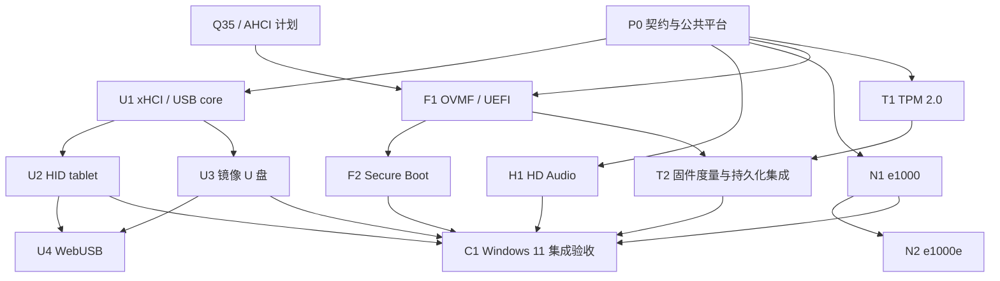

# 现代 PC 设备与 UEFI 安全启动实施计划

状态：设计与实施计划，尚未实现或通过本文验收。

本计划基于 2026 年 10 月 3 日审查的当前 v86 分支，逐步增加 xHCI、USB HID tablet、
USB 大容量存储、受限 WebUSB 直通、HD Audio、e1000/e1000e，以及 OVMF、Secure Boot
和 TPM 2.0。默认保留旧机器配置；新增能力采用显式选项，验证后再组合成现代 PC 配置。

本计划与 [Q35 AHCI SATA 计划](q35-ahci-sata-plan.md) 共用平台、PCI、MMIO、中断与存储
基础。Q35 在当前工作区仍是计划，不能作为已经存在的实现。USB、音频和网卡可先在现有
i440FX 平台验证；最终现代 PC 集成以 Q35 为主。本文面向 x86/x86-64，ARM64 的固件和
设备接入另见 [ARM64 virt 与 Android 16 计划](arm64-virt-android16-plan.md)。

## 目标与范围

| 功能 | 首个可交付结果 | 后续扩展及边界 |
| --- | --- | --- |
| xHCI + HID tablet | Windows 8 及以后、Linux 使用系统驱动，获得准确绝对坐标、按键和滚轮 | USB 键盘、Hub、更多端点与速度；Vista/7 的 xHCI 不纳入免驱承诺 |
| USB 大容量存储 | 将磁盘镜像作为可热插拔 U 盘，支持读写、弹出与快照 | USB 启动、更多 LUN、UAS；实体 U 盘不等同于镜像设备 |
| WebUSB | 经用户选择，将浏览器允许的真实 USB 接口接到虚拟 USB 总线 | 普通网页不能承诺任意 HID、U 盘或其他受保护接口直通 |
| HD Audio | 合规 HDA 控制器与通用 codec，在 Vista 及以后、Linux 播放 PCM | 录音、多声道、多 stream、插孔事件；保留旧系统的 SB16 |
| e1000 | 固定一个经过驱动验证的型号，复用现有网络后端完成收发 | e1000e 是单独设备型号与驱动目标，不是简单更换 PCI ID |
| OVMF | X64 UEFI Shell、GPT/ESP 磁盘启动和持久化启动项 | 固定固件版本、GOP 与运行时服务；不要求首版支持所有 OVMF 构建 |
| Secure Boot | 验证签名、拒绝不可信或撤销的启动映像，保护变量更新 | 固件验签、变量存储保护和密钥配置均属于验收 |
| TPM 2.0 | OVMF 与操作系统识别，支持真实命令、度量和持久化状态 | 软件 vTPM 不提供物理 TPM 的防篡改或硬件背书保证 |

Windows 11 的公开要求包括兼容的 64 位处理器、至少双核、4GB 内存、64GB 存储、
UEFI / Secure Boot capable、TPM 2.0，以及 DirectX 12 / WDDM 2.0 图形要求。因此，
完成上述设备不等于已经满足 Windows 11 的全部条件；能运行某个安装镜像也不等于获得
官方硬件兼容认证。最终验收固定具体版本、版本号和架构，并分别记录启动、安装、驱动、
安全功能及图形能力。[Microsoft Windows 11 系统要求](https://www.microsoft.com/en-us/windows/windows-11-specifications)

## 当前分支基础

以下为代码和仓库文档审查结果，本次编写计划未重新执行客体启动测试。

| 入口 | 当前基础 | 本计划要补的部分 |
| --- | --- | --- |
| [x86-64 文档](x86-64.md)、`src/rust/x64/` | 已有 long mode、36 位物理地址与 x64 JIT；文档记录 Linux x64、Windows 8.1 x64 桌面验证 | 针对目标 Windows 11 镜像补 CPU 指令、CPUID、系统行为和性能缺口 |
| [src/platform.js](../src/platform.js)、[src/pci.js](../src/pci.js) | 平台资源描述、i440FX/PIIX、256B 配置空间、共享 INTx | 精确 BAR 映射、配置访问语义、MSI/MSI-X、Q35 资源布局 |
| [src/io.js](../src/io.js) | MMIO 按 128KiB 粗粒度注册 | 同一粗块内小 BAR 的独立分发、迁移和解除映射 |
| [src/cpu.js](../src/cpu.js)、[src/extended_memory.js](../src/extended_memory.js) | 已有物理地址校验与跨页、高地址读写接口 | 给新设备提供统一 DMA 包装、错误转换和有界调度 |
| [src/acpi_tables.js](../src/acpi_tables.js)、[src/acpi.js](../src/acpi.js) | ACPI、fw_cfg 文件、APIC/IOAPIC、复位和电源生命周期 | UEFI 所需固件契约、TPM2 表、资源保留；不能照搬 SeaBIOS 初始化假设 |
| [src/browser/mouse.js](../src/browser/mouse.js)、[src/ps2.js](../src/ps2.js)、[src/vmware.js](../src/vmware.js) | PS/2 输入与已有 VMware 绝对坐标路径 | 统一坐标转换与输入路由，新增 USB HID 报告 |
| [src/buffer.js](../src/buffer.js)、[src/ide.js](../src/ide.js)、[src/state_io.js](../src/state_io.js) | 镜像、异步 I/O、ATA/ATAPI 和快照 I/O 跟踪 | 共用块后端，新增 SCSI/BOT；复用 Q35 计划的后端整理 |
| [src/sb16.js](../src/sb16.js)、[src/browser/speaker.js](../src/browser/speaker.js) | SB16 与 `dac-*` 音频通道 | HDA 控制器、codec、PCM 路由、虚拟时间驱动 |
| [src/ne2k.js](../src/ne2k.js)、[src/virtio_net.js](../src/virtio_net.js) | NE2000、virtio-net 与现有网络后端 | e1000/e1000e 前端；无需为每张网卡重写联网方案 |
| [src/browser/cpu_worker.js](../src/browser/cpu_worker.js)、[src/browser/cpu_worker_runtime.js](../src/browser/cpu_worker_runtime.js) | 设备与 RAM 在 CPU Worker，页面适配器经消息通信；音频已有专用通道 | 新选项、USB 权限代理、持久化代理和完整 epoch 生命周期 |

未发现已有的 xHCI、USB 设备栈、HDA、e1000、OVMF 平台、Secure Boot 或 TPM 实现。
现有 `virtio.js` 中 MSI-X 配置字段的占位不能视为已有 MSI-X 投递支持。

## 实施顺序与依赖

优先得到可见收益：公共基础 → tablet → 镜像 U 盘；音频、网卡和 OVMF 探路可并行。
Secure Boot 与 TPM 分别实现，在 UEFI 稳定后集成。WebUSB 和 e1000e 不阻塞前面的交付。



| 阶段 | 主要交付 | 完成门槛 |
| --- | --- | --- |
| P0 | 固定版本/身份/配置，公共 DMA、MMIO、中断、生命周期契约 | 旧设备回归通过，新设备框架可在页面与 Worker 两种路径运行 |
| U1 | xHCI 控制器与 USB 请求层 | 客体系统驱动加载，枚举测试设备，命令/传输/事件环正确 |
| U2 | HID tablet | 坐标、点击、滚轮、拖拽、分辨率变化和恢复通过 |
| U3 | USB BOT 存储 | 可挂载、读写、校验、弹出、再插入；已成功 flush 的写入按后端契约保留，中断写入不错误报告成功 |
| H1 | HDA 控制器 + 播放 codec | 系统驱动识别，持续播放、暂停、复位与 Worker 音频通过 |
| N1 | e1000 固定型号 | 目标驱动识别，双向联网、描述符环回绕与恢复通过 |
| F1 | OVMF X64、变量持久化、GOP | Shell → Linux → Windows UEFI 引导，冷启动与启动项持久化通过 |
| T1/T2 | TPM2 前端/后端、ACPI、TCG2 度量 | 操作系统就绪、PCR/事件日志一致，NV 与快照恢复通过 |
| F2 | Secure Boot 与受保护变量服务 | 可信映像启动，未签名/错误签名/撤销映像拒绝，变量更新检查通过 |
| C1 | 固定 Windows 11 集成配置 | 不绕过所验收的 UEFI/Secure Boot/TPM 条件，安装、重启、设备与安全功能通过 |
| U4/N2 | 受限 WebUSB / e1000e | 各自兼容矩阵与生命周期通过后独立发布 |

OVMF、vTPM 移植和 Windows 驱动身份验证应在 P0 做小型可行性探测，尽早暴露阻塞。
表中顺序是交付依赖，不代表必须等 USB 全部完成才开始固件调研。

## P0 公共基础与配置契约

### API 与兼容性

以下为拟新增接口，字段名在 P0 冻结，不能当作当前可运行示例：

```js
new V86({
    cpu_type: "x86_64",
    machine_type: "q35",                // 来自 Q35 计划
    acpi: true,
    cpu_cores: 2,
    net_device: { type: "e1000", relay_url: "..." },
    audio_device: { type: "hda" },      // "sb16" | "hda" | "none"
    usb: {
        controller: "xhci",
        tablet: true,
        mass_storage: [
            { id: "usb-disk0", image: { url: "usb.img", async: true }, read_only: false },
        ],
        webusb: false,
    },
    firmware: {
        type: "uefi",                  // 默认仍使用原有 bios/vga_bios 路径
        code: { url: "OVMF.fd" },       // 示例名；具体产物与变量服务必须配套
        vars: { store_id: "vm-demo/uefi" },
        secure_boot: false,
    },
    tpm: { version: "2.0", interface: "crb", store_id: "vm-demo/tpm" },
    // RAM、显示适配器、hda/cdrom 等继续按现有及 Q35 计划配置。
});
```

- `hda` 已表示第一块硬盘，不能用作顶层 HD Audio 选项；新增 `audio_device`。
- 未配置时保留 SB16、原网卡、PS/2 与 SeaBIOS 默认行为。首版 SB16/HDA 二选一，
  若以后支持共存，先实现多来源音频混合，不能共用无来源标识的 `dac-*` 队列。
- UEFI 与传统 `bios/vga_bios` 的互斥、错误信息、CODE/变量模板版本组合在启动前校验。
  `secure_boot: true` 表示要求加载并核验受信配置，不能仅设置一个对外可见的状态位。
- USB 设备使用稳定 ID 和端口号。热插拔 API 具有明确的成功、失败、取消和断开事件；
  Node 支持模拟设备，WebUSB 是可选浏览器适配器。
- 固定配置序列化贯穿 [v86.d.ts](../v86.d.ts)、starter、CPU Worker、CPU 初始化、
  reset、destroy、快照和构建入口；不在快照中保存浏览器权限对象、Promise 或打开的句柄。
- 固件变量、TPM 和可写介质的存储归属于同一 VM 身份；不同 VM 不能意外共用同一状态目录。

### PCI、DMA、中断和时钟

复用 Q35 计划的 PCI/BAR/MMIO 改造，不再为每个设备各造一套机制：

1. 平台集中分配 BDF、BAR、IRQ 与资源保留；支持 BAR 探测、重定位、解除映射和解码开关。
   Bus Master Enable 禁止时不能继续 DMA；清除 INTx/MSI 状态不会误清同线其他设备。
2. DMA 使用现有 `validate_physical_range`、`read_blob_physical`、`write_blob_physical`
   等接口。按设备规则额外检查 RAM/MMIO 类型、对齐、长度、链环、地址溢出与总量上限。
   完整保留地址高位；超出当前 36 位总线的地址返回设备错误，禁止回绕至低内存。
3. 公共中断层先实现可测试的单向量 MSI，再按型号需要加 MSI-X table/PBA、mask/pending
   和多向量。写回描述符/事件必须先于中断可见，覆盖多核 APIC 目标和屏蔽后补发。
4. xHCI 的 PCI/PCIe profile 要求 MSI 和/或 MSI-X，INTx-only 仅可用于内部 bring-up；
   e1000 和 HDA 可先按所选型号以 INTx 验证。不能为了省实现而暴露失效的 capability。
   [Intel xHCI 1.2b，§5.2.8 / §4.17.3](https://cdrdv2-public.intel.com/625472/625472_xHCI_Rev1_2b.pdf)
5. 使用 [MachineClock](../src/machine_clock.js) 推进设备可见计时与定时器。仅停止页面
   展示、音频静音或权限未授予，不应阻断运行中客体的硬件进度；VM `pause()` 则冻结虚拟
   时钟和设备计时。在途宿主 I/O 可以结束，客体可见的完成结果按统一暂停/恢复规则提交。
   每轮处理有预算，防止描述符环或 USB doorbell 一次占满页面/Worker。

### 异步 I/O、复位和快照

各设备从首个版本就具备 `reset/get_state/set_state/destroy` 或等价生命周期；新快照包含
设备型号、schema、固件和后端状态版本。旧快照缺少新设备时按旧布局恢复；设备组合不同
或格式不兼容时在修改 RAM 之前失败。

异步请求携带 machine/device epoch；旧请求晚到不得写入新机器 RAM、推进新队列或发 IRQ。
磁盘写入已提交时不能声称复位能够撤销物理写入。复用 `state_io.js` 等待可完成的在途 I/O，
为长轮询 USB IN、断开的 WebUSB 和超时后端制定取消/脱离策略，不能让保存快照无限等待。
关闭和 S5 的持久化失败必须可观测，不能默默丢弃。

## U1 xHCI 与 USB 核心

建议新增 `src/usb/`，拆成 `xhci.js`、`usb_device.js`、`hid_tablet.js`、
`mass_storage.js` 和共享描述符/常量模块。控制器只处理 xHCI、DMA 和端口；USB 设备处理
标准/类请求；镜像和浏览器适配器属于后端。模拟 USB 事务，无需实现电气信号。

首版选定一个规范 profile 与硬件身份，固定槽位数、root port 数、context 大小和一个
interrupter；建议先支持直接连接的 USB 2.0 full/high-speed 设备。支持 xHCI 不代表首版
就具备 USB 3.x 全速率、Hub、streams、等时传输和全部可选能力。

| 层次 | 实现范围 |
| --- | --- |
| 寄存器 | Capability、Operational、Runtime、Doorbell，复位/启停，CRCR stop/abort、IMAN/IMOD、ERDP.EHB、MFINDEX、PORTSC、Supported Protocol |
| 内存对象 | DCBAA、slot/endpoint/input contexts、scratchpad（仅按声明值要求）、command/transfer/event rings、ERST、ERDP |
| 命令 | Enable/Disable Slot、Address Device、Configure/Evaluate Context、Reset Device、Stop/Reset Endpoint、Set TR Dequeue Pointer、No-op，以及规范要求的错误完成 |
| TRB | Link/cycle/toggle、Setup/Data/Status、Normal、Event Data、短包/错误/停止、IOC；驱动实际使用的组合均需覆盖 |
| USB 请求 | 描述符、地址/配置/接口、GET_STATUS、feature/halt、控制传输三阶段、bulk 与 interrupt IN/OUT |
| 端口与电源 | 接入/拔出、power、reset、速度、状态变化 W1C、Port Status Change Event；PCI PM capability、D0/D3 与 USB2 suspend/resume |

实现顺序：寄存器与 reset → 命令环 → EP0 枚举 → interrupt → bulk → 错误与生命周期。
Transfer Event 指针、剩余长度、completion code、环回绕、事件队列满和端点停止必须与
规范一致。NAK/暂时无数据需要等待或调度，不能当成成功零长度包；STALL、短包、断开
分别处理。SET_ADDRESS 的控制器行为和设备地址状态保持一致。

验收分两层：Node 构造 ring/contexts 验证边界与 DMA；固定 Linux 内核加载 `xhci_hcd`
后运行 `lsusb -v`、枚举/取消/重插测试。随后在 Windows 8.1/10/目标 Windows 11
镜像中验证系统驱动。Windows 自带 xHCI 栈从 Windows 8 开始，Vista/7 保留 PS/2 输入，
USB 兼容若需要则另做 EHCI/UHCI 或明确指定外部驱动。
[Microsoft USB 3.0 驱动栈](https://learn.microsoft.com/en-us/windows-hardware/drivers/usbcon/usb-3-0-driver-stack-architecture)

同时覆盖驱动默认启用的 selective suspend/resume 与设备电源状态转换。整机公布 S3 时，
必须验证 xHCI 休眠/唤醒与端点恢复；未验证的新平台应关闭对应 ACPI 睡眠能力声明，
不能沿用旧机器的通过记录。

## U2 USB HID tablet

采用通用 HID 绝对定位 pointer：X/Y 为 16 位绝对值（例如 logical range 0–32767），
包含鼠标按钮和相对滚轮。这里的 tablet 是绝对坐标鼠标设备，首版不承诺压感笔、多点触控
或 Windows Ink。报告描述符的 Usage、Collection、绝对/相对位与实际 payload 必须一致。
不声明无法兑现的 Boot Mouse 协议；覆盖 HID descriptor/report、GET/SET_REPORT、
GET/SET_IDLE 及实际声明协议所需请求。

输入链路为：页面指针 → 客体显示内容矩形内的归一化坐标 → 统一输入路由 → HID 报告。
复用显示布局提供的数据，不把外层 canvas 边框、留黑或 CSS 像素直接当成客体像素。
考虑 devicePixelRatio、页面缩放、全屏、动态分辨率、指针离开、失焦与拖动捕获。
首版固定单显示器；多显示器的坐标范围另定义。

同一指针事件只进入一个客体路径：USB tablet、VMware 绝对坐标或 PS/2。切换时释放已按下
按钮，避免双击、双光标移动和卡住的按键。绝对坐标路径不要求 pointer lock；游戏需要的
相对移动作为显式模式保留。鼠标尚未枚举时的回退不能造成重复输入。

验收：四角、中心和至少 5×5 网格往返定位；在正常缩放与 letterbox/HiDPI 下验证映射
误差不超过 1 个客体像素（客体桌面光标策略单独记录）。测试按键、滚轮、跨边界拖拽、
分辨率切换、热插拔、快照恢复、Worker，确认不累积漂移。

## U3 镜像 U 盘

首版采用 USB Mass Storage Bulk-Only Transport（BOT）+ SCSI transparent command set，
单 LUN、512B 扇区。USB 层处理 CBW/data/CSW，SCSI 层处理命令、sense 与介质状态，
块后端复用 `buffer.js` 及 Q35 计划的读写/flush/cancel/错误接口，不复制 IDE 控制器。

最低命令包括 INQUIRY、TEST UNIT READY、REQUEST SENSE、READ CAPACITY、MODE SENSE、
READ/WRITE、SYNCHRONIZE CACHE、START STOP UNIT 和防止/允许介质移除。READ/WRITE(16)
及容量扩展随所支持容量落实；只实现 READ CAPACITY(10) 时不得虚报超出范围的大盘。
覆盖 GET_MAX_LUN、BOT reset、endpoint halt 清理、tag/residue、方向/长度不匹配与
phase error 恢复，不把所有失败都返回成功 CSW。

热拔出停止新请求并按策略完成或取消已有请求；只读盘正确拒绝写入。客体弹出与 host 拔出
分开表示。内存 overlay 的 flush 只保证 overlay 一致性，持久后端才承诺相应持久化；
页面应能导出修改后镜像或恢复持久 overlay。一个镜像不能同时经 USB 与 IDE/AHCI 可写挂载。

验收：Linux 和 Windows 格式化/挂载，覆盖空盘、只读、边界 LBA、跨页和高地址 DMA。
写入至少 1GiB 的可复现数据并校验 SHA-256，覆盖随机读写、后端失败、写中复位、断开、
flush、快照和重新连接；以测试镜像执行，避免依赖真实 U 盘。USB 启动在固件支持该控制器后
单独验收，不能用“操作系统已挂载”代替。

安全弹出后应验证完整数据；意外拔出/复位则验证已承诺的写入、不误写其他扇区、正确的
失败状态和客体恢复流程，不承诺未经 flush 的写入或客体文件系统在突发断开后必然完整。

## U4 WebUSB 受限直通

普通网页 WebUSB 的受保护接口包含 HID（0x03）、Mass Storage（0x08）等类别；
浏览器还受到 blocklist、设备占用与平台驱动绑定影响。因此，本计划的 tablet 与镜像 U 盘
完全由模拟设备提供，不依赖 WebUSB，也不把 WebUSB 宣传为通用 USB passthrough。
[WebUSB 规范的接口保护规则](https://wicg.github.io/webusb/)

首版选择一块允许访问、具有 vendor-specific 接口的测试设备。页面在 HTTPS/localhost、
浏览器能力和 Permissions Policy 检查通过后，由用户手势触发选择；拒绝、撤销和设备被
其他程序占用返回明确状态。权限和真实句柄保留在浏览器适配器，CPU Worker 使用带 ID/epoch
的异步消息，不把 `USBDevice` 当成可序列化对象。

实现 control/bulk/interrupt 事务桥接、配置和 alternate setting、halt 清理、disconnect。
虚拟总线地址不映射成真实设备 SET_ADDRESS；配置/接口占用使用 WebUSB 提供的方法协调。
复合设备只开放可以完整映射的接口，必要时生成一致的受限描述符；拒绝无法正确重写的组合。
不盲转会更改主机侧配置、所有权或不支持端点的请求。等时传输和严格实时设备单独规划。

WebUSB 没有可通用假设的逐请求取消/物理状态回滚能力。虚拟取消通过 epoch 丢弃晚到结果，
不能保证已经送到设备的写操作被撤销。恢复快照时真实设备保持断开，重新授权/连接后作为
重新插入呈现；不得重放快照前的真实 OUT 请求。

验收记录 browser/version/OS/VID:PID/interface/driver binding，覆盖允许设备的往返、
拒绝授权、拔出、占用、reset、超时、Worker 和恢复。实体 U 盘/HID 若成为独立需求，另立
本地原生代理、WebHID 适用范围或文件导入方案，不能靠关闭浏览器安全限制交付。

## H1 HD Audio

建议拆为 `src/hda.js` 控制器、`src/hda_codec.js` codec 和可复用 PCM 后端。固定一套
Intel HDA 兼容控制器身份（例如 ICH6 `8086:2668` 作为候选）及简单输出 codec；P0 先验证
目标 Windows INF 与 Linux 探测路径，避免冒充需要大量私有初始化的真实 codec。

控制器覆盖 GCTL/CRST、GCAP、STATESTS、CORB/RIRB 地址/指针/大小/复位、verb response、
中断状态/屏蔽、stream descriptor、BDL、LPIB、CBL/LVI、格式和 DMA position buffer。
实现驱动会使用的 immediate command 路径；公布几个 stream、环大小或 64 位 DMA，
就实现对应语义。首先只公布最小可用输出 stream，输入功能后续增加。

codec 至少具有 root、Audio Function Group、DAC 和 output pin，正确返回 widget、PCM
格式与连接列表能力；支持 stream/channel 绑定、converter format、pin control、
amplifier/mute、power 和 reset verbs。设备管理器看到 HDA controller 只是第一步，
codec 拓扑被通用驱动接受并产生音频 endpoint 才算枚举完成。

音频先实现 48kHz/16-bit/stereo，能力只公布实际支持格式，再扩展 44.1kHz 和其他位宽。
WALLCLK 24MHz、DMA 消耗、LPIB 和周期 IRQ 基于虚拟时间推进。浏览器未解锁音频、
页面静音或没有输出设备时仍消耗客体 PCM 并保持正确中断；宿主 AudioWorklet 的拉取仅是
播放后端需求，不能成为控制器唯一时钟。

复用现有 AudioWorklet/Worker 通道，但增加来源、格式、队列上限、重采样和暂停/恢复语义。
音频输出队列不跨快照直接重播，恢复时丢弃旧 epoch 的样本，并以客体 stream 状态重建。
录音另设功能阶段，获取麦克风的权限不会成为播放所必需的条件。

验收：Linux ALSA 和固定 Vista/7/8.1/10/11 镜像的系统驱动矩阵；自动检查生成 PCM 的
频率/声道/样本数和 DMA/IRQ，浏览器检查可听输出。连续播放至少 10 分钟，记录 underrun、
overflow、延迟和漂移；覆盖格式变更、静音、暂停、reset、快照、Worker 与后台切换。
[Microsoft HDA 总线驱动](https://learn.microsoft.com/en-us/windows-hardware/drivers/audio/hd-audio-bus-driver)

## N1 e1000 与 N2 e1000e

先选 `8086:100e`（82540EM）作为 e1000 候选，参考规范及现有成熟模拟器行为；确定身份后，
实现该型号完整的必要契约。e1000e 候选为 `8086:10d3`（82574L），在 PCIe/MSI-X 和驱动
测试具备后另做，不能只更换 vendor/device ID。

Windows inbox 驱动必须按 PCI ID、Windows build、架构及实际镜像核实。Windows 11 的
部分 inbox 网络驱动属于可移除的 Feature on Demand，不能仅凭“e1000 很常见”承诺所有
镜像免驱。P0 提取测试镜像 INF 并记录匹配结果；没有系统驱动的组合明确标记或调整型号。
[Microsoft inbox 网络驱动说明](https://learn.microsoft.com/en-us/windows-hardware/manufacture/desktop/inbox-network-drivers?view=windows-11)

e1000 首版实现 EEPROM/NVM 与 MAC、PHY/MDIC、link、CTRL/STATUS、RX/TX descriptor rings、
head/tail、packet buffer、接收过滤、广播/多播、统计、中断 ICR/IMS/IMC 和 moderation。
处理 descriptor 链跨界、ring wrap、DD/EOP/RS、短帧、超长帧、无 RX buffer 和 reset。
复用 `net{id}-{send,receive,mac}` 总线，保持 MAC 恢复/转换与现有 fetch、Wisp、WebSocket、
in-browser 后端的一致性；设备声称 1Gbps 链路不代表浏览器能达到该吞吐。

先让 legacy descriptor 基础收发工作，再补目标驱动实际启用的 checksum、VLAN 和 TSO/
extended descriptor 路径。某些真实型号驱动可能默认启用这些功能，不能只靠隐藏一个
通用 feature bit 解决；调试时关闭 offload 的结果单独记录，正式验收使用驱动默认配置。
e1000e 另补型号寄存器、NVM/PHY 差异、PCIe capability、电源状态、MSI/MSI-X、向量和队列
语义，按实际实现限制 RSS/多队列，不复用错误的 e1000 假设。

验收：Linux 对应 `e1000`/`e1000e` 与目标 Windows 驱动；DHCP、ARP、DNS、TCP/UDP 双向
收发、MTU/分片相关行为、丢包、link down/up、reset、快照及多核中断。用可控回环端点做
至少 1GiB 双向传输校验并记录吞吐/CPU/IRQ；协议测试和依赖外网服务的测试分开。

## F1 OVMF / UEFI

先冻结 edk2 commit、工具链、构建选项、固件大小、CODE/变量布局和 hash。在 QEMU 的
匹配平台跑通同一构建，形成串口与设备探测参考，再移入 v86。首个探索构建关闭 Secure Boot
和 TPM，先验证固件路径；最终集成用 Q35/AHCI，但 OVMF 探路可在兼容 i440FX 布局开始。

不能把 OVMF 当成较大的 SeaBIOS 文件直接替换。需要审计并实现：

- 复位向量、4GiB 顶部固件映射/别名、ROM 写保护、内存洞和高 RAM；CODE 与可写状态分离。
- fw_cfg 的签名、特性、RAM/CPU/E820/文件与固件实际请求。若所选固件要求 DMA fw_cfg，
  实现对应地址/长度/端序/完成；若使用 PIO 回退则不虚报 DMA capability。
- PCI host bridge、BAR 分配、ACPI/SMBIOS 与内存资源保留；PIIX4/ICH9 的 PM 资源必须在
  OVMF 初始化流程下正确生成，不能依赖 SeaBIOS 写寄存器的特定时序。
- GPT/ESP、AHCI 磁盘与光驱、BootOrder/Boot####、启动管理器、UEFI runtime services，
  包括 ExitBootServices 之后变量访问和操作系统使用的地址映射转换。
- 固定显示适配器的 GOP。优先审计 OVMF 自带 QEMU/Bochs 显示路径能否匹配现有设备；
  传统 VGA BIOS/INT 10h 能显示，不代表已有 UEFI GOP。串口 Shell 只算早期里程碑。

变量每 VM 独立且可持久化，支持容量不足、损坏、原子提交与恢复；重启保留变量，显式恢复
出厂设置才重置模板。采用 pflash 时实现固件要求的 flash 操作与布局；采用后述 PV vars
时使用相应服务协议和存储格式，不能混用 VARS.fd 与服务端存储。

验收顺序：串口日志与 Shell → 图形 GOP → GPT/ESP Linux 冷启动 → Windows UEFI 引导 →
持久化 BootOrder、冷/热重启、超过 4GiB RAM、多核与快照。固定磁盘启动是完成条件，
直接装载内核不能代替。安装阶段使用可恢复镜像副本。

UEFI profile 初期不声明未经验证的 S3/S4。当前平台的休眠声明和部分 SeaBIOS 唤醒假设
需要按固件拆分；对应 OVMF 休眠、唤醒与设备恢复路径单独通过后再开放。

## T1/T2 TPM 2.0

采用“客体 TPM 接口 + TPM 命令后端 + 每 VM 持久化”的三层结构。优先评估 libtpms 的
Wasm 移植，复用其 TPM 2.0 状态机与密码学实现；swtpm/libtpms 的原生组合用于差分测试。
不能用只返回 TPM 存在、固定 PCR 或少数成功响应的 stub 作为完成版本。

P0 探测构建依赖、熵源、命令调用、NV 导入/导出、Wasm 内存与许可证。默认交付应能在
浏览器本地运行；若只能通过原生代理调试，要明确它还不是浏览器版完成状态。

首版选择 CRB 接口，并同步固定 OVMF 与 Windows/Linux 支持配置；TIS/FIFO 作为后续
可选前端。实现 locality、interface ID、command-ready、start/cancel、状态转换和命令/
响应缓冲区边界。TPM2 ACPI 表的 start method、control area、AML `MSFT0101` 身份与
资源保持一致，避免 OS 选择了另一条未实现接口。审计目标 OVMF/Windows 所需的 Physical
Presence Interface（PPI）`_DSM`、固件请求/结果和重启后的处理；未支持操作准确声明，
TPM Clear 等请求不能只返回成功而不执行相应流程。

TPM 后端覆盖初始化/关机、capability、随机数、PCR read/extend、sessions、object/key、
NV、授权与目标客体所需算法（至少审计 SHA-256 和 RSA/ECC 需求）。使用宿主密码学随机
源，不用 `Math.random()`；真实 VM 的身份与种子独立，确定性种子只用于测试。
固件启用 TCG2 测量与事件日志，将日志位置正确交给 OS；用事件日志重算 PCR，与实际 TPM
结果比对。TPM 被枚举、TPM ready、度量正确、密钥可持久化分别验收。

磁盘、UEFI vars、TPM NV/volatile state 和 VM 快照要采用一致的保存协议与代次标识，恢复
时检查是否配套。TPM 时钟、reset/restart counters，以及变量服务的启动阶段、策略和锁定
状态一并保存；运行期恢复不能意外重新进入尚未锁定的固件初始化阶段。TPM 状态回退、
重新生成身份或升级不兼容后端可能使密封密钥失效，不能遇到错误就静默清空。
测试 BitLocker 等密封场景前保存恢复材料，并用测试盘验证正常重启、度量变化后的预期
恢复流程、快照回滚和状态损坏路径。

一致恢复也会回退 dbx、认证更新时间、TPM NV 与计数器，不能据此宣称防宿主回滚；
认证更新的防重放保证仅针对同一未回滚状态序列。需要防回滚时另设可信外部状态锚点。

同源页面、宿主和用户持有软件状态的能力属于此 vTPM 的信任边界；不能宣称具备物理 TPM
防篡改、可信硬件 EK 证书或生产远程证明。TPM Clear/替换 VM 身份必须作为显式操作。
[libtpms 项目](https://github.com/stefanberger/libtpms)、[QEMU TPM 设备与接口说明](https://www.qemu.org/docs/master/specs/tpm.html)

## F2 Secure Boot

在 F1 后先用测试密钥验证签名启动链，再配置适合目标 Windows/Linux 的受信任证书与 dbx。
区分 SetupMode、UserMode、SecureBoot、PK、KEK、db、dbx；实现认证更新、变量属性、
删除/追加、时间戳或相应重放防护、存储耗尽和断电一致性。不能以 Windows UI 显示“开”
代替实际验签和保护。

当前分支没有完整 SMM/SMRAM/RSM，因此在 P0 选择以下实现路线：

| 路线 | 实施内容 | 采用条件 |
| --- | --- | --- |
| 优先评估：OVMF `QEMU_PV_VARS` + v86 变量服务 | 在 guest 外处理访问控制与认证更新，实现设备协议、事件/变量策略、持久化和密码学验证 | 固定支持该选项的 edk2 构建，移植并审计服务端，不把普通 JSON 存储等同于保护 |
| 传统：SMM + pflash | 实现 SMI/SMM 进入与 RSM、SMRAM 隔离/锁定、多核语义、受保护 flash 与 OVMF SMM 驱动 | 需要复用传统 SMM 固件构建时，作为独立平台里程碑完成 |

edk2 的 OVMF X64 已提供 `QEMU_PV_VARS` 构建选项，QEMU 的对应方案在宿主处理变量
访问控制与签名校验，因此 SMM 不是所有 Secure Boot 实现的绝对前提。v86 必须实际实现
匹配的服务；仅打开固件编译选项不会自动获得该能力。若两条保护路线均未完成，只能报告
“UEFI/验签实验”，不能报告完整安全启动。
[edk2 PV vars 文档](https://github.com/tianocore/edk2/blob/master/OvmfPkg/QEMU_PV_VARS.md)、
[QEMU 变量服务设计](https://www.qemu.org/docs/master/devel/uefi-vars.html)

密钥与撤销库固定来源、版本和 hash，开发测试私钥不进入发布镜像。按目标安装介质核对
Microsoft 证书链与 2023 证书过渡，不能长期依赖一份陈旧预置 VARS。
[Microsoft Secure Boot 证书说明](https://support.microsoft.com/en-us/windows/security/devicesecurity/windows-11-and-secure-boot)

验收必须包含正反例：有效签名通过；未签名、改动后、错误签名与 dbx 撤销的映像拒绝；
未授权修改 PK/KEK/db/dbx、直接写保护存储、重放旧认证更新失败；合法更新和重启后状态
一致。再用 Windows `Confirm-SecureBootUEFI`、Linux `mokutil --sb-state` 等核对客体视图，
同时验证启动链与 TPM event log/PCR 的集成。

## C1 集成、回归与完成定义

P0 建立固定矩阵，记录 ISO/hash、Windows build/edition/架构、Linux kernel/config、
固件版本、设备 ID、驱动名/版本、浏览器/宿主版本和测试日期。先用现有已验证客体完成
增量设备验证，再进入 Windows 11，避免同时排查 CPU、固件和设备三个层次。

| 维度 | 最低覆盖 |
| --- | --- |
| 旧机器 | 默认 i440FX + SeaBIOS + PS/2 + SB16 + NE2000/virtio + IDE 行为及旧快照 |
| USB | Linux、Windows 8.1/10/目标 11；Vista/7 的无 xHCI 回退明确记录 |
| HDA | 固定 Vista 及以后镜像的 inbox 驱动矩阵；Linux ALSA |
| NIC | 每个选定 PCI ID 在目标 Windows 镜像中的 INF 匹配与 Linux 对应驱动 |
| UEFI | Q35/AHCI、GOP、GPT、4GiB 以上物理内存、双核及多核 |
| 浏览器 | 页面执行与 CPU Worker，主浏览器正式版；WebUSB 单独标记支持平台 |
| 生命周期 | pause/resume、warm/cold reset、S5、快照、恢复、热插拔、在途请求和持久化失败；S3/S4 按各固件 profile 单独启用验收 |
| 安全功能 | Secure Boot 正反例、认证变量更新、TPM 命令/NV/PCR/event log 与密封场景 |

当前 x64 文档的 CPU 能力不能直接推导最新 Windows 11 可运行。为选定安装镜像建立指令/
CPUID/MSR 与启动日志清单，审计 SSE4.x、POPCNT 等实际依赖，缺失语义在解释器/JIT 中
实现并做差分验证后再宣布对应能力。双核和内存容量也要以客体实际可用值验证。图形驱动的
WDDM/DirectX 能力独立跟踪；UEFI GOP、WebGPU 后端或应用 API 转发不能替代这项验收。

每阶段保留寄存器、descriptor/TRB/verb/TPM command 摘要、IRQ 和后端错误诊断，日志
有容量上限且默认不记录音频内容、磁盘数据或 TPM 密钥。对环/长度解析做恶意输入和故障
注入测试，确认失败结束为客体设备错误，不造成宿主无限循环或任意内存访问。

建议将测试放在现有 `tests/devices/`、`tests/x64/` 与浏览器测试体系中，扩展
`devices-test`、`cpu-worker-tests`、`platform-contract-tests` 等实际入口。公共平台改动
同时运行相关 ACPI、extended/high-memory、x64、多核与旧设备回归；文档编写本身不代表
这些未来测试已通过。

首个完整交付需要：新增设备按声明能力工作；Windows/Linux 驱动矩阵有证据；固件冷启动与
安全正反例通过；保存/恢复不破坏持久状态；旧默认配置继续可用；用户文档明确 WebUSB、
vTPM、Windows 11 CPU/图形兼容的边界。只出现设备名称、播放一次声音或绕过安装检查，
均不能替代相应阶段验收。

## 建议的首批提交

1. 固定兼容矩阵、候选设备身份、固件/vTPM 探测结果与拟新增 API；与 Q35 计划统一资源表。
2. 提交公共精确 MMIO/BAR、DMA 与生命周期支持及回归；MSI 单独提交并验证。
3. 提交 USB core + xHCI 寄存器/命令环，再逐项加入传输环和枚举，最后接入 HID tablet。
4. 提交 BOT/SCSI/块后端与镜像 U 盘；HDA 和 e1000 可由独立工作流并行推进。
5. 提交 OVMF 固件契约、GOP 与持久变量，再提交 TPM2 与 Secure Boot 的独立模块。
6. 提交固定 Windows 11 集成证据和配置；WebUSB、e1000e、USB 启动及录音按各自门槛扩展。

## 规范与实现参考

实现以冻结版本的规范为准；下面的上游源码用于理解驱动交互和差分测试。移植代码前核对
许可证，记录来源与修改，不因参考 QEMU 就宣称完整 QEMU 机器兼容。

- [Intel xHCI 1.2b](https://cdrdv2-public.intel.com/625472/625472_xHCI_Rev1_2b.pdf)
- [USB HID 1.11](https://www.usb.org/document-library/device-class-definition-hid-111)、[USB Mass Storage BOT](https://www.usb.org/document-library/mass-storage-bulk-only-10)
- [WebUSB 规范](https://wicg.github.io/webusb/)
- [Intel HD Audio 规范](https://www.intel.com/content/dam/www/public/us/en/documents/product-specifications/high-definition-audio-specification.pdf)
- [Intel 8254x 软件开发手册](https://www.intel.com/content/dam/doc/manual/pci-pci-x-family-gbe-controllers-software-dev-manual.pdf)
- [QEMU e1000](https://github.com/qemu/qemu/blob/master/hw/net/e1000.c)、[QEMU e1000e](https://github.com/qemu/qemu/blob/master/hw/net/e1000e.c)
- [edk2 OvmfPkg](https://github.com/tianocore/edk2/tree/master/OvmfPkg)、[UEFI 规范](https://uefi.org/specifications)
- [TCG TPM 2.0 Library](https://trustedcomputinggroup.org/resource/tpm-library-specification/)、[TCG PC Client 平台 TPM Profile](https://trustedcomputinggroup.org/resource/pc-client-platform-tpm-profile-ptp-specification/)
