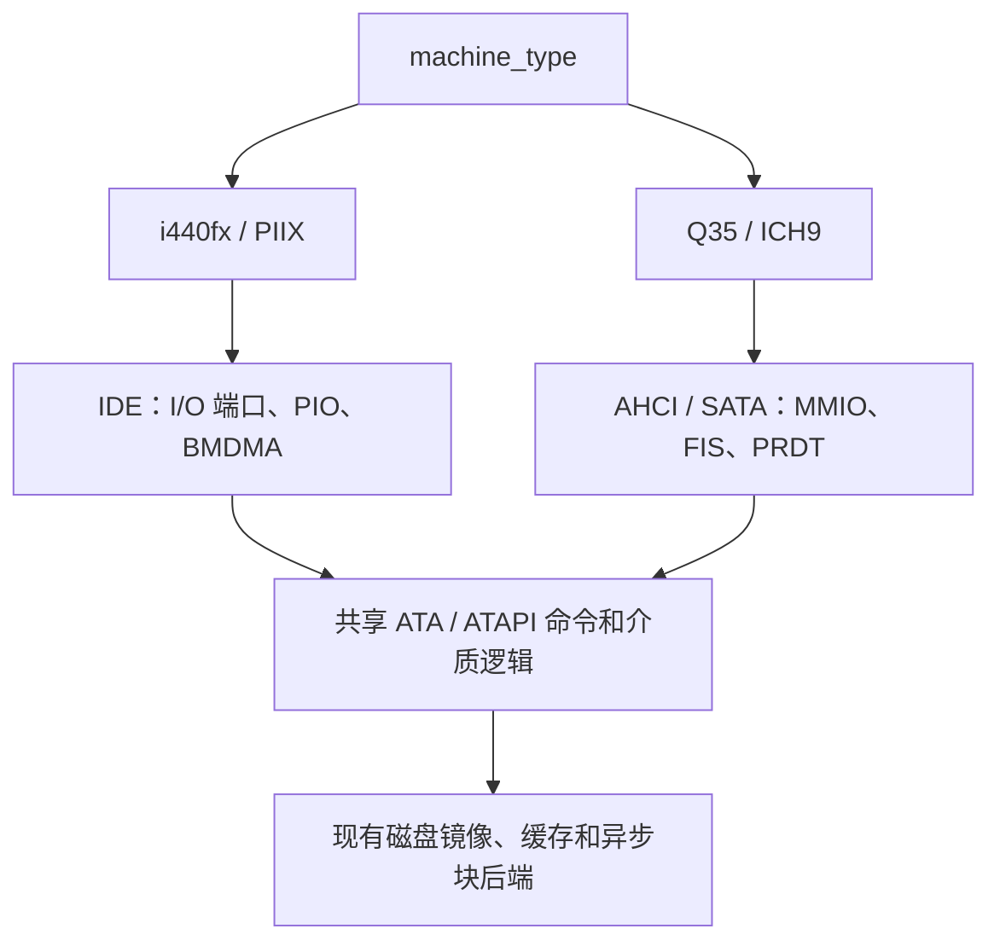

# Q35 AHCI SATA 实施计划

状态：P0–P6 已全部实现，并通过下文“实施状态”所列验收（P6 的 1–7 项：高地址 DMA、MSI、
NCQ、SATA 热插拔、PCIe Root Port 与多总线拓扑、链路电源管理/HPET/SMBus/TCO、SMM）。此后
补齐了长模式下的 SMI（64 位保存布局）、本地 APIC 的 SMI 投递和 TSEG，并用 Windows 8.1 x64
验证了 Q35/AHCI（见“Windows 验证”）。

本计划基于 2026 年 10 月 3 日审查的当前 v86 分支。目标是增加
`machine_type: "i440fx" | "q35"`：默认保留现有 i440FX 行为；选择 Q35 时自动创建
Q35 MCH、ICH9 LPC 和 AHCI 控制器，将现有硬盘与光驱配置连接到 SATA 端口。
文中引用的固件与参考实现行为已对照 SeaBIOS rel-1.16.2 和 QEMU 9.2.0 源码核实。

首个完整交付版本应支持 SATA 硬盘和 SATA ATAPI 光驱的系统安装、启动、读写、
复位及快照恢复。它是逐步对齐 QEMU Q35 平台的基础版本，不代表一次实现完整
Q35 芯片组、PCIe 生态或 QEMU 的全部能力。

## 实施状态

P0–P5 的实现：

| 部分 | 代码 |
| --- | --- |
| 机器描述、选项与入口 | [`src/platform.js`](../src/platform.js)、[`src/cpu.js`](../src/cpu.js)、[`src/browser/`](../src/browser/)、[`v86.d.ts`](../v86.d.ts) |
| PCI 配置访问、ECAM、命令寄存器、INTx | [`src/pci.js`](../src/pci.js) |
| 精确子区间 MMIO | [`src/io.js`](../src/io.js)（`mmap_register_range`） |
| Q35 MCH、ICH9 LPC、RCBA、PIRQ 路由 | [`src/q35.js`](../src/q35.js) |
| ICH9 PM、Q35 的 DSDT/FADT/MCFG | [`src/acpi.js`](../src/acpi.js)、[`src/acpi_tables.js`](../src/acpi_tables.js) |
| 只驱动 IOAPIC 的 GSI 16–23 | [`src/rust/cpu/cpu.rs`](../src/rust/cpu/cpu.rs)（`ioapic_raise_irq/ioapic_lower_irq`） |
| IDE 传输接口、共享设备语义修正 | [`src/ide.js`](../src/ide.js) |
| AHCI 控制器与端口 | [`src/ahci.js`](../src/ahci.js) |

验收命令：`make q35-tests`（`acpi-table-tests`、`q35-device-tests`、`q35-guest-tests`），
发布门级别 `R-q35`。覆盖内容：

- [`tests/devices/ahci.js`](../tests/devices/ahci.js)：不运行客体代码，直接编程寄存器和命令表，
  覆盖存在性与签名、初始 D2H FIS、PIO/DMA/ATAPI 命令、多段 PRDT、LBA48、错误完成与恢复、
  中断、COMRESET、HBA reset、软件复位、MSE/BME、字节访问和快照。
- [`tests/devices/ahci_lifecycle.mjs`](../tests/devices/ahci_lifecycle.mjs)：延迟 100ms 的异步
  后端下，读写在途时的复位、清 ST、快照、S5，以及写入在后端完成后才报告完成。
- [`tests/devices/q35_guest.js`](../tests/devices/q35_guest.js)：SeaBIOS 从 SATA 光驱启动
  linux4.iso（IOAPIC 模式，ahci 在 GSI 16），读写 hda 后在主机侧比对、快照恢复、经 FADT
  复位寄存器重启后数据仍在、S5；MS-DOS 6.22 以实模式 int13h 从 SATA 硬盘干净启动，加载
  EMM386 后在虚拟 8086 模式下经 SMM 读盘（P6.7 之前这里按预期失败）；buildroot 直接启动
  内核验证 PIC 模式、ECAM 与 PIRQ 链接设备。
- [`tests/devices/acpi_tables.js`](../tests/devices/acpi_tables.js)：Q35 的表内容，iasl 反汇编后
  逐字节重编译，acpiexec 执行 `_PIC`、GSI/PIRQ 链接设备方法。

实现中发现并按计划之外处理的问题：

- QEMU 9.2 在命令出错时只置 TFES、不置 DHRS。v86 按 AHCI 规范两者都置（D2H FIS 带 I 位），
  否则 SeaBIOS 1.16.2 会等到 32 秒超时；出错命令保留在 PxCI 中，端口停止处理直到清除 ST。
- 同步的 `save_state` 路径不等待在途 I/O，恢复快照时也不取消旧机器的在途 I/O。现在保存会
  先等在途 I/O 完成，IDE 设备在恢复时取消旧 I/O，对 IDE 和 AHCI 都有效。
- IDENTIFY 的 word 49 一直没有声明 DMA，libata 因此把 SATA 设备配置成 PIO。SATA 传输现在
  声明 DMA、PIO 3/4 和 UDMA 0–5（选中 UDMA5），IDE 保持不变。
- `tests/api/state.js` 自提交 `2a5733f5` 加入 `vram_size` 上限（256 MiB）后一直失败（测试仍用
  512 MiB）；测试已改为上限值 256 MiB（`MAX_VRAM_SIZE`），现在通过。

尚未处理：VGA ROM 仍固定在 `0xFEB00000`（实测 SeaBIOS 在 Q35 上把 ABAR 分到 `0xFEBF0000`，
未与之重叠）；Q35 的 S3/S4 仍未声明；P6 各项见文末。

P6 已完成的项：

| 项 | 实现 | 验证 |
| --- | --- | --- |
| 1 高地址 DMA | CAP.S64A；CLBU、FBU、CTBAU、DBAU 参与寻址（36 位物理地址之外按越界失败） | `ahci.js`：`high_memory_size` 下命令列表、接收 FIS、命令表和数据都在 4 GiB 以上；Linux 报告 `flags: 64bit` |
| 2 MSI | 能力在 0x80（ICH9 的位置），64 位地址、1 条消息；Rust `apic_msi` 投递到本地 APIC；启用 MSI 时释放 INTA，关闭时按电平恢复 INTA | `ahci.js`：能力寄存器、向量到达 IRR、INTx 切换；Linux 使用 `PCI-MSI ... ahci`，`pci=nomsi` 时经 GSI 16 |
| 3 NCQ | CAP.SNCQ，IDENTIFY word 75/76 声明 32 深度，word 84/87 声明 GPL；READ/WRITE FPDMA QUEUED 受理即清 PxCI、发不带 I 位的 D2H FIS，多条同时在途，各自完成时发 SDB FIS 清 PxSACT 并置 SDBS；非排队命令（含 FLUSH CACHE）等排队命令全部完成；出错时发带 ERR 的 SDB FIS（TFES）、中止设备上全部排队命令、在读取日志前拒绝新的排队命令；READ LOG EXT 支持日志目录（00h）和 NCQ 错误日志（10h，含校验和，读后清除）；清 ST、COMRESET 丢弃在途排队命令；快照等待它们完成 | `ahci.js`：SDB FIS 内容、tag、错误日志、恢复流程、PRDT 溢出、ATAPI 拒绝；`ahci_lifecycle.mjs`：四条读同时在途、排队写入落盘后才完成、FLUSH 顺序、清 ST、快照；`q35_guest.js`：硬盘换成请求乱序完成的异步后端，Linux 报告 `NCQ (depth 31/32)`，并行读校验一致；临时让镜像“变短”制造 IDNF，Linux 经日志页 10h 定位失败的 tag（`res 41/10:...`、`Emask 0x481`），不复位链路，之后读取恢复 |

| 4 SATA 热插拔 | `V86.attach_sata_drive(port, image, { cdrom })` / `detach_sata_drive(port)`（CPU worker 经 RPC 转发），底层 `AHCIController.attach/detach`；插入时置 PxSERR.DIAG.X 和 DIAG.N（PCS、PRCS 由它们派生，只能经清 PxSERR 清除），链路建立并发送签名 D2H FIS；拔出时置 DIAG.N、链路断开、PxTFD 7Fh，已发出的命令保留到软件停止端口，在途读取丢弃、已交给后端的写入照常落盘；开机无盘的端口置 PxCMD.HPCP；端口 2 的光驱随插拔更新 `cpu.devices.cdrom`；快照恢复时若某端口只在快照或只在当前机器有驱动器，恢复后的来宾看到一次拔出或插入 | `ahci.js`：HPCP、PCS/PRCS 与 INTA、插拔后的寄存器、端口 2 光驱、快照两侧不一致；`ahci_lifecycle.mjs`：排队读写在途时拔盘，读取丢弃、写入落盘，重新插入后可用；`q35_guest.js`：Linux 插入后 `connection status changed`、`ata4.00 ... NCQ`、sdb 读出镜像，带热插拔盘的快照恢复，拔出后 `ata4: SATA link down`、sdb 消失 |
| 5 PCIe Root Port、桥后设备、多总线 | 选项 `pcie_root_ports`（0–6，仅 Q35）在 00:1c.0 起创建 ICH9 PCI Express Root Port（8086:2940 起，[`src/pcie_root_port.js`](../src/pcie_root_port.js)）：Type 1 头部，PCIe 能力为 Root Port（x1、2.5 GT/s、无热插拔，有设备时 PDS/DLLLA 置位），MSI、SSVID、PM 能力，4 KiB 配置空间无扩展能力。PCI 核心（[`src/pci.js`](../src/pci.js)）：桥后功能的 `pci_id` 按机器构建时的物理总线编号，客体看到的总线号由它写进桥的 secondary/subordinate 决定，CF8 和 ECAM 的配置访问都按此路由（PCIe 下游端口只转发 device 0）；Type 1 头部的可写位、窗口与桥控制；桥的 I/O、内存（含 64 位可预取）窗口及命令位决定是否转发到桥后（`upstream_forwards_memory/io`、`memory_decoded`），桥的总线主控决定 DMA 和 MSI 能否上行（`is_bus_master`），桥后 I/O BAR 由核心按窗口映射，桥变化时通知 `on_upstream_change`；INTx 按 PCI-to-PCI 桥交织到总线 0 的桥，再按芯片组路由。virtio_devices 描述符可用 `pcie_root_port` 放到某个 Root Port 后；AHCI 与 virtio 遵守上游转发 | `pcie_root_port.js`：头部与能力、只读位、总线号路由（含改号、重叠、仅 device 0、ECAM）、内存窗口/可预取窗口/命令位、桥 BME 对 DMA 和 MSI 的影响、INTx 交织、I/O 窗口对 virtio I/O BAR 的映射、快照；`q35_guest.js` 的 `intx`：linux4 在 `pci=nomsi` 下驱动 Root Port 1 后的第二个 AHCI（`ahci 0000:02:00.0`），读盘一致，与 00:1f.2 共用 GSI 16；`pcie`：Linux 6.8 识别 3 个 `PCIe Root Port`，SeaBIOS 分配的总线与窗口，Root Port 2 后的 virtio-rng 经 I/O 窗口读出 `/dev/hwrng` |
| 6a 链路电源管理 | CAP 声明 SALP、SSC、PSC；PxCMD.ICC 请求 Active/Partial/Slumber（立即完成，读回 0；有命令执行时不进低功耗）；ALPE 置位后端口空闲（PxCI、PxSACT 为 0，无在途命令）即进入 Partial，ASP 时进入 Slumber；发命令时唤醒；PxSCTL.IPM 可禁止 Partial/Slumber；状态反映在 PxSSTS.IPM；没有真实链路，转换不引起 PhyRdy 变化（不置 DIAG.N）；IDENTIFY word 76 bit 9 声明主机发起的电源管理 | `ahci.js`：CAP 位、ICC 请求、IPM 限制、命令唤醒、ALPE/ASP；`q35_guest.js`：Linux 设 `min_power` 后 PxCMD 为 ALPE+ASP，空闲时 Slumber，读盘唤醒且数据正确，切回 `max_performance` 后 Active，无 libata 错误 |
| 6b HPET | 选项 `hpet`（仅 Q35，默认关闭），[`src/hpet.js`](../src/hpet.js)：0xFED00000 的 1 KiB（与 RCBA 同一 128 KiB 块，用精确子区间注册），GCAP_ID 0x8086A201、周期 69841279 fs（14.31818 MHz），64 位主计数器由机器时钟推算；3 个定时器，单次/周期、32/64 位、边沿/电平，比较器与周期寄存器按 QEMU 语义（64 位定时器的 Tn_VAL_SET 在写完高半部分后清除）；路由：FSB(MSI)、传统替换（定时器 0→IRQ0、1→IRQ8，此时 PIT 和 RTC 不再驱动这两条线）、IOAPIC 20–23（与 ICH9 相同）；FSB 优先于传统替换（与 QEMU 相同：Windows 同时置 LEG_RT_CNF 和定时器 0 的 Tn_FSB_EN，从 FSB 消息取时钟中断，向量 0xD1；原先传统替换优先时，Windows 8.1 在启动约 15 秒处等时钟中断而卡死）；ACPI HPET 表与 DSDT 中 LPC 下的 PNP0103 设备，RCBA HPTC 置 0x80；复位与快照（槽位 102） | `hpet.js`：能力寄存器、计数器的启停与写入、32 位单次、周期与错过周期合并、64 位周期两半写入、传统替换与 PIT/RTC 断开、电平触发与 GINTR_STA、FSB 消息、传统替换下定时器 0 的 FSB 消息、ACPI 表与 DSDT、快照；Windows 8.1 x64 以 HPET 为时钟启动到桌面（见“Windows 验证”）；`acpi_tables.js`：HPET 表字段与 iasl 往返；`q35_guest.js`：Linux 6.8 与 4.16 都通过 ACPI 表找到 HPET（`hpet clockevent registered`、`3 comparators, 64-bit 14.318180 MHz counter`），传统替换模式下 IRQ0 由 HPET 产生，切换到 `hpet` 时钟源后 `sleep 2` 计得约 2 s |
| 6c SMBus | 选项 `smbus`（仅 Q35，默认关闭以保持机器的设备组成；Windows 8.1 用自带 INF 识别它），[`src/smbus.js`](../src/smbus.js)：00:1f.3（8086:2930，INTA），I/O BAR4 由设备自己解码（PCI 核心新增“带 `on_move` 的 I/O BAR”：SeaBIOS 把它固定放在 PMBASE+0x100=0x700，低于核心为传统端口保留的 0x1000），HOSTC.HST_EN 且非 I2C_EN 时解码；主机接口按 ICH9 手册与 QEMU `pm_smbus.c`：quick、byte、byte data、word data、process call、block（E32B 32 字节缓冲，或 BYTE_DONE 逐字节，LAST_BYTE 结束）、I2C 块读，KILL、INUSE_STS，INTREN 时完成拉 INTA；总线上 0x50–0x57 八个 256 字节 EEPROM（与 QEMU 一致，内容全零；块写按 QEMU 存入计数和数据）；快照（槽位 104） | `smbus.js`：PCI 头与解码条件、各类命令与 NACK、E32B 块读写、逐字节块读写（与 Linux i801 的握手顺序相同）、I2C 块读、KILL 与未清错误、INTA 经 D31IR 到 GSI 16、快照；`q35_guest.js` 的 `pic`：sysfs 显示 00:1f.3 的 BAR4 为 0x700–0x71F，来宾经 `/dev/port` 向 0x50 写字节并读回 |
| 6d TCO 看门狗 | [`src/ich9_tco.js`](../src/ich9_tco.js)，由 ICH9 PM 块 0x60–0x7F 转发：TCO_RLD/TMR/STS/CNT 等寄存器，0.6 s 一拍；默认不运行，写 TCO_RLD 或清 TCO_TMR_HLT 后开始；第一次超时置 TCO1_STS.TIMEOUT，SMI_EN.TCO_EN 置位时置 SMI_STS.TCO_STS 并产生 SMI，第二次超时置 SECOND_TO_STS、BOOT_STS，若 RCBA GCS.NO_REBOOT 已清零则复位机器；写 TCO_RLD 重装并重新计数超时；状态寄存器写 1 清零（与硬件相同，QEMU 为直接写入）；TCO_LOCK 粘滞；复位与快照 | `ich9_tco.js`：默认值与不运行、装载与剩余拍数、两次超时与 NO_REBOOT、喂狗、清 NO_REBOOT 后复位、TMR_HLT、TCO_LOCK、快照 |
| 7 SMM | [`src/rust/cpu/smm.rs`](../src/rust/cpu/smm.rs)：SMI 时把状态按 QEMU `smm_helper.c` 的布局存到 SMBASE+0xFE00——传统 CPU 档位用 32 位布局（修订号 0x20000），x86-64 档位在任何模式下都用 64 位布局（0x20064，与 AMD64/Intel 64 处理器相同；长模式下的 SMI 也走它；传统档位下来宾若违规进入长模式，同样改用 64 位布局，`smm_state` 第 2 位记下所用布局供 RSM 读取），均支持 SMBASE 重定位；在 SMBASE+0x8000 以实模式、4 GiB 段界限、IF=0、NMI 屏蔽、无分页进入处理程序（64 位布局时 EFER 清零）；RSM（0F AA，SMM 外 #UD；32 位路径标为块边界，64 位解码器也支持）恢复全部状态（64 位布局另含 EFER、RIP、R8–R15、段与描述符表的 64 位基址；EFER.LMA 由 LME、CR0.PG 和 CR4.PAE 推出，CS.L 只在长模式下生效）和新的 SMBASE；SMI 来源：ICH9 的 APM 控制端口 0xB2（SMI_EN.APMC_EN）送给执行该端口写入的核（并行模式下是发出这次 I/O 的 worker 核），TCO 送给 BSP（与 QEMU 相同），以及本地 APIC 的 SMI 消息（ICR、MSI、IOAPIC 表项的投递模式 2）；每核一个 SMI 锁存（[`src/rust/cpu/apic.rs`](../src/rust/cpu/apic.rs) 的 `SMI_PENDING`），`handle_irqs` 在 NMI 之前取它，SMM 中到来的 SMI 等到 RSM 之后进入，能唤醒 HLT 中的核，INIT 清除它，随机器核状态进入快照；长模式指令执行期间到来的 SMI 在该指令结束后进入（与外部中断相同）；每核状态 `smm_state`、`smbase` 进入生成的状态布局（独立的新范围，旧快照恢复为复位值 0x30000；INIT 保留 SMBASE）；SMRAM：0xA0000–0xBFFFF 仍是映射区，仅在非内联的映射区读写路径里判断——当前核在 SMM 且 G_SMRAME，或 D_OPEN 时访问内存，否则仍是 VGA，因此 RAM 快路径和 VGA 都没有额外开销；TSEG：MCH ESMRAMC 的 T_EN 与 TSEG_SZ（1、2、8 MiB，或 QEMU 的扩展 TSEG：配置寄存器 0x50 写入 0xFFFF 后读回 16，即 16 MiB）在 G_SMRAME 时把 4 GiB 以下内存的顶端划为 TSEG，SMM 中是内存，SMM 外读全 1、写丢弃（32 位路径把它当作映射区，x64 物理总线把它解码成同样的空洞；快速 RAM 上限降到 TSEG 之下，变化时换新的总线 generation、刷新 TLB，worker 在下一时间片同步），D_LCK 之后 ESMRAMC 只读；MCH SMRAM 寄存器的 G_SMRAME/D_OPEN/D_LCK 语义（[`src/q35.js`](../src/q35.js)）；APM 状态端口 0xB3 在 Q35 上可读写（i440FX 仍读 0，否则 SeaBIOS 的 PIIX4 SMM 握手会死等） | `smm.js`：SeaBIOS 的 SMM 初始化（SMBASE 重定位到 0xA0000、SMRAM 以 G_SMRAME 关闭、SMRAM 中是 entry_smi）、32 位保存区布局、D_OPEN 与 SMM 中的可见性、测试自己的 RSM 处理程序返回后状态原样、SMM 中的 SMI 被锁存并在 RSM 后进入、本地 APIC 自发 IPI 与 MSI 产生的 SMI、在 SMM 中（带锁存的 SMI）保存与恢复快照、ESMRAMC 与扩展 TSEG、TSEG 在 SMM 内外的可见性（含跨边界访问）、快照、D_LCK；x86-64 档位下 SeaBIOS 用 64 位保存区完成 SMM 初始化和 call32_smm 引导，SMI/RSM 往返保留 64 位寄存器和处理程序的修改；[`tests/x64/smm_long_mode.mjs`](../tests/x64/smm_long_mode.mjs)：64 位代码经本地 APIC 给自己发 SMI，处理程序第一次运行时在 SMM 中再发一次（锁存到 RSM 之后），复制并修改保存区，测试核对 64 位布局的各字段（RIP、RAX、R8、R15、RSP、RFLAGS、EFER、CR0/3/4、CS/SS 的选择子与属性含 L/D/G、GDTR、TR），RSM 后长模式继续，寄存器是处理程序修改后的值（解释器、页面层 JIT 都通过）；`apic_routing.mjs`：投递模式 2 的 IPI 锁存为 SMI 而不进 IRR；`ich9_tco.js`：TCO_EN 时超时产生 SMI；`q35_guest.js` 的 `dos`：MS-DOS 6.22 加载 EMM386 后引导到 `C:\>` 并执行 `DIR`，其中 113 次 SMI 来自虚拟 8086 模式 |

SMM 的限制：高端 SMRAM（H_SMRAME，0xFEDA0000 处的别名）和 D_CLS 未实现；保存区的自动
HALT 重启与 I/O 指令重启字段未实现（HLT 中到来的 SMI 在 RSM 后从 HLT 之后继续，与 QEMU
相同）。SeaBIOS 只为 BSP 重定位 SMBASE，AP 收到 SMI 会进入默认 SMBASE 0x30000 处的内容
（与 QEMU 加 SeaBIOS 相同，只有为每个核重定位 SMBASE 的固件才会给 AP 发 SMI）。SeaBIOS
置位 HaveSmmCall32 后，所有 16 位 int13h 都经 call32_smm（每次两次 SMI），实模式 DOS 的
磁盘访问因此也走 SMM。

Windows 验证（[`tests/x64/windows_boot.mjs`](../tests/x64/windows_boot.mjs)，Windows 8.1 x64
镜像以只读方式打开，来宾写入都留在内存 overlay；新增 `WIN_MACHINE=q35`、`WIN_HPET=1`、
`WIN_ROOT_PORTS=<n>`、`WIN_SMBUS=1`）：该镜像在 IDE 上安装，`storahci` 未启用，直接在 Q35 上
启动会 INACCESSIBLE_BOOT_DEVICE。先在 i440FX 上以管理员把 `storahci` 的 Start 设为 0 并删除
StartOverride，关机保存 overlay；之后在 Q35 上从 AHCI 启动，110 秒到桌面，64 位与 WOW64
探针全部通过（结果写到 AHCI 端口 1 上的工具盘）。再打开 HPET、2 个根端口和 SMBus，121 秒
到桌面；Windows 的 PnP 列表里 MCH（29C0）、ICH9 LPC（2918）、AHCI（2922，两块硬盘和光驱）、
HPET（PNP0103）、PCI Express Root Complex、两个根端口（2940、2942）、ICH9 SMBus（2930）的
ConfigManagerErrorCode 都是 0，只有 NE2000 网卡为 28（Windows 8.1 没有自带驱动，与 Q35 无关）。
这一轮发现了 HPET 中 FSB 与传统替换路由的优先级问题（见 6b）。

实现 P6 时发现并修复的平台问题：

- x64 扩展内存的 aperture 原先放在 0xFED00000–0xFEDFFFFF（注释认为 IOAPIC 与 LAPIC 之间未被使用），
  正好遮住 Q35 的 HPET 和 RCBA：来宾在非长模式下读到全 1，长模式下读到扩展内存页。RCBA 因此
  自 P2 起对来宾一直不可达（SeaBIOS 和测试过的 Linux 都没有读它，所以没暴露）。aperture 已移到
  0xFEF00000（LAPIC 之上、BIOS 之下，两种机型都未使用）；`tests/x64/extended_memory.mjs` 通过，
  `q35_guest.js` 的 `pic` 部分用 `devmem` 从来宾读 RCBA 的 GCS 和 D28IR。
- 机型记录原先放在 `state[99]`，而流式快照（`save_state_stream`）把 `state[99]` 用作扩展内存
  位图，Q35 的流式快照因此会被当成 i440FX 而拒绝恢复。机型记录改到 `state[103]`；`ahci.js`
  增加了 Q35 流式快照的保存与恢复测试。

NCQ 与 QEMU 的差异：QEMU 出错时只置 TFES；v86 的 SDB FIS 带 I 位，按规范同时置 SDBS 和 TFES
（Linux 只看 TFES）。QEMU 没有实现 NCQ 错误日志的读取（READ LOG EXT 10h），v86 实现了，
Linux 的 NCQ 错误恢复因此能定位失败的命令而不必复位。QEMU 的 AHCI 没有热插拔事件
（不置 HPCP、不产生 PCS/PRCS），这一项按 AHCI 1.3.1 和 Linux libahci 的处理实现。

Root Port 的范围与限制：没有 PCIe 原生热插拔（slot 能力不声明热插拔）、PME、AER 和 ASPM；
DSDT 没有 `_OSC`，Linux 因此不使用这些原生服务，pcieport 只做枚举。桥控制的 secondary bus
reset 位可写但不复位桥后设备；VGA enable 不起作用（显卡在总线 0）。内置设备（网卡、9p 等）
仍在总线 0，目前只有 virtio_devices 描述符和测试用的第二个 AHCI 能放到 Root Port 后。

## 配置契约

建议保持现有镜像配置接口：

```js
new V86({
    machine_type: "q35", // "i440fx" | "q35"，默认 "i440fx"
    hda: { url: "disk.img", async: true },
    cdrom: { url: "installer.iso" },
    // 其余选项保持现有用法
});
```

| 配置 | 平台 | 默认存储连接 |
| --- | --- | --- |
| 未填写或 `"i440fx"` | 保留当前 i440FX/PIIX 行为 | IDE 硬盘与 ATAPI 光驱 |
| `"q35"` | Q35 MCH 与 ICH9 LPC | AHCI 控制器连接 SATA 硬盘与 SATA ATAPI 光驱 |

- Q35 提供 6 个 SATA 端口，固定 `hda → port 0`、`hdb → port 1`、`cdrom → port 2`，与 QEMU
  的 `-hda/-hdb/-cdrom` 一致。省略前面的磁盘不改变后面设备的端口号：未提供 `hda` 时
  `hdb` 仍接在 port 1，而现有 IDE 在这种配置下会忽略 `hdb`。
- port 2 始终连接 SATA ATAPI 光驱，未提供 `cdrom` 时为空托盘，与现有 IDE 总是创建空光驱
  一致。`set_cdrom/eject_cdrom` 通过 ATAPI 介质事件换盘，不依赖 SATA 热插拔。没有磁盘的
  port 0/1 以及 port 3–5 返回正确的未连接状态。
- SATA 每个端口连接一个设备，不使用 IDE 的 master/slave。
- 不增加必须手动设置的 `ahci: true` 或 `sata: true` 开关；机器型号决定默认控制器。
- Q35 首版默认启用 ACPI，并对显式 `acpi: false` 给出不支持的配置错误：v86 在
  `acpi: false` 时既不创建 PM 功能也不启用 IOAPIC，而 SeaBIOS 自带的后备 DSDT 只有
  i440FX 版本。i440FX 的 ACPI 默认行为保持不变。
- 非法 `machine_type` 在初始化时明确报错。
- `qemu_compatible` 保留现有 i440FX 兼容语义。Q35 使用自己的设备布局，不能因该选项
  又套用 i440FX 地址；Q35 下该选项对设备名称及 subsystem identity 的作用需单独定义。
- 快照记录机器型号与设备布局版本。旧快照缺少型号时按 i440FX 解释，拒绝跨型号直接恢复。
- Q35 面向带 AHCI 驱动的客体。依赖 vm86 下 int13h 访问磁盘的客体（DOS + EMM386/QEMM、
  Windows 3.x 增强模式、Windows 9x 的兼容模式磁盘访问）在 P6.7 实现 SMM 之后可以经
  SeaBIOS 的 `call32_smm` 使用 AHCI 磁盘服务（见 P2 固件部分的更新说明）；每次磁盘调用
  要经两次 SMI，比 i440FX 的 IDE 慢，这类客体仍建议使用 i440FX。

Q35、AHCI、SATA 属于不同层次：Q35/ICH9 定义平台，AHCI 定义操作系统访问存储控制器的
接口，SATA 定义控制器与设备之间的协议。模拟器需要实现客体可见的寄存器、FIS
（Frame Information Structure）、命令和设备状态，无需模拟串行电气信号或逐周期物理链路。

## 当前代码基础

| 代码入口 | 当前情况 | 计划中的处理 |
| --- | --- | --- |
| [`src/platform.js`](../src/platform.js) | 已集中描述部分设备位置、资源和 CPU 拓扑 | 增加机器型号、芯片组资源、ECAM、IRQ 与存储配置 |
| [`src/pci.js`](../src/pci.js) | 硬编码 i440FX/PIIX，配置空间为 256B，设备表和快照围绕 bus 0；部分写路径有缺陷（见 P1） | 抽离芯片组，统一 BDF 配置访问，增加 ECAM 与可扩展设备表 |
| [`src/rust/cpu/cpu.rs`](../src/rust/cpu/cpu.rs) | `device_raise_irq` 同时驱动 PIC 与 IOAPIC 的同号引脚 | 增加只驱动 IOAPIC 的共享电平输入（GSI 16–23） |
| [`src/io.js`](../src/io.js) 与 [`src/const.js`](../src/const.js) | MMIO 注册按 128KiB 粒度对齐 | 增加精确子区间映射、迁移和解除映射 |
| [`src/virtio.js`](../src/virtio.js) 与 [`src/virtio_devices.js`](../src/virtio_devices.js) | MMIO BAR 放大到 128KiB；插件在 0x10–0x1F 号槽中自动分配 | 现有 BAR 保持不变；Q35 下预留 `00:1f.*` |
| [`src/graphics_adapters/vga_core.js`](../src/graphics_adapters/vga_core.js) | LFB 默认 `0xE0000000`；ROM 固定在 `0xFEB00000` 并忽略 BAR 写入 | ROM 改为跟随固件分配，或登记为固定资源 |
| [`src/acpi.js`](../src/acpi.js) 与 [`src/acpi_tables.js`](../src/acpi_tables.js) | PIIX4 PM 和对应 ACPI 表，尚无 MCFG | 复用公共电源逻辑，新增 ICH9 布局与 Q35 表描述 |
| [`src/cpu.js`](../src/cpu.js) | 初始化、复位和快照包含 IDE 专用分支 | 按机器选择设备，校验并保存对应控制器状态 |
| [`src/browser/`](../src/browser/) | Worker 选项转发表固定；镜像导出、下载和磁盘统计直接访问 `devices.ide` | 转发 `machine_type`，改走统一存储接口 |
| [`src/ide.js`](../src/ide.js) | ATA/ATAPI 语义与 IDE 通道、PIO、BMDMA 混合 | 抽出传输接口，ATA/ATAPI 语义由 IDE 与 AHCI 共用（见 P3） |
| [`src/buffer.js`](../src/buffer.js) 与 [`src/state_io.js`](../src/state_io.js) | 已有磁盘后端、缓存与在途 I/O 跟踪 | 复用并补齐错误、取消与 flush 适配 |
| [`bios/seabios.config`](../bios/seabios.config) | 已启用 `CONFIG_AHCI=y`、`CONFIG_USE_SMM=y`、`CONFIG_CALL32_SMM=y` | 以现有 SeaBIOS 为第一轮验证基础 |
| [`bios/fetch-and-build-seabios.sh`](../bios/fetch-and-build-seabios.sh) | 固定 SeaBIOS `rel-1.16.2` | 针对固定版本审计 Q35 初始化路径 |

当前分支已有支持跨页、高内存与地址校验的物理访问接口，以及 LBA48 和稀疏大磁盘测试。
这些能力应直接复用，避免新增控制器退回仅支持低地址或小磁盘的实现。

## 架构与实施顺序



| 阶段 | 交付内容 | 依赖与完成条件 |
| --- | --- | --- |
| P0 | 配置契约与机器描述 | 默认 i440FX 行为不变，选项贯穿所有入口 |
| P1 | PCI 配置访问与精确 MMIO 映射 | 为 Q35 和 AHCI 提供公共基础；旧设备回归通过 |
| P2 | Q35/ICH9、固件、ACPI、中断 | 依赖 P1；可先用软盘或直接内核启动完成枚举、资源描述和中断验证 |
| P3 | 共享 ATA/ATAPI 与块后端接口 | 可与 P1/P2 并行；IDE 行为和测试保持通过 |
| P4 | AHCI/SATA 控制器及硬盘、光驱 | 依赖 P1/P3；可先通过测试内部挂接在 i440FX 上联调，再与 P2 集成；实现真实 BIOS 启动 |
| P5 | 数据完整性、复位、快照和客体验证 | 是发布条件；生命周期接口应在前面阶段就设计好 |
| P6 | 高地址 DMA、MSI、NCQ、热插拔和完整平台扩展 | 基础版本通过后，逐项实现并开放对应能力 |

AHCI 控制器不依赖 Q35 芯片组：SeaBIOS 按 class `01:06:01` 查找控制器，QEMU 的 pc 机型也能
挂接 ICH9 AHCI。因此 P4 可以先在 i440FX 上联调，不必等待 P2。这种挂接只供测试内部使用，
不是公开选项，与“机器型号决定默认控制器”并不冲突。

## P0 配置与机器描述

扩展 `create_platform`，让设备 BDF、ECAM、RAM/PCI 内存区域、IRQ 路由、PM 资源与存储类型
来自同一份描述。避免在各设备中散落对 `machine_type` 的判断。

选项需要贯穿 [`v86.d.ts`](../v86.d.ts)、[`src/browser/starter.js`](../src/browser/starter.js)、
[`src/browser/cpu_worker.js`](../src/browser/cpu_worker.js)（其选项转发表需加入
`machine_type`）和 CPU 初始化；同时覆盖浏览器及 Node 入口。新模块加入
[`Makefile`](../Makefile) 的构建输入。以下入口目前直接访问 `devices.ide`，需改走统一存储
接口：[`cpu_worker_runtime.js`](../src/browser/cpu_worker_runtime.js) 的镜像导出、
[`main.js`](../src/browser/main.js) 的镜像下载按钮和
[`performance_recorder.js`](../src/browser/performance_recorder.js) 的磁盘统计。

将芯片组创建与通用 PCI 总线逻辑分开，CPU 按平台创建 IDE 或 AHCI，并通过统一介质接口
提供光驱操作。机器描述同时向固件、ACPI 表和设备实现提供资源信息，其中包括：

- Q35 的槽位布局：`00:1f.*` 保留给 ICH9。`pci_functions` 目前只有两种 i440FX 布局，
  需要增加 Q35 下显卡、网卡等设备的位置。
- virtio 插件在 0x10–0x1F 号槽中自动分配（[`src/virtio_devices.js`](../src/virtio_devices.js)）。
  Q35 下必须跳过 0x1F，芯片组设备需在插件分配之前完成注册。
- 按机器型号生成的固定 I/O 范围表：ICH9 的 GPE0 并入 PM 区，不再使用 PIIX4 的 `0xAFE0`。
- Q35 下检查低端 RAM 结束于 `0xB0000000` 之下。当前低端 RAM 最多 2GiB，满足这一条件。

验收：未填写和显式填写 i440FX 的设备集合一致；Q35 的配置能够正确传入 Worker；
非法选项失败明确，Q35 不意外创建 IDE 控制器，插件设备不占用 0x1F 号槽。

## P1 PCI 与 MMIO 公共基础

统一配置访问为 `config_read/write(bdf, offset, size)`。BDF 包含总线号、设备号和功能号。
传统 `CF8/CFC` 与 ECAM 使用同一后端，支持按函数选择 256B 或 4KiB 配置空间；256B 的函数
经 ECAM 读取 `0x100` 以上时返回全一。设备表及快照改为可扩展的 BDF 集合；首版 Q35 可以先
只布置 root bus 上的设备。现有 i440FX 快照（包括站点分发的状态文件）必须继续按原格式恢复。

配置访问需要统一处理：

- 不存在函数的全一返回值、配置边界和 8/16/32 位访问。写入不存在的函数一律丢弃；目前
  `pci_write8/16` 会先访问 `undefined.buffer` 而抛出异常。
- 按字段实现只读、写一清零、保留位与设备回调，避免不同访问宽度语义不一致。
- `CF8` 读回写入的地址并检查 bit 31；目前读回的是“设备是否存在”。
- BAR 大小探测、重定位与解除映射。
- PCI Memory Enable、Bus Master Enable、INTx Disable 的实际效果。命令寄存器的 32 位写目前
  只记录日志、不保存数值，必须先修正，否则用 dword 写开启总线主控的客体将无法 DMA。
- 恢复快照后重新建立映射和中断状态。

当前 128KiB MMIO 粒度无法直接表示小型 AHCI BAR 和 16KiB ICH9 RCBA。建议保留粗粒度
快路径，在需要的块中加入按精确地址区间分发的处理器。每段映射具有明确 owner，支持迁移、
释放、空洞及跨边界访问；解除一个设备的映射不能清除同块其他设备。

新设备禁止通过扩大客体看到的 BAR 大小或向外取整覆盖整个 MMIO 块来绕过该问题。现有
virtio 已把 MMIO BAR 放大到 128KiB，这是已安装客体看到的布局：i440FX 下保持不变，
Q35 下暂时沿用。

VGA ROM 固定在 `0xFEB00000`，独占一个 128KiB 块，并忽略 ROM BAR 写入。SeaBIOS 从窗口
顶端向下分配 BAR，并不知道这块 ROM 不会移动；Q35 的 BAR 集合不同，无法保证其他 BAR 不会
落进这一块。需要让 ROM BAR 跟随固件分配，或把它登记为固定资源并检查重叠。

验收：CF8/CFC 与 ECAM 前 256B 一致；同一个粗块内两个设备独立工作；BAR 探测、迁移、
关闭解码、解除映射和快照恢复均正确；固定资源不与固件分配的 BAR 重叠；旧快照可以恢复。

## P2 Q35 ICH9 固件与 ACPI

建议使用以下核心拓扑：

| PCI 地址 | 设备 | 身份 |
| --- | --- | --- |
| `00:00.0` | Q35 MCH / Host Bridge | `8086:29c0` |
| `00:1f.0` | ICH9 LPC，包含电源管理功能 | `8086:2918` |
| `00:1f.2` | ICH9 AHCI | `8086:2922`，class `01:06:01` |

这对应 QEMU 的 Q35/ICH9 核心组织方式；AHCI 提供 6 个端口，主要寄存器位于 BAR5。
参考 [QEMU Q35 机器实现](https://github.com/qemu/qemu/blob/v9.2.0/hw/i386/pc_q35.c)
与 [ICH9 AHCI 实现](https://github.com/qemu/qemu/blob/v9.2.0/hw/ide/ich.c)。

### MCH 与内存布局

至少实现固件实际使用的 PCIEXBAR（config `0x60`）、ECAM、PAM（`0x90–0x96`）和
SMRAM（`0x9D`）行为，以及一致的 RAM/PCI hole。SeaBIOS 识别 Q35 后会设置 PCIEXBAR，此后
32 位代码的配置访问全部经 ECAM（16 位 PCI BIOS 仍走 `CF8/CFC`），因此必须一起实现设备
身份与对应行为，不能先换 ID 再等待后续补齐 ECAM。

SeaBIOS rel-1.16.2 把 ECAM 写死在 `0xB0000000`（256MiB），并从 `0xC0000000` 开始分配普通
PCI MMIO，平台只能与之匹配。平台的实际 RAM 映射、E820、ACPI `_CRS` 和 MCFG 必须一致；
较大 RAM 配置需要配套保留及重映射。当前 VGA LFB 默认使用 `0xE0000000`，不能在未协调
显存映射时把 ECAM 放在那里。

PAM0 必须像 i440FX 现有实现一样读出 `0x10`。SeaBIOS 的 `make_bios_writable` 据此判断
shadow RAM 中已有 BIOS；否则它会从 4GiB 以下的 BIOS 别名执行代码并复制自身，而 v86
不允许在那里执行代码。

参考 [SeaBIOS PCI 初始化](https://github.com/coreboot/seabios/blob/rel-1.16.2/src/fw/pciinit.c)
与 [Q35 常量](https://github.com/coreboot/seabios/blob/rel-1.16.2/src/fw/dev-q35.h)。

### ICH9 LPC 与中断

复用公共 PM 定时器、SCI、睡眠和共享 IRQ 逻辑，但为 ICH9 实现独立的寄存器布局：

- PMBASE 位于 PCI config `0x40`，PM 区域按 128B 对齐，长度为 128B。
- ACPI enable 位位于 config `0x44` bit 7，不能沿用 PIIX4 的 config `0x80`；bits 2:0 选择
  SCI，SeaBIOS 写 0，即 IRQ9。
- GPE0 位于 `PMBASE + 0x20`，长度为 16B，FADT 同步描述。
- SMI_EN 位于 `PMBASE + 0x30`。SeaBIOS 读它来判断是否跳过 SMM 初始化，随后写入 APMC_EN
  与 GLB_SMI_EN；它还会先按 16 位读、再按 32 位写回 GEN_PMCON_1（config `0xA0`）。没有
  SMM 时，这些寄存器只需保存数值。
- RCBA 位于 config `0xF0`，实现固件使用的映射及寄存器行为。SeaBIOS 写入 `0xFED1C000`
  并在 E820 中保留 16KiB，小于 MMIO 映射粒度，需要精确映射。
- PIRQA–D 路由寄存器位于 config `0x60–0x63`，PIRQE–H 位于 `0x68–0x6B`；bit 7 置位表示不
  路由到 PIC。
- ACPI enable/disable 命令值（QEMU 的 ICH9 用 `0x02/0x03`）、SCI、复位和睡眠行为按平台
  描述生成，并与 `0xB2` 的处理保持一致。

中断拓扑按 QEMU Q35：0–24 号槽的 INTA–D 按 `(slot + pin) % 4` 接到 PIRQE–H；25–31 号槽
（包括 `00:1f.2` 的 AHCI）的 INTA–D 依次接到 PIRQA–D。APIC 模式下 PIRQn 固定接 IOAPIC
GSI 16+n；PIC 模式下按路由寄存器接到 ISA IRQ。这些规则适用于所有 PCI 功能，统一在
`PCI.get_irq_line` 中实现，不只针对 AHCI。

当前的 `device_raise_irq(i)` 同时驱动 PIC 和 IOAPIC 的第 i 号引脚，`set_shared_irq_level`
也经由它实现，表达不了“PIC 走 PIRQ 路由、IOAPIC 走 16+n”。需要新增只驱动 IOAPIC 的共享
电平输入；现有 24 项的 `shared_irq_sources` 及其快照可以直接覆盖引脚 16–23。PIC 路径可以
继续用现有的共享电平逻辑，IOAPIC 同号 ISA 引脚会随之变化，QEMU 的 ICH9 也是这样。

Q35 不再创建独立的 PIIX4 PM PCI function。参考
[QEMU ICH9 定义](https://github.com/qemu/qemu/blob/v9.2.0/include/hw/southbridge/ich9.h)
与 [ICH9 LPC 实现](https://github.com/qemu/qemu/blob/v9.2.0/hw/isa/lpc_ich9.c)。

### ACPI 与固件

继续使用现有 fw_cfg 与 `etc/table-loader` 交付 ACPI 表。增加 MCFG，将根节点描述为
`PNP0A08` 并提供 `PNP0A03` 兼容 ID，更新 `_SEG`、`_BBN`、`_CRS`、`_PRT`、LPC 地址及
FADT 的 PM/GPE/SCI 信息。仅声明已实现和验证的能力与睡眠状态；`ACPI_SLEEP_STATES` 目前是
全局表，需要改为按机器描述生成。此外：

- `_CRS` 的 32 位窗口不能包含 ECAM。现有窗口从 `pci_mmio_start` 开始，内存为 256MiB 时
  起点是 `0x10000000`，会把 ECAM 包进去，操作系统的资源分配器会把它当成可用地址。
- 按 PCI Firmware 规范，ECAM 应由 ACPI 主板资源保留（PNP0C02；QEMU 用 PNP0C01 的
  `DRAC`）。SeaBIOS 只在 E820 中保留它；Linux 6.12 的早期检查对 BIOS 日期早于 2016 年的
  机器接受 E820 保留（SeaBIOS 报 2014 年），晚期检查只认 ACPI 主板资源。
- 按模式提供两张 `_PRT`：QEMU 用 `_PIC` 记录模式，PIC 模式用 LNKA–H 链接设备（PRTP），
  APIC 模式用 GSIA–H（PRTA，GSI 16–23）。现有 DSDT 只有一张基于 LNKA–D 的 `_PRT`，
  也没有 `_PIC`。
- ISA 设备移到 LPC（`_ADR 0x001F0000`）下，并保留 PS/2 键盘的 `PNP0303`：SeaBIOS 解析
  DSDT，找不到它就不初始化 PS/2。

现有 SeaBIOS 配置已启用 AHCI，可以先复用当前固件验证。v86 当前没有真实 SMM：读 `0xB3`
返回 0，使 `smm_relocate_and_restore` 不必等待 SMI；写 `0xB2` 直接处理 ACPI 命令。ICH9 与
PIIX4 共用这段代码，额外访问的 SMI_EN、GEN_PMCON_1 和 SMRAM 见上文。与 i440FX 相同，
SeaBIOS 会把 `0x38000`、`0x3FE00` 附近的原内容暂存到 `0xA8000`、`0xAFE00`（v86 中为
VGA 显存）再取回。Q35 应先验证这一策略；若有问题，再提供同版本构建的无 SMM 固件。

缺少 SMM 还有一个直接后果：SeaBIOS 的 AHCI 磁盘服务在 vm86 下不可用。AHCI 驱动只在
32 位模式运行（[`block.c`](https://github.com/coreboot/seabios/blob/rel-1.16.2/src/block.c)
的 `process_op_32`），16 位 int13h 要经 `call32` 进入。`call32_prep` 遇到 CR0.PE=1 直接返回
错误（[`stacks.c`](https://github.com/coreboot/seabios/blob/rel-1.16.2/src/stacks.c)）；而经
SMM 的 `call32_smm` 需要 `HaveSmmCall32`，该标志只在 SMI 处理程序真正执行时置位
（[`smm.c`](https://github.com/coreboot/seabios/blob/rel-1.16.2/src/fw/smm.c)）。QEMU 依靠
SMM 避开了这一点，改用无 SMM 固件也无法解决。因此配置契约把依赖 vm86 下 int13h 的客体
排除在 Q35 之外。完整 SMM、SMRAM 隔离和 RSM 留到后续平台工作，不能把兼容绕过描述成
已支持 SMM。

更新（P6.7）：SMM 已实现（见“实施状态”）。SeaBIOS 现在真正执行它的 SMM 初始化：SMI 把
SMBASE 从 0x30000 重定位到 0xA0000，处理程序置位 `HaveSmmCall32`，SMRAM 以 G_SMRAME
关闭；`0xB3` 在 Q35 上是可读写的 APM 状态寄存器；`0xA8000`、`0xAFE00` 的暂存在 D_OPEN
期间落在 SMRAM（内存）而不是 VGA 显存。vm86 下的 int13h 因此经 `call32_smm` 工作，配置
契约中的排除已改为建议。

验收：SeaBIOS 完成 Q35 枚举，Linux 可读取正确 PCI/ACPI 信息；ACPI 表校验和、ECAM、
资源保留、PM 和 IRQ 测试通过；PIC 和 APIC 两种模式下，显卡、virtio 和 AHCI 的中断都按
`_PRT` 到达。直接启动内核可用于阶段调试，但不能替代最终磁盘启动验收。

## P3 共享 ATA ATAPI 与块后端

将存储拆成块后端、ATA/ATAPI 设备语义和控制器传输层。现有 `IDEInterface` 混合了命令、
PIO 状态、通道选择和 IRQ，但它对 `IDEChannel` 的依赖集中在少数几处：PRDT 地址、BMDMA
状态、中断（`dma_segments`、`do_*_dma`、`push_irq`）以及主从盘引用。

建议采用 QEMU 已验证的路线。QEMU 的 AHCI 没有拆分 IDE 设备模型，而是给每个端口挂一条
单设备 IDE 总线，由 AHCI 实现 DMA/PIO 搬运和中断
（[`ahci.c`](https://github.com/qemu/qemu/blob/v9.2.0/hw/ide/ahci.c)）。v86 先把上述依赖
抽成传输接口，由 IDE 通道和 AHCI 端口分别实现；ATA/ATAPI 命令语义原地复用，H2D FIS
装入现有任务文件寄存器（含 HOB 字节）后执行。这比把设备语义整体抽离改动小，IDE 回归
风险也更低。只有这条路线走不通时，才把设备语义整体抽离。

| 可共享部分 | 保留在 IDE 的部分 | AHCI 新增部分 |
| --- | --- | --- |
| IDENTIFY、容量、LBA28/LBA48、读写命令、task file 寄存器、错误与介质状态 | I/O 端口（含 task file 与 HOB 的端口访问）、master/slave、PIO 数据端口、BMDMA | Command List、Command Table、FIS 与 task file 的互相装载、AHCI PRDT、端口状态机 |
| ATAPI packet 命令、sense、光盘读写语义及换盘状态 | IDE 下的 packet/data 阶段传输 | AHCI ACMD、FIS 与客体内存数据传输 |

共享设备生成 IDENTIFY 时，根据 PATA/SATA 连接方式和实际实现生成能力字段。
不能照搬 PATA 字段，也不能声明尚未实现的 NCQ、队列深度或高级电源管理。

共享层不能继承以下 IDE 行为，本阶段需一并修正：

- 越界读写时把状态写成 `0xFF`。放进 D2H FIS 就等于 BSY，SeaBIOS 会等到超时，Linux 会进入
  错误恢复。改为 `ERR|DRDY`，错误寄存器报告 IDNF 或 ABRT。
- PIO 写在后端写入完成前就置 DRDY 并发出中断，与 DMA 写的顺序不一致；FLUSH CACHE 则立即
  完成。统一改为后端完成后才报告写完成，FLUSH 等待此前全部在途写入。现有缓冲区的 `set`
  都同步回调，对它们没有可见差异；延迟后端的测试需要覆盖新的顺序。

磁盘后端继续使用现有镜像、缓存和 `get/set/get_state` 能力，增加统一的异步完成、错误、
取消与 flush/barrier 适配。对内存 overlay 和持久化后端分别明确 flush 所能兑现的语义，
不要求用户更换镜像格式。

验收：现有 IDE 启动、读写、光驱、换盘、复位和大磁盘测试保持通过；延迟后端下 PIO 写、
DMA 写和 FLUSH 的完成顺序正确。

## P4 AHCI 控制器与 SATA 端口

建议新增独立的 `AHCIController` 和 `AHCIPort`，将 PCI 包装、寄存器状态、命令执行、
DMA 和设备语义分开。首版使用 INTx，MSI 后续加入。

| 部分 | 首版范围 |
| --- | --- |
| PCI 包装 | ICH9 AHCI 身份、BAR5、解码开关、总线主控与 INTx |
| HBA 全局寄存器 | `CAP/GHC/IS/PI/VS`，全局复位及中断控制；VS 报 1.0，与 QEMU 相同（`CAP2/BOHC` 自 AHCI 1.2 才定义，Linux 只在 VS≥1.2 时读取 CAP2） |
| 端口寄存器 | `PxCLB/CLBU/FB/FBU/IS/IE/CMD/TFD/SIG/SSTS/SCTL/SERR/SACT/CI` 等 |
| 命令引擎 | Command Header（含 R/C 位）、Command Table、H2D Register FIS（C 位区分命令与 Device Control 更新，后者用于 SRST）、ATAPI packet |
| 数据搬运 | Scatter/Gather PRDT、长度与地址验证、PRDBC 更新 |
| 完成路径 | Received FIS、任务状态、错误状态、命令完成与中断撤销 |
| SATA 状态 | 空端口、设备签名与初始 D2H FIS、COMRESET、SRST、HBA reset、端口启停 |

命令执行路径：

```text
写 PxCI
  → 读取 Command Header / Command Table / H2D FIS
  → 解析 ATA 或 ATAPI 命令及实际数据阶段
  → 验证所需 PRDT 与 DMA 范围
  → 调用磁盘后端并搬运数据
  → 更新 PRDBC / Received FIS / PxTFD / 完成与错误状态
  → 按寄存器和中断规则完成命令
```

首版可以提供 32 个命令槽，每个端口串行执行 non-NCQ 命令。所有公布的槽位都必须可用，
不能只实现 slot 0。初期关闭 NCQ、热插拔、Port Multiplier、FIS-based switching 和
高级链路电源管理，对应能力位只在实现后开放。

寄存器必须正确实现只读、写一清零、保留位、复位默认值，以及 `ST/FRE` 与 `CR/FR`
启停关系；`ST` 由 1 变 0 时清除 `PxCI` 与 `PxSACT`。状态产生与实际 IRQ 输出分离：
更新 `PxIS` 和 Received FIS 不依赖中断是否打开，中断再按 `PxIE`、全局状态、`GHC.IE`
和 PCI INTx 控制组合决定，并正确撤销。

ATA 最低命令集覆盖 IDENTIFY、READ/WRITE DMA 及 EXT、必要的 PIO 类读写、FLUSH CACHE
及 EXT、SET FEATURES、容量查询和不支持命令的 ABRT。AHCI 下的 PIO 类命令同样通过
FIS 和客体内存传输，不经过 IDE 数据端口。

SATA ATAPI 光驱纳入首个完整版本，覆盖 IDENTIFY PACKET、PACKET/ACMD、光盘读取、
容量与 TOC、无盘和换盘 sense。仅支持硬盘时只能称为硬盘启动阶段版本，不能认为已覆盖
现有 `hda/hdb/cdrom` 场景。

数据结构、对齐、PRDT 长度、复位及状态机以
[Intel AHCI 1.3.1 规范](https://www.intel.com/content/dam/www/public/us/en/documents/technical-specifications/serial-ata-ahci-spec-rev1-3-1.pdf)
为依据；客体看到的 AHCI 版本与能力必须匹配实际实现。

SeaBIOS 与 Linux 联调需要专门覆盖以下行为：

1. SeaBIOS 先向硬盘发送 IDENTIFY PACKET DEVICE，收到正常错误完成后才尝试 IDENTIFY
   DEVICE。错误命令必须更新 FIS 和状态，并允许 SeaBIOS 的非排队错误恢复（清 ST、等 CR
   清零、清 SERR/IS，必要时 COMRESET），不能让固件等到超时。
2. 它会将 `PxIE` 设为零并轮询 `PxIS` 与 Received FIS，因此屏蔽 IRQ 不得屏蔽状态更新。
3. 它只识别 `PxIS` 的 DHRS 与 PSS 两位。错误完成必须发送带 ERR 的 D2H Register FIS 并
   置 DHRS；只置 TFES 时，它会等满 32 秒超时。
4. PSS 置位时，它从 PIO Setup FIS 第 2 字节读取状态。因此 PSS 只能由 I=1 的 PIO Setup
   FIS 置位（QEMU 在 ATAPI 命令包阶段使用 I=0），否则 ATAPI 命令会读到命令包阶段的状态，
   失败的 TEST UNIT READY 也会被当成成功。Linux 对 PIO 读命令则从同一 FIS 的第 15 字节
   （E_Status）取结果状态，两处都必须有效。
5. 成功判定要求 DRDY=1，ATAPI 命令也一样。
6. `PxTFD` 的复位值 `0x7F` 含 DRQ。设备连接时必须模拟初始 D2H Register FIS，更新签名和
   状态；否则 SeaBIOS 在每个端口上等满 32 秒后放弃该设备。链路须在置 SUD 后 10ms 内显示
   `PxSSTS.DET=3`。
7. 探测成功后，SeaBIOS 在端口复位后改写 CLB/FB，再用一次写同时置上 FRE 与 ST。HBA 不能
   缓存旧地址，并须接受两位同时置位。
8. 无数据命令仍带有 PRDT：SET FEATURES 的长度为 0 且命令头 W=1，TEST UNIT READY 的缓冲区
   为 NULL，两者的 PRDT 都描述从地址 0 开始的 4MiB。数据方向与长度必须按命令和 CDB 语义
   确定，不能依据 PRDT 长度或 W 位盲目发起 DMA。

参考 [SeaBIOS AHCI 驱动](https://github.com/coreboot/seabios/blob/rel-1.16.2/src/hw/ahci.c)
与 [Linux libahci](https://github.com/torvalds/linux/blob/v6.12/drivers/ata/libahci.c)。

## P5 数据正确性与生命周期

DMA 使用 CPU 已有 `validate_physical_range`、`read_blob_physical` 和
`write_blob_physical`，不能直接用客体地址索引 `mem8`，也不能将完整地址通过 `>>> 0`
截成 32 位。验证所需命令结构、PRDT 的对齐、长度、方向、地址空洞和溢出，再分块传输；
无效请求按控制器错误语义完成，不能让宿主异常直接破坏模拟器。

LBA48 大磁盘与高地址 DMA 分别验收。首版可暂设 `S64A=0`；CLB、FB、CTBA、DBA 的高位
地址路径通过测试后再开启 S64A，并继续受平台有效物理地址范围限制。磁盘偏移计算也需
检查 JavaScript 安全整数范围。

所有异步命令接入 `state_io.js` 的在途 I/O 跟踪。每次 reset/restore 更新命令代次，
旧回调不得写入新机器内存、完成新命令或重复产生 IRQ。异步完成时重新确认命令仍有效。
写命令不能在后端完成前就向客体报告完成；FLUSH 等待此前写入，并等待后端提供的 flush。

快照需要保存机器型号、设备布局版本、PCI/芯片组状态、AHCI 全局及端口寄存器、设备与
介质状态。首版采用停止提交新命令并等待在途 I/O 完成的策略，不序列化 Promise 或网络请求。
恢复前校验机器与磁盘拓扑，恢复后重建 BAR/ECAM 映射和中断电平。

CPU 的初始化、复位、保存和恢复不能继续假定 `devices.ide` 一定存在；旧快照中的 IDE 槽位
保持原义，AHCI 使用新的槽位。`set_cdrom/eject_cdrom` 保持可用，通过统一介质接口分发：
AHCI 光驱提供与 IDE 光驱相同的 `has_disk/set_cdrom/eject/buffer`，页面和 Worker 的光驱
菜单无需区分。磁盘活动事件和统计也应能表达 AHCI 端口，并明确原有 IDE 事件的兼容策略。

关机、复位和休眠需区分语义：复位使旧命令完成回调失效，S5 等待已提交写入按现有平台语义
完成；Q35 的 S3/S4 只有在固件和存储生命周期验证后才能对客体声明支持。

## 验收矩阵

| 层级 | 必须达到的结果 |
| --- | --- |
| 机器契约 | 默认及显式 i440FX 保持旧行为，Q35 自动创建 AHCI，非法选项明确失败 |
| 旧平台回归 | IDE、旧快照（含站点分发的状态文件）、光盘 API、原有 PCI 与 ACPI 测试保持通过 |
| PCI 与资源 | CF8/ECAM 一致，配置宽度、空 BDF、BAR 探测与迁移、MSE/BME、资源冲突正确处理，固定资源不与固件分配的 BAR 重叠 |
| ACPI 与中断 | 表校验和、MCFG、FADT、`_CRS`、`_PRT` 对应硬件，ECAM 在主板资源中保留，PIC/IOAPIC 路由正确 |
| AHCI 命令 | 各槽位、多个 PRDT、跨页、短传输与非法请求、空端口、复位、状态清除正确 |
| 数据完整性 | 随机读写回读校验、末扇区、只读盘、非法地址、LBA48 大磁盘 |
| 固件启动 | SeaBIOS 实际从 SATA 硬盘与 SATA ATAPI ISO 启动，覆盖错误探测和轮询路径；DOS 在实模式下经 int13h 读写 SATA 硬盘，加载 EMM386 后在 vm86 下经 SMM 读写（P6.7） |
| Linux 客体 | 原生 ahci/libata 驱动完成安装、挂载、文件校验和重启后的再次校验 |
| Windows 客体 | 使用自带 AHCI 驱动的版本完成安装与重启；旧系统另列驱动与兼容边界 |
| 生命周期 | 读写中的 reset/save/restore/关机、迟到回调、多端口、换光盘 |
| 执行模式 | 解释器/JIT、debug/release，再扩展多核、parallel 和高内存 |

可复用的测试结构包括：

- [`tests/devices/ide_large_disk.js`](../tests/devices/ide_large_disk.js)：3TiB 稀疏磁盘，
  覆盖超过 2^32 扇区的 LBA48 访问，无需分配真实巨型镜像。
- [`tests/devices/device_io_reset.mjs`](../tests/devices/device_io_reset.mjs)：延迟异步后端与
  reset/S5 生命周期。
- [`tests/devices/mmio_ram.js`](../tests/devices/mmio_ram.js)：BAR 分配、重定位及恢复测试结构。
- [`tests/devices/acpi_tables.js`](../tests/devices/acpi_tables.js)：table-loader、校验和与 AML。
- [`tests/devices/acpi_guest.js`](../tests/devices/acpi_guest.js)：真实客体、重启及电源状态。
- [`tests/smp/physical_bus.mjs`](../tests/smp/physical_bus.mjs)：物理地址、跨页及地址空洞。

本地可用的客体镜像：

- `images/linux4.iso`（Linux 4.16）的内核内置 ahci/libata，已用于 IOAPIC 路由测试，适合
  作为第一个 Linux AHCI 客体；`images/TinyCore-11.0.iso`（Linux 5.4）同样内置 ahci。
- `images/buildroot-bzimage68.bin` 不含 libata，不能用于 AHCI 验收。
- `images/msdos622.img`（64MiB 硬盘镜像）可以直接作为 SATA 硬盘，验证实模式 int13h 路径
  （F5 跳过 CONFIG.SYS），其 CONFIG.SYS 加载 EMM386，用来验证 vm86 下经 SMM 的路径。

在现有 `platform-contract-tests` 和 `platform-release-gate` 中增加 Q35/AHCI 验收阶段。
与 QEMU 的差分验证固定一个版本，比较枚举结果、寄存器语义和相同命令序列的结果，
记录允许存在的能力差异；不依赖不断变化的 master 作为唯一验收基线。

新系统安装与已有镜像迁移分开验证。已有 IDE 系统盘切换到 AHCI 后，客体可能因启动驱动
未准备好而无法启动；修改机器型号不等于完成系统盘迁移，更不意味着快照可跨平台恢复。
Windows 镜像可以先在 i440FX 下启用系统自带的 AHCI 驱动，再切换到 Q35：Windows 7 把
`msahci` 的 Start 设为 0；Windows 8 起把 `storahci` 的 Start 设为 0，并处理其 StartOverride。
参考 [Microsoft 启动设备错误说明](https://learn.microsoft.com/en-us/troubleshoot/windows-server/performance/inaccessible-boot-device-stop-error)。

## P6 后续能力

基础版本通过后，建议按以下顺序扩展，每项实现并验证后再开放对应能力位：

1. 高地址 DMA，覆盖所有相关地址高位与高内存传输。
2. MSI，验证启用/关闭、向量投递及 INTx 切换。
3. NCQ，包含并发命令、tag、完成通知、flush 顺序及 queued error recovery。
4. SATA 热插拔。光驱换盘已由 ATAPI 介质事件覆盖，不依赖此项。
5. PCIe Root Port、桥后设备和多总线拓扑。
6. 链路电源管理、HPET、SMBus，以及更完整的 ICH9 行为。
7. 真实 SMM、SMRAM 和其他完整平台兼容能力。实现 SMM 后，SeaBIOS 的 `call32_smm` 才能
   让 vm86 下的 AHCI int13h 工作。（已实现，见“实施状态”。）

性能优化在数据正确性之后进行，重点测量批量数据搬运、后端请求合并和多端口并发。
AHCI 接口本身不保证模拟器比 IDE 更快，应使用相同客体、镜像与后端做对照测量。
