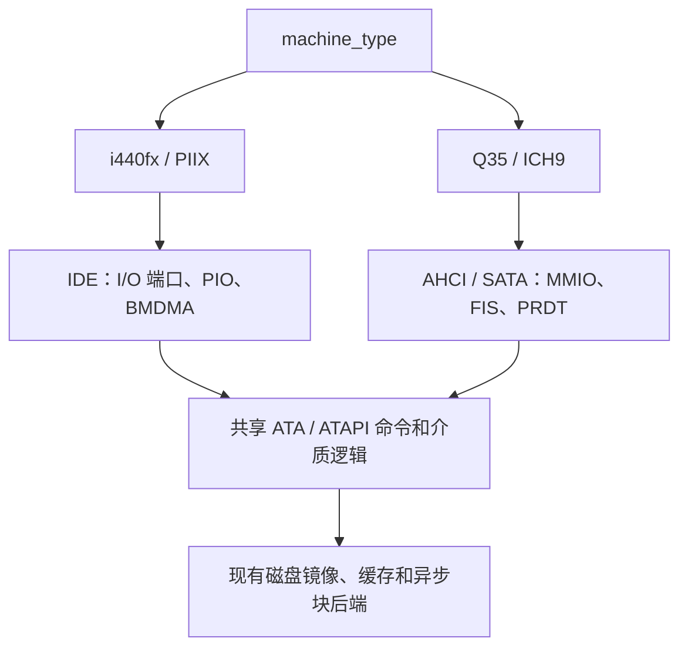

# Q35 AHCI SATA 实施计划

状态：设计与实施计划，尚未实现或通过本计划中的验收。

本计划基于 2026 年 10 月 3 日审查的当前 v86 分支。目标是增加
`machine_type: "i440fx" | "q35"`：默认保留现有 i440FX 行为；选择 Q35 时自动创建
Q35 MCH、ICH9 LPC 和 AHCI 控制器，将现有硬盘与光驱配置连接到 SATA 端口。

首个完整交付版本应支持 SATA 硬盘和 SATA ATAPI 光驱的系统安装、启动、读写、
复位及快照恢复。它是逐步对齐 QEMU Q35 平台的基础版本，不代表一次实现完整
Q35 芯片组、PCIe 生态或 QEMU 的全部能力。

## 配置契约

建议保持现有镜像配置接口：

```js
new V86({
    machine_type: "q35", // "i440fx" | "q35"，默认 "i440fx"
    hda: { url: "disk.img", async: true },
    cdrom: { url: "installer.iso" },
    // 其余选项保持现有用法
});
```

| 配置 | 平台 | 默认存储连接 |
| --- | --- | --- |
| 未填写或 `"i440fx"` | 保留当前 i440FX/PIIX 行为 | IDE 硬盘与 ATAPI 光驱 |
| `"q35"` | Q35 MCH 与 ICH9 LPC | AHCI 控制器连接 SATA 硬盘与 SATA ATAPI 光驱 |

- Q35 提供 6 个 SATA 端口，固定 `hda → port 0`、`hdb → port 1`、`cdrom → port 2`。
  未连接设备的端口返回正确的未连接状态；省略前面的磁盘不改变后面设备的端口号。
- SATA 每个端口连接一个设备，不使用 IDE 的 master/slave。
- 不增加必须手动设置的 `ahci: true` 或 `sata: true` 开关；机器型号决定默认控制器。
- 建议 Q35 首版默认启用 ACPI，并对显式 `acpi: false` 给出不支持的配置错误。
  i440FX 的 ACPI 默认行为保持不变。
- 非法 `machine_type` 在初始化时明确报错。
- `qemu_compatible` 保留现有 i440FX 兼容语义。Q35 使用自己的设备布局，不能因该选项
  又套用 i440FX 地址；Q35 下该选项对设备名称及 subsystem identity 的作用需单独定义。
- 快照记录机器型号与设备布局版本。旧快照缺少型号时按 i440FX 解释，拒绝跨型号直接恢复。

Q35、AHCI、SATA 属于不同层次：Q35/ICH9 定义平台，AHCI 定义操作系统访问存储控制器的
接口，SATA 定义控制器与设备之间的协议。模拟器需要实现客体可见的寄存器、FIS
（Frame Information Structure）、命令和设备状态，无需模拟串行电气信号或逐周期物理链路。

## 当前代码基础

| 代码入口 | 当前情况 | 计划中的处理 |
| --- | --- | --- |
| [`src/platform.js`](../src/platform.js) | 已集中描述部分设备位置、资源和 CPU 拓扑 | 增加机器型号、芯片组资源、ECAM、IRQ 与存储配置 |
| [`src/pci.js`](../src/pci.js) | 硬编码 i440FX/PIIX，配置空间为 256B，设备表和快照围绕 bus 0 | 抽离芯片组，统一 BDF 配置访问，增加 ECAM 与可扩展设备表 |
| [`src/io.js`](../src/io.js) 与 [`src/const.js`](../src/const.js) | MMIO 注册按 128KiB 粒度对齐 | 增加精确子区间映射、迁移和解除映射 |
| [`src/acpi.js`](../src/acpi.js) 与 [`src/acpi_tables.js`](../src/acpi_tables.js) | PIIX4 PM 和对应 ACPI 表，尚无 MCFG | 复用公共电源逻辑，新增 ICH9 布局与 Q35 表描述 |
| [`src/cpu.js`](../src/cpu.js) | 初始化、复位和快照包含 IDE 专用分支 | 按机器选择设备，校验并保存对应控制器状态 |
| [`src/ide.js`](../src/ide.js) | ATA/ATAPI 语义与 IDE 通道、PIO、BMDMA 混合 | 提取共享设备逻辑，保留 IDE 传输层 |
| [`src/buffer.js`](../src/buffer.js) 与 [`src/state_io.js`](../src/state_io.js) | 已有磁盘后端、缓存与在途 I/O 跟踪 | 复用并补齐错误、取消与 flush 适配 |
| [`bios/seabios.config`](../bios/seabios.config) | 已启用 `CONFIG_AHCI=y` | 以现有 SeaBIOS 为第一轮验证基础 |
| [`bios/fetch-and-build-seabios.sh`](../bios/fetch-and-build-seabios.sh) | 固定 SeaBIOS `rel-1.16.2` | 针对固定版本审计 Q35 初始化路径 |

当前分支已有支持跨页、高内存与地址校验的物理访问接口，以及 LBA48 和稀疏大磁盘测试。
这些能力应直接复用，避免新增控制器退回仅支持低地址或小磁盘的实现。

## 架构与实施顺序



| 阶段 | 交付内容 | 依赖与完成条件 |
| --- | --- | --- |
| P0 | 配置契约与机器描述 | 默认 i440FX 行为不变，选项贯穿所有入口 |
| P1 | PCI 配置访问与精确 MMIO 映射 | 为 Q35 和 AHCI 提供公共基础；旧设备回归通过 |
| P2 | Q35/ICH9、固件、ACPI、中断 | 依赖 P1；完成枚举、资源描述和中断验证 |
| P3 | 共享 ATA/ATAPI 与块后端接口 | 可与 P1/P2 并行；IDE 行为和测试保持通过 |
| P4 | AHCI/SATA 控制器及硬盘、光驱 | 依赖 P1/P3，与 P2 集成；实现真实 BIOS 启动 |
| P5 | 数据完整性、复位、快照和客体验证 | 是发布条件；生命周期接口应在前面阶段就设计好 |
| P6 | 高地址 DMA、MSI、NCQ、热插拔和完整平台扩展 | 基础版本通过后，逐项实现并开放对应能力 |

## P0 配置与机器描述

扩展 `create_platform`，让设备 BDF、ECAM、RAM/PCI 内存区域、IRQ 路由、PM 资源与存储类型
来自同一份描述。避免在各设备中散落对 `machine_type` 的判断。

选项需要贯穿 [`v86.d.ts`](../v86.d.ts)、[`src/browser/starter.js`](../src/browser/starter.js)、
[`src/browser/cpu_worker.js`](../src/browser/cpu_worker.js) 和 CPU 初始化；同时覆盖浏览器及
Node 入口。新模块加入 [`Makefile`](../Makefile) 的构建输入。

将芯片组创建与通用 PCI 总线逻辑分开，CPU 按平台创建 IDE 或 AHCI，并通过统一介质接口
提供光驱操作。机器描述同时向固件、ACPI 表和设备实现提供资源信息。

验收：未填写和显式填写 i440FX 的设备集合一致；Q35 的配置能够正确传入 Worker；
非法选项失败明确，Q35 不意外创建 IDE 控制器。

## P1 PCI 与 MMIO 公共基础

统一配置访问为 `config_read/write(bdf, offset, size)`。BDF 包含总线号、设备号和功能号。
传统 `CF8/CFC` 与 ECAM 使用同一后端，支持按函数选择 256B 或 4KiB 配置空间。
设备表及快照改为可扩展的 BDF 集合；首版 Q35 可以先只布置 root bus 上的设备。

配置访问需要统一处理：

- 不存在函数的全一返回值、配置边界和 8/16/32 位访问。
- 按字段实现只读、写一清零、保留位与设备回调，避免不同访问宽度语义不一致。
- BAR 大小探测、重定位与解除映射。
- PCI Memory Enable、Bus Master Enable、INTx Disable 的实际效果。
- 恢复快照后重新建立映射和中断状态。

当前 128KiB MMIO 粒度无法直接表示小型 AHCI BAR 和 16KiB ICH9 RCBA。建议保留粗粒度
快路径，在需要的块中加入按精确地址区间分发的处理器。每段映射具有明确 owner，支持迁移、
释放、空洞及跨边界访问；解除一个设备的映射不能清除同块其他设备。

禁止通过扩大客体看到的 BAR 大小或向外取整覆盖整个 MMIO 块来绕过该问题。

验收：CF8/CFC 与 ECAM 前 256B 一致；同一个粗块内两个设备独立工作；BAR 探测、迁移、
关闭解码、解除映射和快照恢复均正确。

## P2 Q35 ICH9 固件与 ACPI

建议使用以下核心拓扑：

| PCI 地址 | 设备 | 身份 |
| --- | --- | --- |
| `00:00.0` | Q35 MCH / Host Bridge | `8086:29c0` |
| `00:1f.0` | ICH9 LPC，包含电源管理功能 | `8086:2918` |
| `00:1f.2` | ICH9 AHCI | `8086:2922`，class `01:06:01` |

这对应 QEMU 的 Q35/ICH9 核心组织方式；AHCI 提供 6 个端口，主要寄存器位于 BAR5。
参考 [QEMU Q35 机器实现](https://github.com/qemu/qemu/blob/master/hw/i386/pc_q35.c)
与 [ICH9 AHCI 实现](https://github.com/qemu/qemu/blob/master/hw/ide/ich.c)。

### MCH 与内存布局

至少实现固件实际使用的 PCIEXBAR、ECAM、PAM/BIOS shadow 行为，以及一致的 RAM/PCI hole。
SeaBIOS 识别 Q35 后会设置 PCIEXBAR，并立即使用 ECAM 进行后续配置访问，因此必须一起
实现设备身份与对应行为，不能先换 ID 再等待后续补齐 ECAM。

沿用当前固定版本 SeaBIOS 时，建议匹配它的默认布局：ECAM 位于 `0xB0000000`，占 256MiB，
普通 PCI MMIO 从 `0xC0000000` 开始。平台的实际 RAM 映射、E820、ACPI `_CRS` 和 MCFG
必须一致；较大 RAM 配置需要配套保留及重映射。当前 VGA LFB 默认使用 `0xE0000000`，
不能在未协调显存映射时把 ECAM 放在那里。

参考 [SeaBIOS PCI 初始化](https://github.com/coreboot/seabios/blob/rel-1.16.2/src/fw/pciinit.c)
与 [Q35 常量](https://github.com/coreboot/seabios/blob/rel-1.16.2/src/fw/dev-q35.h)。

### ICH9 LPC 与中断

复用公共 PM 定时器、SCI、睡眠和共享 IRQ 逻辑，但为 ICH9 实现独立的寄存器布局：

- PMBASE 位于 PCI config `0x40`，PM 区域按 128B 对齐，长度为 128B。
- ACPI enable 位位于 config `0x44` bit 7，不能沿用 PIIX4 的 config `0x80`。
- GPE0 位于 `PMBASE + 0x20`，长度为 16B，FADT 同步描述。
- RCBA 位于 config `0xF0`，实现固件使用的映射及寄存器行为。
- 支持 PIRQA–H 八路路由；PIC 路径、IOAPIC GSI 16–23、设备引脚路由和 AML 保持一致。
- ACPI enable/disable 命令值、SCI、复位和睡眠行为按平台描述生成。

Q35 不再创建独立的 PIIX4 PM PCI function。参考
[QEMU ICH9 定义](https://github.com/qemu/qemu/blob/master/include/hw/southbridge/ich9.h)。

### ACPI 与固件

继续使用现有 fw_cfg 与 `etc/table-loader` 交付 ACPI 表。增加 MCFG，将根节点描述为
`PNP0A08` 并提供 `PNP0A03` 兼容 ID，更新 `_SEG`、`_BBN`、`_CRS`、`_PRT`、LPC 地址及
FADT 的 PM/GPE/SCI 信息。仅声明已实现和验证的能力与睡眠状态。

现有 SeaBIOS 配置已启用 AHCI，可以先复用当前固件验证。v86 当前没有真实 SMM，已有
`0xB3` 兼容读取和 `0xB2` 直接处理 ACPI 命令的路径。Q35 应先验证这一策略；若有问题，
再提供同版本构建的无 SMM 固件。完整 SMM、SMRAM 隔离和 RSM 留到后续平台工作，
不能把兼容绕过描述成已支持 SMM。

验收：SeaBIOS 完成 Q35 枚举，Linux 可读取正确 PCI/ACPI 信息；ACPI 表校验和、ECAM、
资源保留、PM 和 IRQ 测试通过。直接启动内核可用于阶段调试，但不能替代最终磁盘启动验收。

## P3 共享 ATA ATAPI 与块后端

将存储拆成块后端、ATA/ATAPI 设备语义和控制器传输层。现有 `IDEInterface` 混合了命令、
PIO 状态、通道选择和 IRQ，不能直接作为 AHCI 后端使用。

| 可共享部分 | 保留在 IDE 的部分 | AHCI 新增部分 |
| --- | --- | --- |
| IDENTIFY、容量、LBA28/LBA48、读写命令、错误与介质状态 | I/O 端口、task file、HOB、master/slave、PIO、BMDMA | Command List、Command Table、FIS、AHCI PRDT、端口状态机 |
| ATAPI packet 命令、sense、光盘读写语义及换盘状态 | IDE 下的 packet/data 阶段传输 | AHCI ACMD、FIS 与客体内存数据传输 |

共享设备生成 IDENTIFY 时，根据 PATA/SATA 连接方式和实际实现生成能力字段。
不能照搬 PATA 字段，也不能声明尚未实现的 NCQ、队列深度或高级电源管理。

磁盘后端继续使用现有镜像、缓存和 `get/set/get_state` 能力，增加统一的异步完成、错误、
取消与 flush/barrier 适配。对内存 overlay 和持久化后端分别明确 flush 所能兑现的语义，
不要求用户更换镜像格式。

验收：现有 IDE 启动、读写、光驱、换盘、复位和大磁盘测试保持通过。

## P4 AHCI 控制器与 SATA 端口

建议新增独立的 `AHCIController` 和 `AHCIPort`，将 PCI 包装、寄存器状态、命令执行、
DMA 和设备语义分开。首版使用 INTx，MSI 后续加入。

| 部分 | 首版范围 |
| --- | --- |
| PCI 包装 | ICH9 AHCI 身份、BAR5、解码开关、总线主控与 INTx |
| HBA 全局寄存器 | `CAP/GHC/IS/PI/VS`，全局复位及中断控制 |
| 端口寄存器 | `PxCLB/CLBU/FB/FBU/IS/IE/CMD/TFD/SIG/SSTS/SCTL/SERR/SACT/CI` 等 |
| 命令引擎 | Command Header、Command Table、H2D Register FIS、ATAPI packet |
| 数据搬运 | Scatter/Gather PRDT、长度与地址验证、PRDBC 更新 |
| 完成路径 | Received FIS、任务状态、错误状态、命令完成与中断撤销 |
| SATA 状态 | 空端口、设备签名、COMRESET、SRST、HBA reset、端口启停 |

命令执行路径：

```text
写 PxCI
  → 读取 Command Header / Command Table / H2D FIS
  → 解析 ATA 或 ATAPI 命令及实际数据阶段
  → 验证所需 PRDT 与 DMA 范围
  → 调用磁盘后端并搬运数据
  → 更新 PRDBC / Received FIS / PxTFD / 完成与错误状态
  → 按寄存器和中断规则完成命令
```

首版可以提供 32 个命令槽，每个端口串行执行 non-NCQ 命令。所有公布的槽位都必须可用，
不能只实现 slot 0。初期关闭 NCQ、热插拔、Port Multiplier、FIS-based switching 和
高级链路电源管理，对应能力位只在实现后开放。

寄存器必须正确实现只读、写一清零、保留位、复位默认值，以及 `ST/FRE` 与 `CR/FR`
启停关系。状态产生与实际 IRQ 输出分离：更新 `PxIS` 和 Received FIS 不依赖中断是否打开，
中断再按 `PxIE`、全局状态、`GHC.IE` 和 PCI INTx 控制组合决定，并正确撤销。

ATA 最低命令集覆盖 IDENTIFY、READ/WRITE DMA 及 EXT、必要的 PIO 类读写、FLUSH CACHE
及 EXT、SET FEATURES、容量查询和不支持命令的 ABRT。AHCI 下的 PIO 类命令同样通过
FIS 和客体内存传输，不经过 IDE 数据端口。

SATA ATAPI 光驱纳入首个完整版本，覆盖 IDENTIFY PACKET、PACKET/ACMD、光盘读取、
容量与 TOC、无盘和换盘 sense。仅支持硬盘时只能称为硬盘启动阶段版本，不能认为已覆盖
现有 `hda/hdb/cdrom` 场景。

数据结构、对齐、PRDT 长度、复位及状态机以
[Intel AHCI 1.3.1 规范](https://www.intel.com/content/dam/www/public/us/en/documents/technical-specifications/serial-ata-ahci-spec-rev1-3-1.pdf)
为依据；客体看到的 AHCI 版本与能力必须匹配实际实现。

SeaBIOS 联调需要专门覆盖以下行为：

1. 它先向硬盘发送 IDENTIFY PACKET DEVICE，收到正常错误完成后才尝试 IDENTIFY DEVICE。
   错误命令必须更新 FIS 和状态，并允许后续恢复，不能让固件等到超时。
2. 它会将 `PxIE` 设为零并轮询 `PxIS` 与 Received FIS，因此屏蔽 IRQ 不得屏蔽状态更新。
3. 无数据 SET FEATURES 仍可能带有 PRDT。必须先按命令语义确定数据阶段，不能依据
   未使用的 PRDT 长度盲目发起 DMA。

参考 [SeaBIOS AHCI 驱动](https://github.com/coreboot/seabios/blob/rel-1.16.2/src/hw/ahci.c)。

## P5 数据正确性与生命周期

DMA 使用 CPU 已有 `validate_physical_range`、`read_blob_physical` 和
`write_blob_physical`，不能直接用客体地址索引 `mem8`，也不能将完整地址通过 `>>> 0`
截成 32 位。验证所需命令结构、PRDT 的对齐、长度、方向、地址空洞和溢出，再分块传输；
无效请求按控制器错误语义完成，不能让宿主异常直接破坏模拟器。

LBA48 大磁盘与高地址 DMA 分别验收。首版可暂设 `S64A=0`；CLB、FB、CTBA、DBA 的高位
地址路径通过测试后再开启 S64A，并继续受平台有效物理地址范围限制。磁盘偏移计算也需
检查 JavaScript 安全整数范围。

所有异步命令接入 `state_io.js` 的在途 I/O 跟踪。每次 reset/restore 更新命令代次，
旧回调不得写入新机器内存、完成新命令或重复产生 IRQ。异步完成时重新确认命令仍有效。
写命令不能在后端完成前就向客体报告完成；FLUSH 等待此前写入，并等待后端提供的 flush。

快照需要保存机器型号、设备布局版本、PCI/芯片组状态、AHCI 全局及端口寄存器、设备与
介质状态。首版采用停止提交新命令并等待在途 I/O 完成的策略，不序列化 Promise 或网络请求。
恢复前校验机器与磁盘拓扑，恢复后重建 BAR/ECAM 映射和中断电平。

CPU 的初始化、复位、保存和恢复不能继续假定 `devices.ide` 一定存在。
`set_cdrom/eject_cdrom` 保持可用，通过统一介质接口分发；磁盘活动事件和统计也应能表达
AHCI 端口，并明确原有 IDE 事件的兼容策略。

关机、复位和休眠需区分语义：复位使旧命令完成回调失效，S5 等待已提交写入按现有平台语义
完成；Q35 的 S3/S4 只有在固件和存储生命周期验证后才能对客体声明支持。

## 验收矩阵

| 层级 | 必须达到的结果 |
| --- | --- |
| 机器契约 | 默认及显式 i440FX 保持旧行为，Q35 自动创建 AHCI，非法选项明确失败 |
| 旧平台回归 | IDE、旧快照、光盘 API、原有 PCI 与 ACPI 测试保持通过 |
| PCI 与资源 | CF8/ECAM 一致，配置宽度、空 BDF、BAR 探测与迁移、MSE/BME、资源冲突正确处理 |
| ACPI 与中断 | 表校验和、MCFG、FADT、`_CRS`、`_PRT` 对应硬件，PIC/IOAPIC 路由正确 |
| AHCI 命令 | 各槽位、多个 PRDT、跨页、短传输与非法请求、空端口、复位、状态清除正确 |
| 数据完整性 | 随机读写回读校验、末扇区、只读盘、非法地址、LBA48 大磁盘 |
| 固件启动 | SeaBIOS 实际从 SATA 硬盘与 SATA ATAPI ISO 启动，覆盖错误探测和轮询路径 |
| Linux 客体 | 原生 ahci/libata 驱动完成安装、挂载、文件校验和重启后的再次校验 |
| Windows 客体 | 使用自带 AHCI 驱动的版本完成安装与重启；旧系统另列驱动与兼容边界 |
| 生命周期 | 读写中的 reset/save/restore/关机、迟到回调、多端口、换光盘 |
| 执行模式 | 解释器/JIT、debug/release，再扩展多核、parallel 和高内存 |

可复用的测试结构包括：

- [`tests/devices/ide_large_disk.js`](../tests/devices/ide_large_disk.js)：3TiB 稀疏磁盘，
  覆盖超过 2^32 扇区的 LBA48 访问，无需分配真实巨型镜像。
- [`tests/devices/device_io_reset.mjs`](../tests/devices/device_io_reset.mjs)：延迟异步后端与
  reset/S5 生命周期。
- [`tests/devices/mmio_ram.js`](../tests/devices/mmio_ram.js)：BAR 分配、重定位及恢复测试结构。
- [`tests/devices/acpi_tables.js`](../tests/devices/acpi_tables.js)：table-loader、校验和与 AML。
- [`tests/devices/acpi_guest.js`](../tests/devices/acpi_guest.js)：真实客体、重启及电源状态。
- [`tests/smp/physical_bus.mjs`](../tests/smp/physical_bus.mjs)：物理地址、跨页及地址空洞。

在现有 `platform-contract-tests` 和 `platform-release-gate` 中增加 Q35/AHCI 验收阶段。
与 QEMU 的差分验证固定一个版本，比较枚举结果、寄存器语义和相同命令序列的结果，
记录允许存在的能力差异；不依赖不断变化的 master 作为唯一验收基线。

新系统安装与已有镜像迁移分开验证。已有 IDE 系统盘切换到 AHCI 后，客体可能因启动驱动
未准备好而无法启动；修改机器型号不等于完成系统盘迁移，更不意味着快照可跨平台恢复。
参考 [Microsoft 启动设备错误说明](https://learn.microsoft.com/en-us/troubleshoot/windows-server/performance/inaccessible-boot-device-stop-error)。

## P6 后续能力

基础版本通过后，建议按以下顺序扩展，每项实现并验证后再开放对应能力位：

1. 高地址 DMA，覆盖所有相关地址高位与高内存传输。
2. MSI，验证启用/关闭、向量投递及 INTx 切换。
3. NCQ，包含并发命令、tag、完成通知、flush 顺序及 queued error recovery。
4. SATA 热插拔与介质事件。
5. PCIe Root Port、桥后设备和多总线拓扑。
6. 链路电源管理、HPET、SMBus，以及更完整的 ICH9 行为。
7. 真实 SMM、SMRAM 和其他完整平台兼容能力。

性能优化在数据正确性之后进行，重点测量批量数据搬运、后端请求合并和多端口并发。
AHCI 接口本身不保证模拟器比 IDE 更快，应使用相同客体、镜像与后端做对照测量。
