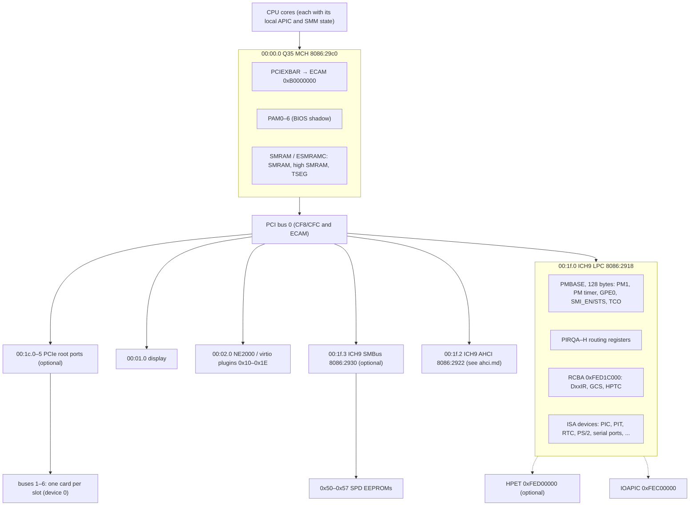
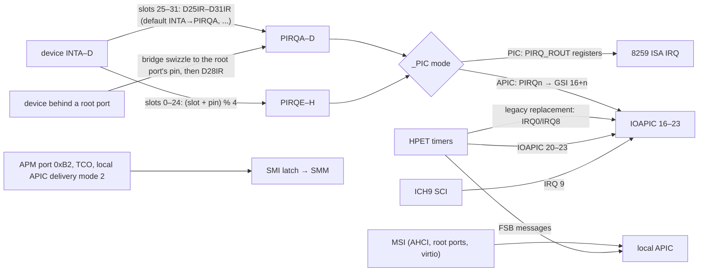
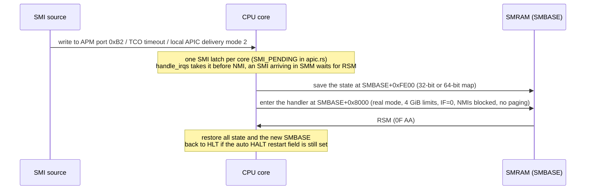
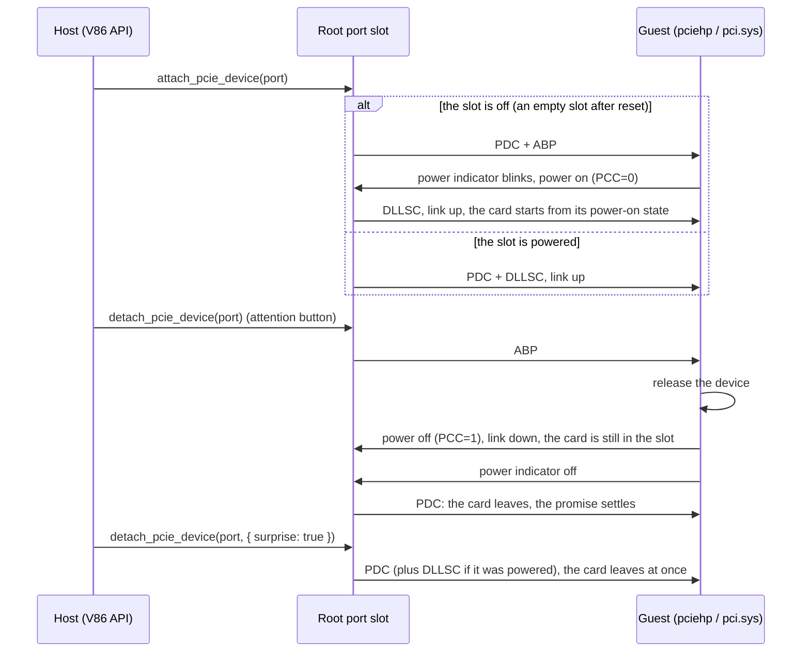

# The Q35 machine

`machine_type: "q35"` selects the Q35 platform: the Q35 MCH host bridge (with a
PCI Express configuration window), the ICH9 LPC bridge (power management,
interrupt routing, root complex register block) and the ICH9 AHCI controller,
plus an optional HPET, SMBus controller and PCI Express root ports (with native
hot plug). The default, `"i440fx"`, keeps the existing i440FX/PIIX platform.

Three documents describe it:

- This one: the platform. Chipset, address map and interrupts, ACPI tables,
  firmware, SMM, HPET/SMBus/TCO, root ports and hot plug.
- [ahci.md](ahci.md): the host controller interface. HBA registers, command
  engine, DMA, interrupts, NCQ.
- [sata.md](sata.md): between the controller and the devices. Ports and links,
  FISes, ATA/ATAPI devices, SATA hot plug, link power management, disk backends.

The firmware and reference behaviour cited here was checked against the sources
of SeaBIOS rel-1.16.2 and QEMU 9.2.0.

| | |
| --- | --- |
| Option | `machine_type: "q35"`; optional `hpet`, `smbus`, `pcie_root_ports` (0–6) |
| Verified guests | Linux 4.16, 6.8 and 6.18; MS-DOS 6.22 (real mode, and virtual-8086 mode under EMM386); Windows 8.1 x64 |
| Not implemented | S3/S4 (only S5 is advertised); the VGA ROM stays fixed at `0xFEB00000` |

## Status

Implemented and accepted: the Q35 MCH and the ICH9 LPC, ECAM, ICH9 power
management and ACPI tables, interrupt routing in APIC and PIC mode, AHCI (with
64-bit DMA, MSI, NCQ, SATA hot plug and link power management), PCI Express root
ports (several buses, native hot plug, built-in devices behind them), the HPET,
the SMBus controller, the TCO watchdog, and SMM (32- and 64-bit save maps, SMIs
from the local APIC, TSEG, high SMRAM, D_CLS, auto HALT restart).

Not done: Q35 advertises only S5, not S3 or S4. The VGA ROM is still fixed at
`0xFEB00000`; on Q35 SeaBIOS puts ABAR at `0xFEBF0000`, so the two do not
overlap in practice.

## Design

**The machine type picks the chipset and the default storage controller, and
one platform description serves every device.**
[`create_platform`](../src/platform.js) derives from `machine_type` the device
locations, ECAM, the PM/GPE/SMI resources, interrupt routing, sleep states, the
number of root ports, the HPET and SMBus switches and the built-in devices
placed behind root ports. CPU setup, the firmware interface, the ACPI tables and
the devices all take their resources from this description; no device checks
the machine type on its own. The PCI layout is QEMU's: display at `00:01.0`,
NE2000 at `00:02.0`, `00:1f.*` reserved for the ICH9, virtio plugins allocated
in slots `0x10–0x1E` (skipping `0x1F`).

**Follow QEMU's Q35 and SeaBIOS's fixed assumptions.** Installed guests
(Windows in particular) have seen this topology under QEMU, and the firmware
hardcodes some addresses, so the platform has to match:

- SeaBIOS hardcodes ECAM at `0xB0000000` (256 MiB) and allocates ordinary PCI
  memory from `0xC0000000`. RAM below 4 GiB must therefore end below
  `0xB0000000` (`create_platform` checks this), and E820, MCFG, `_CRS` and the
  motherboard resource that reserves ECAM all agree.
- PAM0 (`0x90`) reads `0x10`, as on the i440FX. SeaBIOS's `make_bios_writable`
  takes that to mean the BIOS is already in shadow RAM. Otherwise it would run
  code from the BIOS alias below 4 GiB to copy itself, and v86 does not allow
  execution there.
- The DSDT puts the ISA devices under the LPC (`_ADR 0x001F0000`) and keeps the
  keyboard's `PNP0303`. SeaBIOS parses the DSDT and leaves PS/2 alone when it
  does not find it.
- PCI interrupt routing, the ICH9's ACPI command values (`0x02/0x03`) and the
  root ports' hot plug semantics are the same as QEMU's.

**Keep the layers apart.** Q35/ICH9 defines the platform, AHCI defines how the
operating system talks to the storage controller, and SATA defines the protocol
between the controller and the devices. The emulator implements the registers,
FISes, commands and device state the guest can see; it does not simulate
electrical signalling or a cycle-accurate physical link. The AHCI controller
itself does not depend on Q35 (SeaBIOS looks for class `01:06:01`), and the
test-only `ahci_test_drives` can put a second AHCI on the i440FX or behind a
root port.

**Lay the common PCI and MMIO groundwork first** ([`src/pci.js`](../src/pci.js),
[`src/io.js`](../src/io.js)):

- One BDF configuration access path. `CF8/CFC` and ECAM share the backend. A
  function has 256 bytes or 4 KiB of configuration space; ECAM reads above
  `0x100` of a 256-byte function return all ones. Absent functions read all ones
  and drop writes. `CF8` reads back the address written to it. The command
  register's memory enable, bus master enable and INTx disable take effect. BAR
  sizing, moves and unmapping work, and so does rebuilding after a snapshot.
- Exact sub-range MMIO (`mmap_register_range`). The 128 KiB fast path stays; only
  the blocks that need it dispatch by exact ranges (the 4 KiB AHCI ABAR, the
  16 KiB RCBA, the 1 KiB HPET in the same block as the RCBA). Every range has an
  owner, and unmapping one device leaves the others in the block alone. Inflating
  the BARs the guest sees is not used as a workaround.
- GSIs 16–23 that drive only the IOAPIC (`ioapic_raise_irq/ioapic_lower_irq` in
  [`cpu.rs`](../src/rust/cpu/cpu.rs)). The existing `device_raise_irq(i)` drives
  PIC pin i and IOAPIC pin i together, which cannot express "PIC through the
  PIRQ routing, IOAPIC at 16+n".

**SMM costs the common paths nothing.** `0xA0000–0xBFFFF` is mapped memory
anyway, so SMRAM visibility is decided only in the out-of-line mapped read and
write paths (RAM when the current core is in SMM with G_SMRAME, or with D_OPEN;
VGA otherwise). The RAM fast path and VGA pay nothing. TSEG lowers the fast RAM
limit and switches to a new bus generation.

**Optional devices are opt-in, and the page chooses for the user.** The HPET, the
SMBus controller and root ports are off by default in the library: the set of
devices matters to installed guests, and snapshots require both sides to match.
The page's Q35 always has the HPET and SMBus and no root ports
(`Q35_PAGE_DEVICES` in [`main.js`](../src/browser/main.js); the URL arguments
`?hpet=`, `?smbus=` and `?root_ports=` change them), because the page has no way
to put a device behind a root port.

**Hot plug uses a "card in the slot" model.** The device configured for a root
port is the card in that port's slot. A function that is pulled out or powered
off is off the bus: configuration reads return all ones, its BARs do not decode,
it cannot master the bus and its INTx is not delivered. Plugged in or powered on
again, it starts from its power-on state. The slot follows QEMU's pcie-root-port
as closely as possible, since Windows and Linux have been tested against it.

## Architecture

### Devices



### Interrupt routing



### Physical address map

| Address | Contents |
| --- | --- |
| `0x00000000–0x0009FFFF` | RAM |
| `0x000A0000–0x000BFFFF` | VGA; SMRAM in SMM (G_SMRAME) or with D_OPEN |
| `0x000C0000–0x000FFFFF` | Option ROMs and the BIOS (shadowed under PAM control) |
| `0x00100000`–top of low RAM | RAM; with TSEG on, its top 1/2/8/16 MiB are TSEG (all ones and dropped writes outside SMM) |
| `0xB0000000–0xBFFFFFFF` | ECAM (PCIEXBAR, 256 MiB, buses 0–255) |
| `0xC0000000`– | PCI memory window (BARs assigned by SeaBIOS); the display's LFB defaults to `0xE0000000` |
| `0xFEB00000` | VGA ROM (fixed) |
| `0xFEC00000` | IOAPIC |
| `0xFED00000` | HPET (1 KiB) |
| `0xFED1C000` | RCBA (16 KiB) |
| `0xFEDA0000–0xFEDBFFFF` | High SMRAM (ESMRAMC.H_SMRAME) |
| `0xFEE00000` | Local APIC |
| `0xFEF00000` | Aperture of x64 extended RAM |
| `0xFFFE0000`– | BIOS |

## MCH and memory

The MCH ([`src/q35.js`](../src/q35.js)) implements the registers the firmware
uses:

- **PCIEXBAR** (config `0x60`, 64 bits: base, length, enable). SeaBIOS sets it
  once it recognizes Q35, and from then on its 32-bit code reaches configuration
  space only through ECAM (the 16-bit PCI BIOS still uses `CF8/CFC`). The device
  identity and ECAM therefore had to arrive together.
- **PAM0–PAM6** (`0x90–0x96`): BIOS shadow attributes; PAM0 reads `0x10` (see above).
- **SMRAM** (`0x9D`): C_BASE_SEG is read-only (A/B segment); G_SMRAME, D_OPEN,
  D_CLS and D_LCK behave as described under "SMM".
- **ESMRAMC** (`0x9E`): H_SMRAME, TSEG_SZ, T_EN; read-only after D_LCK. QEMU's
  extended TSEG: configuration register `0x50` reads back 16 (16 MiB) after a
  write of `0xFFFF`.

## ICH9 LPC, power management and TCO

The ICH9 has no separate PIIX4 PM function; the LPC decodes the PM I/O block
([`src/acpi.js`](../src/acpi.js)):

| Register | Location | Notes |
| --- | --- | --- |
| PMBASE | LPC config `0x40` | 128-byte aligned, 128 bytes long; SeaBIOS sets `0x600` |
| ACPI_CNTL | config `0x44` | bit 7 ACPI_EN (not the PIIX4's config `0x80`); bits 2:0 select the SCI, SeaBIOS writes 0, i.e. IRQ 9 |
| GPE0 | PMBASE + `0x20` | 16 bytes, described in the FADT |
| SMI_EN / SMI_STS | PMBASE + `0x30` / `0x34` | SeaBIOS reads SMI_EN to decide whether to set up SMM, then writes APMC_EN and GLB_SMI_EN |
| TCO | PMBASE + `0x60–0x7F` | the watchdog, see below |
| GEN_PMCON_1 | config `0xA0` | SeaBIOS reads it as a word and writes it back as a dword |
| RCBA | config `0xF0` | SeaBIOS writes `0xFED1C000` and reserves 16 KiB in E820 |
| PIRQA–D / PIRQE–H routing | config `0x60–0x63` / `0x68–0x6B` | bit 7 set: not routed to the PIC |

The RCBA implements D25IR–D31IR (each device's INTx to PIRQ mapping, default
`0x3210`: INTA→PIRQA, ...), GCS (default `0x20`: no reboot on a TCO timeout) and
HPTC (`0x80`: HPET at `0xFED00000`).

**TCO watchdog** ([`src/ich9_tco.js`](../src/ich9_tco.js)): TCO_RLD, TMR, STS,
CNT and the other registers, with 0.6 s ticks. It does not run by default; a
write to TCO_RLD or clearing TCO_TMR_HLT starts it. The first timeout sets
TCO1_STS.TIMEOUT and raises an SMI if SMI_EN.TCO_EN is set. The second sets
SECOND_TO_STS and BOOT_STS and resets the machine if GCS.NO_REBOOT is clear.
Status registers are write-1-to-clear, as in hardware (QEMU writes them
directly); TCO_LOCK is sticky.

## Interrupts

The interrupt topology is QEMU's (see the diagram above) and applies to every
PCI function, not only AHCI:

- INTA–D of slots 0–24 go to PIRQE–H by `(slot + pin) % 4`.
- Slots 25–31 (including the AHCI at `00:1f.2` and the root ports at `00:1c.*`)
  go to PIRQA–D through D25IR–D31IR.
- A device behind a root port is first swizzled to the root port's pin, as with
  any PCI-to-PCI bridge, and then routed by D28IR.
- In APIC mode PIRQn always reaches IOAPIC GSI 16+n; in PIC mode the LPC's
  routing registers pick the ISA IRQ. The PIC path keeps the existing shared
  level logic, so the IOAPIC's ISA pin of the same number follows it, as in
  QEMU's ICH9.

## ACPI tables

The tables still reach the guest through fw_cfg and `etc/table-loader`
([`src/acpi_tables.js`](../src/acpi_tables.js)):

- **MCFG**: ECAM at `0xB0000000`, segment 0, buses 0–255.
- **DSDT**: the root `\_SB.PCI0` has `_HID PNP0A08` and `_CID PNP0A03`, with
  `_SEG`, `_BBN` and a `_CRS` whose 32-bit window excludes ECAM (the operating
  system's resource allocator would otherwise treat it as free). There are two
  `_PRT`s: link devices LNKA–H in PIC mode (`PRTP`) and GSIA–H in APIC mode
  (`PRTA`, GSIs 16–23); `_PIC` records the mode. The ISA devices are under the
  LPC, and with the HPET there is a `PNP0103` under the LPC as well. ECAM is
  reserved by the motherboard resource `DRAC` (`PNP0C01`). The PCI Firmware
  specification requires that, and it keeps ECAM out of resource allocation.
  SeaBIOS reserves ECAM only in E820. Linux 6.12's early check accepts an E820
  reservation for BIOS dates before 2016 (SeaBIOS reports 2014); its late check
  accepts only ACPI motherboard resources. `_OSC`, as in QEMU, grants control of
  native PCIe hot plug, SHPC, PME, AER and the PCIe capability structure; an
  unknown UUID and a wrong revision are reported in the first dword, as the
  specification says.
- **FADT**: the PM block, `GPE0_BLK = PMBASE + 0x20` (length 16), ACPI_ENABLE and
  ACPI_DISABLE `0x02/0x03`, SCI 9, the reset register. Only S5 is advertised.
- **MADT**, and **HPET** when the HPET is on.

## Firmware (SeaBIOS)

SeaBIOS ([`bios/seabios.config`](../bios/seabios.config): `CONFIG_AHCI`,
`CONFIG_USE_SMM`, `CONFIG_CALL32_SMM`) goes through these steps on Q35: it
recognizes Q35, sets PCIEXBAR and enumerates through ECAM; it assigns BARs (from
`0xC0000000`), bus numbers and bridge windows; it programs PMBASE, ACPI_CNTL,
RCBA and the PIRQ routing; it sets up SMM (an SMI relocates SMBASE from
`0x30000` to `0xA0000`, the handler sets `HaveSmmCall32`, and SMRAM is closed
with G_SMRAME); it parses the DSDT (PS/2) and boots through AHCI.

SeaBIOS's AHCI driver runs only in 32-bit mode, and 16-bit int13h calls enter it
through `call32`. Once `HaveSmmCall32` is set, every `call32` goes through SMM
(`call32_smm`, two SMIs per call). That makes int13h work from virtual-8086 mode
as well (DOS with EMM386, Windows 3.x enhanced mode, Windows 9x compatibility-mode
disk access), at the price of slower disk calls than the i440FX's IDE, so these
guests are better off on the i440FX. The firmware also polls through SMM, which
directly affects boot speed in the browser; see
[ahci.md](ahci.md#firmware-interplay).

## SMM

SMM is implemented in [`src/rust/cpu/smm.rs`](../src/rust/cpu/smm.rs); the
semantics of the MCH's SMRAM registers are in [`src/q35.js`](../src/q35.js).



- **Save maps**: the state goes to SMBASE+0xFE00 in the layout of QEMU's
  `smm_helper.c`. Legacy CPU profiles use the 32-bit map (revision `0x20000`).
  The x86-64 profile uses the 64-bit map (`0x20064`, as AMD64/Intel 64
  processors do) in every mode, including SMIs taken in long mode. If a guest on
  a legacy profile illegally enters long mode, it gets the 64-bit map too; bit 2
  of `smm_state` records which map was used, for RSM. Both maps support SMBASE
  relocation. The 64-bit map adds EFER, RIP, R8–R15 and the 64-bit bases of the
  segments and descriptor tables; entry clears EFER, and on return EFER.LMA
  follows from LME, CR0.PG and CR4.PAE.
- **SMI sources**: the APM control port `0xB2` (SMI_EN.APMC_EN) interrupts the
  core that wrote it (in parallel mode, the worker core that issued the I/O);
  TCO interrupts the BSP (as in QEMU); and the local APIC delivers SMI messages
  (ICR, MSI, IOAPIC entries with delivery mode 2). An SMI wakes a halted core,
  INIT clears the latch, and the latch is part of the core's snapshot state. An
  SMI arriving during a long-mode instruction is taken after that instruction.
- **SMRAM**: in SMM with G_SMRAME, or at any time with D_OPEN, `0xA0000` is RAM;
  otherwise it is VGA. With D_CLS, data accesses in SMM go to VGA while code
  fetches still come from SMRAM (through `memory::fetch8` and the x64
  `fetch_physical`).
- **High SMRAM** (ESMRAMC.H_SMRAME): the same memory appears at
  `0xFEDA0000–0xFEDBFFFF` instead, and `0xA0000` is VGA even in SMM (as in
  QEMU). SMBASE may point into the high window; the save area is accessed through
  that alias, and such an SMI is dropped while high SMRAM is off.
- **TSEG**: with G_SMRAME, T_EN and TSEG_SZ make the top of memory below 4 GiB
  TSEG. In SMM it is RAM; outside SMM it reads all ones and drops writes (the
  32-bit paths treat it as mapped memory, and the x64 physical bus decodes the
  same hole). The fast RAM limit drops below TSEG; a change switches to a new bus
  generation and flushes the TLB, and workers catch up in their next time slice.
- **Auto HALT restart**: an SMI that interrupts HLT sets the auto HALT restart
  field of the save area (`0x7F02` in the 32-bit map, `0x7EC9` in the 64-bit
  map). Unless the handler clears it, RSM returns to the halted state. Setting it
  is ignored when the SMI did not come from HLT.
- **State**: each core's `smm_state` and `smbase` are in the generated state
  layout; old snapshots restore the reset value `0x30000`, and INIT keeps
  SMBASE. The APM status port `0xB3` is read/write on Q35 (on the i440FX it
  still reads 0, or SeaBIOS's PIIX4 SMM handshake would wait forever).

## HPET

Option `hpet` (Q35 only), [`src/hpet.js`](../src/hpet.js): 1 KiB at `0xFED00000`,
GCAP_ID `0x8086A201`, a period of 69841279 fs (14.31818 MHz), and a 64-bit main
counter derived from the machine clock. There are 3 timers: one-shot or periodic,
32- or 64-bit, edge or level. Comparators and period registers follow QEMU's
semantics (for 64-bit timers, Tn_VAL_SET clears after the upper half is
written). Routes: FSB (MSI), legacy replacement (timer 0 → IRQ0, timer 1 → IRQ8;
the PIT and RTC then stop driving these lines), and IOAPIC 20–23. **FSB takes
precedence over legacy replacement**, as in QEMU: Windows sets LEG_RT_CNF and
timer 0's Tn_FSB_EN together and takes its clock interrupt from the FSB message
(vector `0xD1`). With legacy replacement taking precedence, Windows 8.1 hung
about 15 seconds into boot waiting for a clock interrupt. There is an ACPI HPET
table and a `PNP0103` under the LPC in the DSDT, and RCBA HPTC reads `0x80`.

v86 does not report an invariant TSC, so with the HPET present Windows 8.1 moves
QueryPerformanceCounter to the HPET (14.318 MHz instead of the 3.58 MHz ACPI PM
timer) and takes its clock interrupt from the HPET's FSB messages. The time to
the desktop with and without the HPET was within noise (115/117 s against
128/116 s).

## SMBus

Option `smbus` (Q35 only), [`src/smbus.js`](../src/smbus.js): function `00:1f.3`
(`8086:2930`, INTA). The device decodes its I/O BAR4 itself, which needed a new
kind of I/O BAR in the PCI core (one with `on_move`): SeaBIOS always puts it at
PMBASE+0x100 = `0x700`, below the `0x1000` the core reserves for legacy ports.
It decodes while HOSTC.HST_EN is set and I2C_EN is not. The host interface
follows the ICH9 datasheet and QEMU's `pm_smbus.c`: quick, byte, byte data, word
data, process call, block (the 32-byte E32B buffer, or byte by byte with
BYTE_DONE and LAST_BYTE), I2C block read, KILL, INUSE_STS, and INTA on completion
with INTREN. The bus holds eight 256-byte EEPROMs at `0x50–0x57` (as in QEMU,
all zeros).

## PCI Express root ports and hot plug

Option `pcie_root_ports` (0–6, Q35 only) creates ICH9 PCI Express root ports from
`00:1c.0` up (`8086:2940` and up,
[`src/pcie_root_port.js`](../src/pcie_root_port.js)): a type 1 header, a PCIe
capability of a root port (x1, 2.5 GT/s), MSI, SSVID and PM capabilities, and
4 KiB of configuration space without extended capabilities.

**Bridges and buses** ([`src/pci.js`](../src/pci.js)): a function behind a
bridge has a `pci_id` from the physical bus number assigned when the machine is
built; the bus numbers the guest sees are whatever it writes to the bridge's
secondary and subordinate registers, and both CF8 and ECAM route by them (a PCIe
downstream port forwards only device 0). The bridge's I/O and memory windows
(including the 64-bit prefetchable one) and command bits decide what is
forwarded behind it, and its bus master bit decides whether DMA and MSIs from
behind it get upstream (the PCI bridge specification). I/O BARs behind a bridge
are mapped through its window, and devices hear about bridge changes.

**Devices behind root ports**: virtio_devices descriptors, and the built-in
`net_device` (virtio and NE2000; an NE2000 behind a bridge gets its I/O ports
from `0x1300`), `filesystem` (9p), `virtio_console` and `virtio_balloon`, with
`pcie_root_port` in their options (and optionally `pcie_plugged: false` for an
empty slot at boot); one device per port.

**Native hot plug**: each root port has one hot plug slot, as QEMU's
pcie-root-port does.

- SLTCAP reports an attention button, a power controller, power and attention
  indicators, surprise removal, hot plug capability and the physical slot number
  (port number + 1).
- The event enables, HPIE, the indicators, PCC and DLLSCE of SLTCTL are writable;
  every write is a command that completes at once (setting CC).
- The SLTSTA events are write-1-to-clear; PDS says a card is in the slot, and
  LNKSTA.DLLLA is set while a card is in and powered.
- After reset, a slot with a card is powered with its power indicator on, and an
  empty slot is off with both indicators off (as `pcie_cap_slot_reset` in QEMU).
- With HPIE and an enabled event pending, the port interrupts: one MSI when the
  condition starts, otherwise an INTx level.



The reasons behind a few choices:

- An insertion into a powered-off slot reports PDC and ABP together (as QEMU
  does): when a slot has an attention button, Linux enables only the ABP event,
  not PDC.
- The card leaves only after the guest has switched the slot off **and** turned
  the power indicator off (as in QEMU): a blinking indicator means the operation
  is not finished yet, and Windows switches the power off first and the indicator
  a moment later.
- Empty slots are off after reset (as in QEMU): Windows does not switch empty
  slots off itself, and it does not enumerate a card inserted into a powered
  empty slot.
- A function whose card is out or unpowered is off the bus
  (`pci.set_function_present`). When it comes back, its configuration space is
  restored from its template, its BARs move back and its own reset runs; virtio
  drops requests from before the removal through `plug_generation`. PCIRST#
  resets the slots and powers unpowered cards on again.
- The CPU worker runs the page's commands one at a time, while a removal through
  the attention button waits for the guest. The worker therefore answers as soon
  as the removal starts and reports its end separately, so stop, save_state and
  restart are not held up behind it.

## Configuration

```js
new V86({
    machine_type: "q35",          // "i440fx" | "q35", default "i440fx"
    hda: { url: "disk.img", async: true },
    cdrom: { url: "installer.iso" },
    hpet: true, smbus: true,      // optional, off by default
    pcie_root_ports: 2,           // optional, 0–6
});
```

- Q35 always has ACPI; an explicit `acpi: false` is an error. Without ACPI, v86
  creates neither the PM function nor the IOAPIC, and SeaBIOS's fallback DSDT
  only describes the i440FX. An invalid `machine_type` fails at initialization.
- No `ahci: true` style switch exists; the machine type picks the default
  controller. Which disk goes on which port is described in
  [sata.md](sata.md#ports-and-drives).
- `qemu_compatible` keeps its i440FX meaning only; Q35 uses QEMU's layout anyway.
- The Machine type option of `index.html` and `debug.html` picks the machine; the
  page's Q35 has the HPET and SMBus and no root ports.
- The hot plug API is `attach_pcie_device(port)` and
  `detach_pcie_device(port, { surprise })`; see [`v86.d.ts`](../v86.d.ts).

## Snapshots

A snapshot records the machine type and the device layout version
(`state[103]`). Old snapshots without it are read as i440FX, and restoring
across machine types is refused. Q35 device state: `state[100]` chipset, `[101]`
AHCI, `[102]` HPET, `[104]` SMBus, `[105]` the root port slots; the PCI core's
`[265]` lists the functions that are off the bus; each core's SMM state is in the
generated state layout. The machine type record used to be in `state[99]`, but
streamed snapshots use that slot for the extended RAM bitmap, so streamed Q35
snapshots were taken for i440FX and refused; the record moved to `state[103]`.

A single-buffer snapshot (`save_state`) must stay below 2 GiB: its header holds
the length as an Int32, and browsers cannot allocate an `ArrayBuffer` of 2 GiB or
more. A larger machine (a 2 GB Windows with a display driver installed, for
example) gets a RangeError and needs `save_state_stream`; the page streams
directly when RAM plus video memory is 1 GiB or more.

## Testing

`make q35-tests` (`acpi-table-tests`, `q35-device-tests`, `q35-guest-tests`,
`q35-hotplug-tests`), release gate level `R-q35`:

- [`tests/devices/acpi_tables.js`](../tests/devices/acpi_tables.js): the Q35
  tables, disassembled with iasl and recompiled byte for byte; acpiexec runs
  `_PIC`, the GSI/PIRQ link device methods and `_OSC` (grant, subset query,
  unknown UUID, wrong revision).
- [`tests/devices/pcie_root_port.js`](../tests/devices/pcie_root_port.js): header
  and capabilities, routing by bus numbers (renumbering, overlaps, device 0 only,
  ECAM), windows and command bits, the bridge's bus master bit for DMA and MSI,
  INTx swizzling, I/O windows, slot registers, insertion into powered and
  unpowered slots, removal by the attention button, surprise removal, reset,
  snapshots, placement of built-in devices.
- [`tests/devices/hpet.js`](../tests/devices/hpet.js),
  [`smbus.js`](../tests/devices/smbus.js),
  [`ich9_tco.js`](../tests/devices/ich9_tco.js),
  [`smm.js`](../tests/devices/smm.js),
  [`tests/x64/smm_long_mode.mjs`](../tests/x64/smm_long_mode.mjs): register
  semantics and snapshots of each device. The SMM tests cover SeaBIOS's SMM
  setup, the 32- and 64-bit save maps, SMRAM visibility, the latch, TSEG, high
  SMRAM, D_CLS, auto HALT restart, and every field after 64-bit code sends itself
  an SMI through the local APIC.
- [`tests/devices/q35_guest.js`](../tests/devices/q35_guest.js): SeaBIOS boots
  linux4.iso from the SATA CD drive (IOAPIC mode); MS-DOS 6.22 boots from the SATA
  disk and, with EMM386, reads it from virtual-8086 mode through SMM (113 SMIs);
  PIC mode, ECAM, the PIRQ link devices, RCBA and SMBus; AHCI and virtio behind
  root ports; the HPET.
- [`tests/devices/pcie_hotplug.mjs`](../tests/devices/pcie_hotplug.mjs): Alpine
  x86_64 with Linux 6.18 takes control through `_OSC` and pciehp drives 3 slots;
  a virtio entropy device is hot added and removed by the attention button, the
  virtio NIC is removed by the button and plugged in again, and a function
  without a driver is pulled out by surprise and plugged in again.
- [`tests/glbridge/cpu_worker_hotplug_browser_test.html`](../tests/glbridge/cpu_worker_hotplug_browser_test.html):
  with the CPU in a worker, built-in device placement, plugging, errors passed
  back, and other commands answered while a button removal waits.

## Windows 8.1

[`tests/x64/windows_boot.mjs`](../tests/x64/windows_boot.mjs) opens the image
read-only and keeps guest writes in an in-memory overlay (`WIN_MACHINE=q35`,
`WIN_HPET=1`, `WIN_ROOT_PORTS=<n>`, `WIN_SMBUS=1`):

- The image was installed on IDE. The overlay used earlier (a state that had run
  on the i440FX) stopped with INACCESSIBLE_BOOT_DEVICE on Q35. After `storahci`'s
  Start was set to 0 and its StartOverride deleted on the i440FX, Q35 reached the
  desktop in 110 seconds and the 64-bit and WOW64 probes passed. The raw image
  without an overlay booted on Q35 directly: Windows went through "Getting
  devices ready" by itself and reached the desktop in 414 seconds.
- With the HPET, 2 root ports and SMBus on, the desktop came after 121 seconds.
  In the PnP list, the MCH, ICH9 LPC, AHCI (two disks and the CD drive), HPET,
  PCI Express Root Complex, root ports and SMBus all had ConfigManagerErrorCode 0
  (the NE2000 had 28: Windows 8.1 has no driver for it).
- PCIe hot plug (`WIN_PCIE_DEVICE`, `WIN_PCIE_AHCI`, `WIN_PCIE_TRACE`,
  `WIN_AHCI_TRACE`; the commands `pcieattach`, `pciedetach [surprise]` and
  `pcieslot`): Windows takes the slots over through `_OSC`, keeps empty slots off,
  and enables ABP, PFD, PDC, CC, HPIE and DLLSC with MSI. After an insertion the
  power indicator blinks for 5 seconds, the slot is powered, the link comes up and
  the device is enumerated. Removal by the button: 5 seconds of blinking, power
  off, indicator off, done after 6 seconds. Surprise removal: Windows switches
  the slot and its indicator off at once.

## Differences from QEMU and limits

- Q35 advertises only S5; S3 and S4 wait until the firmware and the storage
  lifecycle have been verified for them.
- SMM: the I/O instruction restart field of the save area is cleared on SMI and
  ignored by RSM; ESMRAMC.E_SMERR is not implemented. Both are as in QEMU.
  SeaBIOS relocates SMBASE only for the BSP, so an AP that receives an SMI enters
  at the default SMBASE `0x30000`.
- Root ports: no PME, AER or ASPM events (`_OSC` grants the first two anyway);
  the slots have no MRL sensor, electromechanical interlock or power fault
  detection; the secondary bus reset bit is writable but does not reset the
  devices behind the bridge; VGA enable has no effect. Each root port holds one
  single-function device, and the card plugged back in is always the device
  configured for that port.
- A bridge's bus master bit blocks DMA and MSIs from behind it, as the PCI bridge
  specification says. SeaBIOS sets bus master only on devices, never on bridges
  (QEMU does not gate on this bit), so DMA from behind a bridge is blocked during
  SeaBIOS. No user-configurable device behind a bridge is driven by SeaBIOS; only
  the test-only second AHCI is affected (two commands time out after 32 seconds
  each during POST). Linux and Windows both set bus master on bridges.
- Linux (6.18 and mainline) virtio-pci does not survive a surprise removal: on
  driver removal, `vp_reset` waits for device_status to read 0, while a removed
  card reads all ones (as on real hardware), so the pciehp thread hangs. Remove
  virtio devices with a driver through the attention button.
- When Windows 8.1 removes a storage controller with a driver (the second AHCI,
  with a mounted volume) through the attention button, it switches the slot off
  at the end of the 5-second blink without any register or configuration write
  to the controller before that; the removal never finishes and its storage stack
  hangs. The same controller is removed cleanly by Linux. Do not hot-unplug
  storage devices with a driver from Windows guests.

## Platform problems found along the way

- The aperture of x64 extended RAM used to be at `0xFED00000–0xFEDFFFFF`, right
  over Q35's HPET and RCBA (the guest read all ones outside long mode and pages of
  extended RAM in long mode). It moved to `0xFEF00000`.
- The machine type record moved from `state[99]` to `state[103]` (see
  "Snapshots").
- The priority of the HPET's FSB and legacy replacement routes (see "HPET").
- The root ports' reset state and the moment a button removal completes used to
  differ from QEMU. Under Windows that showed up as cards not being enumerated
  after insertion and unexpected PDC events during a button removal; both now
  follow QEMU.
