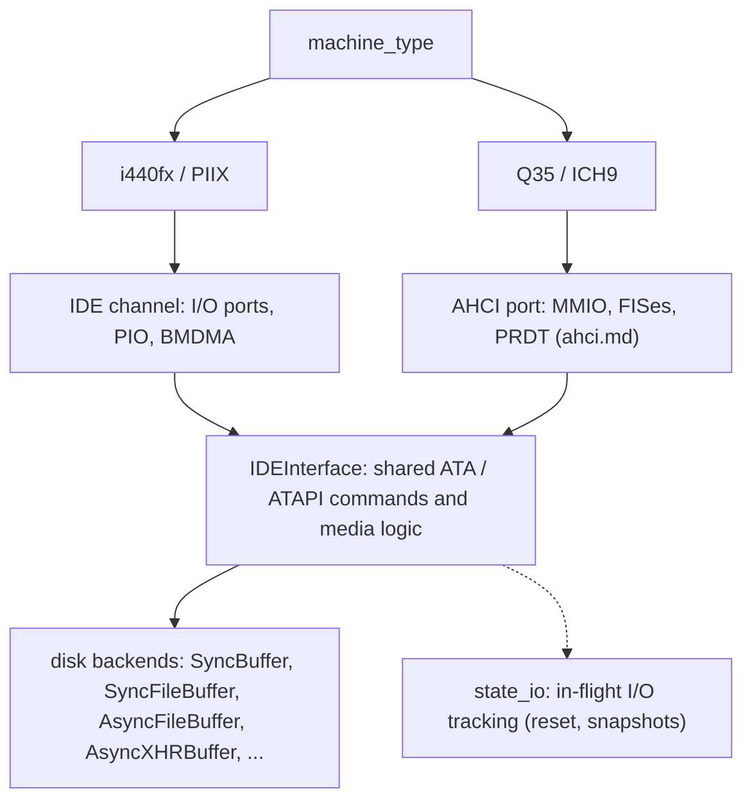
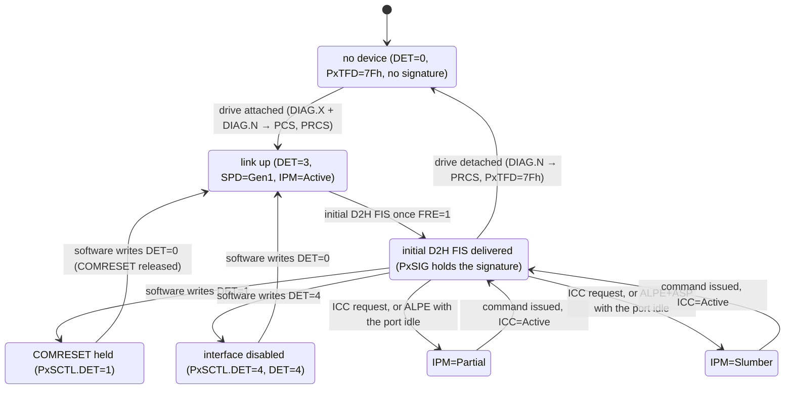
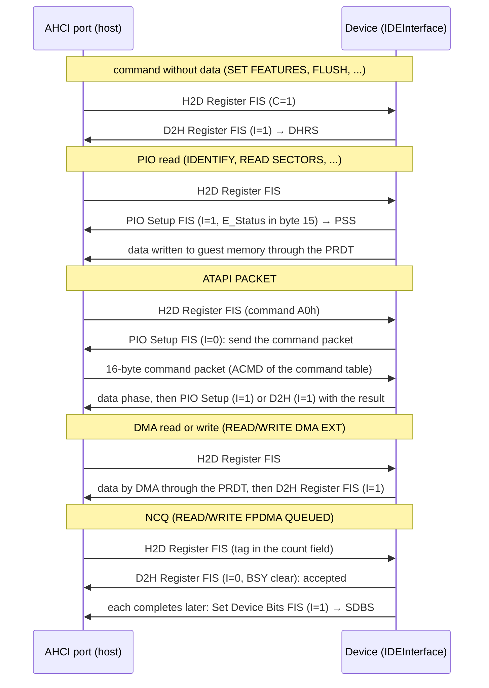

# SATA ports, devices and links

SATA defines the protocol between the AHCI controller and the devices: the state
of each port's link, the device signature, the exchange of FISes (Frame
Information Structures), and the ATA disks and ATAPI CD drives at the other end
of the link. In v86 the SATA layer consists of `AHCIPort` in
[`src/ahci.js`](../src/ahci.js) (link and FISes) and `IDEInterface` in
[`src/ide.js`](../src/ide.js) (ATA/ATAPI device semantics, shared with IDE); the
data comes from the disk backends in [`src/buffer.js`](../src/buffer.js).

Related documents: the platform is in [q35.md](q35.md); the controller side of
the HBA registers, the command engine, DMA, interrupts and NCQ is in
[ahci.md](ahci.md).

| | |
| --- | --- |
| Ports | 6, Gen1 (1.5 Gbps); `hda`, `hdb`, `cdrom` on ports 0, 1, 2 |
| Devices | SATA disks and SATA ATAPI CD drives (IDE's device semantics), NCQ with a depth of 32 |
| Runtime changes | `attach_sata_drive`/`detach_sata_drive` (hot plug); `set_cdrom`/`eject_cdrom` (media change) |
| Not implemented | Port multipliers, FIS-based switching, Gen2/Gen3, DMA Setup and BIST FISes, device-initiated power management, physical layer timing |

## Status

Implemented: 6 ports with Gen1 (1.5 Gbps) links, COMRESET, device signatures and
the initial D2H FIS, SATA disks and SATA ATAPI CD drives (sharing IDE's device
semantics), NCQ (depth 32) with the NCQ error log, attaching and detaching drives
at runtime (SATA hot plug), host-initiated link power management
(Partial/Slumber), and disc changes in the CD drive through ATAPI media events.

Not implemented: port multipliers, FIS-based switching, Gen2/Gen3 speeds, DMA
Setup and BIST FISes, device-initiated link power management, and physical layer
timing (link state changes take no time).

## Design

**Emulate the link the guest can see, not the physical layer.** The guest learns
about the link through `PxSSTS` (DET/SPD/IPM), `PxSCTL`, `PxSERR`, the signature
and the received FIS area. v86 keeps this state and its change events; it does
not emulate OOB signalling, speed negotiation or electrical timing, and state
changes complete at once.

**One device per port, with a fixed mapping of drives.** SATA is point to point
and has no IDE master/slave. `hda`, `hdb` and `cdrom` are always on ports 0, 1
and 2, as QEMU's `-hda/-hdb/-cdrom` are, and leaving out an earlier disk does not
move the later ones. Port 2 always has an ATAPI CD drive (an empty tray without
`cdrom`), just as IDE always creates an empty CD drive, so `set_cdrom/eject_cdrom`
need not care which controller is there.

**Share the device semantics with IDE, and tell the transports apart only where
it matters.** ATA/ATAPI commands, IDENTIFY, capacity, LBA28/LBA48, the task file
registers and error and media state are shared by IDE and AHCI (the port is
`IDEInterface`'s transport, see [ahci.md](ahci.md#design)). IDENTIFY builds its
capability words for a SATA connection: it neither copies the PATA words nor
reports features that are not implemented. A few IDE behaviours that must not
reach SATA were fixed before sharing (see "Device model").

**Hot plug is a link event; a disc change is a media event.** Attaching or
detaching a drive looks like a change of the link (PhyRdy, COMINIT), and the
guest finds out what is there by resetting the port. A disc change is a change of
medium in the same device, reported through ATAPI sense data and event
notification; it does not rely on hot plug.

**The backend only holds data; the device layer guarantees the order of
completions.** A disk backend provides `get/set/get_state` and may complete
synchronously or asynchronously. A write is reported only after the backend has
completed it and FLUSH waits for earlier writes; the device layer guarantees this
whether the backend is asynchronous or not.

## Architecture

### Storage stack

### Link state machine

### FIS exchange

## Ports and drives

| Port | Drive | Notes |
| --- | --- | --- |
| 0 | `hda` | an empty port without `hda`; `hdb` stays on port 1 |
| 1 | `hdb` | |
| 2 | `cdrom` | always an ATAPI CD drive, an empty tray without `cdrom` |
| 3–5 | empty | drives can be attached at runtime (SATA hot plug) |

`cpu.devices.cdrom` is the CD drive on port 2, and `disk_device("hda")` and so on
look drives up by name. Image export and the page's disk activity statistics go
through this common storage interface instead of using `devices.ide` directly.

## Link and port state

- **PxSSTS** is `0x113` (DET=3, SPD=Gen1, IPM=Active) when a device is present and
  the link is up; DET is 0 without a device; with `PxSCTL.DET=4` the interface is
  disabled (DET=4). The link comes up as soon as SUD is set (the specification
  allows 10 ms).
- **COMRESET**: software holds the reset by writing `PxSCTL.DET=1` and releases
  it by writing 0. The device resets, the link comes up again, `PxTFD` returns to
  `0x7F`, and a new initial D2H FIS is due.
- **PxSERR**: DIAG.N (PhyRdy change) and DIAG.X (COMINIT from the device,
  "exchanged"). `PxIS.PRCS` and `PCS` follow them and clear only when `PxSERR` is
  cleared.
- **PxCMD.HPCP**: ports without a drive at power-on are reported as hot plug
  capable.

## Signature and the first D2H FIS

After a device reset its task file registers hold the signature: an ATA device
has sector count 1, LBA low 1, mid 0 and high 0 (`0x00000101`); an ATAPI device
has LBA mid `0x14` and high `0xEB` (`0xEB140101`). An ATA device reports DRDY,
an ATAPI device 0.

`PxTFD` resets to `0x7F`, which has DRQ set. Once the link is up (and FRE=1) the
port must therefore emulate the initial D2H Register FIS the device sends: it
writes the signature to `PxSIG` and the status to `PxTFD` and sets DHRS. Without
it SeaBIOS waits the full 32 seconds on every port and then gives up on the
device.

## FIS types

| FIS | Type | Direction | Received FIS offset | Purpose |
| --- | --- | --- | --- | --- |
| Register H2D | `0x27` | host → device | — | a command (C=1) or a device control update (C=0, SRST) |
| Register D2H | `0x34` | device → host | `0x40` | command completion, signature, status and error; with I=1 it sets DHRS (and TFES on an error) |
| PIO Setup | `0x5F` | device → host | `0x20` | PIO data phase; with I=1 it sets PSS; byte 2 is the status, byte 15 E_Status |
| Set Device Bits | `0xA1` | device → host | `0x58` | NCQ completions (the bits of the completed tags) and errors; sets SDBS |

Data FISes are not modelled: the port moves data directly between guest memory
and the device's buffer as the PRDT describes. DMA Setup and BIST FISes are not
used.

## Device model

ATA disks and ATAPI CD drives are both `IDEInterface`s. AHCI loads the fields of
the H2D FIS (including the HOB bytes) into the task file registers and runs the
existing command code; the port implements the data phases, interrupts and
completion of the command ([ahci.md](ahci.md#command-execution)).

**ATA commands**: IDENTIFY DEVICE, READ/WRITE SECTORS (EXT), READ/WRITE MULTIPLE
(EXT), SET MULTIPLE MODE, READ/WRITE DMA (EXT), READ/WRITE FPDMA QUEUED, READ LOG
EXT, READ VERIFY SECTORS, FLUSH CACHE (EXT), SET FEATURES, READ NATIVE MAX ADDRESS
(EXT), IDLE/STANDBY IMMEDIATE, DEVICE RESET, EXECUTE DEVICE DIAGNOSTIC, PACKET
and others; unsupported commands end with ABRT.

**ATAPI commands**: IDENTIFY PACKET DEVICE, and in command packets TEST UNIT
READY, REQUEST SENSE, INQUIRY, MODE SENSE, START STOP UNIT, PREVENT ALLOW MEDIUM
REMOVAL, READ CAPACITY, READ(10)/(12), READ CD, READ TOC/PMA/ATIP, GET
CONFIGURATION, GET EVENT STATUS NOTIFICATION, READ DISC INFORMATION, MECHANISM
STATUS and others, which cover reading discs, capacity and the TOC, and the sense
data of an empty drive and of a disc change.

**IDENTIFY on SATA** (an IDE connection keeps the PATA words):

| Word | Contents |
| --- | --- |
| 49, 53, 64, 88 | DMA, PIO modes 3/4 and UDMA 0–5 supported (UDMA5 selected). Word 49 used to omit DMA, so libata configured SATA devices for PIO |
| 75 | NCQ queue depth − 1 (31; 0 for ATAPI) |
| 76 | Gen1, NCQ, host-initiated interface power management (bit 9) |
| 77–79 | 0 |
| 80 | `0x0070` (ATA/ATAPI-4, -5 and -6); Linux tells SATA from PATA by words 80 and 93 |
| 84, 87 | bit 5: GPL (READ LOG EXT, needed for NCQ error recovery) |
| 93 | 0 (no cable detection) |

**IDE behaviour fixed before sharing it**:

- Out-of-range reads and writes used to set the status to `0xFF`. In a D2H FIS
  that means BSY: SeaBIOS waits for a timeout and Linux goes into error
  recovery. The status is now `ERR|DRDY` with IDNF or ABRT in the error register.
- PIO writes used to set DRDY and interrupt before the backend had written the
  data, unlike DMA writes, and FLUSH CACHE completed at once. Now writes report
  completion only after the backend has completed them, and FLUSH waits for all
  writes in flight.

## NCQ on the device side

READ/WRITE FPDMA QUEUED carries the tag in the count field and the sector count
in the features field. The device releases the bus as soon as it accepts the
command (a D2H FIS without the I bit) and sends a Set Device Bits FIS when each
command completes. READ LOG EXT provides the log directory (00h) and the NCQ
error log (10h: the failed tag, status, error and LBA, with a checksum, cleared
by reading it). ATAPI devices do not accept queued commands (they end with ABRT).
The controller side (concurrency, ordering, error recovery) is in
[ahci.md](ahci.md#ncq).

## SATA hot plug

`V86.attach_sata_drive(port, image, { cdrom })` and `detach_sata_drive(port)` (the
CPU worker forwards them by RPC) use `AHCIController.attach/detach`:

- **Attach**: sets `PxSERR.DIAG.X` and `DIAG.N` (and with them `PCS` and `PRCS`);
  the link comes up and the signature D2H FIS is sent.
- **Detach**: sets `DIAG.N`; the link goes down and `PxTFD` reads `7Fh`. Commands
  already issued stay until software stops the port; reads in flight are dropped,
  and writes already handed to the backend still land.
- The CD drive on port 2 updates `cpu.devices.cdrom` when it is attached or
  detached.
- When a snapshot is restored and a port has a drive only in the snapshot or only
  in the current machine, the restored guest sees a removal or an insertion. To
  restore a snapshot taken with a hot-plugged drive, attach the same image to the
  same port first.

After an insertion Linux reports `connection status changed` and finds the new
disk after resetting the port (`ata4.00 ... NCQ`); after a removal it reports
`ata4: SATA link down` and the device goes away.

## Link power management

CAP reports SALP, SSC and PSC, and IDENTIFY word 76 bit 9 reports host-initiated
power management:

- `PxCMD.ICC` requests Active, Partial or Slumber; the request completes at once
  and reads back as 0, and no low power state is entered while a command runs.
- With `PxCMD.ALPE` set, an idle port (`PxCI` and `PxSACT` 0, nothing in flight)
  enters Partial, or Slumber with `ASP`; issuing a command wakes it.
- `PxSCTL.IPM` can forbid Partial or Slumber; the current state shows in
  `PxSSTS.IPM`.
- There is no real link, so transitions change no PhyRdy (DIAG.N is not set).

Linux with `min_power` sets ALPE+ASP in `PxCMD`, the idle link goes to Slumber,
reads wake it with correct data, and switching back to `max_performance` returns
to Active, without libata errors.

## Disk backends

The backends in [`src/buffer.js`](../src/buffer.js) provide
`get(offset, length, fn)`, `set(offset, data, fn)` and the snapshot interface; the
device layer registers every read and write with
[`state_io.js`](../src/state_io.js):

| Backend | Source | Reads | Writes |
| --- | --- | --- | --- |
| `SyncBuffer` | an `ArrayBuffer` in memory | synchronous | written to memory synchronously |
| `SyncFileBuffer` | a local file below 256 MB | read whole at start, then synchronous | in memory |
| `AsyncFileBuffer` | a local file of 256 MB or more | synchronous with `FileReaderSync` in the CPU worker (about 0.5 ms per request), asynchronous with `FileReader` on the main thread; data read is not cached | kept in memory, 256-byte blocks in 16 MiB chunks |
| `AsyncXHRBuffer` and others | a URL (HTTP Range requests), split files | asynchronous (blocks read are cached with `fixed_chunk_size`) | kept in memory, 256-byte blocks in 16 MiB chunks |

- Guest writes stay in memory and never change the original file. The written
  256-byte blocks are packed into chunks of 65536 (16 MiB), with a map from block
  number to slot: 1.5 GB written takes about 1.8 GB of memory (about 3 GB with an
  `ArrayBuffer` for each block, as before, and then every 64 MB of new blocks
  caused a full garbage collection of millions of objects). A snapshot holds the
  block numbers as one `Float64Array` and references the chunks without copying
  them, so its manifest stays a few kilobytes; with a buffer for each block, the
  6 million blocks that installing VMware Tools in Windows 8.1 writes failed the
  V7 save with "manifest too large". Snapshots of the format before
  (`[[block number, data], ...]`) still restore. Measured in headless Chrome
  (Q35, a local 2 GiB disk, the CPU worker): 1.5 GB written, the page saves 1.8 GB
  in about 2.5 seconds (manifest 15 KB) and restores it in about 5. The V7
  records' CRC-32 is computed 16 bytes a step (slicing-by-16, the same values
  as zlib); computed a byte a step, the same save took about 10 seconds.
- **Get hard disk image** with a local file read in parts (`AsyncFileBuffer`):
  `get_as_file` builds a `File` of the original file's slices and the written
  blocks, one part for each run of blocks that follow each other on the disk and
  in a chunk. In the CPU worker it is sent to the page as it is (before, the
  worker asked the backend for a buffer it does not have, and the button gave
  nothing). The 2 GiB disk above with 1.5 GB written exports in about 1.3 seconds.
- **Synchronous reads decide how fast Q35 boots in the browser.** SeaBIOS's AHCI
  driver polls for each command's completion, through SMM on Q35, which is slow;
  an asynchronous read arrives only after the emulator finishes a batch of
  instructions, so every read waits tens of milliseconds
  ([ahci.md](ahci.md#firmware-interplay)). With local files read synchronously by
  `FileReaderSync` in the CPU worker, the BIOS disk phase of Windows 8.1 dropped
  from about 180 seconds to about 20, and the time to the lock screen from about
  10 minutes to about 5. Disks loaded from a URL and the debug mode
  `cpu_worker=0` still read asynchronously, so the BIOS phase on Q35 remains slow
  with them.
- What FLUSH guarantees depends on the backend: with the in-memory overlay, a
  write is complete when the backend calls back.

## Testing

- [`tests/devices/ahci.js`](../tests/devices/ahci.js): presence of empty ports and
  devices, signatures, the initial D2H FIS, COMRESET, software reset, IDENTIFY
  words, ATAPI commands and sense data, the NCQ error log, the registers after hot
  plug (HPCP, PCS/PRCS, the CD drive on port 2, snapshots that disagree with the
  machine), link power management (CAP bits, ICC requests, IPM limits, wakeup by
  commands, ALPE/ASP).
- [`tests/devices/ahci_lifecycle.mjs`](../tests/devices/ahci_lifecycle.mjs): with
  an asynchronous backend, writes complete only after landing, FLUSH ordering,
  removing a drive with queued reads and writes in flight (reads dropped, writes
  landed, usable again after reinsertion).
- [`tests/devices/q35_guest.js`](../tests/devices/q35_guest.js): SeaBIOS boots
  linux4.iso from the SATA CD drive and MS-DOS from the SATA disk; Linux writes hda
  and the host compares, the data survives a snapshot restore, a reset through the
  FADT and S5; hot plug (insertion, restoring a snapshot with a hot-plugged disk,
  removal); link power management.
- [`tests/devices/ide_large_disk.js`](../tests/devices/ide_large_disk.js): LBA48
  accesses beyond 2^32 sectors on a sparse 3 TiB disk (the device layer is shared
  with IDE).
- [`tests/devices/disk_write_cache.js`](../tests/devices/disk_write_cache.js): the
  written blocks of the lazily loaded disks (reads over writes, blocks kept from
  reads, chunk boundaries, snapshot state in both formats, `get_as_file`), and V7
  and V6 snapshots of a machine with 40 MB written; `DISK_WRITE_MB=1536` writes
  as much as the VMware Tools installation.

## Differences from QEMU and limits

- QEMU's AHCI has no hot plug events (no HPCP, no PCS/PRCS); v86 implements them
  after AHCI 1.3.1 and Linux's libahci.
- A few commands such as CHECK POWER MODE are not supported; Linux reports
  `Check power mode failed` when a disk is removed, which does not affect the
  removal.
- Port multipliers, FIS-based switching, Gen2/Gen3 speeds and physical layer
  timing are not emulated; device-initiated power management is not reported.
